<!--
  P-DIAG.1 — C4 Level 3: Components, one diagram per API router group (as-built)
  Authored against main @ 08541b860f1445b16c342c39b6606d86b9dbeb17
  Router groups enumerated from genesis/api/app.py create_app at the
  authoring SHA (18 include_router calls). Every box names a REAL
  module: node labels carry the genesis/... path; the checked-in
  spot-check script `c4-spot-check.py` asserts (a) every cited module
  path exists and (b) every router wired in app.py has a diagram here.
  Drift rule: v1.2 rule 11 — an MR that adds/removes a router, moves a
  service boundary, or re-routes a dependency MUST update this file in
  the same MR.
  Lock statements are NOT made here: every lock taken by these services
  is owned by lock-order.md (P-DIAG.0) — cited by edge id, never
  restated.
-->

# C4 L3 — Components per router group (P-DIAG.1)

Reading guide: each diagram maps **router → application service →
domain module(s)**. The common seam every router shares (diagram 0) is
drawn once and not repeated. Session injection: the api layer composes
`tenant_session` (infrastructure) and passes the `AsyncSession` into
the application service — the application layer never imports
infrastructure (import-linter contract 2, `backend/pyproject.toml`).
Cross-cutting application modules (`audit.py`, `outbox.py`,
`pagination.py`, `batch_runner.py`) appear only where they carry the
flow being mapped.

## 0. Common request seam (shared by all 18 router groups)

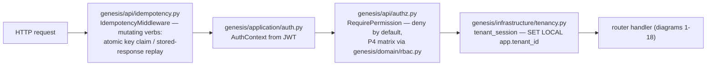

## 1. health — `genesis/api/health.py`

Liveness/readiness only; no application/domain layer, no tenant scope.

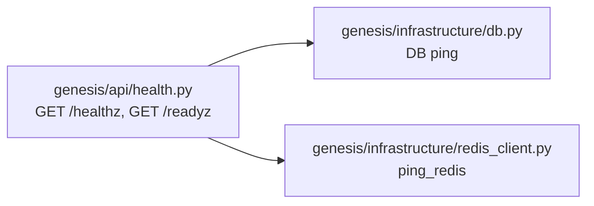

## 2. auth — `genesis/api/auth.py`

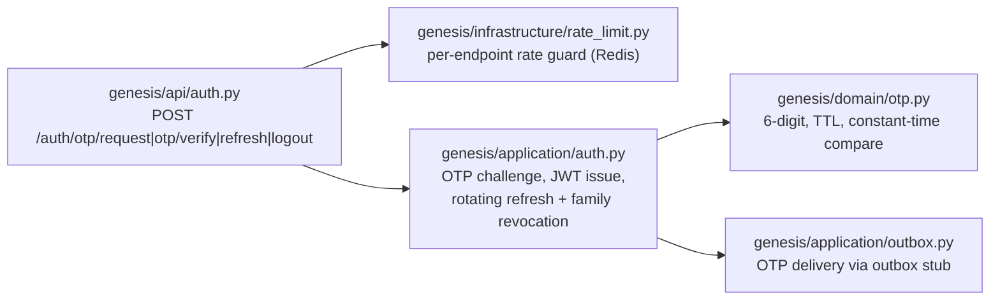

## 3. members — `genesis/api/members.py`

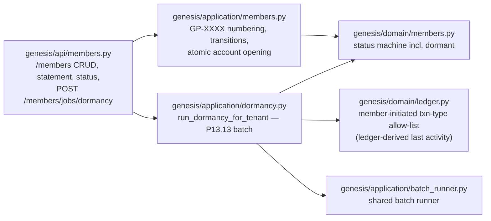

## 4. member KYC — `genesis/api/member_kyc.py`

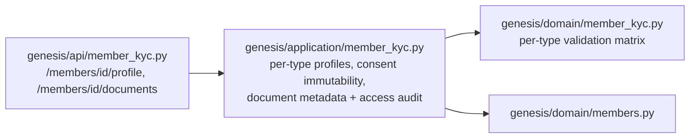

## 5. member exits — `genesis/api/member_exits.py`

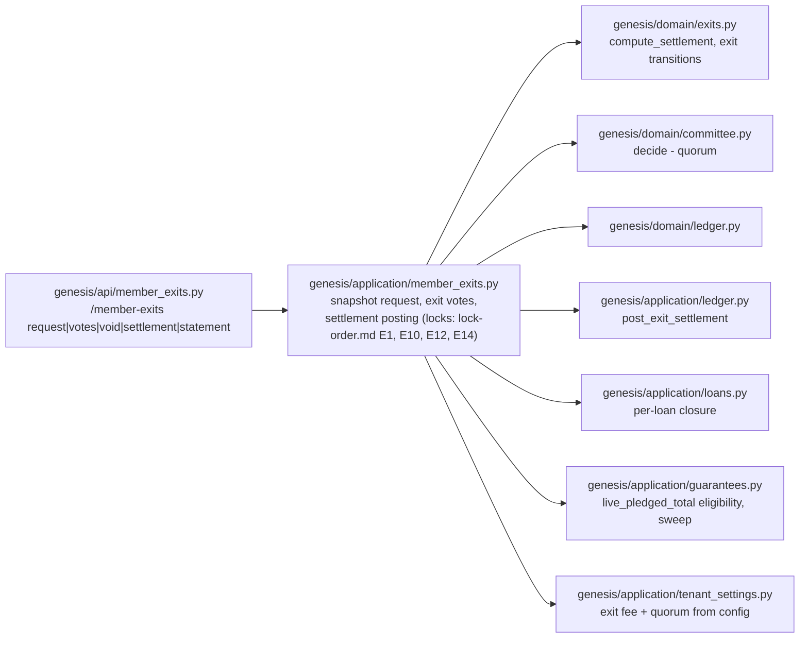

## 6. loans (products / applications / guarantees) — `genesis/api/loans.py`

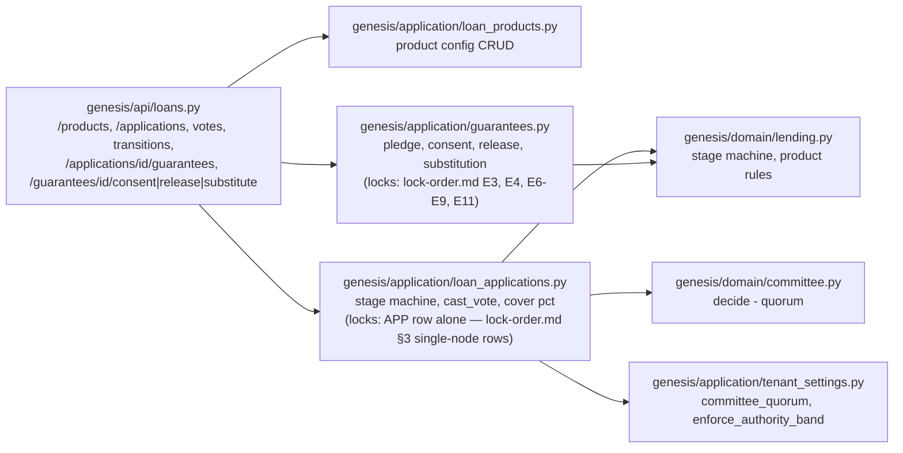

## 7. loan book (disburse / repay / portfolio / arrears) — `genesis/api/loan_book.py`

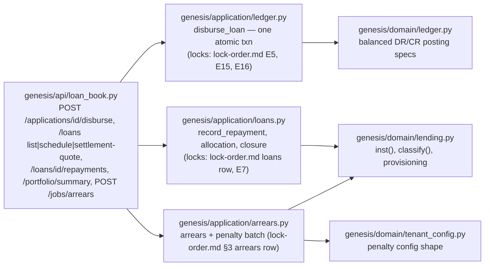

## 8. transactions — `genesis/api/transactions.py`

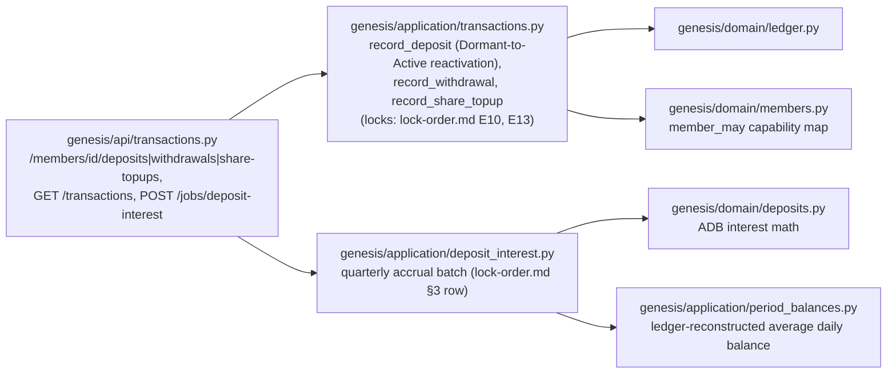

## 9. dashboard — `genesis/api/dashboard.py`

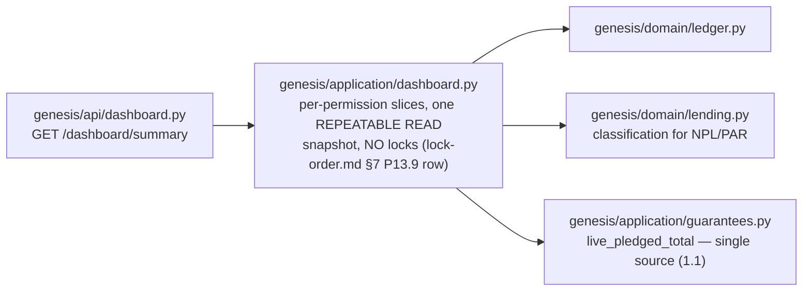

## 10. dividends — `genesis/api/dividends.py`

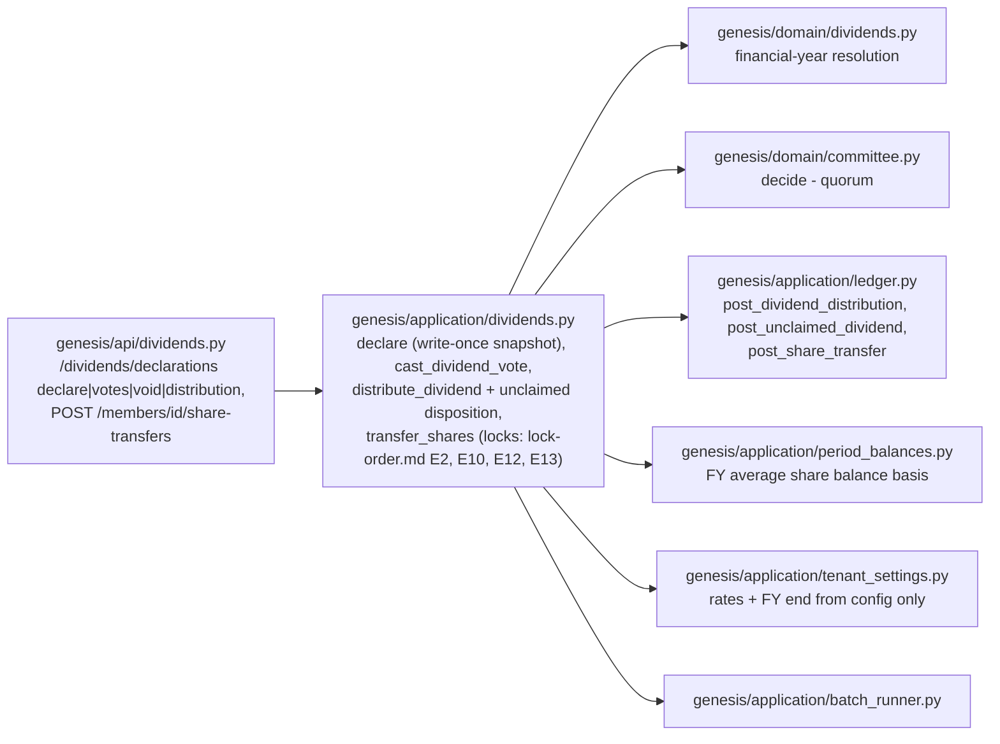

## 11. reports & exports — `genesis/api/reports.py`

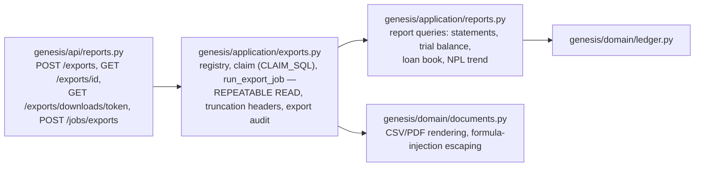

## 12. tenant settings — `genesis/api/tenant_settings.py`

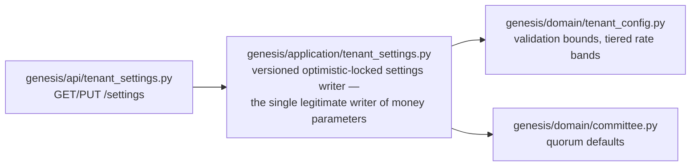

## 13. accounting periods — `genesis/api/accounting_periods.py`

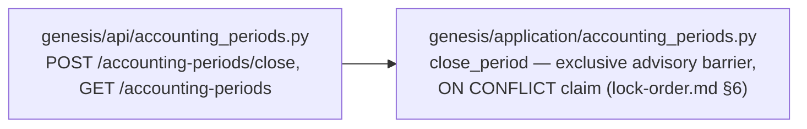

## 14. me — `genesis/api/me.py`

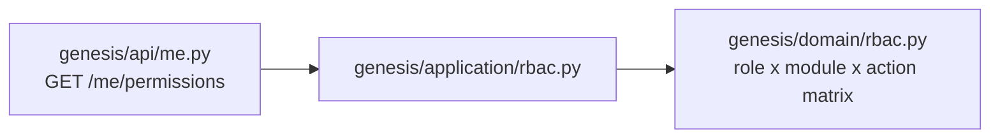

## 15. access control — `genesis/api/access.py`

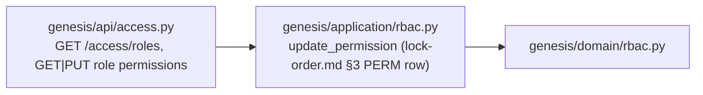

## 16. users — `genesis/api/users.py`

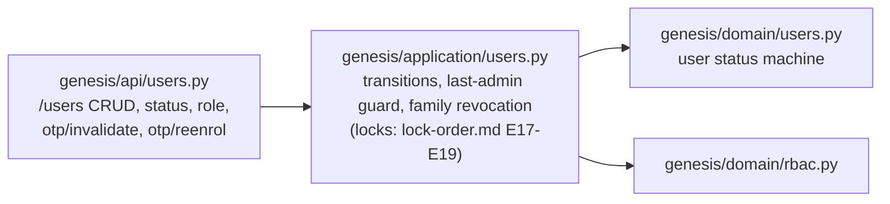

## 17. audit log viewer — `genesis/api/audit_log.py`

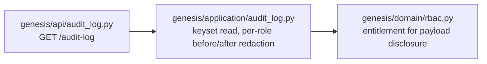

## 18. branches — `genesis/api/branches.py`

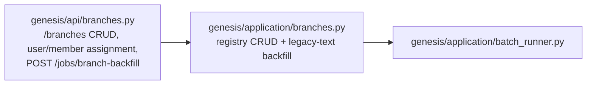

## Verification

- **Router completeness**: the 18 groups above are exactly the
  `include_router` calls in `genesis/api/app.py` `create_app` at the
  authoring SHA (health, auth, members, member_kyc, member_exits,
  loans, loan_book, transactions, dashboard, dividends, reports,
  tenant_settings, accounting_periods, me, access, users, audit_log,
  branches).
- **No invented boxes**: run `python3 docs/diagrams/c4-spot-check.py`
  from the repo root — it fails if any cited `genesis/...` module path
  does not exist, or if a router wired in `app.py` has no diagram
  section here, or if a diagram names a router that is not wired.
- **Locks**: every lock reference above is an edge id or §-row of
  [`lock-order.md`](lock-order.md) — the single authority; nothing is
  restated here (v1.2 rule 11).
