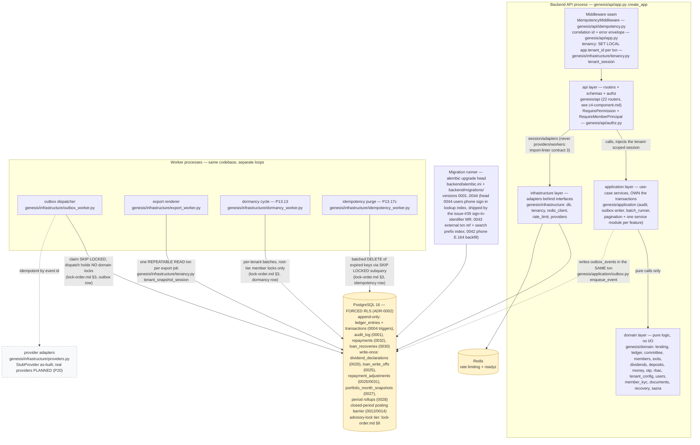

<!--
  P-DIAG.1 — C4 Level 2: Containers (as-built)
  Authored against main @ 08541b860f1445b16c342c39b6606d86b9dbeb17
  Drift rule: v1.2 rule 11 — any MR that changes the layering, a worker
  process, the migration chain head, a middleware, or a trust-relevant
  store property MUST update this file in the same MR.
  Reconciled to main @ 8f46aa54250ff1a066af423924f3eb54a9c72fb7
  (P-DIAG drift MR: head 0022 -> 0032; fourth worker loop P13.17c;
  domain modules recovery/sasra; new append-only / write-once store
  properties from 0025-0032).
  Reconciled to main @ 4ea6bf288460e121a42815b67965adc1854a6320
  (docs/CI follow-up MR, !38 review R3: migration head 0032 -> 0034
  — 0033/0034 landed by !53/!54 after the previous reconciliation).
  Reconciled to main @ eb90a80ede68aed673c317ecd833b464ac17eac4
  (post-merge remediation MR: migration head 0034 -> 0036 — 0035/0036
  landed by !65/!66 without the same-MR diagram refresh v1.2 rule 11
  requires; api layer grows to 22 routers (P14.5 member surface, !65)).
  Migration head 0036 -> 0037 by the issue-#30 close-out MR (!71):
  0037_committee_recommender.py ships in that MR (same-commit refresh
  per v1.2 rule 11 / spot-check check 5).
  Migration head 0037 -> 0038 by the issue-#31 batch-6 MR:
  0038_corrections_register_indexes.py (two expand-only register
  keyset indexes; no table/RLS change) ships in that MR (same-commit
  refresh per v1.2 rule 11 / spot-check check 5).
  Migration head 0038 -> 0039 by the issue-#31 batch-8 MR (!79,
  merged): 0039_member_dividend_payout.py (one nullable TEXT column +
  CHECK on members; no RLS change).
  Migration head 0039 -> 0040 by the issue-#31 batch-10 MR (merged
  pre re-import as sircle8283932/sacco!83):
  0040_share_transfer_maker_checker.py (expand-only: share_transfers
  gains maker-checker workflow columns, DB SoD CHECK, write-once/
  status-machine trigger, register expression index; authored with
  down_revision '0038' at branch time and RE-CHAINED onto 0039 after
  the batch-8 merge landed on main) ships in that MR (same-commit
  refresh per v1.2 rule 11 / spot-check check 5).
  Migration head 0040 -> 0041 by the issue-#31 batch-7 remediation
  MR (senior-review finding N1): 0041_members_numeric_member_no_index.py
  (one expand-only expression index; no table/RLS change) ships in
  that MR; RENUMBERED 0040 -> 0041 and re-chained onto 0040 after the
  batch-10 merge claimed 0040 on main (the 0017 precedent; down_revision
  had earlier been re-chained 0038 -> 0039 after !79 merged; same-commit
  refresh per v1.2 rule 11 / spot-check check 5).
  Migration head 0042 -> 0043 by the issue-#35 remainder MR:
  0043_external_txn_ref_and_search_index.py (expand-only:
  transactions.external_ref nullable CHECK-bounded column + partial
  UNIQUE (tenant_id, channel, external_ref) dedupe + the ledger-search
  text_pattern_ops prefix index; no table/RLS change; re-chained
  down_revision '0041' -> '0042' after !87 merged
  0042_phone_e164_backfill.py to main — the 0017/0041 precedent)
  ships in that MR (same-commit refresh per v1.2 rule 11 /
  spot-check check 5).
  Migration head 0043 -> 0044 by the issue-#35 sign-in-identifier
  MR: 0044_users_phone_signin_index.py (expand-only: one partial
  index idx_users_phone (tenant_id, phone) WHERE phone IS NOT NULL
  serving the staff phone sign-in lookup; no table/column/RLS
  change) ships in that MR (same-commit refresh per v1.2 rule 11 /
  spot-check check 5).
  Traceability: every box cites its module; `c4-spot-check.py` verifies
  every cited module path exists at the authoring SHA.
-->

# C4 L2 — Containers (P-DIAG.1)

One backend codebase (`backend/src/genesis`), deployed as the API
process plus four worker loops, over PostgreSQL 16 (forced RLS) and
Redis. The four layers and their **import-linter-enforced inward
dependency direction** are contracts in `backend/pyproject.toml`
(`[tool.importlinter]`): domain imports nothing outward; application
never imports api/infrastructure; api never imports the provider or
worker modules.

## 2. Traceability table

| Container / element | Source on main @ `08541b8` |
|---|---|
| api layer | `genesis/api/` — 22 routers wired in `genesis/api/app.py` `create_app`; per-handler authz dependencies `genesis/api/authz.py` (`RequirePermission` L38, `RequireAnyPermission` L94, member-principal gate `RequireMemberPrincipal` L64 — P14.5, !65) |
| Idempotency middleware | `genesis/api/idempotency.py` (`IdempotencyMiddleware` L98): atomic `ON CONFLICT DO NOTHING` claim per (tenant, key), replay returns the stored response, actor is part of the request hash |
| Tenancy middleware/seam | `genesis/infrastructure/tenancy.py` (`tenant_session` L12 — `SET LOCAL app.tenant_id` via `set_config(..., true)`; `tenant_snapshot_session` L31 — REPEATABLE READ for exports) |
| application layer | `genesis/application/` — one service module per feature; cross-cutting: `audit.py` (in-txn audit rows), `outbox.py` (`enqueue_event` L17), `batch_runner.py` (shared batch jobs), `pagination.py` (keyset) |
| domain layer | `genesis/domain/` — 16 pure modules, zero I/O (import-linter contract 1: forbidden from api/application/infrastructure); `recovery.py` (P13.16 case-status machine) and `sasra.py` (P13.10 return mapping) joined since authoring |
| infrastructure layer | `genesis/infrastructure/` — `db.py`, `tenancy.py`, `redis_client.py`, `rate_limit.py`, `providers.py` |
| import-linter contracts | `backend/pyproject.toml` `[tool.importlinter]`: (1) domain is pure; (2) application independent of delivery/adapters; (3) request handlers never import `providers` / `outbox_worker` / `export_worker` |
| outbox dispatcher | `genesis/infrastructure/outbox_worker.py` (`dispatch_due` L48: claim txn commits BEFORE any provider call; backoff L31; dead-letter after `MAX_ATTEMPTS = 8` L26) — the as-built flow is [`sequence-outbox-dispatch.md`](sequence-outbox-dispatch.md) (P-DIAG.5) |
| export renderer | `genesis/infrastructure/export_worker.py` → `genesis/application/exports.py` (`run_export_job` L381, claim `CLAIM_SQL` L82) |
| dormancy worker | `genesis/infrastructure/dormancy_worker.py` (`run_dormancy_cycle` L65 — fail-closed per tenant, per-tenant error isolation per !37) → `genesis/application/dormancy.py` (`run_dormancy_for_tenant` L370) |
| idempotency purge worker | `genesis/infrastructure/idempotency_worker.py` (`run_worker`) → `genesis/application/idempotency_purge.py` (`purge_expired_idempotency_keys` — shared batch runner, `FOR UPDATE SKIP LOCKED` subquery; P13.17c/DSA-3) |
| migration runner | `backend/alembic.ini`, `backend/migrations/env.py`, `backend/migrations/versions/0001..0044` — head `0044` (`0044_users_phone_signin_index.py`, `down_revision = "0043"`; shipped by the issue-#35 sign-in-identifier MR in the same commit as this refresh), verified against `versions/` on this tree |
| PostgreSQL 16 | forced RLS per ADR-0002; store properties below |
| Redis | `genesis/infrastructure/redis_client.py` (`ping_redis` — `/readyz`), `genesis/infrastructure/rate_limit.py` (auth endpoints) |

## 3. Trust-relevant store properties (by reference)

- **Forced-RLS boundary**: every tenant-owned table has RLS enabled
  AND forced (ADR-0002, migration `0001`); the request/worker session
  is scoped per transaction (`tenancy.py`). Cross-tenant leakage suite
  is release-blocking (MASTER_PROMPT 1.6).
- **Append-only stores**: `ledger_entries` and `transactions`
  (UPDATE/DELETE blocked by triggers, migration `0004` —
  `ledger_entries_no_update`/`_no_delete`, `transactions_no_update`/
  `_no_delete`); `audit_log` (`audit_log_append_only`, migration
  `0001` L336); `repayments` (`repayments_no_update`/`_no_delete`,
  migration `0032` — issue #24 N4); `loan_recoveries`
  (`loan_recoveries_no_update`/`_no_delete` + the within-claim
  constraint trigger, migration `0030`). Corrections are reversing
  entries, never UPDATE (MASTER_PROMPT 1.5).
- **Write-once snapshots**: `dividend_declarations` (migration
  `0020`), `loan_write_offs` (`loan_write_offs_write_once`, migration
  `0025`), `repayment_adjustments` (write-once workflow trigger,
  migrations `0025`/`0031` — regenerated for the maker-checker
  machine, plus the `ck_repayment_adjustments_sod` maker≠checker
  CHECK), `portfolio_month_snapshots` (migration `0027`) and the
  `0028` period rollups — the snapshot-bind-reverify pattern's
  DB-level anchors.
- **Advisory-lock tier** (reference generation, period barrier): owned
  by [`lock-order.md`](lock-order.md) **§6** — cited, not restated.
- **Outbox holds no domain locks**: owned by
  [`lock-order.md`](lock-order.md) **§3** (the `outbox_events`
  single-node locker row) — cited, not restated.
