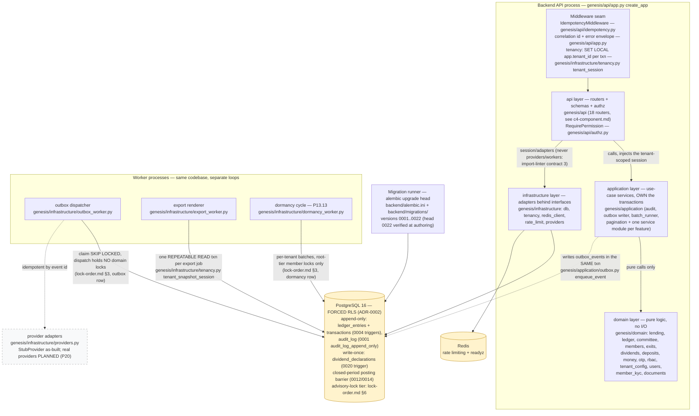

<!--
  P-DIAG.1 — C4 Level 2: Containers (as-built)
  Authored against main @ 08541b860f1445b16c342c39b6606d86b9dbeb17
  Drift rule: v1.2 rule 11 — any MR that changes the layering, a worker
  process, the migration chain head, a middleware, or a trust-relevant
  store property MUST update this file in the same MR.
  Traceability: every box cites its module; `c4-spot-check.py` verifies
  every cited module path exists at the authoring SHA.
-->

# C4 L2 — Containers (P-DIAG.1)

One backend codebase (`backend/src/genesis`), deployed as the API
process plus three worker loops, over PostgreSQL 16 (forced RLS) and
Redis. The four layers and their **import-linter-enforced inward
dependency direction** are contracts in `backend/pyproject.toml`
(`[tool.importlinter]`): domain imports nothing outward; application
never imports api/infrastructure; api never imports the provider or
worker modules.

## 2. Traceability table

| Container / element | Source on main @ `08541b8` |
|---|---|
| api layer | `genesis/api/` — 18 routers wired in `genesis/api/app.py` `create_app`; per-handler authz dependency `genesis/api/authz.py` (`RequirePermission` L28, `RequireAnyPermission` L54) |
| Idempotency middleware | `genesis/api/idempotency.py` (`IdempotencyMiddleware` L98): atomic `ON CONFLICT DO NOTHING` claim per (tenant, key), replay returns the stored response, actor is part of the request hash |
| Tenancy middleware/seam | `genesis/infrastructure/tenancy.py` (`tenant_session` L12 — `SET LOCAL app.tenant_id` via `set_config(..., true)`; `tenant_snapshot_session` L31 — REPEATABLE READ for exports) |
| application layer | `genesis/application/` — one service module per feature; cross-cutting: `audit.py` (in-txn audit rows), `outbox.py` (`enqueue_event` L17), `batch_runner.py` (shared batch jobs), `pagination.py` (keyset) |
| domain layer | `genesis/domain/` — 14 pure modules, zero I/O (import-linter contract 1: forbidden from api/application/infrastructure) |
| infrastructure layer | `genesis/infrastructure/` — `db.py`, `tenancy.py`, `redis_client.py`, `rate_limit.py`, `providers.py` |
| import-linter contracts | `backend/pyproject.toml` `[tool.importlinter]`: (1) domain is pure; (2) application independent of delivery/adapters; (3) request handlers never import `providers` / `outbox_worker` / `export_worker` |
| outbox dispatcher | `genesis/infrastructure/outbox_worker.py` (`dispatch_due` L48: claim txn commits BEFORE any provider call; backoff L31; dead-letter after `MAX_ATTEMPTS = 8` L26) — the P-DIAG.5 sequence diagram details this flow once it lands |
| export renderer | `genesis/infrastructure/export_worker.py` → `genesis/application/exports.py` (`run_export_job` L381, claim `CLAIM_SQL` L82) |
| dormancy worker | `genesis/infrastructure/dormancy_worker.py` (`run_dormancy_cycle` L65 — fail-closed per tenant, per-tenant error isolation per !37) → `genesis/application/dormancy.py` (`run_dormancy_for_tenant` L370) |
| migration runner | `backend/alembic.ini`, `backend/migrations/env.py`, `backend/migrations/versions/0001..0022` — head `0022` (`0022_dividend_dormant_policy.py`, `down_revision = "0021"`), verified at authoring |
| PostgreSQL 16 | forced RLS per ADR-0002; store properties below |
| Redis | `genesis/infrastructure/redis_client.py` (`ping_redis` — `/readyz`), `genesis/infrastructure/rate_limit.py` (auth endpoints) |

## 3. Trust-relevant store properties (by reference)

- **Forced-RLS boundary**: every tenant-owned table has RLS enabled
  AND forced (ADR-0002, migration `0001`); the request/worker session
  is scoped per transaction (`tenancy.py`). Cross-tenant leakage suite
  is release-blocking (MASTER_PROMPT 1.6).
- **Append-only stores**: `ledger_entries` and `transactions`
  (UPDATE/DELETE blocked by triggers, migration `0004` —
  `ledger_entries_no_update`/`_no_delete`, `transactions_no_update`/
  `_no_delete`); `audit_log` (`audit_log_append_only`, migration
  `0001` L336). Corrections are reversing entries, never UPDATE
  (MASTER_PROMPT 1.5).
- **Write-once snapshot**: `dividend_declarations`
  (`dividend_declarations_write_once` trigger, migration `0020`) — the
  snapshot-bind-reverify pattern's DB-level anchor.
- **Advisory-lock tier** (reference generation, period barrier): owned
  by [`lock-order.md`](lock-order.md) **§6** — cited, not restated.
- **Outbox holds no domain locks**: owned by
  [`lock-order.md`](lock-order.md) **§3** (the `outbox_events`
  single-node locker row) — cited, not restated.
