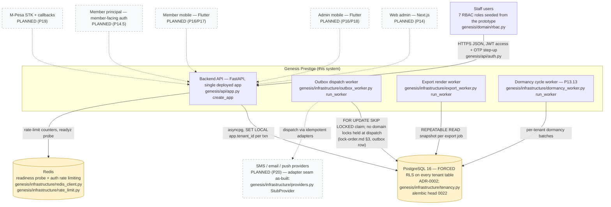

<!--
  P-DIAG.1 — C4 Level 1: System Context (as-built)
  Authored against main @ 08541b860f1445b16c342c39b6606d86b9dbeb17
  Drift rule: v1.2 rule 11 — any MR that changes a depicted container,
  actor, protocol or trust boundary MUST update this file in the same
  MR. PLANNED (Pn) elements are flipped to as-built by the executing
  prompt's MR (the PHASE B2 common rules; P14/P16/P19/P20 each carry
  that instruction explicitly).
  Traceability: every as-built box cites its module below and in the
  companion table (§2); the checked-in spot-check script
  `c4-spot-check.py` verifies every cited module path exists at the
  authoring SHA.
-->

# C4 L1 — System context (P-DIAG.1)

What exists on `main` at the authoring SHA: **one deployed FastAPI
backend**, PostgreSQL 16 with **forced RLS**, Redis, and three worker
loops sharing the backend codebase. Every client and every external
provider is still `PLANNED (Pn)` — today the only principals are staff
users calling the JSON API directly (there is no member principal
until P14.5).

## 2. Traceability table (every box → code on main)

| Box | As-built? | Source on main @ `08541b8` |
|---|---|---|
| Staff users | as-built | the only authenticated principal: `genesis/api/authz.py` (`RequirePermission`), roles/matrix `genesis/domain/rbac.py`; JWT + OTP step-up `genesis/api/auth.py`, `genesis/application/auth.py` |
| Backend API | as-built | `genesis/api/app.py` `create_app` — the single FastAPI app; 18 routers enumerated in [`c4-component.md`](c4-component.md) |
| Outbox dispatch worker | as-built | `genesis/infrastructure/outbox_worker.py` (`run_worker` L182, `dispatch_due` L48) |
| Export render worker | as-built | `genesis/infrastructure/export_worker.py` (`run_worker` L53, `run_export_cycle` L31) |
| Dormancy cycle worker | as-built (P13.13 !32; resilience hardened by !37) | `genesis/infrastructure/dormancy_worker.py` (`run_worker` L106, `run_dormancy_cycle` L65) |
| PostgreSQL 16, forced RLS | as-built | RLS enabled AND forced per ADR-0002 (`docs/adr/`), session scoping `genesis/infrastructure/tenancy.py` (`tenant_session` L12); migration head `0022` (`backend/migrations/versions/0022_dividend_dormant_policy.py`) |
| Redis | as-built | `genesis/infrastructure/redis_client.py` (readyz), `genesis/infrastructure/rate_limit.py` (auth rate limiting) |
| Web admin | PLANNED (P14) | not on main (an open scaffold MR !13 exists but is unmerged — as-built means merged) |
| Admin mobile / Member mobile | PLANNED (P16/P17/P18) | not on main (draft !11 unmerged) |
| Member principal | PLANNED (P14.5) | no member-facing auth exists; staff tokens are the only principal |
| M-Pesa | PLANNED (P19) | no payment-intent tables, no callback routes on main |
| SMS/email/push providers | PLANNED (P20) | only the adapter contract + logging stub are as-built: `genesis/infrastructure/providers.py` (`NotificationProvider`, `StubProvider`) |

## 3. Trust-relevant properties (by reference — never restated)

- **Forced-RLS tenant boundary**: every request/worker transaction is
  scoped with `SET LOCAL app.tenant_id` (`tenancy.py`); the app role
  cannot bypass RLS (ADR-0002). Explicit bound `tenant_id` predicates
  ride on top (v1.1 rule 4).
- **Lock discipline**: all lock-order statements for the edges above
  are owned by [`lock-order.md`](lock-order.md) (P-DIAG.0) — see its
  §3 catalogue and §6 advisory tier; this file intentionally cites,
  never restates (v1.2 rule 11).
- **Outbox dispatch holds no domain locks**: the worker claim/dispatch
  split is recorded in [`lock-order.md`](lock-order.md) §3 (the
  `outbox_events` single-node locker row).
