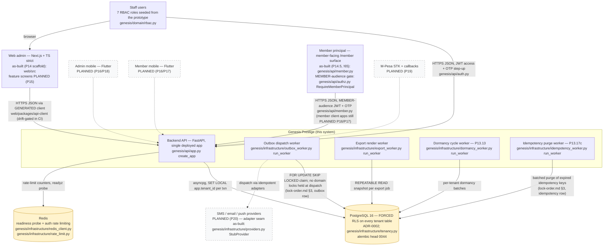

<!--
  P-DIAG.1 — C4 Level 1: System Context (as-built)
  Authored against main @ 08541b860f1445b16c342c39b6606d86b9dbeb17
  Drift rule: v1.2 rule 11 — any MR that changes a depicted container,
  actor, protocol or trust boundary MUST update this file in the same
  MR. PLANNED (Pn) elements are flipped to as-built by the executing
  prompt's MR (the PHASE B2 common rules; P14/P16/P19/P20 each carry
  that instruction explicitly).
  Reconciled to main @ 8f46aa54250ff1a066af423924f3eb54a9c72fb7
  (P-DIAG drift MR: migration head 0022 -> 0032; the P13.17c
  idempotency purge worker added as the fourth worker loop).
  Reconciled to main @ 4ea6bf288460e121a42815b67965adc1854a6320
  (docs/CI follow-up MR, !38 review R3: migration head 0032 -> 0034
  — 0033/0034 landed by !53/!54 after the previous reconciliation).
  Reconciled to main @ eb90a80ede68aed673c317ecd833b464ac17eac4
  (post-merge remediation MR: migration head 0034 -> 0036 — 0035/0036
  landed by !65/!66 without the same-MR diagram refresh v1.2 rule 11
  requires; the member principal (P14.5, !65) flipped to as-built).
  Migration head 0036 -> 0037 by the issue-#30 close-out MR (!71):
  0037_committee_recommender.py ships in that MR (same-commit refresh
  per v1.2 rule 11 / spot-check check 5).
  Migration head 0037 -> 0038 by the issue-#31 batch-6 MR:
  0038_corrections_register_indexes.py (two expand-only register
  keyset indexes; no table/RLS change) ships in that MR (same-commit
  refresh per v1.2 rule 11 / spot-check check 5).
  Migration head 0038 -> 0039 by the issue-#31 batch-8 MR (!79,
  merged): 0039_member_dividend_payout.py (one nullable TEXT column +
  CHECK on members; no RLS change).
  Migration head 0039 -> 0040 by the issue-#31 batch-10 MR (merged
  pre re-import as sircle8283932/sacco!83):
  0040_share_transfer_maker_checker.py (expand-only maker-checker
  workflow columns + register index on share_transfers; authored on
  down_revision 0038 and re-chained onto 0039 after the batch-8
  merge) ships in that MR (same-commit refresh per v1.2 rule 11 /
  spot-check check 5).
  Migration head 0040 -> 0041 by the issue-#31 batch-7 remediation
  MR (senior-review finding N1): 0041_members_numeric_member_no_index.py
  (one expand-only expression index; no table/RLS change) ships in
  that MR; RENUMBERED 0040 -> 0041 and re-chained onto 0040 after
  the batch-10 merge claimed 0040 on main (the 0017 precedent;
  same-commit refresh per v1.2 rule 11 / spot-check check 5).
  Migration head 0042 -> 0043 by the issue-#35 remainder MR:
  0043_external_txn_ref_and_search_index.py (expand-only:
  transactions.external_ref nullable CHECK-bounded column + partial
  UNIQUE (tenant_id, channel, external_ref) dedupe + the ledger-search
  text_pattern_ops prefix index; no table/RLS change; re-chained
  down_revision '0041' -> '0042' after !87 merged
  0042_phone_e164_backfill.py to main — the 0017/0041 precedent)
  ships in that MR (same-commit refresh per v1.2 rule 11 /
  spot-check check 5).
  Migration head 0043 -> 0044 by the issue-#35 sign-in-identifier
  MR: 0044_users_phone_signin_index.py (expand-only: one partial
  index idx_users_phone (tenant_id, phone) WHERE phone IS NOT NULL
  serving the staff phone sign-in lookup; no table/column/RLS
  change) ships in that MR (same-commit refresh per v1.2 rule 11 /
  spot-check check 5).
  Traceability: every as-built box cites its module below and in the
  companion table (§2); the checked-in spot-check script
  `c4-spot-check.py` verifies every cited module path exists at the
  authoring SHA.
-->

# C4 L1 — System context (P-DIAG.1)

What exists on `main` at the reconciliation SHA: **one deployed
FastAPI backend**, PostgreSQL 16 with **forced RLS**, Redis, and four
worker loops sharing the backend codebase.  The **web admin scaffold** (P14,
!13) is the first as-built client: staff reach the API through its
GENERATED, drift-gated client; mobile clients and external providers
remain `PLANNED (Pn)`. Two authenticated principals exist: staff, and
— since P14.5 (!65) — the **member principal** (MEMBER-audience tokens
on the `/member` surface; a member token can never satisfy a staff
`RequirePermission` gate).

## 2. Traceability table (every box → code on main)

| Box | As-built? | Source on main @ `08541b8` |
|---|---|---|
| Staff users | as-built | staff principal: `genesis/api/authz.py` (`RequirePermission`), roles/matrix `genesis/domain/rbac.py`; JWT + OTP step-up `genesis/api/auth.py`, `genesis/application/auth.py` |
| Backend API | as-built | `genesis/api/app.py` `create_app` — the single FastAPI app; 22 routers enumerated in [`c4-component.md`](c4-component.md) |
| Outbox dispatch worker | as-built | `genesis/infrastructure/outbox_worker.py` (`run_worker` L182, `dispatch_due` L48) |
| Export render worker | as-built | `genesis/infrastructure/export_worker.py` (`run_worker` L53, `run_export_cycle` L31) |
| Dormancy cycle worker | as-built (P13.13 !32; resilience hardened by !37) | `genesis/infrastructure/dormancy_worker.py` (`run_worker` L106, `run_dormancy_cycle` L65) |
| Idempotency purge worker | as-built (P13.17c !49) | `genesis/infrastructure/idempotency_worker.py` (`run_worker`) → `genesis/application/idempotency_purge.py` (`purge_expired_idempotency_keys`); expiry semantics never depend on it running (the `expires_at > now()` fence in `genesis/api/idempotency.py`) |
| PostgreSQL 16, forced RLS | as-built | RLS enabled AND forced per ADR-0002 (`docs/adr/`), session scoping `genesis/infrastructure/tenancy.py` (`tenant_session` L12); migration head `0044` (`backend/migrations/versions/0044_users_phone_signin_index.py`; `down_revision = "0043"` — the sign-in-identifier phone-lookup index) |
| Redis | as-built | `genesis/infrastructure/redis_client.py` (readyz), `genesis/infrastructure/rate_limit.py` (auth rate limiting) |
| Web admin | as-built with this MR (P14 scaffold, !13): app shell + OTP auth gate + deny-by-default route guards; feature screens PLANNED (P15) | `web/src` (modules `auth`/`authz`/`layout`/`table`), tokens `web/packages/design-system`, GENERATED client `web/packages/api-client` — freshness gated by the `web:spec-drift`/`web:client-drift` CI jobs against `backend/scripts/export_openapi.py` |
| Admin mobile / Member mobile | PLANNED (P16/P17/P18) | not on main (draft !11 unmerged) |
| Member principal | as-built (P14.5, !65) | member-facing surface `genesis/api/member.py` (`/member` auth + guarantor consent/self-release); per-request live-link gate `genesis/api/authz.py` (`RequireMemberPrincipal`); MEMBER-audience tokens `genesis/application/auth.py` (`MemberAuthContext`) issued by `genesis/application/member_auth.py`; audited credential-link administration `genesis/api/member_identity.py` → `genesis/application/member_identity.py` (`member_credentials`, migration 0035) |
| M-Pesa | PLANNED (P19) | no payment-intent tables, no callback routes on main |
| SMS/email/push providers | PLANNED (P20) | only the adapter contract + logging stub are as-built: `genesis/infrastructure/providers.py` (`NotificationProvider`, `StubProvider`) |

## 3. Trust-relevant properties (by reference — never restated)

- **Forced-RLS tenant boundary**: every request/worker transaction is
  scoped with `SET LOCAL app.tenant_id` (`tenancy.py`); the app role
  cannot bypass RLS (ADR-0002). Explicit bound `tenant_id` predicates
  ride on top (v1.1 rule 4).
- **Lock discipline**: all lock-order statements for the edges above
  are owned by [`lock-order.md`](lock-order.md) (P-DIAG.0) — see its
  §3 catalogue and §6 advisory tier; this file intentionally cites,
  never restates (v1.2 rule 11).
- **Outbox dispatch holds no domain locks**: the worker claim/dispatch
  split is recorded in [`lock-order.md`](lock-order.md) §3 (the
  `outbox_events` single-node locker row).
