<!--
  P-DIAG.3 — Data-flow diagrams: L0 context + L1 money-bearing flows
  Authored against main @ 08541b860f1445b16c342c39b6606d86b9dbeb17
  Redrawn business-legible and reconciled to main @
  8f46aa54250ff1a066af423924f3eb54a9c72fb7 by the P-DIAG drift MR:
  the P13.15/P13.16 PLANNED labels are flipped to as-built and the
  flows shipped by !46 (corrections/fees/write-off), !47 (recovery
  cases), !51 (bad-debt recovery receipts + exit claim guard) and
  !52 (maker-checker adjustments) are drawn first-class (F10-F14).
  Reconciled to main @
  047d4e399e3f5c5537f15a8fb73b8f1ab4a15658 by the issue-#30 close-out
  MR (!71): the P14.5 (!65) member-principal surface — member OTP
  sign-in, guarantor consent/self-release as MEMBER-principal acts,
  the staff-attested override, the credential-link admin — is drawn
  first-class (F15, §3.15) with CNS_* element ids.
  Reconciled by the issue-#31 batch-10 MR (!83): share transfer —
  previously named in §4 as out-of-scope (the one-call
  transfer_shares) — became a money-bearing TWO-PHASE maker-checker
  workflow with a history register (ledger items (l)/(m), the !77
  human-authorized remediation) and is drawn first-class (F16,
  §3.16) with STF_* element ids.
  Status: as-built, derived from code (not from MR prose).
  AUDIENCE: the DIAGRAMS are for SACCO managers, auditors and
  committee members — business vocabulary only inside the drawings
  (no function names, table names or HTTP verbs). The per-diagram
  "Source of truth" footer tables map every element to the
  implementing module:function for engineers/auditors.
  Drift rule: v1.2 rule 11 — any MR that changes a diagrammed flow,
  store, or trust boundary MUST update this file in the same MR.
  Lock statements in this file cite lock-order.md edge ids ONLY
  (E1-E25 and the §3 single-node lockers); the chains are NEVER
  restated here — lock-order.md is the single authority (rule 11).
  STRIDE-per-element threat model over these elements: stride.md
  (P-DIAG.4).
-->

# Data-flow diagrams — L0 context + L1 money flows (P-DIAG.3)

## 0. How to read these diagrams

- **Audience.** The drawings use business vocabulary (member, teller,
  loan officer, checker, committee, write-off, recovery receipt) and
  are meant to be readable WITHOUT opening a code file. Every diagram
  is paired with (a) a short plain-language narrative of the business
  rule it depicts and (b) a **Source of truth** footer table mapping
  each element to the implementing file(s) and function/route names —
  the code citations live in the footer, never inside the drawing.
- **Shapes.** External entities (people, providers) are rectangles,
  processes (things the system does) are stadiums `([ ])`, data stores
  (record books) are cylinders `[( )]`. Trust boundaries are subgraphs
  named `TB1..TB4` (§1). Dashed elements are `PLANNED (Pn)` /
  `INCOMING (!MR)` — not built on main at the reconciliation SHA; the
  executing MR flips them to as-built (v1.2 rule 11).
- **Element ids.** Every element carries a stable id (`L0_*`, `TXN_*`,
  `DSB_*`, `RPY_*`, `EXIT_*`, `DIV_*`, `INT_*`, `DRM_*`, `EXP_*`,
  `OBX_*`, `FEE_*`, `ADJ_*`, `WOF_*`, `RCV_*`, `RCS_*`, `CNS_*`, `STF_*`). `stride.md`
  (P-DIAG.4) references these ids; renaming one is a change to both
  files (rule 11).
- **Traceability.** Every process/store/flow row in the footer tables
  cites the implementing module:function or migration on main at the
  reconciliation SHA. An untraceable element is a rejected MR (P-DIAG
  common rules). Functions are the stable citation (lock-order.md §3
  convention); line numbers are avoided because parallel MRs shift
  them.
- **Locks.** Where a flow takes row/advisory locks, the footer cites
  the `lock-order.md` edge id (E1-E25) or its §3 single-node-locker
  row — never the chain itself (rule 11).
- **Stores are logical record books.** The ledger book drawn in the
  flows is physically `ledger_entries` + `transactions` +
  `txn_ref_sequences`; the footer rows name each physical table and
  its migration.

## 1. Trust boundaries (shared legend — engineering companion)

| Id | Boundary | As-built enforcement (citation) |
|---|---|---|
| TB1 | **Unauthenticated network edge → authenticated staff principal.** Everything left of TB1 is untrusted input. | JWT bearer decode: `api/authz.py:get_auth_context` → `application/auth.py:decode_access_token` (access ≤15 min, `application/auth.py:issue_access_token`; STAFF audience since P14.5 — see TB1M); principal established by OTP step-up: `application/auth.py:verify_otp` + `domain/otp.py:evaluate_challenge` (6 digits, ≤5 attempts, 5-min TTL, single-use, constant-time `hmac.compare_digest`); rotating refresh with family revocation on reuse: `application/auth.py:rotate_refresh_token`; pre-auth endpoints scope tenant from the explicit `x-tenant-id` header only: `api/auth.py:tenant_id_from_headers`; every auth route rate-limited: `api/auth.py:_rate_guard` → `infrastructure/rate_limit.py:check_rate_limit`. Authorization behind TB1 is deny-by-default per handler: `api/authz.py:RequirePermission` / `RequireAnyPermission`. Keyset pagination cursors crossing TB1 are opaque HMAC-signed tokens sealed/verified by the ONE codec (`application/pagination.py:encode_cursor`/`decode_cursor`, #31 batch 13): scope-bound to tenant + endpoint, dual-version key rotation window, constant-time tag check — see the `L0_API keyset cursors` rows in `stride.md` §1. |
| TB1M | **Unauthenticated network edge → authenticated MEMBER principal (P14.5, !65).** The member and staff principals are DISJOINT credential populations at the same network edge: a member token can never satisfy a staff gate and vice versa (FM1). | Identity is the `member_credentials` link row (0035) — the LINK, never any email, is authoritative (FM2; the !29 interim email bridge is retired). Same P3 OTP machinery, one implementation: `application/member_auth.py:verify_member_otp` → `domain/otp.py:evaluate_challenge`; same tables with an exactly-one-principal XOR CHECK (0035); rotating member refresh families: `member_auth.py:rotate_member_refresh_token`. Token audiences dispatch deny-by-default: `application/auth.py:decode_principal` (`genesis-staff` / `genesis-member`; unknown/missing audience refused). The member gate re-verifies the LIVE link on EVERY request: `api/authz.py:RequireMemberPrincipal` → `member_auth.live_credential_by_id`; consent/release re-verify it AGAIN inside the transaction under the guarantee row lock. Link mutations are audited ADMIN mutations under the narrow `member_identity` module (FM3 — never self-service); consent rows carry their principal at the DB level (0035 trigger, FM4). Same `_rate_guard`, same `x-tenant-id` pre-auth scoping (`api/member.py`). |
| TB2 | **api/worker process → forced-RLS Postgres.** No statement runs outside a tenant-scoped transaction. | `infrastructure/tenancy.py:tenant_session` — `set_config('app.tenant_id', :tid, true)` (≡ `SET LOCAL`, transaction-bound, pool-safe); snapshot variant for exports: `tenant_snapshot_session` (REPEATABLE READ); RLS enabled AND **forced** on every tenant-owned table: migration `0001` (`FORCE ROW LEVEL SECURITY` + `tenant_isolation` policies); app DB role `NOSUPERUSER NOBYPASSRLS` per ADR-0002 (bootstrap in `.gitlab-ci.yml` `backend:test`); defence in depth: explicit bound `tenant_id = :tid` predicates on every tenant-owned read AND write (v1.1 rule 4). |
| TB3 | **Request process ↔ worker loops.** Workers carry no request principal (system actor, `actor_id=None` in audit rows) and run per-tenant cycles. | `infrastructure/outbox_worker.py:run_worker`, `infrastructure/export_worker.py:run_worker`, `infrastructure/dormancy_worker.py:run_worker`, `infrastructure/idempotency_worker.py:run_worker` (P13.17c); per-tenant fan-out via `outbox_worker.py:list_active_tenants`; dormancy per-tenant failure isolation (!32 R1): `dormancy_worker.py:run_dormancy_cycle`; workers cross TB2 exactly like the api (same `tenant_session`). The deposit-interest and arrears batches are NOT worker loops as-built: they are staff-triggered via `POST /jobs/deposit-interest` (`api/transactions.py`) and `POST /jobs/arrears` (`api/loan_book.py`) — their long-running batches still execute on the TB3 side of the request/short-transaction discipline (§3.6, §3.14). |
| TB4 | **Provider adapter seam.** Nothing inside the domain talks to an external delivery network directly. | `infrastructure/providers.py:NotificationProvider` protocol; as-built implementation is `StubProvider` (logs event ids, never payload contents; idempotent by event id); real SMS/email/push providers are **PLANNED (P20)**; request handlers are forbidden from importing providers (import-linter contract, `infrastructure/providers.py` module docstring); dispatch happens outside any transaction and holds no domain locks (lock-order.md §3 outbox row). |

**PLANNED external edges** (drawn dashed on L0, flipped by the
executing MR per rule 11): member mobile/web CLIENTS — P16–P18 (the
member-facing AUTH API surface itself is as-built since P14.5/!65 —
TB1M above); M-Pesa STK + callbacks — P19; real notification
providers — P20.

## 2. L0 — system context

Plain language: the SACCO's own staff sign in with a one-time code
(OTP), and — since P14.5 — a member whose email a staff administrator
has explicitly linked can sign in the same way to act for THEMSELVES
(consenting to or withdrawing their own guarantee pledge — drawn
first-class as flow F15, §3.15); the two
kinds of sign-in can never stand in for each other. The member mobile
and web apps, M-Pesa and real SMS/email delivery are planned but not
built.
Everything staff do lands in one shared database that keeps every
SACCO's records invisible to every other SACCO, and four background
helpers deliver notifications, render reports, mark dormant members
and tidy expired duplicate-submission records.

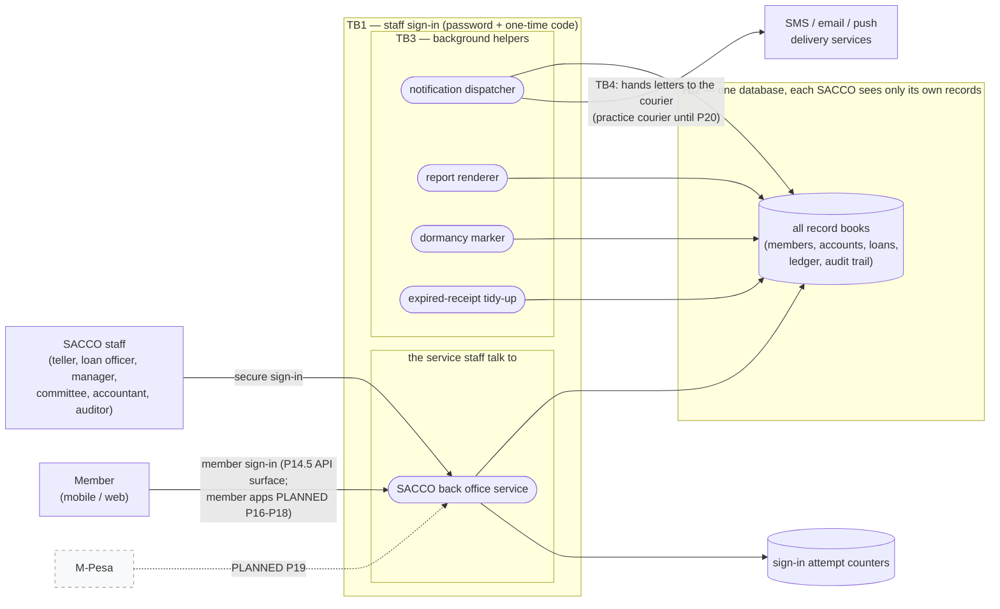
```mermaid
flowchart LR
    %% P-DIAG.3 L0 — reconciled to main @ 8f46aa54250ff1a066af423924f3eb54a9c72fb7
    L0_STAFF["SACCO staff<br/>(teller, loan officer, manager,<br/>committee, accountant, auditor)"]
    L0_MEMBER["Member<br/>(mobile / web)"]
    L0_MPESA["M-Pesa"]
    L0_PROVIDERS["SMS / email / push<br/>delivery services"]

    subgraph TB1["TB1 — staff sign-in (password + one-time code)"]
        subgraph TB3A["the service staff talk to"]
            L0_API(["SACCO back office service"])
        end
        subgraph TB3B["TB3 — background helpers"]
            L0_OBXW(["notification dispatcher"])
            L0_EXPW(["report renderer"])
            L0_DRMW(["dormancy marker"])
            L0_IDMW(["expired-receipt tidy-up"])
        end
    end

    subgraph TB2["TB2 — one database, each SACCO sees only its own records"]
        L0_PG[("all record books<br/>(members, accounts, loans,<br/>ledger, audit trail)")]
    end
    L0_REDIS[("sign-in attempt counters")]

    L0_STAFF -->|"secure sign-in"| L0_API
    L0_MEMBER -->|"member sign-in (P14.5 API surface;<br/>member apps PLANNED P16-P18)"| L0_API
    L0_MPESA -.->|"PLANNED P19"| L0_API
    L0_API --> L0_PG
    L0_API --> L0_REDIS
    L0_OBXW --> L0_PG
    L0_EXPW --> L0_PG
    L0_DRMW --> L0_PG
    L0_IDMW --> L0_PG
    L0_OBXW -->|"TB4: hands letters to the courier<br/>(practice courier until P20)"| L0_PROVIDERS

    classDef planned fill:#f8f9fa,stroke:#999,stroke-dasharray: 5 5;
    class L0_MPESA planned;
```

### Source of truth (L0)

| Element | Kind | Citation |
|---|---|---|
| L0_STAFF | external entity | the only authenticated principal as-built: `users` table (0001), roles seeded from the prototype matrix (`application/rbac.py:seed_permissions`) |
| L0_MEMBER | external entity — **auth backend AS-BUILT (P14.5, !65); member apps PLANNED (P16–P18)** | the MEMBER principal is first-class: `member_credentials` link table (0035, RLS forced), `/member` auth + guarantor consent/self-release surface (`api/member.py`), admin link mutations (`api/member_identity.py`), the TB1M boundary above. The mobile/web member clients remain planned (P16–P18); until they land the surface is exercised by the P14.5 test suites |
| L0_MPESA | external entity — **PLANNED (P19)** | no payment-provider code on main; deposits/withdrawals arrive via staff-recorded channels (`domain` `Channel` enum) |
| L0_PROVIDERS | external entity (seam as-built, real delivery **PLANNED (P20)**) | `infrastructure/providers.py:StubProvider` behind `NotificationProvider` (TB4) |
| L0_API | process | `api/app.py:create_app` — routers + `IdempotencyMiddleware` (`api/idempotency.py`) + correlation middleware + sanitized error envelope (`{category, correlation_id}`) |
| L0_OBXW / L0_EXPW / L0_DRMW / L0_IDMW | processes | `infrastructure/outbox_worker.py:run_worker`, `infrastructure/export_worker.py:run_worker`, `infrastructure/dormancy_worker.py:run_worker`, `infrastructure/idempotency_worker.py:run_worker` (TB3) |
| L0_PG | store | Postgres 16; RLS forced by migration `0001`; every access via `infrastructure/tenancy.py` (TB2); alembic head `0032` |
| L0_REDIS | store | `infrastructure/rate_limit.py:check_rate_limit` (fixed window, Redis-backed when configured; in-process fallback otherwise — see stride.md D-row); readiness dep in `/readyz` |

## 3. L1 — money-bearing flows

### 3.1 F1 — deposits / withdrawals / share top-ups

Plain language: the teller records money in or out for a member. The
same request submitted twice (a double click, a retried network call)
has exactly one effect. A withdrawal can never take out money that is
pledged as security for someone's loan, and a member who has exited
can never transact. Every shilling lands in the permanent ledger book
— never edited, only ever added to — and the exact figures are written
to the audit trail.

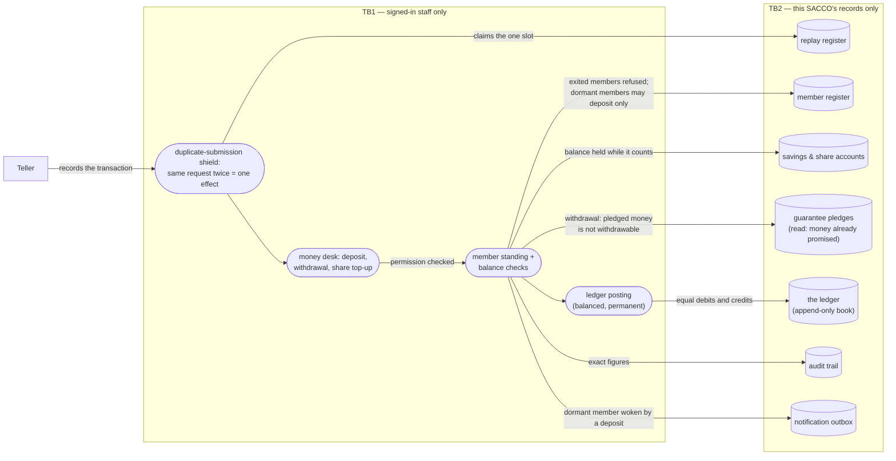
```mermaid
flowchart LR
    %% P-DIAG.3 F1 — reconciled to main @ 8f46aa54250ff1a066af423924f3eb54a9c72fb7
    TXN_E1["Teller"]
    subgraph TB1["TB1 — signed-in staff only"]
        TXN_P0(["duplicate-submission shield:<br/>same request twice = one effect"])
        TXN_P1(["money desk: deposit,<br/>withdrawal, share top-up"])
        TXN_P2(["member standing +<br/>balance checks"])
        TXN_P3(["ledger posting<br/>(balanced, permanent)"])
    end
    subgraph TB2["TB2 — this SACCO's records only"]
        TXN_S1[("replay register")]
        TXN_S2[("member register")]
        TXN_S3[("savings & share accounts")]
        TXN_S4[("guarantee pledges<br/>(read: money already promised)")]
        TXN_S5[("the ledger<br/>(append-only book)")]
        TXN_S6[("audit trail")]
        TXN_S7[("notification outbox")]
    end

    TXN_E1 -->|"records the transaction"| TXN_P0
    TXN_P0 -->|"claims the one slot"| TXN_S1
    TXN_P0 --> TXN_P1
    TXN_P1 -->|"permission checked"| TXN_P2
    TXN_P2 -->|"exited members refused;<br/>dormant members may deposit only"| TXN_S2
    TXN_P2 -->|"balance held while it counts"| TXN_S3
    TXN_P2 -->|"withdrawal: pledged money<br/>is not withdrawable"| TXN_S4
    TXN_P2 --> TXN_P3
    TXN_P3 -->|"equal debits and credits"| TXN_S5
    TXN_P2 -->|"exact figures"| TXN_S6
    TXN_P2 -->|"dormant member woken by a deposit"| TXN_S7
```

#### Source of truth (F1)

| Element | Citation | Locks (lock-order.md ids only) |
|---|---|---|
| TXN_P0 | `api/idempotency.py:IdempotencyMiddleware` — `ON CONFLICT` claim in its own transaction, replay returns the stored response; keys scoped per (tenant, actor, route+body hash), expiring per 0029 | §3 idempotency single-node row |
| TXN_P1 | `api/transactions.py` deposit/withdrawal/share-topup routes; `RequirePermission(TRANSACTIONS, CREATE)`; `extra="forbid"` request models | — |
| TXN_P2 | `application/transactions.py:record_deposit` / `record_withdrawal` / `record_share_topup`; member standing via `_require_member` → `domain/members.py:member_may` (capability map); dormant reactivation inside the deposit txn: `application/members.py:reactivate_dormant_member` (P13.13); withdrawal never overdraws: available = balance − `application/guarantees.py:live_pledged_total` | E10 (deposit/withdrawal), E13 (top-up) |
| TXN_P3 | `application/ledger.py:post_deposit` / `post_withdrawal` / `post_share_topup` → `_post` (open-period barrier `application/accounting_periods.py:assert_open_period`; refs `_next_ref`) | E15 → E16 |
| TXN_S1–S7 | `idempotency_keys` (0001/0029), `members` (0001), `deposit_accounts`/`share_accounts` (0001), `guarantees` (0001), `ledger_entries`+`transactions`+`txn_ref_sequences` (0001/0004, append-only + balanced-DR/CR triggers 0004/0014), `audit_log` (0001, append-only trigger), `outbox_events` (0001) | — |

### 3.2 F2 — loan disbursement

Plain language: paying out an approved loan is one all-or-nothing
step. The system re-checks — at the moment the money moves — that the
committee approved it, that the member's deposits still satisfy the
product's multiplier rule, and that every guarantor has actually
consented. It then creates the loan, its repayment schedule, the
payout ledger entry and the notification together: either everything
happens or nothing does.

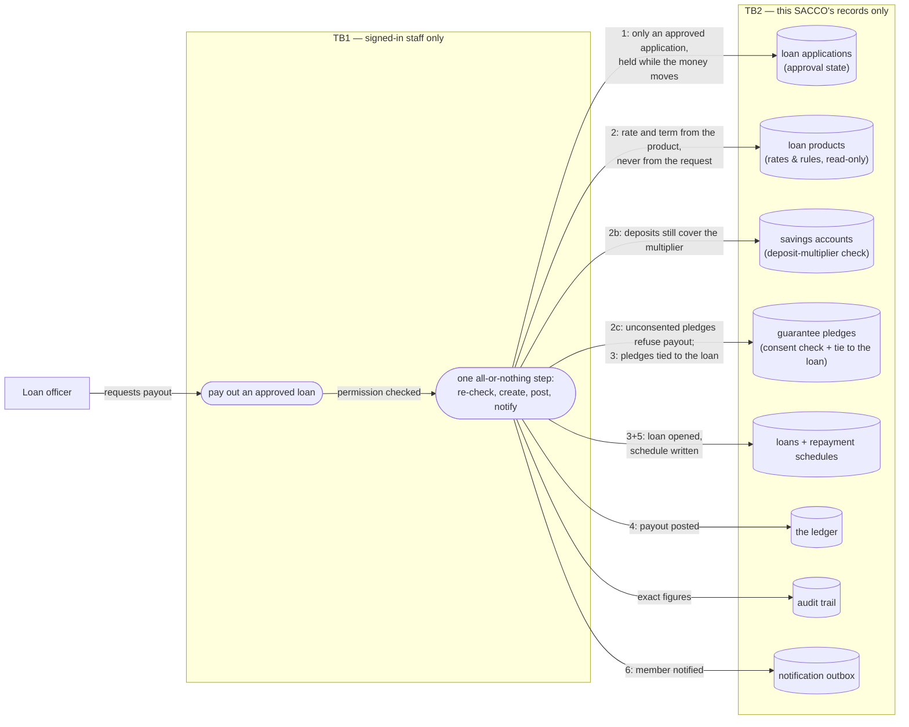
```mermaid
flowchart LR
    %% P-DIAG.3 F2 — reconciled to main @ 8f46aa54250ff1a066af423924f3eb54a9c72fb7
    DSB_E1["Loan officer"]
    subgraph TB1["TB1 — signed-in staff only"]
        DSB_P1(["pay out an approved loan"])
        DSB_P2(["one all-or-nothing step:<br/>re-check, create, post, notify"])
    end
    subgraph TB2["TB2 — this SACCO's records only"]
        DSB_S1[("loan applications<br/>(approval state)")]
        DSB_S2[("loan products<br/>(rates & rules, read-only)")]
        DSB_S3[("savings accounts<br/>(deposit-multiplier check)")]
        DSB_S4[("guarantee pledges<br/>(consent check + tie to the loan)")]
        DSB_S5[("loans + repayment schedules")]
        DSB_S6[("the ledger")]
        DSB_S7[("audit trail")]
        DSB_S8[("notification outbox")]
    end

    DSB_E1 -->|"requests payout"| DSB_P1
    DSB_P1 -->|"permission checked"| DSB_P2
    DSB_P2 -->|"1: only an approved application,<br/>held while the money moves"| DSB_S1
    DSB_P2 -->|"2: rate and term from the product,<br/>never from the request"| DSB_S2
    DSB_P2 -->|"2b: deposits still cover the multiplier"| DSB_S3
    DSB_P2 -->|"2c: unconsented pledges refuse payout;<br/>3: pledges tied to the loan"| DSB_S4
    DSB_P2 -->|"3+5: loan opened,<br/>schedule written"| DSB_S5
    DSB_P2 -->|"4: payout posted"| DSB_S6
    DSB_P2 -->|"exact figures"| DSB_S7
    DSB_P2 -->|"6: member notified"| DSB_S8
```

#### Source of truth (F2)

| Element | Citation | Locks |
|---|---|---|
| DSB_P1 | `api/loan_book.py:disburse_application`; `extra="forbid"` — a caller-sent `disbursed_at`/rate is rejected (v1.1 rule 1) | — |
| DSB_P2 | `application/ledger.py:disburse_loan` — atomic steps 1–6 (approval check, deposit-multiplier eligibility under the row lock (issue #15), unconsented-pledge refusal, loan + schedule (`domain/lending` amortisation), posting, outbox) in ONE application-service transaction | E4 (app anchor; loan is *created*, note in the E4 row), E5, then E15 → E16 |
| DSB_S1–S8 | tables per footer naming: `loan_applications`, `loan_products`, `deposit_accounts`, `guarantees` (0001; loan linkage backfill 0011), `loans`+`loan_schedules` (0001), ledger stores, `audit_log`, `outbox_events` | — |

### 3.3 F3 — loan repayment

Plain language: a repayment always pays penalties first, then
interest, then principal — the member cannot choose to dodge
penalties. When the last shilling is paid the loan closes by itself
and the guarantors are released. A repayment against a written-off
loan is refused loudly: after a write-off, the ONLY money-in path is
the recovery receipt (F13), so cash against a dead loan can never be
mistaken for a normal repayment.

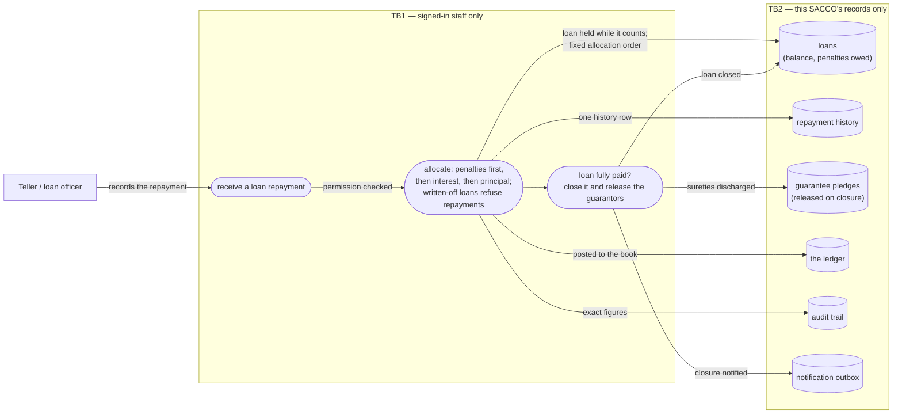
```mermaid
flowchart LR
    %% P-DIAG.3 F3 — reconciled to main @ 8f46aa54250ff1a066af423924f3eb54a9c72fb7
    RPY_E1["Teller / loan officer"]
    subgraph TB1["TB1 — signed-in staff only"]
        RPY_P1(["receive a loan repayment"])
        RPY_P2(["allocate: penalties first,<br/>then interest, then principal;<br/>written-off loans refuse repayments"])
        RPY_P3(["loan fully paid?<br/>close it and release the guarantors"])
    end
    subgraph TB2["TB2 — this SACCO's records only"]
        RPY_S1[("loans<br/>(balance, penalties owed)")]
        RPY_S2[("repayment history")]
        RPY_S3[("guarantee pledges<br/>(released on closure)")]
        RPY_S4[("the ledger")]
        RPY_S5[("audit trail")]
        RPY_S6[("notification outbox")]
    end

    RPY_E1 -->|"records the repayment"| RPY_P1
    RPY_P1 -->|"permission checked"| RPY_P2
    RPY_P2 -->|"loan held while it counts;<br/>fixed allocation order"| RPY_S1
    RPY_P2 -->|"one history row"| RPY_S2
    RPY_P2 -->|"posted to the book"| RPY_S4
    RPY_P2 --> RPY_P3
    RPY_P3 -->|"sureties discharged"| RPY_S3
    RPY_P3 -->|"loan closed"| RPY_S1
    RPY_P2 -->|"exact figures"| RPY_S5
    RPY_P3 -->|"closure notified"| RPY_S6
```

#### Source of truth (F3)

| Element | Citation | Locks |
|---|---|---|
| RPY_P1 | `api/loan_book.py:post_repayment` | — |
| RPY_P2 | `application/loans.py:record_repayment` — documented allocation order penalties → interest → principal; a non-active (closed / written_off) loan is refused (`status is not LoanStatus.ACTIVE` guard); posting via `application/ledger.py:post_allocated_repayment` | §3 repayment single-node row (LOANS entry) → E15 → E16 |
| RPY_P3 | `application/loans.py:_close_loan` → `application/guarantees.py:release_guarantees_for_loan` | E7 (row write) |
| RPY_S1–S6 | `loans` (0001, `penalty_due` 0007/0019), `repayments` (0001; amount CHECK widened 0025; append-only triggers 0032), `guarantees` (0001), ledger stores, `audit_log`, `outbox_events`; `loans.penalty_due` maintained by the P13.8 arrears/penalty batch (posts nothing; lock-order.md §3 arrears row) | — |

### 3.4 F4 — exit settlement

Plain language: a member leaving the SACCO gets a settlement quote
(shares + deposits − loans − fees) that the committee approves. The
payout re-checks every component at the moment it posts: if anything
moved since approval, nothing is paid and the quote must be redone.
A member cannot leave while they still guarantee someone else's loan,
while they have open loan applications — or, since !51, while a
written-off loan of theirs is not fully recovered: **write-off is not
forgiveness**, so the surviving claim blocks the door until the cash
comes back (F13) — the debt cannot walk out with the settlement.

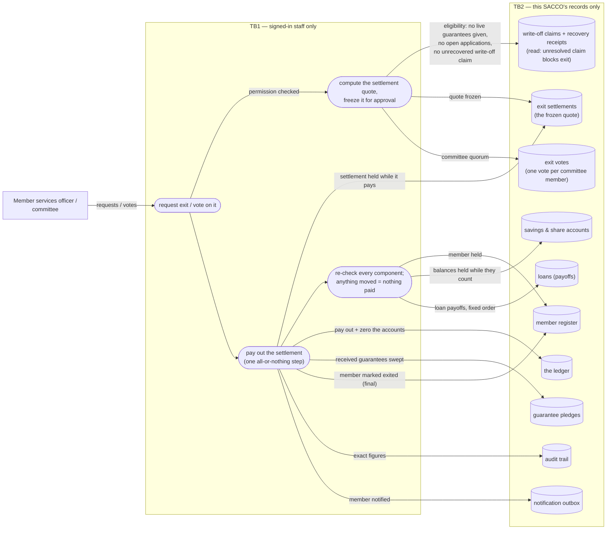
```mermaid
flowchart LR
    %% P-DIAG.3 F4 — reconciled to main @ 8f46aa54250ff1a066af423924f3eb54a9c72fb7
    EXIT_E1["Member services officer /<br/>committee"]
    subgraph TB1["TB1 — signed-in staff only"]
        EXIT_P1(["request exit / vote on it"])
        EXIT_P2(["compute the settlement quote,<br/>freeze it for approval"])
        EXIT_P3(["pay out the settlement<br/>(one all-or-nothing step)"])
        EXIT_P4(["re-check every component;<br/>anything moved = nothing paid"])
    end
    subgraph TB2["TB2 — this SACCO's records only"]
        EXIT_S1[("exit settlements<br/>(the frozen quote)")]
        EXIT_S2[("exit votes<br/>(one vote per committee member)")]
        EXIT_S3[("member register")]
        EXIT_S4[("savings & share accounts")]
        EXIT_S5[("loans (payoffs)")]
        EXIT_S6[("guarantee pledges")]
        EXIT_S7[("the ledger")]
        EXIT_S8[("audit trail")]
        EXIT_S9[("notification outbox")]
        EXIT_S10[("write-off claims + recovery receipts<br/>(read: unresolved claim blocks exit)")]
    end

    EXIT_E1 -->|"requests / votes"| EXIT_P1
    EXIT_P1 -->|"permission checked"| EXIT_P2
    EXIT_P2 -->|"eligibility: no live guarantees given,<br/>no open applications,<br/>no unrecovered write-off claim"| EXIT_S10
    EXIT_P2 -->|"quote frozen"| EXIT_S1
    EXIT_P2 -->|"committee quorum"| EXIT_S2
    EXIT_P1 --> EXIT_P3
    EXIT_P3 -->|"settlement held while it pays"| EXIT_S1
    EXIT_P3 --> EXIT_P4
    EXIT_P4 -->|"member held"| EXIT_S3
    EXIT_P4 -->|"balances held while they count"| EXIT_S4
    EXIT_P4 -->|"loan payoffs, fixed order"| EXIT_S5
    EXIT_P3 -->|"pay out + zero the accounts"| EXIT_S7
    EXIT_P3 -->|"received guarantees swept"| EXIT_S6
    EXIT_P3 -->|"member marked exited (final)"| EXIT_S3
    EXIT_P3 -->|"exact figures"| EXIT_S8
    EXIT_P3 -->|"member notified"| EXIT_S9
```

#### Source of truth (F4)

| Element | Citation | Locks |
|---|---|---|
| EXIT_P1 | `api/member_exits.py` routes (`RequirePermission(MEMBERS, EDIT/APPROVE)`) | — |
| EXIT_P2 | `application/member_exits.py:request_exit` (eligibility under the member row; exit fee from tenant config `_exit_fee`, never the request body), `cast_exit_vote` (quorum from `application/tenant_settings.py` at vote time) | E1 context; §3 exit-vote single-node row |
| EXIT_P3 | `application/member_exits.py:post_settlement` — ONE transaction: postings (`application/ledger.py:post_exit_settlement`) + zeroed balances + guarantee sweep + terminal transition + audit + outbox; declarer/approver separation enforced | E1 → E10 → E12 → E14 → E7 → E15 → E16 |
| EXIT_P4 | `application/member_exits.py:_compute_under_locks` + `_active_loan_payoffs`; component-by-component re-verify against the persisted snapshot, 409 on drift, posts nothing (gate 1.4 snapshot rule) | (same chain — cited once above) |
| EXIT_S10 (**new, !51**) | the unresolved-claim guard in `_compute_under_locks`: `loan_write_offs` (status `posted`) anti-joined against the SUM of `loan_recoveries` — receipts < total blocks exit; race-safe against a concurrent receipt via the member-row conflict (lock-order.md E23 note); a committee waiver is a FUTURE branch recorded on issue #21 | read under the held member row |
| EXIT_S1–S9 | `member_exits` (0001/0010, open-exit partial UNIQUE), `exit_votes` (0010), `members`, accounts, `loans`, `guarantees`, ledger stores, `audit_log`, `outbox_events`; negative settlements are an explicit branch (P12) | — |

### 3.5 F5 — dividend declaration + distribution (incl. the !36 unclaimed disposition)

Plain language: the dividend rate comes from the SACCO's configured
settings — never from the request — and the declared totals are frozen
before the committee votes on them. The payout run can be re-run
safely: each member is paid at most once. A member who exits mid-run
is neither silently paid nor silently dropped — their entitlement is
parked as a recorded payable.

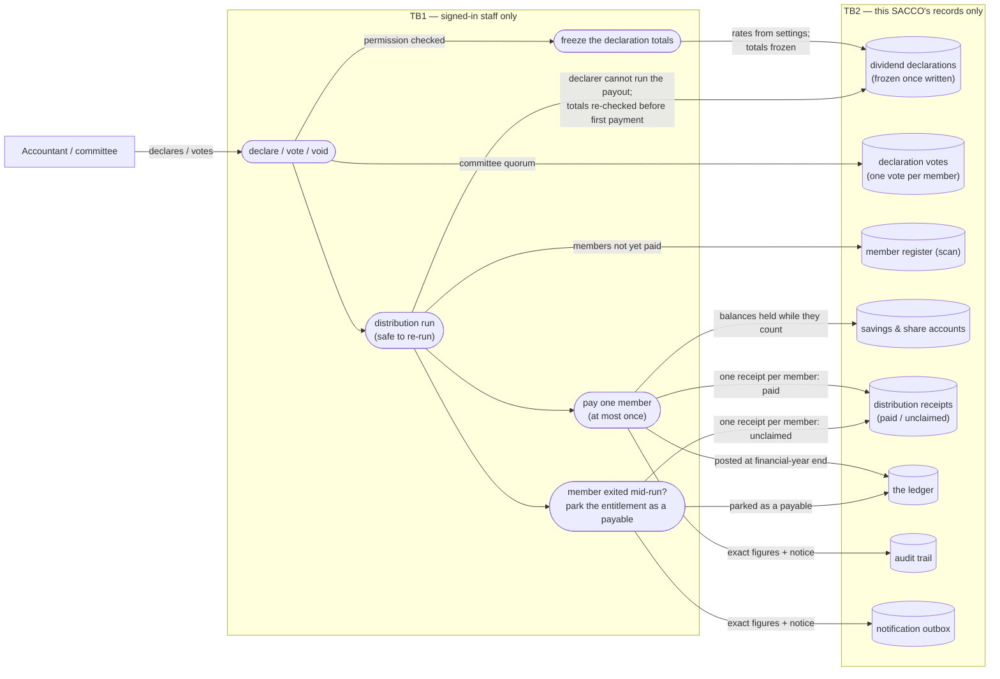
```mermaid
flowchart LR
    %% P-DIAG.3 F5 — reconciled to main @ 8f46aa54250ff1a066af423924f3eb54a9c72fb7
    DIV_E1["Accountant / committee"]
    subgraph TB1["TB1 — signed-in staff only"]
        DIV_P1(["declare / vote / void"])
        DIV_P2(["freeze the declaration totals"])
        DIV_P3(["distribution run<br/>(safe to re-run)"])
        DIV_P4(["pay one member<br/>(at most once)"])
        DIV_P5(["member exited mid-run?<br/>park the entitlement as a payable"])
    end
    subgraph TB2["TB2 — this SACCO's records only"]
        DIV_S1[("dividend declarations<br/>(frozen once written)")]
        DIV_S2[("declaration votes<br/>(one vote per member)")]
        DIV_S3[("member register (scan)")]
        DIV_S4[("savings & share accounts")]
        DIV_S5[("distribution receipts<br/>(paid / unclaimed)")]
        DIV_S6[("the ledger")]
        DIV_S7[("audit trail")]
        DIV_S8[("notification outbox")]
    end

    DIV_E1 -->|"declares / votes"| DIV_P1
    DIV_P1 -->|"permission checked"| DIV_P2
    DIV_P2 -->|"rates from settings;<br/>totals frozen"| DIV_S1
    DIV_P1 -->|"committee quorum"| DIV_S2
    DIV_P1 --> DIV_P3
    DIV_P3 -->|"declarer cannot run the payout;<br/>totals re-checked before first payment"| DIV_S1
    DIV_P3 -->|"members not yet paid"| DIV_S3
    DIV_P3 --> DIV_P4
    DIV_P4 -->|"balances held while they count"| DIV_S4
    DIV_P4 -->|"one receipt per member: paid"| DIV_S5
    DIV_P4 -->|"posted at financial-year end"| DIV_S6
    DIV_P3 --> DIV_P5
    DIV_P5 -->|"one receipt per member: unclaimed"| DIV_S5
    DIV_P5 -->|"parked as a payable"| DIV_S6
    DIV_P4 -->|"exact figures + notice"| DIV_S7
    DIV_P5 -->|"exact figures + notice"| DIV_S8
```

#### Source of truth (F5)

| Element | Citation | Locks |
|---|---|---|
| DIV_P1 | `api/dividends.py` routes; declare/vote/void need `RequirePermission(TRANSACTIONS, EDIT/APPROVE)`, distribution `RequirePermission(MEMBERS, APPROVE)` (module header) | §3 dividend vote/void/open single-node rows |
| DIV_P2 | `application/dividends.py:declare_dividend` — rates resolved server-side (`resolve_dividend_config`), totals persisted as the approved snapshot (`compute_declaration_totals`); write-once by DB trigger (0020) | — |
| DIV_P3 | `application/dividends.py:distribute_dividend` — declarer ≠ executor (P12 separation ban); `_verify_snapshot` on first run only; postings stamped `occurred_at` at FY end (gate 1.5); SKIP-LOCKED members picked up by the idempotent re-run | E2 (decl FOR SHARE per batch → member scan) |
| DIV_P4 | `application/dividends.py:_distribute_one` → `application/ledger.py:post_dividend_distribution`; claim = one `(tenant, declaration, member)` UNIQUE row `ON CONFLICT DO NOTHING` (v1.1 rule 5) | E10 → E12 → E15 → E16 |
| DIV_P5 | `application/dividends.py:_dispose_unclaimed_one` over `unclaimed_scan_sql` (members who EXITED mid-run; root tier only, no account rows) → `application/ledger.py:post_unclaimed_dividend` parks the entitlement as the `liability.unclaimed_dividends` payable (issue #19 P3, MR !36, migration `0022`); resolution/payout of parked rows has NO shipped path yet — see stride.md §2 residual | §3/§7 dormancy-precedent root-tier scan; E15 → E16 |
| DIV_S1–S8 | `dividend_declarations`/`dividend_declaration_votes`/`dividend_distributions` (0020, disposition 0022), `members`, accounts, ledger stores, `audit_log`, `outbox_events`; the `0022` downgrade REFUSES LOUDLY on live `'unclaimed'` dispositions | — |

### 3.6 F6 — deposit-interest batch

Plain language: quarterly savings interest is computed from each
member's AVERAGE balance over the whole quarter, rebuilt from the
ledger — parking money in the account on the measurement day earns
nothing extra. The rate and the quarter come from settings, never from
the request, and re-running the batch pays nothing twice.

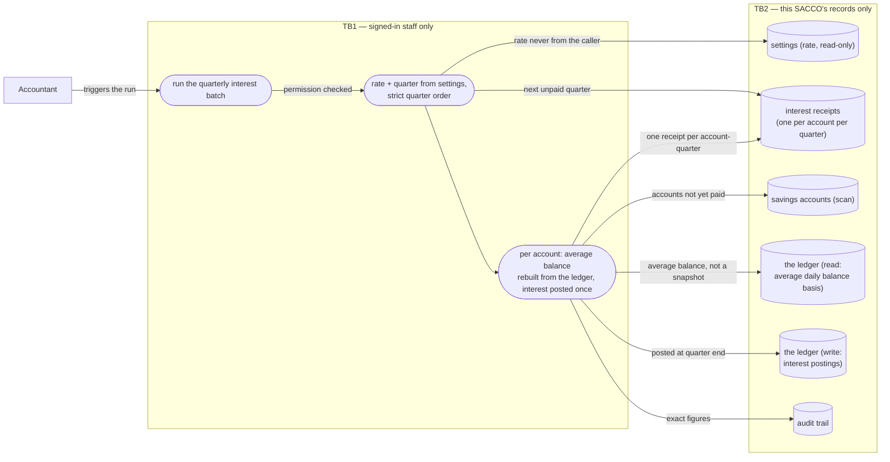
```mermaid
flowchart LR
    %% P-DIAG.3 F6 — reconciled to main @ 8f46aa54250ff1a066af423924f3eb54a9c72fb7
    INT_E1["Accountant"]
    subgraph TB1["TB1 — signed-in staff only"]
        INT_P1(["run the quarterly interest batch"])
        INT_P2(["rate + quarter from settings,<br/>strict quarter order"])
        INT_P3(["per account: average balance<br/>rebuilt from the ledger, interest posted once"])
    end
    subgraph TB2["TB2 — this SACCO's records only"]
        INT_S1[("settings (rate, read-only)")]
        INT_S2[("interest receipts<br/>(one per account per quarter)")]
        INT_S3[("savings accounts (scan)")]
        INT_S4[("the ledger (read:<br/>average daily balance basis)")]
        INT_S5[("the ledger (write:<br/>interest postings)")]
        INT_S6[("audit trail")]
    end

    INT_E1 -->|"triggers the run"| INT_P1
    INT_P1 -->|"permission checked"| INT_P2
    INT_P2 -->|"rate never from the caller"| INT_S1
    INT_P2 -->|"next unpaid quarter"| INT_S2
    INT_P2 --> INT_P3
    INT_P3 -->|"accounts not yet paid"| INT_S3
    INT_P3 -->|"one receipt per account-quarter"| INT_S2
    INT_P3 -->|"average balance, not a snapshot"| INT_S4
    INT_P3 -->|"posted at quarter end"| INT_S5
    INT_P3 -->|"exact figures"| INT_S6
```

#### Source of truth (F6)

| Element | Citation | Locks |
|---|---|---|
| INT_P1 | `api/transactions.py` `/jobs/deposit-interest` route (`RequirePermission(TRANSACTIONS, EDIT)`) | — |
| INT_P2 | `application/deposit_interest.py:resolve_run_parameters` — rate exclusively from tenant configuration; period resolved server-side in strict quarter order (never caller-supplied/backdatable) | — |
| INT_P3 | `application/deposit_interest.py:_process_batch` / `_process_one` — basis = ledger-reconstructed average daily balance under the account row lock (never a snapshot, gate 1.5); claim `ON CONFLICT (tenant_id, account_id, period_start) DO NOTHING`; posting `application/ledger.py:post_deposit_interest`, `occurred_at` at period end | §3 deposit-interest single-node row (DSELF SKIP LOCKED) → E15 → E16 |
| INT_S1–S6 | `tenant_settings` (0009/0017), `deposit_interest_accruals` (0008), `deposit_accounts` (0001), ledger stores, `audit_log` | — |

### 3.7 F7 — dormancy batch

Plain language: a member with no self-initiated activity for the
configured period is marked dormant by a nightly pass — system
postings like interest do not count as activity, so parking a member
account cannot dodge dormancy. A dormant member may still deposit
(which wakes the account automatically) but cannot borrow, pledge or
withdraw.

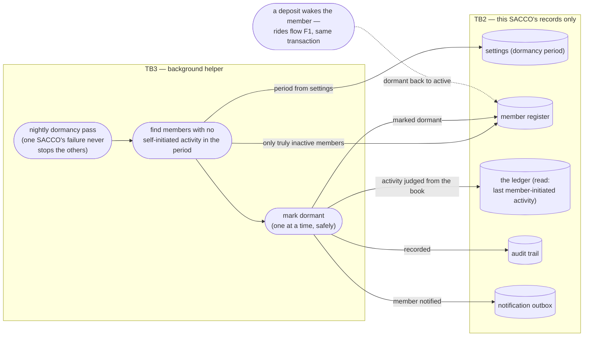
```mermaid
flowchart LR
    %% P-DIAG.3 F7 — reconciled to main @ 8f46aa54250ff1a066af423924f3eb54a9c72fb7
    subgraph TB3["TB3 — background helper"]
        DRM_P1(["nightly dormancy pass<br/>(one SACCO's failure never<br/>stops the others)"])
        DRM_P2(["find members with no<br/>self-initiated activity in the period"])
        DRM_P3(["mark dormant<br/>(one at a time, safely)"])
    end
    subgraph TB2["TB2 — this SACCO's records only"]
        DRM_S1[("settings (dormancy period)")]
        DRM_S2[("member register")]
        DRM_S3[("the ledger (read:<br/>last member-initiated activity)")]
        DRM_S4[("audit trail")]
        DRM_S5[("notification outbox")]
    end
    DRM_P4(["a deposit wakes the member —<br/>rides flow F1, same transaction"])

    DRM_P1 --> DRM_P2
    DRM_P2 -->|"period from settings"| DRM_S1
    DRM_P2 -->|"only truly inactive members"| DRM_S2
    DRM_P2 --> DRM_P3
    DRM_P3 -->|"activity judged from the book"| DRM_S3
    DRM_P3 -->|"marked dormant"| DRM_S2
    DRM_P3 -->|"recorded"| DRM_S4
    DRM_P3 -->|"member notified"| DRM_S5
    DRM_P4 -.->|"dormant back to active"| DRM_S2
```

#### Source of truth (F7)

| Element | Citation | Locks |
|---|---|---|
| DRM_P1 | `infrastructure/dormancy_worker.py:run_dormancy_cycle` — an unexpected per-tenant failure never aborts the other tenants' cycles (!32 R1); the worker itself takes no locks | — |
| DRM_P2 | `application/dormancy.py:run_dormancy_for_tenant` + `resolve_dormancy_period`; scan = `dormancy_scan_sql` (re-run scans zero rows — idempotent anti-join); "member-initiated" is the code-owned allow-list in `domain/ledger.py` | §3 dormancy single-node row (MSELF SKIP LOCKED, root tier; nothing below T1) |
| DRM_P3 | `application/dormancy.py:_mark_dormant` — transition UPDATE + audit row + outbox INSERT under the held member row; **no ledger rows, no advisory locks** | (same row, cited once) |
| DRM_P4 | reactivation is NOT this job: `application/transactions.py:record_deposit` → `application/members.py:reactivate_dormant_member` (F1/TXN_P2) | E10 |
| DRM_S1–S5 | `tenant_settings` (0017), `members` (0001/0021), ledger read, `audit_log`, `outbox_events` | — |

### 3.8 F8 — export render

Plain language: reports are the door data walks out of, so every
export is audited (who, what, how many rows, whether it was cut
short), personally identifying columns appear only for staff whose
role is entitled to them, download links are unguessable and expire,
and a report never mixes mid-settlement state — it reads one
consistent moment in time.

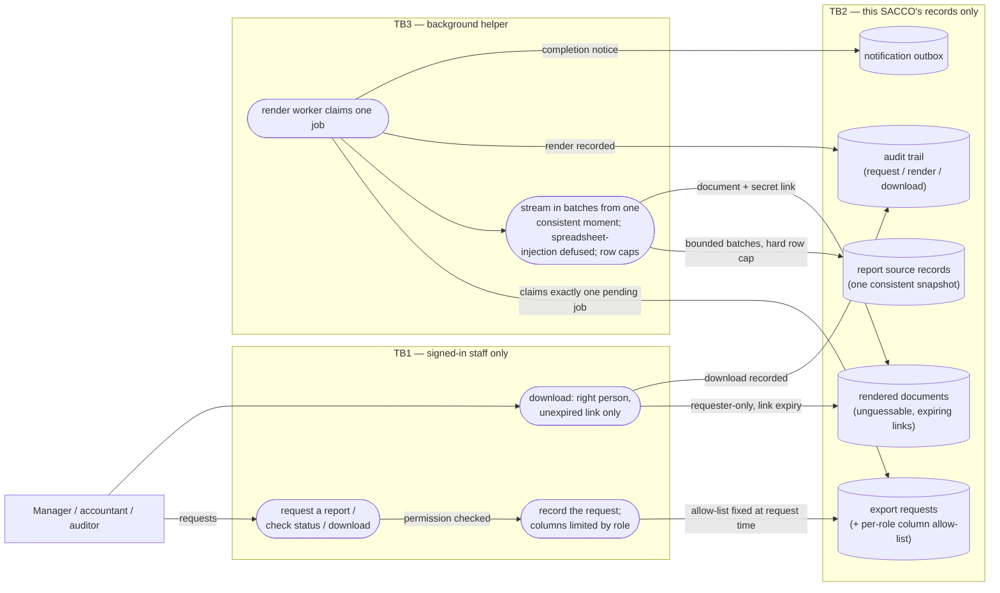
```mermaid
flowchart LR
    %% P-DIAG.3 F8 — reconciled to main @ 8f46aa54250ff1a066af423924f3eb54a9c72fb7
    EXP_E1["Manager / accountant / auditor"]
    subgraph TB1["TB1 — signed-in staff only"]
        EXP_P1(["request a report /<br/>check status / download"])
        EXP_P2(["record the request;<br/>columns limited by role"])
        EXP_P5(["download: right person,<br/>unexpired link only"])
    end
    subgraph TB3["TB3 — background helper"]
        EXP_P3(["render worker claims one job"])
        EXP_P4(["stream in batches from one<br/>consistent moment; spreadsheet-<br/>injection defused; row caps"])
    end
    subgraph TB2["TB2 — this SACCO's records only"]
        EXP_S1[("export requests<br/>(+ per-role column allow-list)")]
        EXP_S2[("report source records<br/>(one consistent snapshot)")]
        EXP_S3[("rendered documents<br/>(unguessable, expiring links)")]
        EXP_S4[("audit trail<br/>(request / render / download)")]
        EXP_S5[("notification outbox")]
    end

    EXP_E1 -->|"requests"| EXP_P1
    EXP_P1 -->|"permission checked"| EXP_P2
    EXP_P2 -->|"allow-list fixed at request time"| EXP_S1
    EXP_P3 -->|"claims exactly one pending job"| EXP_S1
    EXP_P3 --> EXP_P4
    EXP_P4 -->|"bounded batches, hard row cap"| EXP_S2
    EXP_P4 -->|"document + secret link"| EXP_S3
    EXP_P3 -->|"render recorded"| EXP_S4
    EXP_P3 -->|"completion notice"| EXP_S5
    EXP_E1 --> EXP_P5
    EXP_P5 -->|"requester-only, link expiry"| EXP_S3
    EXP_P5 -->|"download recorded"| EXP_S4
```

#### Source of truth (F8)

| Element | Citation | Locks |
|---|---|---|
| EXP_P1 | `api/reports.py` (`RequirePermission(REPORTS, VIEW)` on request/status/download) | — |
| EXP_P2 | `application/exports.py:request_export` — column allow-list per role resolved server-side (`_allowed_columns`: PII columns need `members:view`); request audit + outbox in the same txn | — |
| EXP_P3 | `infrastructure/export_worker.py:run_export_cycle` → `application/exports.py:run_pending_exports` / `run_export_job`; claim = `exports.py:CLAIM_SQL`; snapshot-consistent reads via `infrastructure/tenancy.py:tenant_snapshot_session` (REPEATABLE READ) | §3 export-claim single-node row |
| EXP_P4 | `application/exports.py:run_export` (fetch `batch_size+1`, exact truncation flag, hard row cap, rendering off the event loop via `asyncio.to_thread`; incremental PDF rendering since P13.17d); renderers `domain/documents.py` — CSV formula-injection defence `escape_csv_text`, PDF string escaping `_pdf_escape`; artifact tokens `secrets.token_urlsafe(32)`, TTL `artifact_ttl_hours` | — |
| EXP_P5 | `application/exports.py:download_artifact` — token match + expiry + requester-only access, audited | — |
| EXP_S1–S5 | `exports`/`export_artifacts` (0013; report CHECK widened 0020/0023), source tables, `audit_log`, `outbox_events` | — |

### 3.9 F9 — outbox dispatch

Plain language: every notification is written into an outbox IN THE
SAME transaction as the change it announces — if the change rolls
back, the notice vanishes with it; if the change commits, delivery is
guaranteed to be attempted, retried with growing pauses, and finally
parked on a dead-letter list a human can inspect. Delivery never holds
up or locks any money record.

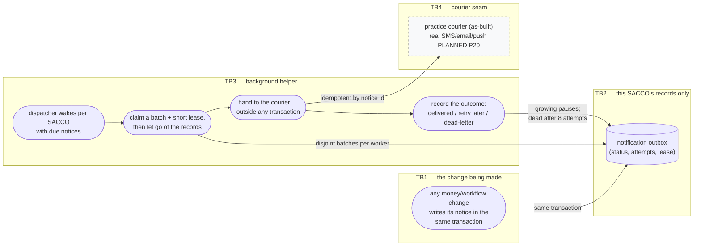
```mermaid
flowchart LR
    %% P-DIAG.3 F9 — reconciled to main @ 8f46aa54250ff1a066af423924f3eb54a9c72fb7
    subgraph TB1["TB1 — the change being made"]
        OBX_P0(["any money/workflow change<br/>writes its notice in the<br/>same transaction"])
    end
    subgraph TB3["TB3 — background helper"]
        OBX_P1(["dispatcher wakes per SACCO<br/>with due notices"])
        OBX_P2(["claim a batch + short lease,<br/>then let go of the records"])
        OBX_P3(["hand to the courier —<br/>outside any transaction"])
        OBX_P4(["record the outcome:<br/>delivered / retry later / dead-letter"])
    end
    subgraph TB2["TB2 — this SACCO's records only"]
        OBX_S1[("notification outbox<br/>(status, attempts, lease)")]
    end
    subgraph TB4["TB4 — courier seam"]
        OBX_E1["practice courier (as-built)<br/>real SMS/email/push PLANNED P20"]
    end

    OBX_P0 -->|"same transaction"| OBX_S1
    OBX_P1 --> OBX_P2
    OBX_P2 -->|"disjoint batches per worker"| OBX_S1
    OBX_P2 --> OBX_P3
    OBX_P3 -->|"idempotent by notice id"| OBX_E1
    OBX_P3 --> OBX_P4
    OBX_P4 -->|"growing pauses;<br/>dead after 8 attempts"| OBX_S1

    classDef planned fill:#f8f9fa,stroke:#999,stroke-dasharray: 5 5;
    class OBX_E1 planned;
```

#### Source of truth (F9)

| Element | Citation | Locks |
|---|---|---|
| OBX_P0 | `application/outbox.py:enqueue_event` — called by every notifying mutation in the SAME transaction (gate 1.2); rollback removes the event | — |
| OBX_P1 | `infrastructure/outbox_worker.py:run_worker` / `run_dispatch_cycle` / `list_due_tenants` (due-tenant discovery, 0024/P13.17e); hourly retention purge `purge_dispatched` (dispatched rows only, 30d) | — |
| OBX_P2 | `infrastructure/outbox_worker.py:dispatch_due` phase 1 — claim + `CLAIM_LEASE_SECONDS` set-based lease (P13.17e), then COMMIT before any provider I/O | §3 outbox single-node row (dispatch holds NO domain locks) |
| OBX_P3 | `dispatch_due` phase 2 — `provider.send` outside any transaction, across TB4; `infrastructure/providers.py:StubProvider` is idempotent by event id | — |
| OBX_P4 | `dispatch_due` phase 3 + `_record_failure` — `backoff_delay` (exponential + jitter), `status='dead'` at `MAX_ATTEMPTS` (8) | — |
| OBX_S1 / OBX_E1 | `outbox_events` (0001, worker columns 0003, purge index 0024); providers per TB4 | — |

### 3.10 F10 — misc fee posting (P13.15, !46)

Plain language: staff can charge a member a fee (e.g. the registration
fee) — but only a fee TYPE. The amount comes exclusively from the
SACCO's configured settings; a request carrying an amount is rejected
outright, and an unconfigured or zero fee refuses to post rather than
guessing.

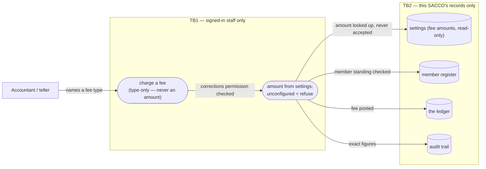
```mermaid
flowchart LR
    %% P-DIAG.3 F10 — reconciled to main @ 8f46aa54250ff1a066af423924f3eb54a9c72fb7
    FEE_E1["Accountant / teller"]
    subgraph TB1["TB1 — signed-in staff only"]
        FEE_P1(["charge a fee<br/>(type only — never an amount)"])
        FEE_P2(["amount from settings;<br/>unconfigured = refuse"])
    end
    subgraph TB2["TB2 — this SACCO's records only"]
        FEE_S1[("settings (fee amounts, read-only)")]
        FEE_S2[("member register")]
        FEE_S3[("the ledger")]
        FEE_S4[("audit trail")]
    end

    FEE_E1 -->|"names a fee type"| FEE_P1
    FEE_P1 -->|"corrections permission checked"| FEE_P2
    FEE_P2 -->|"amount looked up, never accepted"| FEE_S1
    FEE_P2 -->|"member standing checked"| FEE_S2
    FEE_P2 -->|"fee posted"| FEE_S3
    FEE_P2 -->|"exact figures"| FEE_S4
```

#### Source of truth (F10)

| Element | Citation | Locks |
|---|---|---|
| FEE_P1 | `api/corrections.py:post_fee` route — `RequirePermission(CORRECTIONS, CREATE)`; `extra="forbid"` body carries a `FeeType` enum member only | — |
| FEE_P2 | `application/corrections.py:post_misc_fee` → `_resolve_fee_amount` (code-owned `FEE_SETTING_KEYS` → `tenant_settings` column; fails closed on unconfigured/zero); member gate `application/transactions.py:_require_member` (`MoneyOperation.FEE`); posting `application/ledger.py:post_fee` (FE- ref) | member FOR SHARE alone (§3 misc-fee row) → E15 → E16 |
| FEE_S1–S4 | `tenant_settings` (0017), `members` (0001), ledger stores (`transactions.type` CHECK widened for `fee` by 0025), `audit_log` | — |

### 3.11 F11 — maker-checker repayment adjustment (P13.15 !46, hardened by issue #24 !52)

Plain language: undoing a recorded repayment is the classic fraud
channel, so it takes FOUR EYES. One staff member (the maker) requests
the adjustment; the system freezes a snapshot of the loan's position
at that moment. A DIFFERENT staff member (the checker — never the
maker, never an auditor) approves: the system re-checks the frozen
snapshot against the live loan and refuses if anything moved. Only
then does it post the mirror-image correction, restore the loan's
balance and schedule from the surviving history, and — in the one
documented branch — re-open a loan that the undone repayment had
closed. A rejection frees the slot for a corrected request. The
original entry is NEVER edited: the books only ever grow.

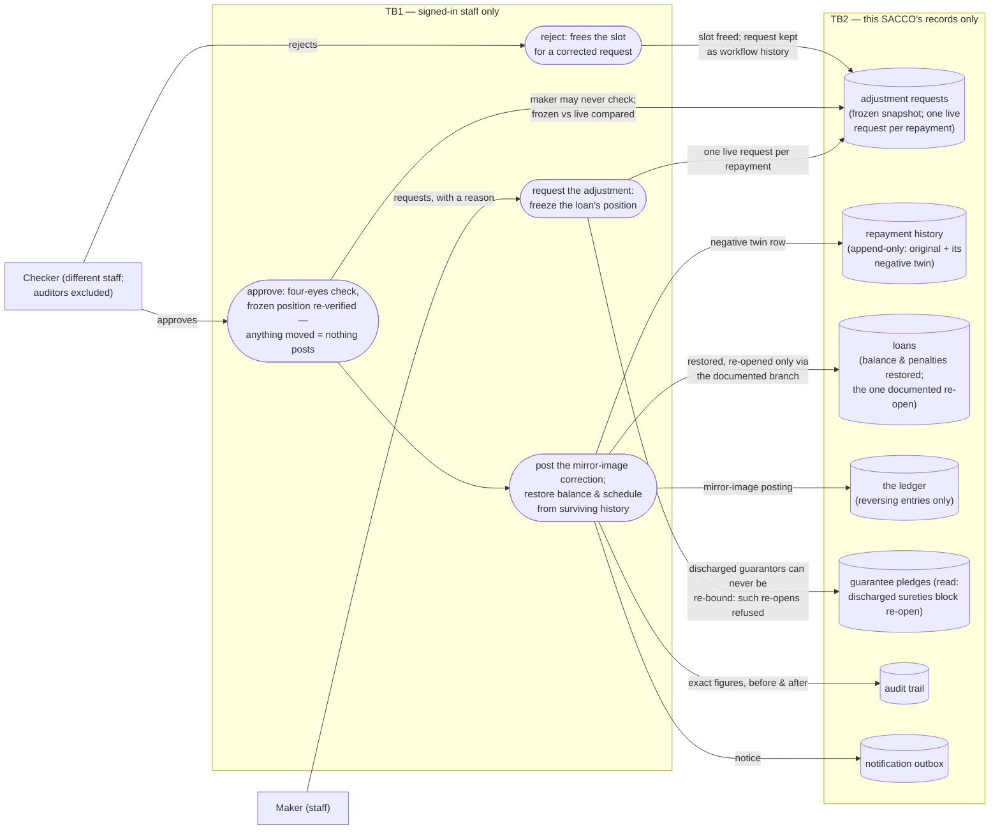
```mermaid
flowchart LR
    %% P-DIAG.3 F11 — reconciled to main @ 8f46aa54250ff1a066af423924f3eb54a9c72fb7
    ADJ_E1["Maker (staff)"]
    ADJ_E2["Checker (different staff;<br/>auditors excluded)"]
    subgraph TB1["TB1 — signed-in staff only"]
        ADJ_P1(["request the adjustment:<br/>freeze the loan's position"])
        ADJ_P2(["approve: four-eyes check,<br/>frozen position re-verified —<br/>anything moved = nothing posts"])
        ADJ_P3(["post the mirror-image correction;<br/>restore balance & schedule<br/>from surviving history"])
        ADJ_P4(["reject: frees the slot<br/>for a corrected request"])
    end
    subgraph TB2["TB2 — this SACCO's records only"]
        ADJ_S1[("adjustment requests<br/>(frozen snapshot; one live<br/>request per repayment)")]
        ADJ_S2[("repayment history<br/>(append-only: original + its<br/>negative twin)")]
        ADJ_S3[("loans<br/>(balance & penalties restored;<br/>the one documented re-open)")]
        ADJ_S4[("the ledger<br/>(reversing entries only)")]
        ADJ_S5[("guarantee pledges (read:<br/>discharged sureties block re-open)")]
        ADJ_S6[("audit trail")]
        ADJ_S7[("notification outbox")]
    end

    ADJ_E1 -->|"requests, with a reason"| ADJ_P1
    ADJ_P1 -->|"one live request per repayment"| ADJ_S1
    ADJ_P1 -->|"discharged guarantors can never be<br/>re-bound: such re-opens refused"| ADJ_S5
    ADJ_E2 -->|"approves"| ADJ_P2
    ADJ_P2 -->|"maker may never check;<br/>frozen vs live compared"| ADJ_S1
    ADJ_P2 --> ADJ_P3
    ADJ_P3 -->|"negative twin row"| ADJ_S2
    ADJ_P3 -->|"mirror-image posting"| ADJ_S4
    ADJ_P3 -->|"restored, re-opened only via<br/>the documented branch"| ADJ_S3
    ADJ_P3 -->|"exact figures, before & after"| ADJ_S6
    ADJ_P3 -->|"notice"| ADJ_S7
    ADJ_E2 -->|"rejects"| ADJ_P4
    ADJ_P4 -->|"slot freed; request kept<br/>as workflow history"| ADJ_S1
```

#### Source of truth (F11)

| Element | Citation | Locks |
|---|---|---|
| ADJ_P1 | `api/corrections.py:request_repayment_adjustment` (`RequirePermission(CORRECTIONS, CREATE)`) → `application/corrections.py:request_repayment_adjustment` — snapshot (balance / penalty_due / status) captured under the full lock set via `_lock_adjustment_chain`; allocation reconstructed from the append-only legs (`_allocation_from_legs`); maker's authority band checked (`tenant_settings.py:enforce_authority_band`); atomic claim on the 0031 partial UNIQUE (`WHERE status <> 'rejected'`); FM10 released-guarantee refusal (`_released_guarantees_exist`) | E20 → E21 (chain shared verbatim with approval) |
| ADJ_P2 | `api/corrections.py:approve_repayment_adjustment` (`RequirePermission(CORRECTIONS, APPROVE)`) → `application/corrections.py:approve_repayment_adjustment` — adjustment row locked FIRST (workflow anchor), `adjustment_transition` gatekeeper, SoD via `_require_distinct_non_assurance_checker` (maker ≠ checker, `ASSURANCE_ROLES` excluded; 0031 `ck_repayment_adjustments_sod` is the DB backstop), snapshot re-verified component-by-component, 409 on drift posting NOTHING | E24 → E20 → E21 |
| ADJ_P3 | same function, post-verification half: storno `application/ledger.py:post_reversal` (`reversal_of_id` linkage, occurred_at = NOW, open-period gate); negative `repayments` row; one-shot decision write permitted by the 0031 write-once trigger; `_rebuild_schedule_paid_amounts` + balance/penalty restore RECOMPUTED from surviving history; in-transaction conservation self-check (`_reconstructed_balance`); reopen only via `domain/lending.py:loan_transition` CLOSED → ACTIVE | (same transaction) → E15 → E16 |
| ADJ_P4 | `api/corrections.py:reject_repayment_adjustment` → `application/corrections.py:reject_repayment_adjustment` — checker decision (same SoD), optimistic-locked; rejected rows are terminal workflow history and free the partial-UNIQUE slot | ADJ row alone (§3 single-node row) |
| ADJ_S1–S7 | `repayment_adjustments` (0025/0031: SoD CHECK, snapshot columns, partial claim UNIQUE, write-once trigger), `repayments` (0025 CHECK `<> 0`, 0032 append-only triggers), `loans` (0001), ledger stores, `guarantees` (0001), `audit_log`, `outbox_events` | — |

### 3.12 F12 — loan write-off (P13.15, !46)

Plain language: writing off a hopeless loan is a committee act, not a
keystroke. Only a loan the arrears process has already classified as
non-performing can even be proposed; the proposal freezes the figures
(write-once — they can never be edited, only voided and redone); the
committee votes with one vote each; and a DIFFERENT person from the
proposer posts it, after the system re-checks the frozen figures
against the live loan. Write-off removes the loan from the performing
book — **it does not forgive the member's debt**: the legal claim
survives (F13), the guarantors stay bound, and the member cannot exit
(F4) until the claim is settled.

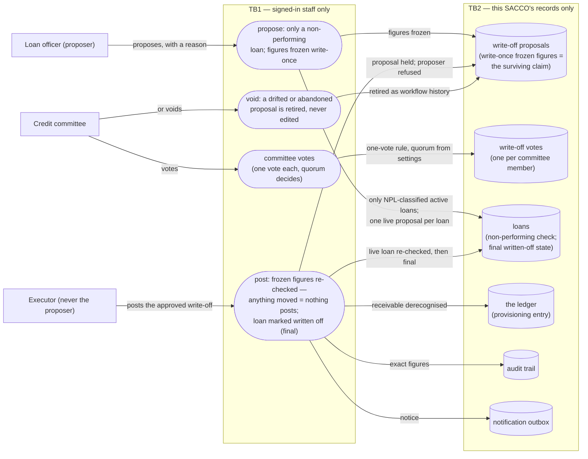
```mermaid
flowchart LR
    %% P-DIAG.3 F12 — reconciled to main @ 8f46aa54250ff1a066af423924f3eb54a9c72fb7
    WOF_E1["Loan officer (proposer)"]
    WOF_E2["Credit committee"]
    WOF_E3["Executor (never the proposer)"]
    subgraph TB1["TB1 — signed-in staff only"]
        WOF_P1(["propose: only a non-performing<br/>loan; figures frozen write-once"])
        WOF_P2(["committee votes<br/>(one vote each, quorum decides)"])
        WOF_P3(["post: frozen figures re-checked —<br/>anything moved = nothing posts;<br/>loan marked written off (final)"])
        WOF_P4(["void: a drifted or abandoned<br/>proposal is retired, never edited"])
    end
    subgraph TB2["TB2 — this SACCO's records only"]
        WOF_S1[("write-off proposals<br/>(write-once frozen figures =<br/>the surviving claim)")]
        WOF_S2[("write-off votes<br/>(one per committee member)")]
        WOF_S3[("loans<br/>(non-performing check;<br/>final written-off state)")]
        WOF_S4[("the ledger<br/>(provisioning entry)")]
        WOF_S5[("audit trail")]
        WOF_S6[("notification outbox")]
    end

    WOF_E1 -->|"proposes, with a reason"| WOF_P1
    WOF_P1 -->|"only NPL-classified active loans;<br/>one live proposal per loan"| WOF_S3
    WOF_P1 -->|"figures frozen"| WOF_S1
    WOF_E2 -->|"votes"| WOF_P2
    WOF_P2 -->|"one-vote rule, quorum from settings"| WOF_S2
    WOF_E3 -->|"posts the approved write-off"| WOF_P3
    WOF_P3 -->|"proposal held; proposer refused"| WOF_S1
    WOF_P3 -->|"live loan re-checked, then final"| WOF_S3
    WOF_P3 -->|"receivable derecognised"| WOF_S4
    WOF_P3 -->|"exact figures"| WOF_S5
    WOF_P3 -->|"notice"| WOF_S6
    WOF_E2 -->|"or voids"| WOF_P4
    WOF_P4 -->|"retired as workflow history"| WOF_S1
```

#### Source of truth (F12)

| Element | Citation | Locks |
|---|---|---|
| WOF_P1 | `api/corrections.py:request_write_off` (`RequirePermission(CORRECTIONS, CREATE)`) → `application/corrections.py:request_write_off` — prudential gate: stored `loans.classification` must be in `domain/lending.py:NPL_CLASSES` (0025 CHECK is the DB backstop); snapshot (balance, penalty_due, total = balance + penalty_due) write-once from INSERT (0025 trigger); one live workflow per loan (`uq_loan_write_offs_open`) | LOANS alone (§3 write-off-request row) |
| WOF_P2 | `api/corrections.py:cast_write_off_vote` (`RequirePermission(CORRECTIONS, APPROVE)`) → `application/corrections.py:cast_write_off_vote` — the P9 committee pattern (`domain/committee.py:decide`, quorum `tenant_settings.py:committee_quorum` at vote time, one-vote UNIQUE 0025); the requester cannot vote | WOFF anchor alone (§3 row) |
| WOF_P3 | `api/corrections.py:post_write_off` → `application/corrections.py:post_write_off` — snapshot row FOR UPDATE, `_wo_transition` gatekeeper, requester-may-not-execute, live loan re-verified component-by-component (409 on drift, posting nothing), `loan_transition(ACTIVE → WRITTEN_OFF)` (terminal), WO- posting `application/ledger.py:post_loan_write_off` (balance > 0 only), loan receivables zeroed | E22 → E15 → E16 |
| WOF_P4 | `api/corrections.py:void_write_off` → `application/corrections.py:void_write_off` | WOFF anchor alone (§3 row) |
| WOF_S1–S6 | `loan_write_offs` + `loan_write_off_votes` (0025), `loans` (0001), ledger stores (`transactions.type` `loan_write_off`, 0025), `audit_log`, `outbox_events` | — |

### 3.13 F13 — bad-debt recovery receipt (issue #21, !51)

Plain language: money talks. When cash actually comes back against a
written-off loan, the recovery receipt is the ONLY door it may enter
through — a normal repayment against a dead loan is refused (F3). Each
receipt is appended to the claim's history; the outstanding claim is
always recomputed from those append-only receipts, so nothing can be
quietly overwritten. A receipt for more than the outstanding claim is
refused — over-recovery is unrepresentable, even by direct database
access. The receipt that recovers the claim IN FULL discharges the
guarantors in the same breath — exactly as if the loan had closed
honestly — and unblocks the member's exit (F4). The loan itself is
never resurrected.

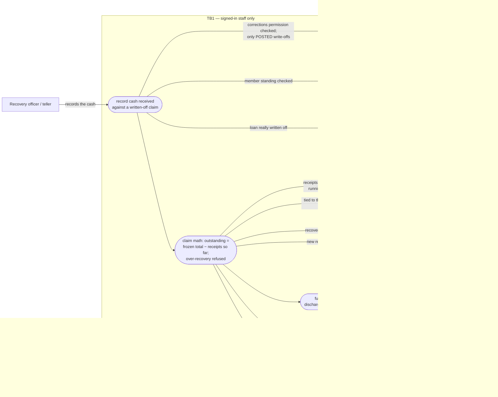
```mermaid
flowchart LR
    %% P-DIAG.3 F13 — reconciled to main @ 8f46aa54250ff1a066af423924f3eb54a9c72fb7
    RCV_E1["Recovery officer / teller"]
    subgraph TB1["TB1 — signed-in staff only"]
        RCV_P1(["record cash received<br/>against a written-off claim"])
        RCV_P2(["claim math: outstanding =<br/>frozen total − receipts so far;<br/>over-recovery refused"])
        RCV_P3(["full recovery?<br/>discharge the guarantors"])
    end
    subgraph TB2["TB2 — this SACCO's records only"]
        RCV_S1[("write-off claims<br/>(the frozen total — held while<br/>the receipt counts)")]
        RCV_S2[("recovery receipts<br/>(append-only history)")]
        RCV_S3[("member register<br/>(exited members refused;<br/>receipt blocks a racing exit)")]
        RCV_S4[("loans (read: still written off —<br/>never resurrected)")]
        RCV_S5[("recovery case file<br/>(read: receipt tied to the case)")]
        RCV_S6[("the ledger<br/>(recovery income entry)")]
        RCV_S7[("guarantee pledges<br/>(released on full recovery only)")]
        RCV_S8[("audit trail")]
        RCV_S9[("notification outbox")]
    end

    RCV_E1 -->|"records the cash"| RCV_P1
    RCV_P1 -->|"corrections permission checked;<br/>only POSTED write-offs"| RCV_S1
    RCV_P1 -->|"member standing checked"| RCV_S3
    RCV_P1 -->|"loan really written off"| RCV_S4
    RCV_P1 --> RCV_P2
    RCV_P2 -->|"receipts summed, never a<br/>running-total column"| RCV_S2
    RCV_P2 -->|"tied to the closed case, if any"| RCV_S5
    RCV_P2 -->|"recovery income posted"| RCV_S6
    RCV_P2 -->|"new receipt appended"| RCV_S2
    RCV_P2 --> RCV_P3
    RCV_P3 -->|"full recovery discharges sureties"| RCV_S7
    RCV_P2 -->|"exact figures"| RCV_S8
    RCV_P2 -->|"notice"| RCV_S9
```

#### Source of truth (F13)

| Element | Citation | Locks |
|---|---|---|
| RCV_P1 | `api/corrections.py:record_recovery_receipt` (`RequirePermission(CORRECTIONS, CREATE)`) → `application/corrections.py:record_recovery_receipt` — POSTED-only guard on the write-off anchor; member gate `transactions._require_member` (`MoneyOperation.RECOVERY`; EXITED refused; the FOR SHARE conflict is what the F4 exit guard relies on); loan re-verified `WRITTEN_OFF` under its own lock | E23 → E21 |
| RCV_P2 | same function — outstanding = write-once `total_written_off` − `_recovered_total` (SUM over append-only `loan_recoveries`, v1.1 rule 2); over-recovery 409 with zero side effects (0030 `loan_recoveries_within_claim` constraint trigger is the direct-SQL backstop); case linkage resolved server-side (`recovery_cases.status = 'closed_written_off'`); RC- posting `application/ledger.py:post_loan_recovery` (recovery INCOME — never a receivable restore) | (same chain) → E15 → E16 |
| RCV_P3 | same function — `claim_fully_recovered` ⇒ `application/guarantees.py:release_guarantees_for_loan` in the same transaction (the P10 closure hook, reused); partial receipts leave sureties untouched; a committee WAIVER (release without cash) is a FUTURE branch recorded on issue #21 | E7 (row write under the held loan) |
| RCV_S1–S9 | `loan_write_offs` (0025), `loan_recoveries` (0030, append-only + within-claim triggers), `members`, `loans`, `recovery_cases` (0026), ledger stores (`transactions.type` `loan_recovery`, 0030), `guarantees`, `audit_log`, `outbox_events` | — |

### 3.14 F14 — recovery cases: worklist & auto-close (P13.16, !47 — no money moves)

Plain language: when a loan goes non-performing, staff open a recovery
case — a work file, not a money record. Only genuinely non-performing
loans can get a case, one open case per loan, and every note added to
the file is permanent (the collections trail is evidence). Cases are
worked from a worklist ordered by how overdue the loan is. Closing is
decided by the LOAN's facts, not by staff mood: the nightly arrears
pass closes a case by itself when the loan cures or is written off —
money talks and closes cases; staff can never hand-declare either.
As-built since !53/!54 (issue #23, 0033 — verified at merged main
`d517769`): a case can PAUSE without pretending to be workable —
disputed, or irrecoverable-pending-write-off — always with a required
reason on the record; the one staff-attested terminal (the loan was
RESTRUCTURED) writes its closing outcome note atomically with the
close; every closed file takes exactly one permanent outcome note.

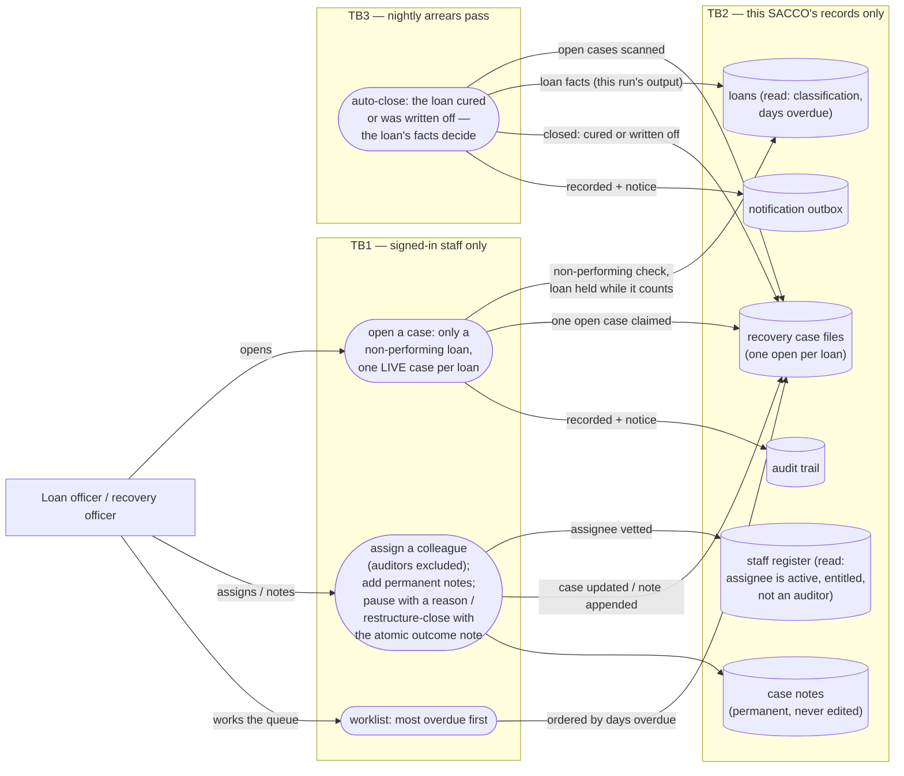
```mermaid
flowchart LR
    %% P-DIAG.3 F14 — reconciled to main @ 8f46aa54250ff1a066af423924f3eb54a9c72fb7
    RCS_E1["Loan officer / recovery officer"]
    subgraph TB1["TB1 — signed-in staff only"]
        RCS_P1(["open a case: only a<br/>non-performing loan,<br/>one LIVE case per loan"])
        RCS_P2(["assign a colleague<br/>(auditors excluded);<br/>add permanent notes;<br/>pause with a reason /<br/>restructure-close with<br/>the atomic outcome note"])
        RCS_P3(["worklist: most overdue first"])
    end
    subgraph TB3["TB3 — nightly arrears pass"]
        RCS_P4(["auto-close: the loan cured<br/>or was written off —<br/>the loan's facts decide"])
    end
    subgraph TB2["TB2 — this SACCO's records only"]
        RCS_S1[("recovery case files<br/>(one open per loan)")]
        RCS_S2[("case notes<br/>(permanent, never edited)")]
        RCS_S3[("loans (read: classification,<br/>days overdue)")]
        RCS_S4[("staff register (read:<br/>assignee is active, entitled,<br/>not an auditor)")]
        RCS_S5[("audit trail")]
        RCS_S6[("notification outbox")]
    end

    RCS_E1 -->|"opens"| RCS_P1
    RCS_P1 -->|"non-performing check,<br/>loan held while it counts"| RCS_S3
    RCS_P1 -->|"one open case claimed"| RCS_S1
    RCS_E1 -->|"assigns / notes"| RCS_P2
    RCS_P2 -->|"assignee vetted"| RCS_S4
    RCS_P2 -->|"case updated / note appended"| RCS_S1
    RCS_P2 --> RCS_S2
    RCS_E1 -->|"works the queue"| RCS_P3
    RCS_P3 -->|"ordered by days overdue"| RCS_S1
    RCS_P4 -->|"open cases scanned"| RCS_S1
    RCS_P4 -->|"loan facts (this run's output)"| RCS_S3
    RCS_P4 -->|"closed: cured or written off"| RCS_S1
    RCS_P1 -->|"recorded + notice"| RCS_S5
    RCS_P4 -->|"recorded + notice"| RCS_S6
```

#### Source of truth (F14)

| Element | Citation | Locks |
|---|---|---|
| RCS_P1 | `api/recovery.py:open_case` (`RequirePermission(LOAN_BOOK, CREATE)`) → `application/recovery.py:open_recovery_case` — active + NPL-classified check under the loan FOR UPDATE (classification is the arrears job's persisted output, never recomputed); atomic one-LIVE-case claim on `uq_recovery_cases_one_open` (0026; regenerated by 0033 under the same name over the live-status predicate — a paused case still blocks a second); 0026 CHECKs (NPL set, dpd > 90) are the DB backstop | LOANS alone (§3 recovery-open row) |
| RCS_P2 | `api/recovery.py:assign_case` / `add_note` (`RequirePermission(LOAN_BOOK, EDIT)`) → `application/recovery.py:assign_recovery_case` / `add_recovery_note` — assignee must be an ACTIVE same-tenant user holding `loan_book:view` (`rbac.actor_access`), `ASSURANCE_ROLES` excluded; notes are append-only rows (no edit/delete route exists — addendum A2) | case row alone (§3 recovery-mutation row) |
| RCS_P3 | `api/recovery.py:worklist` (`RequirePermission(LOAN_BOOK, VIEW)`) → `application/recovery.py:list_worklist` — keyset `ORDER BY days_past_due DESC, id DESC`, served by `idx_loans_dpd_worklist` (0026); rows expose workflow fields + dpd + classification pill, NO balance/penalty figures (least disclosure) | no locks |
| RCS_P4 | `application/arrears.py:run_arrears_for_tenant` → `application/recovery.py:run_recovery_close_pass` (after the classify pass, so a loan curing today closes its case today) → `_close_one` via `domain/recovery.py:transition` (the single gatekeeper; all three closed states terminal); the scan covers ALL live statuses (0033 — a paused case still closes on the loan's facts); cure = stored classification left `NPL_CLASSES` or loan `closed`; `written_off` closes as `closed_written_off`; idempotent by side-effect counts | case rows `FOR UPDATE SKIP LOCKED` in id order, joined loan read WITHOUT a lock (§3 recovery close-pass row) |
| RCS_P2 (dispositions, as-built 0033/!54) | `api/recovery.py:set_disposition` (`POST /recovery-cases/{id}/disposition`, `RequirePermission(LOAN_BOOK, EDIT)`) → `application/recovery.py:set_case_disposition` — single gatekeeper `domain/recovery.py:transition`; pause targets require a `reason` → audit payload (!54); `closed_restructured` requires + atomically writes THE outcome note (!54); `add_case_outcome_note` (`POST …/outcome-note`) is terminal-only, exactly one per case (`uq_recovery_notes_one_outcome`, 0033) | case row alone (§3 recovery-mutation row) |
| RCS_S1–S6 | `recovery_cases` (0026; 0033 widens the status CHECK to the six disposition states and regenerates the one-LIVE-case partial UNIQUE/scan index under the same names) + `recovery_case_notes` (0026; 0033 adds `is_outcome` + the one-outcome partial UNIQUE), `loans` (0001/0026 idx), `users`/`roles`/`permissions` (0001), `audit_log`, `outbox_events` | — |

### 3.15 F15 — guarantor consent & self-release as the MEMBER principal (P14.5, !65)

Plain language: pledging your savings behind someone else's loan is a
personal act, so the consent belongs to the MEMBER — not to a staff
keystroke. A member whose login a staff administrator has explicitly
linked signs in with a one-time code (the same code rules as staff; a
member session can never open a staff door, nor the reverse) and then
consents to — or withdraws — THEIR OWN pledge only. Withdrawal is
allowed only while the pledge is not yet consented, and only if the
borrower's remaining cover still satisfies the product rule. Where the
member cannot act (no login yet, paper consent), a staff officer may
record an ATTESTED override — but only with a mandatory citation of
the evidence, and the guarantor is notified so an attestation made in
their name never goes unseen. Every consent row permanently records
WHO gave it; a consent belonging to nobody cannot be written, even by
direct database access. Linking or revoking a member's login is itself
an audited admin act — never self-service.

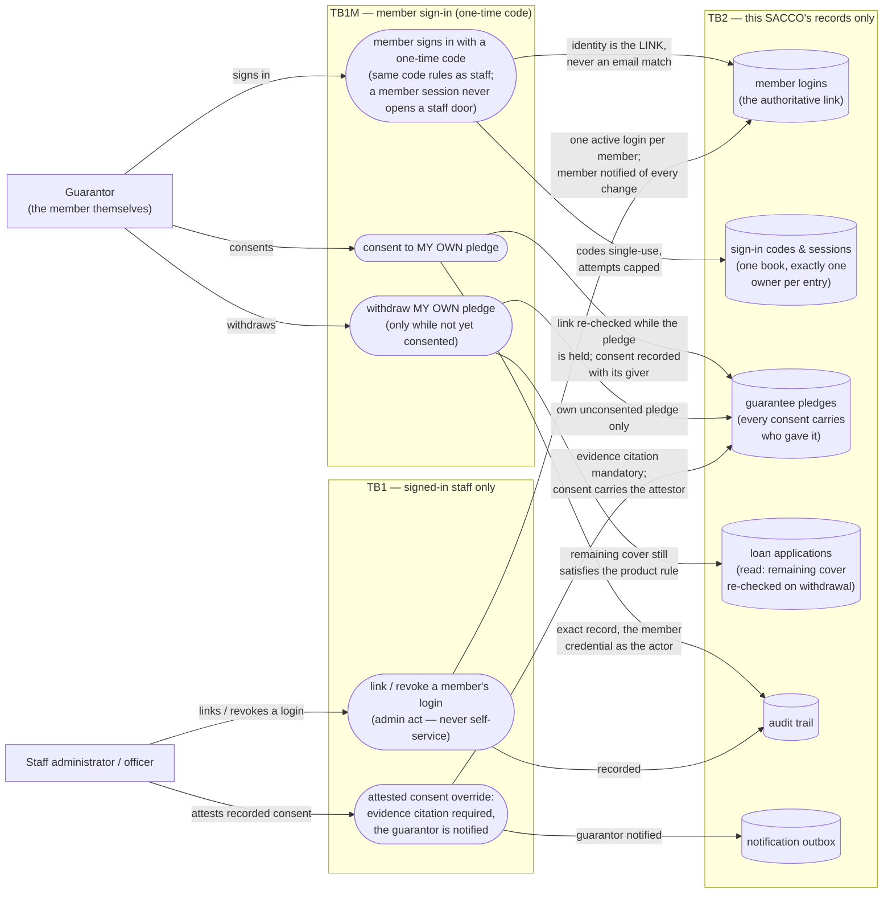
```mermaid
flowchart LR
    %% P-DIAG.3 F15 — drawn as-built at main @ 047d4e399e3f5c5537f15a8fb73b8f1ab4a15658 (P14.5, !65)
    CNS_E1["Guarantor<br/>(the member themselves)"]
    CNS_E2["Staff administrator / officer"]
    subgraph TB1M["TB1M — member sign-in (one-time code)"]
        CNS_P1(["member signs in with a one-time code<br/>(same code rules as staff;<br/>a member session never opens a staff door)"])
        CNS_P2(["consent to MY OWN pledge"])
        CNS_P3(["withdraw MY OWN pledge<br/>(only while not yet consented)"])
    end
    subgraph TB1["TB1 — signed-in staff only"]
        CNS_P4(["attested consent override:<br/>evidence citation required,<br/>the guarantor is notified"])
        CNS_P5(["link / revoke a member's login<br/>(admin act — never self-service)"])
    end
    subgraph TB2["TB2 — this SACCO's records only"]
        CNS_S1[("member logins<br/>(the authoritative link)")]
        CNS_S2[("sign-in codes & sessions<br/>(one book, exactly one<br/>owner per entry)")]
        CNS_S3[("guarantee pledges<br/>(every consent carries<br/>who gave it)")]
        CNS_S4[("loan applications<br/>(read: remaining cover<br/>re-checked on withdrawal)")]
        CNS_S5[("audit trail")]
        CNS_S6[("notification outbox")]
    end

    CNS_E1 -->|"signs in"| CNS_P1
    CNS_P1 -->|"identity is the LINK,<br/>never an email match"| CNS_S1
    CNS_P1 -->|"codes single-use,<br/>attempts capped"| CNS_S2
    CNS_E1 -->|"consents"| CNS_P2
    CNS_E1 -->|"withdraws"| CNS_P3
    CNS_P2 -->|"link re-checked while the pledge<br/>is held; consent recorded<br/>with its giver"| CNS_S3
    CNS_P3 -->|"own unconsented pledge only"| CNS_S3
    CNS_P3 -->|"remaining cover still<br/>satisfies the product rule"| CNS_S4
    CNS_E2 -->|"attests recorded consent"| CNS_P4
    CNS_P4 -->|"evidence citation mandatory;<br/>consent carries the attestor"| CNS_S3
    CNS_P4 -->|"guarantor notified"| CNS_S6
    CNS_E2 -->|"links / revokes a login"| CNS_P5
    CNS_P5 -->|"one active login per member;<br/>member notified of every change"| CNS_S1
    CNS_P2 -->|"exact record, the member<br/>credential as the actor"| CNS_S5
    CNS_P5 -->|"recorded"| CNS_S5
```

#### Source of truth (F15)

| Element | Citation | Locks (lock-order.md ids only) |
|---|---|---|
| CNS_E1 | the MEMBER principal: `member_credentials` link row (0035) — the LINK, never any email, is authoritative (TB1M/FM2) | — |
| CNS_E2 | staff principals per TB1; the override needs `member_identity:approve`, the link admin the narrow `member_identity` grants (`domain/rbac.py:_MEMBER_IDENTITY_GRANTS`) | — |
| CNS_P1 | `api/member.py:request_member_otp` / `verify_member_otp` / `refresh_member_token` → `application/member_auth.py:request_member_otp` / `verify_member_otp` / `rotate_member_refresh_token`; the ONE OTP implementation shared with staff: `domain/otp.py:evaluate_challenge`; same `api/auth.py:_rate_guard` + `x-tenant-id` pre-auth scoping; MEMBER-audience tokens dispatched deny-by-default (`application/auth.py:decode_principal`, FM1) | §3 member-OTP-verify and member-refresh-rotation single-node rows |
| CNS_P2 | `api/member.py:consent_guarantee_as_member` (gate `api/authz.py:RequireMemberPrincipal` — the per-request live-link re-check) → `application/guarantees.py:consent_guarantee_as_member` — the link re-verified AGAIN inside the transaction under the held guarantee row (`member_auth.live_credential_by_id`, the ONE implementation); audit action `guarantee.consent` with the CREDENTIAL as actor | §3 guarantee-consent single-node row (GUAR alone, shared with CNS_P4) |
| CNS_P3 | `api/member.py:release_guarantee_as_member` → `application/guarantees.py:release_guarantee_as_member` — own PLEDGED guarantee only, link re-verified under the held rows; shared release core `application/guarantees.py:_release_locked_guarantee` (rules identical for both principals: cover re-check at execution, least-disclosure refusals) | E4 → E6 (anchor → guarantee), then E9 (cover guard) |
| CNS_P4 | `api/loans.py:consent_guarantee_override` (`member_identity:approve` — never `applications:edit`) → `application/guarantees.py:consent_guarantee_override` — MANDATORY `consent_reference` citing the evidence; audit action `guarantee.consent_override` (attestor + reference); consent-confirmation outbox notification to the guarantor (detection control, the !29 lesson) | §3 guarantee-consent single-node row (GUAR alone, shared with CNS_P2) |
| CNS_P5 | `api/member_identity.py` routes → `application/member_identity.py:create_credential` / `revoke_credential` / `list_member_credentials` — audited ADMIN mutations (FM3, never self-service); atomic active-email claim (`CLAIM_EMAIL_SQL`, `ON CONFLICT` by rowcount); re-link = revoke + create, each notifying the member | §3 member-credential-link single-node row (MSELF alone, chain ROOT) |
| CNS_S1 | `member_credentials` (0035; RLS forced; one-active-per-member and one-active-per-email partial UNIQUEs) | — |
| CNS_S2 | `otp_challenges` + `refresh_tokens` — SHARED with the staff principal, each row owned by exactly one principal kind via the 0035 XOR CHECKs (`ck_otp_challenges_one_principal`, `ck_refresh_tokens_one_principal`) | — |
| CNS_S3 | `guarantees` — 0035 consent-principal columns (`consented_by_credential_id`, `consent_attested_by` + `consent_reference` with `ck_guarantees_attested_consent_reference`) + the FM4 constraint trigger `guarantee_consent_requires_principal`: a row entering `active` without a member credential OR a staff attestation is refused AT THE DATABASE | — |
| CNS_S4 | `loan_applications` (0001) — the release anchor; remaining cover re-verified at execution under the borrower's deposit row (the P7 gate math, `_release_locked_guarantee`) | (within the CNS_P3 chain) |
| CNS_S5 / CNS_S6 | `audit_log`, `outbox_events` (0001) — inherit the shared audit/outbox rows (stride.md §0 coverage map) | — |

### 3.16 F16 — maker-checker share transfer + history register (issue #31 (l)/(m), batch 10 !83)

Plain language: moving share capital from one member to another is
moving MONEY between two people, so — like undoing a repayment (F11)
— it takes FOUR EYES. One staff member (the maker) requests the
transfer; the system checks both members are active, checks the giver
actually holds that much share capital, and freezes the giver's
balance at that moment. NOTHING moves yet. A DIFFERENT staff member
(the checker — never the maker, never an auditor) approves: the
system re-checks that both members are STILL active and the giver's
balance is EXACTLY as frozen — if anything moved, nothing posts and
the request must be rejected and raised afresh. Only then do the two
share movements post, and BOTH members are notified — so the victim
of a colluding pair always sees their equity move. A rejection
requires a written reason and closes the request permanently. Every
request — pending, completed or rejected — stays on a register the
auditor can walk, unfinished business first.

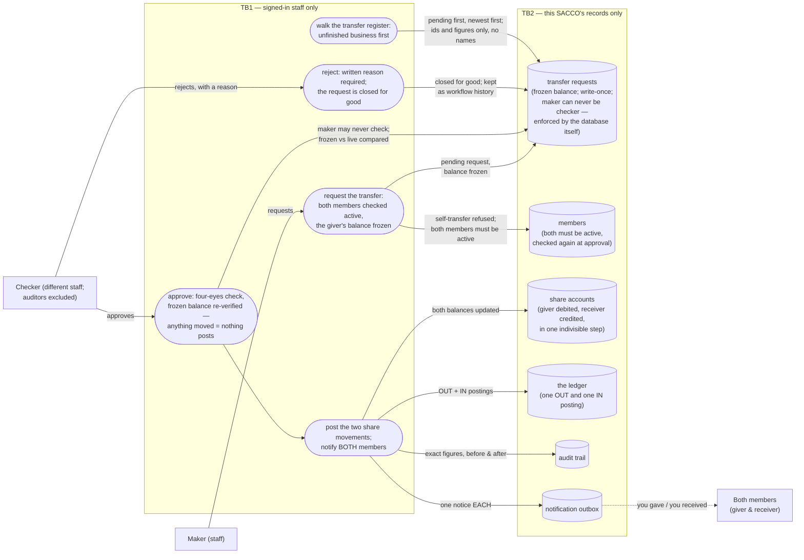
```mermaid
flowchart LR
    %% P-DIAG.3 F16 — drawn as-built by the issue-#31 batch-10 MR (!83)
    STF_E1["Maker (staff)"]
    STF_E2["Checker (different staff;<br/>auditors excluded)"]
    STF_E3["Both members<br/>(giver & receiver)"]
    subgraph TB1["TB1 — signed-in staff only"]
        STF_P1(["request the transfer:<br/>both members checked active,<br/>the giver's balance frozen"])
        STF_P2(["approve: four-eyes check,<br/>frozen balance re-verified —<br/>anything moved = nothing posts"])
        STF_P3(["post the two share movements;<br/>notify BOTH members"])
        STF_P4(["reject: written reason required;<br/>the request is closed for good"])
        STF_P5(["walk the transfer register:<br/>unfinished business first"])
    end
    subgraph TB2["TB2 — this SACCO's records only"]
        STF_S1[("transfer requests<br/>(frozen balance; write-once;<br/>maker can never be checker —<br/>enforced by the database itself)")]
        STF_S2[("members<br/>(both must be active,<br/>checked again at approval)")]
        STF_S3[("share accounts<br/>(giver debited, receiver credited,<br/>in one indivisible step)")]
        STF_S4[("the ledger<br/>(one OUT and one IN posting)")]
        STF_S5[("audit trail")]
        STF_S6[("notification outbox")]
    end

    STF_E1 -->|"requests"| STF_P1
    STF_P1 -->|"self-transfer refused;<br/>both members must be active"| STF_S2
    STF_P1 -->|"pending request,<br/>balance frozen"| STF_S1
    STF_E2 -->|"approves"| STF_P2
    STF_P2 -->|"maker may never check;<br/>frozen vs live compared"| STF_S1
    STF_P2 --> STF_P3
    STF_P3 -->|"OUT + IN postings"| STF_S4
    STF_P3 -->|"both balances updated"| STF_S3
    STF_P3 -->|"exact figures, before & after"| STF_S5
    STF_P3 -->|"one notice EACH"| STF_S6
    STF_S6 -.->|"you gave / you received"| STF_E3
    STF_E2 -->|"rejects, with a reason"| STF_P4
    STF_P4 -->|"closed for good; kept<br/>as workflow history"| STF_S1
    STF_P5 -->|"pending first, newest first;<br/>ids and figures only, no names"| STF_S1
```

#### Source of truth (F16)

| Element | Citation | Locks (lock-order.md ids only) |
|---|---|---|
| STF_P1 | `api/dividends.py:request_share_transfer` (`POST /members/{member_id}/share-transfers`, `RequirePermission(MEMBERS, APPROVE)`) → `application/dividends.py:request_share_transfer` — self-transfer refused server-side AND unrepresentable at the DB (0020 CHECK); both members strictly ACTIVE via the P13.13 `domain/members.py:member_may` capability map; amount 2dp-quantised (`to_cents`) and re-verified under the giver's account row; PENDING row INSERTed with the persisted snapshot (`from_balance_at_request`, the 0040 pending-snapshot CHECK) | full transfer chain via `_lock_transfer_chain` (members in global member-id order, then share accounts — the E13 total order); the INSERT is a plain write |
| STF_P2 | `api/dividends.py:approve_share_transfer` (`POST /share-transfers/{transfer_id}/approval`, `RequirePermission(MEMBERS, APPROVE)`) → `application/dividends.py:approve_share_transfer` — transfer row locked FIRST (workflow anchor), `domain/dividends.py:share_transfer_transition` gatekeeper, SoD via the shared `application/sod.py:require_distinct_non_assurance_checker` (maker ≠ checker server-side; `ASSURANCE_ROLES` excluded; the 0040 `ck_share_transfers_sod` CHECK is the DB backstop), snapshot re-verified component-by-component (both statuses + the frozen balance), 409 on drift posting NOTHING | E25 → the shared `_lock_transfer_chain` (E13 order) |
| STF_P3 | same function, post-verification half: `application/ledger.py:post_share_transfer` (P7 ST-OUT/ST-IN contract), both `_set_balance` writes, the one-shot decision fill permitted by the 0040 write-once/status-machine trigger, in-transaction audit, operator outbox event + ONE `share_transfer.member_notice` per member (ids and amount only — never names; the P13.13 detection-control precedent: the victim of a colluding pair sees their equity move) | (same transaction) → E15 → E16 |
| STF_P4 | `api/dividends.py:reject_share_transfer` (`POST /share-transfers/{transfer_id}/rejection`) → `application/dividends.py:reject_share_transfer` — checker decision (same SoD), version-pinned (409 on stale), MANDATORY rationale into the audit `after` payload (the !52 F2 posture), never echoed; rejected rows are terminal write-once workflow history | STFR row alone (§3 single-node row) |
| STF_P5 | `api/dividends.py:list_share_transfers` (`GET /share-transfers`, `RequirePermission(MEMBERS, VIEW)` — the house read-split) + `get_share_transfer` (`GET /share-transfers/{transfer_id}`, the checker's refresh) → `application/dividends.py:list_share_transfers` / `get_share_transfer` — keyset register, PENDING FIRST then newest first (the 0038 band pattern), hard max 100, served by `idx_share_transfers_register` (0040, EXPLAIN-asserted); least disclosure: bare UUIDs and verbatim decimal strings, no names | no locks |
| STF_S1 | `share_transfers` (0020; 0040: status machine + SoD CHECK + pending-snapshot CHECK + txns-iff-posted CHECK + write-once/status-machine trigger + register index; pre-0040 rows backfilled `posted` with NULL approver — truthful history) | — |
| STF_S2/STF_S3 | `members` (0001), `share_accounts` (0001/0020) — both re-locked and re-checked at approval | (within the STF_P1/P2 chains) |
| STF_S4 | ledger stores (`ledger_entries` + `transactions` + `txn_ref_sequences`) — inherit the §1 append-only rows | — |
| STF_S5/STF_S6 | `audit_log`, `outbox_events` (0001) — inherit the shared audit/outbox rows (stride.md §0 coverage map) | — |

## 4. Cross-reference

- **Threats:** every element id above has STRIDE rows in
  [`stride.md`](stride.md) (P-DIAG.4).
- **Locks:** every lock citation resolves in
  [`lock-order.md`](lock-order.md) §2/§3 (P-DIAG.0) — this file never
  restates a chain.
- **Sequence diagrams** (P-DIAG.5) detail the reusable patterns and
  the highest-risk flows step-by-step: committee voting,
  snapshot-bind-reverify, outbox dispatch, recovery receipt,
  maker-checker adjustment, recovery-case lifecycle, member exit with
  the claim guard, guarantor consent as the member principal (F15) —
  see [`README.md`](README.md).
- **Out-of-scope as-built flows** (not money-bearing in the P-DIAG.3
  sense, listed for completeness, no diagram): arrears/penalty
  classification batch (posts nothing; `application/arrears.py`; its
  recovery close pass IS drawn — F14), period close +
  P13.17a/b snapshot/rollup writers
  (`application/accounting_periods.py:close_period`,
  `portfolio_snapshots.py`, `period_rollups.py` — write-once
  reconstruction outputs, no member money moves), generic ledger
  reversal (`application/ledger.py:reverse_transaction` — the
  repayment-linked path is refused there and lives in F11),
  idempotency retention purge (`application/idempotency_purge.py`),
  settings/users/RBAC admin surfaces. If a future MR makes one
  money-bearing, it lands here first-class (rule 11).

## 5. Drift rule

v1.2 rule 11 applies: any MR that changes a flow, store, boundary or
PLANNED label drawn here updates this file (and the affected
`stride.md` rows) in the same MR. The named flips already claimed:
P19 (M-Pesa edges), P20 (provider seam), P16–P18 (member CLIENT
edge — the P14.5 member AUTH surface itself was flipped as-built by
!65 at TB1M/L0, and its consent/self-release flow is drawn
first-class as F15 by the issue-#30 close-out MR !71),
**!53 / issue #23 (0033)** — recovery-case dispositions
(`disputed`, `irrecoverable_pending_write_off`, `closed_restructured`)
and the single post-closure outcome note extend F14 and its stride.md
rows in that MR. The P13.15 flip recorded here at authoring was
executed by THIS MR (F10–F13 drawn as-built).
**Issue #31 (l)/(m) (batch 10, !83):** share transfer left the §4
out-of-scope list — the retired one-call
`application/dividends.py:transfer_shares` became the two-phase
maker-checker workflow + history register drawn first-class as F16
(§3.16), with its stride.md rows and the lock-order.md E25 anchor
edge landed in the same MR (rule 11).
