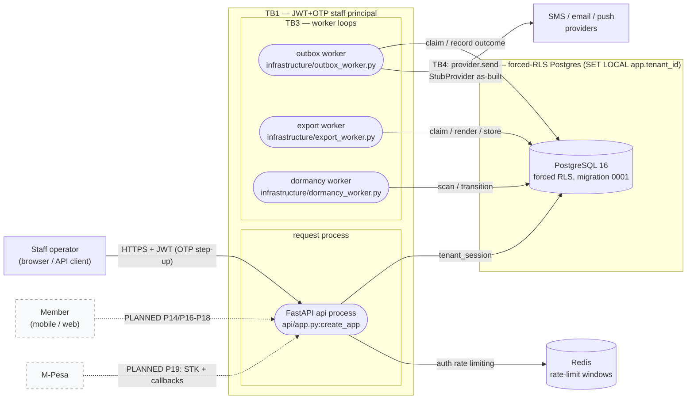
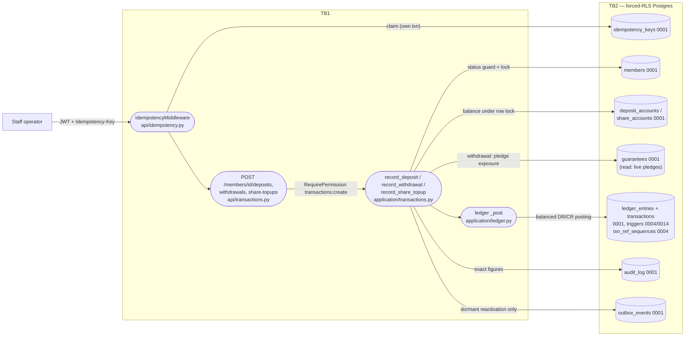
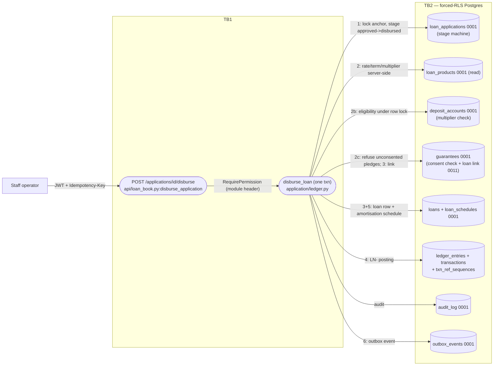
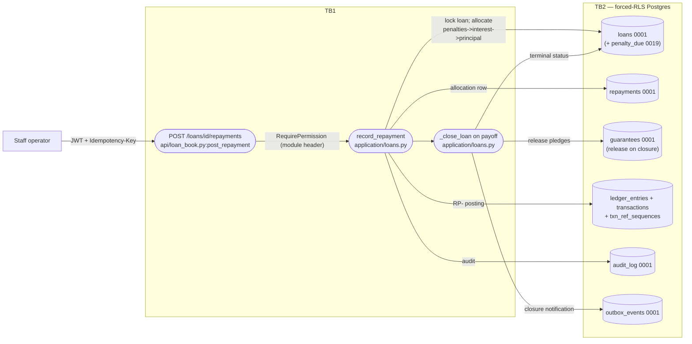
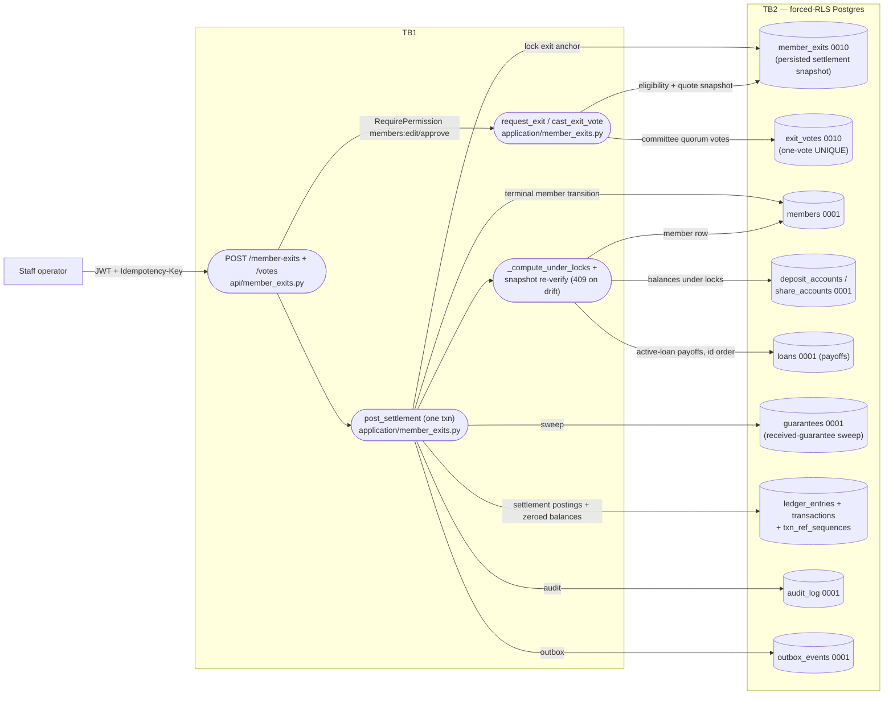
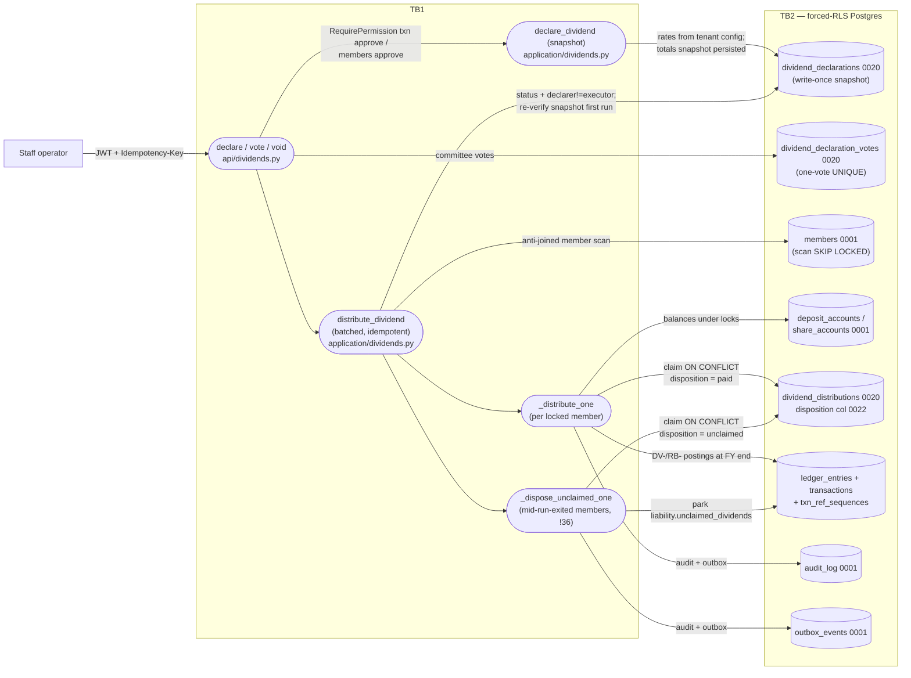
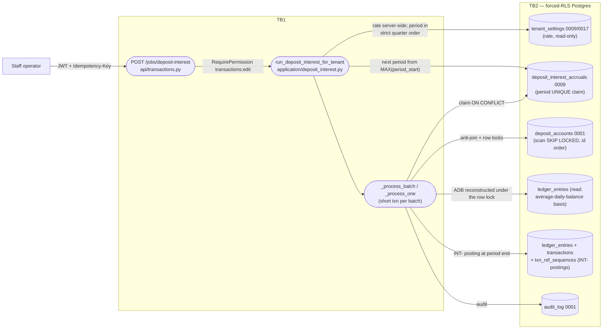
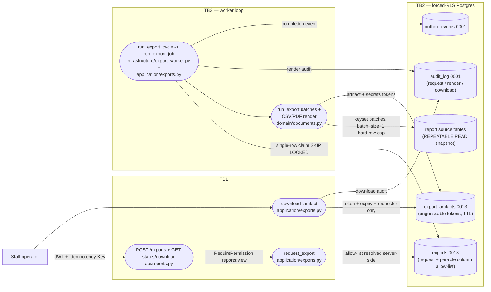
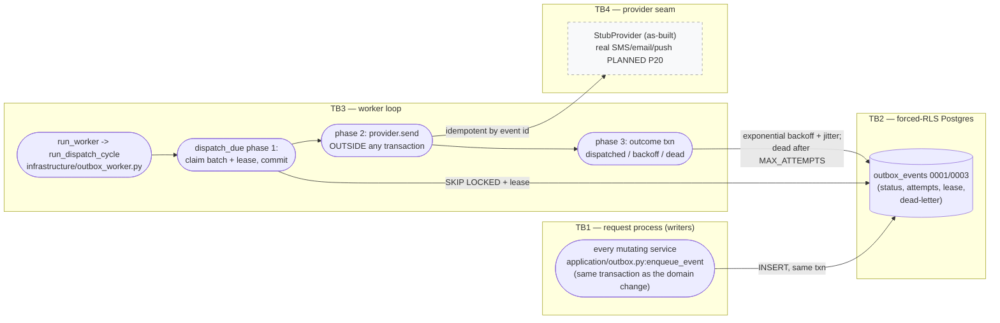

<!--
  P-DIAG.3 — Data-flow diagrams: L0 context + L1 money-bearing flows
  Authored against main @ 08541b860f1445b16c342c39b6606d86b9dbeb17
  Status: as-built, derived from code (not from MR prose).
  Drift rule: v1.2 rule 11 — any MR that changes a diagrammed flow,
  store, or trust boundary MUST update this file in the same MR.
  Lock statements in this file cite lock-order.md edge ids ONLY
  (E1–E19 and the §3 single-node lockers); the chains are NEVER
  restated here — lock-order.md is the single authority (rule 11).
  STRIDE-per-element threat model over these elements: stride.md
  (P-DIAG.4).
-->

# Data-flow diagrams — L0 context + L1 money flows (P-DIAG.3)

## 0. How to read these diagrams

- **Shapes.** External entities are rectangles, processes are stadiums
  `([ ])`, data stores are cylinders `[( )]`. Trust boundaries are
  subgraphs named `TB1..TB4` (§1). Dashed elements are `PLANNED (Pn)`
  — not built on main at the authoring SHA; the executing prompt's MR
  flips them to as-built (v1.2 rule 11).
- **Element ids.** Every element carries a stable id (`L0_*`,
  `TXN_*`, `DSB_*`, `RPY_*`, `EXIT_*`, `DIV_*`, `INT_*`, `DRM_*`,
  `EXP_*`, `OBX_*`). `stride.md` (P-DIAG.4) references these ids;
  renaming one is a change to both files (rule 11).
- **Traceability.** Every process/store/flow row in the per-diagram
  tables cites the implementing module:function or migration on main
  at the authoring SHA. An untraceable element is a rejected MR
  (P-DIAG common rules). Functions are the stable citation
  (lock-order.md §3 convention); line numbers are avoided because
  parallel MRs shift them.
- **Locks.** Where a flow takes row/advisory locks, the table cites
  the `lock-order.md` edge id (E1–E19) or its §3 single-node-locker
  row — never the chain itself (rule 11).
- **Stores are logical tables.** `ledger_entries` + `transactions` +
  `txn_ref_sequences` are drawn as one "ledger" store where the
  distinction adds nothing; the table row names each physical table
  and its migration.

## 1. Trust boundaries (shared legend)

| Id | Boundary | As-built enforcement (citation) |
|---|---|---|
| TB1 | **Unauthenticated network edge → authenticated staff principal.** Everything left of TB1 is untrusted input. | JWT bearer decode: `api/authz.py:get_auth_context` → `application/auth.py:decode_access_token` (access ≤15 min, `application/auth.py:issue_access_token`); principal established by OTP step-up: `application/auth.py:verify_otp` + `domain/otp.py:evaluate_challenge` (6 digits, ≤5 attempts, 5-min TTL, single-use, constant-time `hmac.compare_digest`); rotating refresh with family revocation on reuse: `application/auth.py:rotate_refresh_token`; pre-auth endpoints scope tenant from the explicit `x-tenant-id` header only: `api/auth.py:tenant_id_from_headers`; every auth route rate-limited: `api/auth.py:_rate_guard` → `infrastructure/rate_limit.py:check_rate_limit`. Authorization behind TB1 is deny-by-default per handler: `api/authz.py:RequirePermission` / `RequireAnyPermission`. |
| TB2 | **api/worker process → forced-RLS Postgres.** No statement runs outside a tenant-scoped transaction. | `infrastructure/tenancy.py:tenant_session` — `set_config('app.tenant_id', :tid, true)` (≡ `SET LOCAL`, transaction-bound, pool-safe); snapshot variant for exports: `tenant_snapshot_session` (REPEATABLE READ); RLS enabled AND **forced** on every tenant-owned table: migration `0001` (`FORCE ROW LEVEL SECURITY` + `tenant_isolation` policies); app DB role `NOSUPERUSER NOBYPASSRLS` per ADR-0002 (bootstrap in `.gitlab-ci.yml` `backend:test`); defence in depth: explicit bound `tenant_id = :tid` predicates on every tenant-owned read AND write (v1.1 rule 4). |
| TB3 | **Request process ↔ worker loops.** Workers carry no request principal (system actor, `actor_id=None` in audit rows) and run per-tenant cycles. | `infrastructure/outbox_worker.py:run_worker`, `infrastructure/export_worker.py:run_worker`, `infrastructure/dormancy_worker.py:run_worker`; per-tenant fan-out via `outbox_worker.py:list_active_tenants`; dormancy per-tenant failure isolation (!32 R1): `dormancy_worker.py:run_dormancy_cycle`; workers cross TB2 exactly like the api (same `tenant_session`). The deposit-interest batch is NOT a worker loop as-built: it is staff-triggered via `POST /jobs/deposit-interest` (`api/transactions.py`) — its long-running batches still execute on the TB3 side of the request/short-transaction discipline (§3.6). |
| TB4 | **Provider adapter seam.** Nothing inside the domain talks to an external delivery network directly. | `infrastructure/providers.py:NotificationProvider` protocol; as-built implementation is `StubProvider` (logs event ids, never payload contents; idempotent by event id); real SMS/email/push providers are **PLANNED (P20)**; request handlers are forbidden from importing providers (import-linter contract, `infrastructure/providers.py` module docstring); dispatch happens outside any transaction and holds no domain locks (lock-order.md §3 outbox row). |

**PLANNED external edges** (drawn dashed on L0, flipped by the
executing MR per rule 11): member mobile/web clients + member-facing
auth — P14/P14.5/P16–P18; M-Pesa STK + callbacks — P19; real
notification providers — P20.

## 2. L0 — system context

| Element | Kind | Citation |
|---|---|---|
| L0_STAFF | external entity | the only authenticated principal as-built: `users` table (0001), roles seeded from the prototype matrix (`application/rbac.py:seed_permissions`) |
| L0_MEMBER | external entity — **PLANNED (P14/P14.5/P16–P18)** | no member-facing auth on main; member data is operated on by staff only |
| L0_MPESA | external entity — **PLANNED (P19)** | no payment-provider code on main; deposits/withdrawals arrive via staff-recorded channels (`domain` `Channel` enum) |
| L0_PROVIDERS | external entity (seam as-built, real delivery **PLANNED (P20)**) | `infrastructure/providers.py:StubProvider` behind `NotificationProvider` (TB4) |
| L0_API | process | `api/app.py:create_app` — routers + `IdempotencyMiddleware` (`api/idempotency.py`) + correlation middleware + sanitized error envelope (`{category, correlation_id}`) |
| L0_OBXW / L0_EXPW / L0_DRMW | processes | `infrastructure/outbox_worker.py:run_worker`, `infrastructure/export_worker.py:run_worker`, `infrastructure/dormancy_worker.py:run_worker` (TB3) |
| L0_PG | store | Postgres 16; RLS forced by migration `0001`; every access via `infrastructure/tenancy.py` (TB2) |
| L0_REDIS | store | `infrastructure/rate_limit.py:check_rate_limit` (fixed window, Redis-backed when configured; in-process fallback otherwise — see stride.md D-row); readiness dep in `/readyz` |

## 3. L1 — money-bearing flows

### 3.1 F1 — deposits / withdrawals / share top-ups

| Element | Citation | Locks (lock-order.md ids only) |
|---|---|---|
| TXN_P0 | `api/idempotency.py:IdempotencyMiddleware` — `ON CONFLICT` claim in its own transaction, replay returns the stored response | §3 idempotency single-node row |
| TXN_P1 | `api/transactions.py` deposit/withdrawal/share-topup routes; `RequirePermission(TRANSACTIONS, CREATE)`; `extra="forbid"` request models | — |
| TXN_P2 | `application/transactions.py:record_deposit` / `record_withdrawal` / `record_share_topup`; dormant reactivation inside the deposit txn: `application/members.py:reactivate_dormant_member` (P13.13); withdrawal never overdraws: available = balance − `application/guarantees.py:live_pledged_total` | E10 (deposit/withdrawal), E13 (top-up) |
| TXN_P3 | `application/ledger.py:post_deposit` / `post_withdrawal` / `post_share_topup` → `_post` (open-period barrier `application/accounting_periods.py:assert_open_period`; refs `_next_ref`) | E15 → E16 |
| TXN_S1–S7 | tables per migration in the diagram; append-only + balanced-DR/CR triggers on the ledger store: migrations `0004`/`0014`; audit append-only trigger: `0001` | — |

### 3.2 F2 — loan disbursement

| Element | Citation | Locks |
|---|---|---|
| DSB_P1 | `api/loan_book.py:disburse_application`; `extra="forbid"` — a caller-sent `disbursed_at`/rate is rejected (v1.1 rule 1) | — |
| DSB_P2 | `application/ledger.py:disburse_loan` — atomic steps 1–6 (approval check, deposit-multiplier eligibility under the row lock (issue #15), unconsented-pledge refusal, loan + schedule (`domain/lending` amortisation), posting, outbox) in ONE application-service transaction | E4 (app anchor; loan is *created*, note in the E4 row), E5, then E15 → E16 |
| DSB_S1–S8 | tables per diagram; guarantee→loan linkage backfill: migration `0011`; stage transition via `domain/lending` transition map | — |

### 3.3 F3 — loan repayment

| Element | Citation | Locks |
|---|---|---|
| RPY_P1 | `api/loan_book.py:post_repayment` | — |
| RPY_P2 | `application/loans.py:record_repayment` — documented allocation order penalties → interest → principal; posting via `application/ledger.py:post_allocated_repayment` | §3 repayment single-node row (LOANS entry) → E15 → E16 |
| RPY_P3 | `application/loans.py:_close_loan` → `application/guarantees.py:release_guarantees_for_loan` | E7 (row write) |
| RPY_S1–S6 | tables per diagram; `loans.penalty_due` maintained by the P13.8 arrears/penalty batch (migration `0019`) — that batch is out of this flow's scope (posts nothing; lock-order.md §3 arrears row) | — |

### 3.4 F4 — exit settlement

| Element | Citation | Locks |
|---|---|---|
| EXIT_P1 | `api/member_exits.py` routes (`RequirePermission(MEMBERS, EDIT/APPROVE)`) | — |
| EXIT_P2 | `application/member_exits.py:request_exit` (eligibility under the member row; exit fee from tenant config `_exit_fee`, never the request body), `cast_exit_vote` (quorum from `application/tenant_settings.py` at vote time) | E1 context; §3 exit-vote single-node row |
| EXIT_P3 | `application/member_exits.py:post_settlement` — ONE transaction: postings (`application/ledger.py:post_exit_settlement`) + zeroed balances + guarantee sweep + terminal transition + audit + outbox; declarer/approver separation enforced | E1 → E10 → E12 → E14 → E7 → E15 → E16 |
| EXIT_P4 | `application/member_exits.py:_compute_under_locks` + `_active_loan_payoffs`; component-by-component re-verify against the persisted snapshot, 409 on drift, posts nothing (gate 1.4 snapshot rule) | (same chain — cited once above) |
| EXIT_S1–S9 | tables per diagram; negative settlements are an explicit branch (P12) | — |

### 3.5 F5 — dividend declaration + distribution (incl. the !36 unclaimed disposition)

| Element | Citation | Locks |
|---|---|---|
| DIV_P1 | `api/dividends.py` routes; declare/vote/void need `RequirePermission(TRANSACTIONS, EDIT/APPROVE)`, distribution `RequirePermission(MEMBERS, APPROVE)` (module header) | §3 dividend vote/void/open single-node rows |
| DIV_P2 | `application/dividends.py:declare_dividend` — rates resolved server-side (`resolve_dividend_config`), totals persisted as the approved snapshot (`compute_declaration_totals`) | — |
| DIV_P3 | `application/dividends.py:distribute_dividend` — declarer ≠ executor (P12 separation ban); `_verify_snapshot` on first run only; postings stamped `occurred_at` at FY end (gate 1.5); SKIP-LOCKED members picked up by the idempotent re-run | E2 (decl FOR SHARE per batch → member scan) |
| DIV_P4 | `application/dividends.py:_distribute_one` → `application/ledger.py:post_dividend_distribution`; claim = one `(tenant, declaration, member)` UNIQUE row `ON CONFLICT DO NOTHING` (v1.1 rule 5) | E10 → E12 → E15 → E16 |
| DIV_P5 | `application/dividends.py:_dispose_unclaimed_one` over `unclaimed_scan_sql` (members who EXITED mid-run; root tier only, no account rows) → `application/ledger.py:post_unclaimed_dividend` parks the entitlement as the `liability.unclaimed_dividends` payable; same UNIQUE claim with `disposition='unclaimed'` (issue #19 P3, MR !36, migration `0022`); resolution of unclaimed rows is deferred to the P13.15 correction paths | §3/§7 dormancy-precedent root-tier scan; E15 → E16 |
| DIV_S1–S8 | tables per diagram; `0022` also ships `idx_members_exited_scan` for the disposition scan; the `0022` downgrade REFUSES LOUDLY on live `'unclaimed'` dispositions | — |

### 3.6 F6 — deposit-interest batch

| Element | Citation | Locks |
|---|---|---|
| INT_P1 | `api/transactions.py` `/jobs/deposit-interest` route (`RequirePermission(TRANSACTIONS, EDIT)`) | — |
| INT_P2 | `application/deposit_interest.py:resolve_run_parameters` — rate exclusively from tenant configuration; period resolved server-side in strict quarter order (never caller-supplied/backdatable) | — |
| INT_P3 | `application/deposit_interest.py:_process_batch` / `_process_one` — basis = ledger-reconstructed average daily balance under the account row lock (never a snapshot, gate 1.5); claim `ON CONFLICT (tenant_id, account_id, period_start) DO NOTHING`; posting `application/ledger.py:post_deposit_interest`, `occurred_at` at period end | §3 deposit-interest single-node row (DSELF SKIP LOCKED) → E15 → E16 |
| INT_S1–S6 | tables per diagram | — |

### 3.7 F7 — dormancy batch

```mermaid
flowchart LR
    %% P-DIAG.3 F7 — authored against main @ 08541b860f1445b16c342c39b6606d86b9dbeb17
    subgraph TB3["TB3 — worker loop"]
        DRM_P1(["run_dormancy_cycle<br/>(per-tenant isolation, !32 R1)<br/>infrastructure/dormancy_worker.py"])
        DRM_P2(["run_dormancy_for_tenant<br/>application/dormancy.py"])
        DRM_P3(["_mark_dormant<br/>(under the held member row)"])
    end
    subgraph TB2["TB2 — forced-RLS Postgres"]
        DRM_S1[("tenant_settings 0017<br/>(dormancy period, read-only)")]
        DRM_S2[("members 0001/0021<br/>(scan SKIP LOCKED, id order)")]
        DRM_S3[("ledger_entries (read:<br/>last member-initiated activity)")]
        DRM_S4[("audit_log 0001")]
        DRM_S5[("outbox_events 0001")]
    end
    DRM_P4(["reactivation rides F1:<br/>record_deposit (P13.13)"])

    DRM_P1 --> DRM_P2
    DRM_P2 -->|"period server-side"| DRM_S1
    DRM_P2 -->|"anti-join on status +<br/>ledger-derived last activity"| DRM_S2
    DRM_P2 --> DRM_P3
    DRM_P3 -->|"basis read"| DRM_S3
    DRM_P3 -->|"Active->Dormant transition"| DRM_S2
    DRM_P3 -->|"audit"| DRM_S4
    DRM_P3 -->|"member notification"| DRM_S5
    DRM_P4 -.->|"Dormant->Active, same txn as the deposit"| DRM_S2
```

| Element | Citation | Locks |
|---|---|---|
| DRM_P1 | `infrastructure/dormancy_worker.py:run_dormancy_cycle` — an unexpected per-tenant failure never aborts the other tenants' cycles (!32 R1); the worker itself takes no locks | — |
| DRM_P2 | `application/dormancy.py:run_dormancy_for_tenant` + `resolve_dormancy_period`; scan = `dormancy_scan_sql` (re-run scans zero rows — idempotent anti-join) | §3 dormancy single-node row (MSELF SKIP LOCKED, root tier; nothing below T1) |
| DRM_P3 | `application/dormancy.py:_mark_dormant` — transition UPDATE + audit row + outbox INSERT under the held member row; **no ledger rows, no advisory locks** | (same row, cited once) |
| DRM_P4 | reactivation is NOT this job: `application/transactions.py:record_deposit` → `application/members.py:reactivate_dormant_member` (F1/TXN_P2) | E10 |
| DRM_S1–S5 | tables per diagram; `members` dormancy status shipped by migration `0021` | — |

### 3.8 F8 — export render

| Element | Citation | Locks |
|---|---|---|
| EXP_P1 | `api/reports.py` (`RequirePermission(REPORTS, VIEW)` on request/status/download) | — |
| EXP_P2 | `application/exports.py:request_export` — column allow-list per role resolved server-side (`_allowed_columns`: PII columns need `members:view`); request audit + outbox in the same txn | — |
| EXP_P3 | `infrastructure/export_worker.py:run_export_cycle` → `application/exports.py:run_pending_exports` / `run_export_job`; claim = `exports.py:CLAIM_SQL`; snapshot-consistent reads via `infrastructure/tenancy.py:tenant_snapshot_session` (REPEATABLE READ) | §3 export-claim single-node row |
| EXP_P4 | `application/exports.py:run_export` (fetch `batch_size+1`, exact truncation flag, hard row cap, rendering off the event loop via `asyncio.to_thread`); renderers `domain/documents.py` — CSV formula-injection defence `escape_csv_text`, PDF string escaping `_pdf_escape`; artifact tokens `secrets.token_urlsafe(32)`, TTL `artifact_ttl_hours` | — |
| EXP_P5 | `application/exports.py:download_artifact` — token match + expiry + requester-only access, audited | — |
| EXP_S1–S5 | tables per diagram (migration `0013`) | — |

### 3.9 F9 — outbox dispatch

| Element | Citation | Locks |
|---|---|---|
| OBX_P0 | `application/outbox.py:enqueue_event` — called by every notifying mutation in the SAME transaction (gate 1.2); rollback removes the event | — |
| OBX_P1 | `infrastructure/outbox_worker.py:run_worker` / `run_dispatch_cycle` / `list_active_tenants` | — |
| OBX_P2 | `infrastructure/outbox_worker.py:dispatch_due` phase 1 — claim + `CLAIM_LEASE_SECONDS` lease, then COMMIT before any provider I/O | §3 outbox single-node row (dispatch holds NO domain locks) |
| OBX_P3 | `dispatch_due` phase 2 — `provider.send` outside any transaction, across TB4; `infrastructure/providers.py:StubProvider` is idempotent by event id | — |
| OBX_P4 | `dispatch_due` phase 3 + `_record_failure` — `backoff_delay` (exponential + jitter), `status='dead'` at `MAX_ATTEMPTS` (8) | — |
| OBX_S1 / OBX_E1 | `outbox_events` (0001, worker columns 0003); providers per TB4 | — |

## 4. Cross-reference

- **Threats:** every element id above has STRIDE rows in
  [`stride.md`](stride.md) (P-DIAG.4).
- **Locks:** every lock citation resolves in
  [`lock-order.md`](lock-order.md) §2/§3 (P-DIAG.0) — this file never
  restates a chain.
- **Out-of-scope as-built flows** (not money-bearing in the P-DIAG.3
  sense, listed for completeness, no diagram): arrears/penalty batch
  (posts nothing; `application/arrears.py`), share transfer
  (`application/dividends.py:transfer_shares`), period close
  (`application/accounting_periods.py:close_period`), ledger reversal
  (`application/ledger.py:reverse_transaction`), settings/users/RBAC
  admin surfaces. If a future MR makes one money-bearing, it lands
  here first-class (rule 11).

## 5. Drift rule

v1.2 rule 11 applies: any MR that changes a flow, store, boundary or
PLANNED label drawn here updates this file (and the affected
`stride.md` rows) in the same MR. The named flips already claimed:
P19 (M-Pesa edges), P20 (provider seam), P14/P14.5/P16–P18 (member
edge), P13.15 (corrections — will extend §4's out-of-scope list into
a flow).
