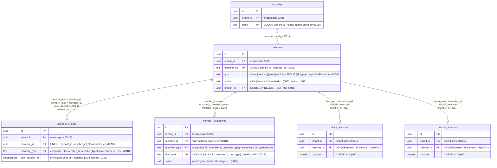
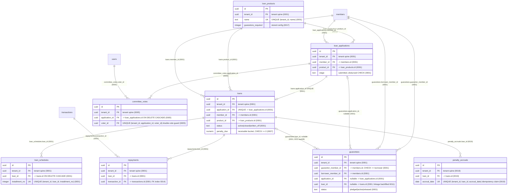
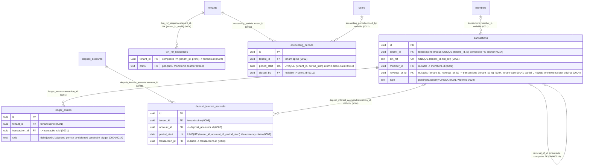
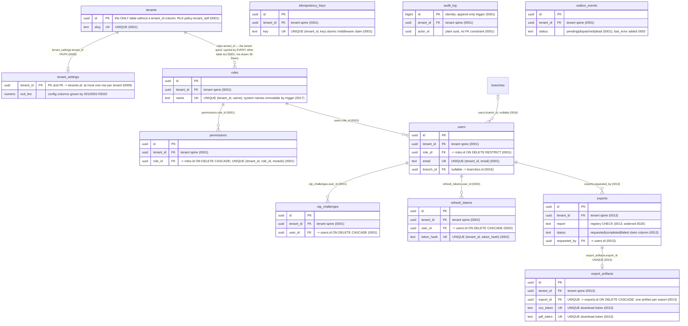

<!--
  P-DIAG.2 — ERD, as-built (Genesis Prestige backend)
  Authored against main @ 08541b860f1445b16c342c39b6606d86b9dbeb17
  Alembic head at authoring: 0022 (0022_dividend_dormant_policy.py,
  down_revision = "0021"), verified linear 0001..0022 at branch time.
  The in-flight 0023 claim (!40, P13.10) had NOT merged at authoring;
  its MR updates this file when it lands (v1.2 rules 11/14).
  Derived exclusively from backend/migrations/versions/*.py — every
  entity is a real table from a migration; every edge cites the FK
  that implements it. Falsifiable gate: erd-spot-check.py (§6).
  Drift rule: v1.2 rule 11 — any MR that adds/alters a table, FK,
  trust-relevant trigger or RLS posture MUST update this file in the
  same MR. A stale diagram is a rejected MR.
-->

# Entity-relationship diagram — as-built (P-DIAG.2)

The entire schema at alembic head **0022**: **37 tables**, drawn as
five subject-area `erDiagram`s (one diagram would not render readably;
the split follows the module boundaries in the §3 traceability table).
An entity appearing in more than one diagram (e.g. `members`,
`transactions`, `users`) is the SAME table, repeated without its
attribute block where it only anchors a cross-area FK.

## 1. How to read these diagrams

- **Every entity is a real table** created by a migration in
  `backend/migrations/versions/`; §3 maps each to its creating and
  altering revisions and its owning module. The completeness of this
  claim — both directions — is machine-checked by
  [`erd-spot-check.py`](erd-spot-check.py) (§6).
- **Every edge is a real FOREIGN KEY**, cited in the edge label as
  `column (migration)`. Nothing is inferred from code or prose.
- **The tenant spine is drawn once, not 36 times.** Every table except
  `tenants` carries `tenant_id uuid NOT NULL REFERENCES tenants(id)
  ON DELETE RESTRICT` (the 0001 pattern, repeated verbatim by every
  later creating migration). Drawing those 36 edges would bury the
  domain FKs, so the spine is shown representatively in diagram E and
  the `tenant_id FK` attribute on every entity stands for its edge.
- **Attribute lists are keys, not column dictionaries**: PK, FKs,
  UNIQUE claim keys (§5) and CHECK-pinned discriminators. The full
  column set lives in the creating migration cited in §3 — the ERD
  does not restate it.
- **Cardinality**: `||` exactly one, `|o` zero-or-one, `o{`
  zero-or-more. Zero-or-one on the parent side means the FK column is
  nullable; `||--o|` child-side means a UNIQUE constraint makes the
  relationship at-most-one (each such UNIQUE is named in the label).
- Trust-relevant store properties (append-only, write-once, forced
  RLS, posting barriers) are annotated **by reference only** in §4
  (v1.2 rule 11) — never restated here.

## 2. The diagrams

### 2.A Membership & KYC



### 2.B Lending



### 2.C Ledger & transactions



### 2.D Dividends & exits

```mermaid
erDiagram
    %% main @ 08541b860f1445b16c342c39b6606d86b9dbeb17 — alembic head 0022
    dividend_declarations {
        uuid id PK
        uuid tenant_id FK "tenant spine (0020)"
        date fy_start UK "partial UNIQUE (tenant_id, fy_start) WHERE status <> rejected (0020)"
        text status "declared|approved|rejected|distributed (0020)"
        uuid requested_by FK "nullable -> users.id (0020)"
    }
    dividend_declaration_votes {
        uuid id PK
        uuid tenant_id FK "tenant spine (0020)"
        uuid declaration_id FK "-> dividend_declarations.id (0020)"
        uuid voter_id FK "UNIQUE (tenant_id, declaration_id, voter_id) double-vote guard (0020)"
    }
    dividend_distributions {
        uuid id PK
        uuid tenant_id FK "tenant spine (0020)"
        uuid declaration_id FK "-> dividend_declarations.id (0020)"
        uuid member_id FK "UNIQUE (tenant_id, declaration_id, member_id) idempotency claim (0020)"
        uuid transaction_id FK "nullable -> transactions.id (0020)"
        text disposition "paid|unclaimed (0022)"
    }
    share_transfers {
        uuid id PK
        uuid tenant_id FK "tenant spine (0020)"
        uuid from_member_id FK "-> members.id; CHECK <> to_member_id (0020)"
        uuid to_member_id FK "-> members.id (0020)"
        uuid out_transaction_id FK "-> transactions.id (0020)"
        uuid in_transaction_id FK "-> transactions.id (0020)"
        uuid created_by FK "nullable -> users.id (0020)"
    }
    member_exits {
        uuid id PK
        uuid tenant_id FK "tenant spine (0001)"
        uuid member_id FK "-> members.id (0001); partial UNIQUE open-exit claim (0010)"
        text status "requested|approved|settled|rejected (0001)"
        uuid requested_by FK "nullable -> users.id (0010)"
        uuid settlement_transaction_id FK "nullable -> transactions.id (0010)"
    }
    exit_votes {
        uuid id PK
        uuid tenant_id FK "tenant spine (0010)"
        uuid exit_id FK "-> member_exits.id ON DELETE RESTRICT (0010)"
        uuid voter_id FK "UNIQUE (tenant_id, exit_id, voter_id) double-vote guard (0010)"
    }
    members
    users
    transactions

    users |o--o{ dividend_declarations : "dividend_declarations.requested_by, nullable (0020)"
    dividend_declarations ||--o{ dividend_declaration_votes : "dividend_declaration_votes.declaration_id (0020)"
    users ||--o{ dividend_declaration_votes : "dividend_declaration_votes.voter_id (0020)"
    dividend_declarations ||--o{ dividend_distributions : "dividend_distributions.declaration_id (0020)"
    members ||--o{ dividend_distributions : "dividend_distributions.member_id (0020)"
    transactions |o--o{ dividend_distributions : "dividend_distributions.transaction_id, nullable (0020)"
    members ||--o{ share_transfers : "share_transfers.from_member_id (0020)"
    members ||--o{ share_transfers : "share_transfers.to_member_id (0020)"
    transactions ||--o{ share_transfers : "share_transfers.out_transaction_id (0020)"
    transactions ||--o{ share_transfers : "share_transfers.in_transaction_id (0020)"
    users |o--o{ share_transfers : "share_transfers.created_by, nullable (0020)"
    members ||--o{ member_exits : "member_exits.member_id (0001)"
    users |o--o{ member_exits : "member_exits.requested_by, nullable (0010)"
    transactions |o--o{ member_exits : "member_exits.settlement_transaction_id, nullable (0010)"
    member_exits ||--o{ exit_votes : "exit_votes.exit_id (0010)"
    users ||--o{ exit_votes : "exit_votes.voter_id (0010)"
```



### 2.E Platform: tenancy, auth/RBAC, exports, outbox



## 3. Traceability: table → migrations → owning module

Every table at head 0022, its creating migration, every later
migration that altered it (columns, CHECKs, triggers, indexes or data
backfills), and the module that owns its writes on main @ `08541b8`.
Both directions of the table↔migration mapping are machine-checked by
[`erd-spot-check.py`](erd-spot-check.py) (§6).

| Table | Created | Altered by | Owning module |
|---|---|---|---|
| `tenants` | 0001 | 0003 (`active_tenant_ids()` worker registry fn) | `infrastructure/tenancy.py` seam; no request-path writer |
| `roles` | 0001 | 0017 (system-role rename-guard trigger) | `application/rbac.py` |
| `permissions` | 0001 | — | `application/rbac.py` |
| `users` | 0001 | 0015 (`last_active_at`, keyset idx), 0016 (`branch_id`, idxs) | `application/users.py`, `application/auth.py` |
| `otp_challenges` | 0001 | — | `application/auth.py` |
| `refresh_tokens` | 0002 | — | `application/auth.py` |
| `members` | 0001 | 0016 (`branch_id`), 0018 (`uq_members_id_type`), 0020 (dividend-scan idx), 0021 (`dormant` status, dormancy-scan idx), 0022 (scan predicate widened, exited-scan idx) | `application/members.py` (+ `dormancy.py` batch) |
| `member_profiles` | 0018 | — | `application/member_kyc.py` |
| `member_documents` | 0018 | — | `application/member_kyc.py` |
| `branches` | 0016 | — | `application/branches.py` |
| `share_accounts` | 0001 | — | created by `application/members.py`; balances moved by `transactions.py`/`dividends.py`/`member_exits.py` |
| `deposit_accounts` | 0001 | 0008 (partial scan idx), 0009 (keyset idx) | created by `application/members.py`; balances moved by `transactions.py`/`deposit_interest.py`/`dividends.py`/`member_exits.py`/`ledger.py` |
| `loan_products` | 0001 | 0017 (`guarantors_required`) | `application/loan_products.py` |
| `loan_applications` | 0001 | 0006 (keyset idx), 0014 (stage-keyset idx, drops 0001 stage idx) | `application/loan_applications.py` |
| `committee_votes` | 0005 | — | `application/loan_applications.py` |
| `loans` | 0001 | 0007 (`penalty_due`, `closed_at`, idxs), 0013 (disbursed idx) | `application/loans.py` (+ `ledger.py` disburse, `arrears.py` batch) |
| `loan_schedules` | 0001 | 0007 (unpaid partial idx) | `application/ledger.py` (creates), `application/loans.py` (allocates) |
| `repayments` | 0001 | 0014 (transaction-FK idx) | `application/ledger.py` |
| `guarantees` | 0001 | 0011 (loan-linkage data backfill) | `application/guarantees.py` |
| `penalty_accruals` | 0019 | — | `application/arrears.py` |
| `transactions` | 0001 | 0004 (`reversal_of_id`, append-only triggers, one-reversal partial UNIQUE), 0008 (keyset idxs), 0012 (closed-period trigger), 0013 (type idx), 0014 (tenant-safe reversal FK, `UNIQUE (tenant_id, id)`, advisory-locked trigger body), 0020 (type CHECK widened) | `application/ledger.py` (every posting) |
| `ledger_entries` | 0001 | 0004 (append-only triggers, balanced deferred constraint trigger), 0014 (balance check also pins totals = `transactions.amount`) | `application/ledger.py` |
| `txn_ref_sequences` | 0004 | — | `application/ledger.py` (`_next_ref`), `application/members.py` (member numbering) |
| `accounting_periods` | 0012 | — | `application/accounting_periods.py` |
| `deposit_interest_accruals` | 0008 | — | `application/deposit_interest.py` |
| `tenant_settings` | 0009 | 0010 (`exit_fee`), 0017 (rate goes nullable + interest/parameters/approval-matrix columns), 0020 (`deposit_rebate_rate_pct`) | `application/tenant_settings.py` (single legitimate writer) |
| `member_exits` | 0001 | 0010 (workflow columns, open-exit partial UNIQUE, idxs) | `application/member_exits.py` |
| `exit_votes` | 0010 | — | `application/member_exits.py` |
| `dividend_declarations` | 0020 (incl. write-once trigger) | — | `application/dividends.py` |
| `dividend_declaration_votes` | 0020 | — | `application/dividends.py` |
| `dividend_distributions` | 0020 | 0022 (`disposition`) | `application/dividends.py` |
| `share_transfers` | 0020 | — | `application/dividends.py` |
| `exports` | 0013 | 0020 (report CHECK widened) | `application/exports.py` |
| `export_artifacts` | 0013 | — | `application/exports.py` |
| `outbox_events` | 0001 | 0003 (`last_error`) | `application/outbox.py` (writer), `infrastructure/outbox_worker.py` (dispatcher) |
| `audit_log` | 0001 (incl. append-only trigger) | 0015 (viewer keyset idxs, drops `idx_audit_time`) | `application/audit.py` (writer), `application/audit_log.py` (viewer) |
| `idempotency_keys` | 0001 | — | `api/idempotency.py` (middleware) |

Nothing in this file is `PLANNED`: every entity above exists at head
0022. The !40 claim (0023, P13.10) adds a `members` keyset index and
widens the `exports.report` CHECK — its MR updates §3 when it merges
(v1.2 rule 11).

## 4. Trust-relevant store properties (by reference — v1.2 rule 11)

Owned elsewhere; cited, never restated:

- **Forced RLS on every table**: enabled AND forced by each table's
  creating migration (`tenant_isolation` policy; `tenants` itself uses
  `tenant_self`), per **ADR-0002** — see
  [`c4-container.md`](c4-container.md) **§3** (P-DIAG.1) for the
  boundary. Leakage-suite membership (`TENANT_TABLES`,
  `backend/tests/test_tenancy_leakage.py`) covers 31 of the 36
  tenant-owned tables plus `tenants`; `committee_votes`,
  `txn_ref_sequences`, `accounting_periods`, `exports` and
  `export_artifacts` carry the same forced policies from their
  creating migrations (0005/0004/0012/0013) but are not enumerated in
  the suite list — recorded here as an observation, not a policy gap
  (their RLS is migration-enforced like every other table's).
- **Append-only stores**: `ledger_entries` and `transactions`
  (migration `0004` triggers), `audit_log` (migration `0001` trigger)
  — see [`c4-container.md`](c4-container.md) **§3**.
- **Write-once snapshot**: `dividend_declarations` (migration `0020`
  trigger) — see [`c4-container.md`](c4-container.md) **§3**.
- **Closed-period posting barrier**: the `transactions` INSERT trigger
  (migrations `0012`/`0014`) shares the advisory-lock key of the
  application guard — the advisory tier is owned by
  [`lock-order.md`](lock-order.md) **§6**; the trigger's serialisation
  with `close_period` is edge E15's territory, not this file's.
- **Balanced double-entry**: the deferred constraint trigger on
  `ledger_entries` (migrations `0004`/`0014`) — a schema fact cited
  in diagram 2.C; posting-order semantics live in
  [`lock-order.md`](lock-order.md) **§3** (`_post`).
- **Other DB-enforced immutability guards** (schema facts, one line
  each, enforcement bodies in the cited migration): DPA consent
  (`member_profiles`, 0018), system role names (`roles`, 0017).
- **Lock behaviour of any table here** (claim scans, SKIP LOCKED,
  advisory locks): [`lock-order.md`](lock-order.md) is the single
  authority — this file states none of it.

## 5. UNIQUE idempotency / atomic-claim keys

The P-DIAG.2 EXIT requires every idempotency claim key marked; they
are marked `UK` in §2 and collected here (all claimed via
`INSERT ... ON CONFLICT DO NOTHING` + rowcount or refused by
constraint, v1.1 rule 5):

| Key | Table | Migration | Claims |
|---|---|---|---|
| `(tenant_id, key)` | `idempotency_keys` | 0001 | one middleware replay slot per request key |
| `(tenant_id, txn_ref)` | `transactions` | 0001 | reference uniqueness backstop behind the advisory generator |
| `(tenant_id, reversal_of_id)` partial | `transactions` | 0004 | at most one reversal per original |
| `(tenant_id, application_id, voter_id)` | `committee_votes` | 0005 | one committee vote per voter |
| `(tenant_id, account_id, period_start)` | `deposit_interest_accruals` | 0008 | one interest accrual per account-quarter |
| `(tenant_id, member_id)` partial, open statuses | `member_exits` | 0010 | one open exit per member |
| `(tenant_id, exit_id, voter_id)` | `exit_votes` | 0010 | one exit vote per voter |
| `(tenant_id, period_start)` | `accounting_periods` | 0012 | concurrent period closes collapse to one row |
| `(export_id)` | `export_artifacts` | 0013 | exactly one artifact per export |
| `(tenant_id, name)` | `branches` | 0016 | atomic branch-name claim |
| `(tenant_id, member_id)` | `member_profiles` | 0018 | one KYC profile per member |
| `(tenant_id, member_id, doc_type)` | `member_documents` | 0018 | one checklist row per document type |
| `(tenant_id, loan_id, accrual_date)` | `penalty_accruals` | 0019 | one penalty accrual per loan-day |
| `(tenant_id, fy_start)` partial, non-rejected | `dividend_declarations` | 0020 | one live declaration per financial year |
| `(tenant_id, declaration_id, voter_id)` | `dividend_declaration_votes` | 0020 | one declaration vote per voter |
| `(tenant_id, declaration_id, member_id)` | `dividend_distributions` | 0020 | one payout per member per declaration |
| `(tenant_id, prefix)` PK | `txn_ref_sequences` | 0004 | counter row serialised by the advisory generator ([`lock-order.md`](lock-order.md) §6) |

## 6. Derivation, regeneration & the falsifiable gate

**Derivation**: hand-derived from `backend/migrations/versions/0001*`
through `0022*` (SQL literals read in full, not summarised from MR
prose), at main @ `08541b860f1445b16c342c39b6606d86b9dbeb17`.

**Regeneration procedure for 0023+ MRs (v1.2 rule 11)**: a migration
that creates a table adds it to the matching §2 subject-area diagram
(entity + every FK edge with citations), a §3 row, and §5 if it
carries a claim key; a migration that alters a table appends itself to
that table's §3 "Altered by" cell (and updates §4 if it adds/changes a
trigger or RLS posture). Then run the gate:

```sh
python3 docs/diagrams/erd-spot-check.py
```

[`erd-spot-check.py`](erd-spot-check.py) (stdlib only, run from the
repo root) fails unless, **both ways**:

1. every entity drawn in a §2 `erDiagram` block and every table named
   in the §3 first column is a table actually created by
   `CREATE TABLE` in `backend/migrations/versions/*.py`, and
2. every `CREATE TABLE` table in the migrations appears both as a §2
   entity and as a §3 row.

An invented table, a dropped table left drawn, or a new migration
table missing here is a FAIL — and a rejected MR. The CI
`docs:diagrams` render job is the syntax gate; this script is the
semantics gate (the P-DIAG.1 `c4-spot-check.py` pattern).
