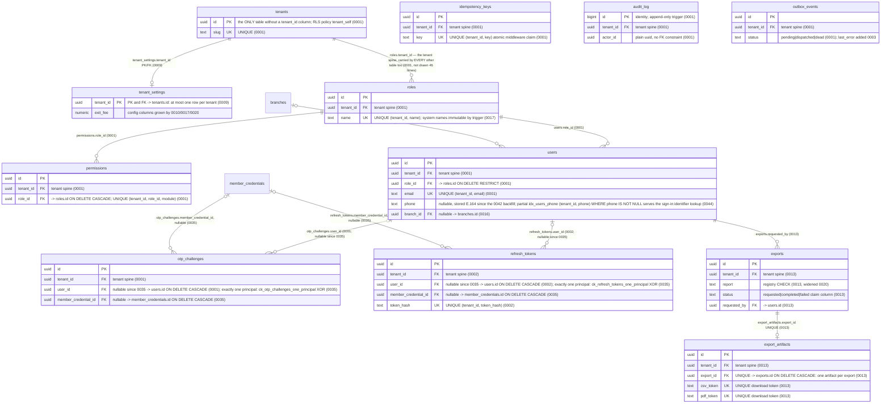

<!--
  P-DIAG.2 — ERD, as-built (Genesis Prestige backend)
  Authored against main @ 08541b860f1445b16c342c39b6606d86b9dbeb17
  Alembic head at authoring: 0022 (0022_dividend_dormant_policy.py,
  down_revision = "0021"), verified linear 0001..0022 at branch time.
  The in-flight 0023 claim (!40, P13.10) had NOT merged at authoring;
  its MR updates this file when it lands (v1.2 rules 11/14).
  Reconciled to main @ 8f46aa54250ff1a066af423924f3eb54a9c72fb7 by the
  P-DIAG drift MR: alembic head 0032 (0032_repayments_append_only.py,
  down_revision = "0031"), verified linear 0001..0032 at branch time.
  Nine tables from 0025-0031 join as subject areas 2.F/2.G; the §3/§4/
  §5 registers are extended.
  Re-reconciled to main @ d517769d1fb5e414c99d2ccf8bcbadf23a3d5085 by
  the !55 as-built flip: alembic head 0034
  (0034_recovery_claim_cap_lock.py, down_revision = "0033"), verified
  linear 0001..0034. 0033 (!53, issue #23) alters recovery_cases /
  recovery_case_notes (no new table); 0034 (!54) regenerates the 0030
  within-claim constraint-trigger function (no table change) — §2.F,
  §3, §4 and §5 updated accordingly (v1.2 rules 11/14).
  Extended for 0037 by the issue-#30 close-out MR (!71), IN THE SAME
  COMMITS as the migration: alembic head 0036 -> 0037
  (0037_committee_recommender.py, down_revision = "0036" — alters
  loan_applications only, no new table); diagram 2.B, §3 and §6
  updated accordingly (v1.2 rules 11/14).
  Extended for 0039 by the issue-#31 batch-8 MR, IN THE SAME MR as
  the migration: alembic head 0038 -> 0039
  (0039_member_dividend_payout.py, down_revision = "0038" — alters
  members only, one nullable CHECK-pinned preference column, no new
  table; 0038, !77, was index-only on existing corrections tables);
  diagram 2.A and §3 updated accordingly (v1.2 rules 11/14).
  Extended for 0040 by the issue-#31 batch-10 MR (!83), IN THE SAME
  COMMITS as the migration: alembic head 0039 -> 0040
  (0040_share_transfer_maker_checker.py, down_revision = "0039" —
  re-chained onto 0039 after the batch-8 merge landed on main, as
  declared up front in !83; alters share_transfers only, no new
  table); diagram 2.D and §3 updated accordingly (v1.2 rules 11/14).
  Extended for 0043 by the issue-#35 remainder MR, IN THE SAME
  COMMIT as the migration: alembic head 0042 -> 0043
  (0043_external_txn_ref_and_search_index.py, down_revision = "0042"
  — re-chained from "0041" after !87 merged 0042_phone_e164_backfill
  to main, the 0017/0041 precedent; alters transactions only:
  nullable external_ref + partial UNIQUE dedupe + the search prefix
  index, no new table);
  diagram 2.C, §3 and §5 updated accordingly (v1.2 rules 11/14).
  Extended for 0044 by the issue-#35 sign-in-identifier MR, IN THE
  SAME COMMIT as the migration: alembic head 0043 -> 0044
  (0044_users_phone_signin_index.py, down_revision = "0043"; one
  partial index idx_users_phone (tenant_id, phone) WHERE phone IS
  NOT NULL serving the new phone sign-in lookup — no table, column,
  constraint or RLS change);
  diagram 2.A and §3 updated accordingly (v1.2 rules 11/14).
  Derived exclusively from backend/migrations/versions/*.py — every
  entity is a real table from a migration; every edge cites the FK
  that implements it. Falsifiable gate: erd-spot-check.py (§6).
  Drift rule: v1.2 rule 11 — any MR that adds/alters a table, FK,
  trust-relevant trigger or RLS posture MUST update this file in the
  same MR. A stale diagram is a rejected MR.
-->

# Entity-relationship diagram — as-built (P-DIAG.2)

The entire schema at alembic head **0044**: **47 tables** (0035
creates `member_credentials`; 0033/0034/0036/0037/0040/0043 alter
existing tables and create none; 0038/0041/0044 add indexes only;
0042 is a data-only backfill touching no schema object), drawn as
seven subject-area `erDiagram`s (one diagram would not render readably;
the split follows the module boundaries in the §3 traceability table).
An entity appearing in more than one diagram (e.g. `members`,
`transactions`, `users`) is the SAME table, repeated without its
attribute block where it only anchors a cross-area FK.

## 1. How to read these diagrams

- **Every entity is a real table** created by a migration in
  `backend/migrations/versions/`; §3 maps each to its creating and
  altering revisions and its owning module. The completeness of this
  claim — both directions — is machine-checked by
  [`erd-spot-check.py`](erd-spot-check.py) (§6).
- **Every edge is a real FOREIGN KEY**, cited in the edge label as
  `column (migration)`. Nothing is inferred from code or prose.
- **The tenant spine is drawn once, not 46 times.** Every table except
  `tenants` carries `tenant_id uuid NOT NULL REFERENCES tenants(id)
  ON DELETE RESTRICT` (the 0001 pattern, repeated verbatim by every
  later creating migration). Drawing those 46 edges would bury the
  domain FKs, so the spine is shown representatively in diagram E and
  the `tenant_id FK` attribute on every entity stands for its edge.
- **Attribute lists are keys, not column dictionaries**: PK, FKs,
  UNIQUE claim keys (§5) and CHECK-pinned discriminators. The full
  column set lives in the creating migration cited in §3 — the ERD
  does not restate it.
- **Cardinality**: `||` exactly one, `|o` zero-or-one, `o{`
  zero-or-more. Zero-or-one on the parent side means the FK column is
  nullable; `||--o|` child-side means a UNIQUE constraint makes the
  relationship at-most-one (each such UNIQUE is named in the label).
- Trust-relevant store properties (append-only, write-once, forced
  RLS, posting barriers) are annotated **by reference only** in §4
  (v1.2 rule 11) — never restated here.

## 2. The diagrams

### 2.A Membership & KYC

```mermaid
erDiagram
    %% main @ 08541b860f1445b16c342c39b6606d86b9dbeb17 — alembic head 0022
    %% post-merge remediation (!65 drift): member_credentials (0035)
    %% verified at main @ eb90a80e, head 0036
    members {
        uuid id PK
        uuid tenant_id FK "tenant spine (0001)"
        text member_no UK "UNIQUE (tenant_id, member_no) (0001)"
        text type "person|company|group|vehicle; UNIQUE (id, type) composite-FK anchor (0018)"
        text status "active|arrears|dormant|exited (0001, widened 0021)"
        uuid branch_id FK "nullable, ON DELETE RESTRICT (0016)"
        text dividend_payout "nullable payout PREFERENCE, CHECK deposit_account|share_capital|mpesa|bank; NULL is the honest not-chosen state; the P13.11 distribution engine does NOT consume it (0039)"
    }
    branches {
        uuid id PK
        uuid tenant_id FK "tenant spine (0016)"
        text name UK "UNIQUE (tenant_id, name) atomic-claim key (0016)"
    }
    member_profiles {
        uuid id PK
        uuid tenant_id FK "tenant spine (0018)"
        uuid member_id FK "UNIQUE (tenant_id, member_id) atomic-claim key (0018)"
        text member_type FK "composite FK (member_id, member_type) to members (id, type) (0018)"
        timestamptz dpa_consent_at "immutable once set: consent-guard triggers (0018)"
    }
    member_documents {
        uuid id PK
        uuid tenant_id FK "tenant spine (0018)"
        uuid member_id FK "with member_type below (0018)"
        text member_type FK "composite FK (member_id, member_type) to members (id, type) (0018)"
        text doc_type UK "UNIQUE (tenant_id, member_id, doc_type) checklist claim (0018)"
        text status "pending|received|verified|rejected (0018)"
    }
    share_accounts {
        uuid id PK
        uuid tenant_id FK "tenant spine (0001)"
        uuid member_id FK "UNIQUE (tenant_id, member_id) (0001)"
        numeric balance "CHECK >= 0 (0001)"
    }
    deposit_accounts {
        uuid id PK
        uuid tenant_id FK "tenant spine (0001)"
        uuid member_id FK "UNIQUE (tenant_id, member_id) (0001)"
        numeric balance "CHECK >= 0 (0001)"
    }
    member_credentials {
        uuid id PK
        uuid tenant_id FK "tenant spine (0035)"
        uuid member_id FK "-> members.id ON DELETE RESTRICT; partial UNIQUE uq_member_credentials_member_active: one ACTIVE credential per member (0035)"
        text email UK "partial UNIQUE uq_member_credentials_email_active (tenant_id, email) WHERE status = active — atomic link claim, doubles as the member-login index (0035)"
        text status "active|revoked CHECK; ck_member_credentials_revoked_at: revoked_at set iff revoked (0035)"
    }

    branches |o--o{ members : "members.branch_id (0016)"
    members ||--o| member_profiles : "member_profiles (member_id, member_type) -> members (id, type); UNIQUE (tenant_id, member_id) (0018)"
    members ||--o{ member_documents : "member_documents (member_id, member_type) -> members (id, type) (0018)"
    members ||--o| share_accounts : "share_accounts.member_id; UNIQUE (tenant_id, member_id) (0001)"
    members ||--o| deposit_accounts : "deposit_accounts.member_id; UNIQUE (tenant_id, member_id) (0001)"
    members ||--o{ member_credentials : "member_credentials.member_id (0035)"
```



### 2.B Lending

```mermaid
erDiagram
    %% main @ 08541b860f1445b16c342c39b6606d86b9dbeb17 — alembic head 0022
    %% post-merge remediation (!65/!66 drift): guarantees consent principal
    %% (0035), loan_applications.created_by (0036) — main @ eb90a80e, head 0036
    %% issue-#30 close-out (!71): loan_applications.recommended_by (0037) — head 0037
    loan_products {
        uuid id PK
        uuid tenant_id FK "tenant spine (0001)"
        text name UK "UNIQUE (tenant_id, name) (0001)"
        integer guarantors_required "stored config (0017)"
    }
    loan_applications {
        uuid id PK
        uuid tenant_id FK "tenant spine (0001)"
        uuid member_id FK "-> members.id (0001)"
        uuid product_id FK "-> loan_products.id (0001)"
        text stage "submitted..disbursed CHECK (0001)"
        uuid created_by FK "nullable -> users.id; acting principal, audit-log backfilled (0036)"
        uuid recommended_by FK "nullable -> users.id; committee referrer, audit-log backfilled (0037)"
    }
    loans {
        uuid id PK
        uuid tenant_id FK "tenant spine (0001)"
        uuid application_id FK "UNIQUE -> loan_applications.id (0001)"
        uuid member_id FK "-> members.id (0001)"
        uuid product_id FK "-> loan_products.id (0001)"
        text status "active|closed|written_off (0001)"
        numeric penalty_due "receivable bucket, CHECK >= 0 (0007)"
    }
    loan_schedules {
        uuid id PK
        uuid tenant_id FK "tenant spine (0001)"
        uuid loan_id FK "-> loans.id ON DELETE CASCADE (0001)"
        integer installment_no UK "UNIQUE (tenant_id, loan_id, installment_no) (0001)"
    }
    repayments {
        uuid id PK
        uuid tenant_id FK "tenant spine (0001)"
        uuid loan_id FK "-> loans.id (0001)"
        uuid transaction_id FK "-> transactions.id (0001; FK index 0014)"
    }
    guarantees {
        uuid id PK
        uuid tenant_id FK "tenant spine (0001)"
        uuid guarantor_member_id FK "-> members.id; CHECK <> borrower (0001)"
        uuid borrower_member_id FK "-> members.id (0001)"
        uuid application_id FK "nullable -> loan_applications.id (0001)"
        uuid loan_id FK "nullable -> loans.id (0001; linkage backfilled 0011)"
        text status "pledged|active|released (0001)"
        uuid consented_by_credential_id FK "nullable -> member_credentials.id; the consenting member principal (0035)"
        uuid consent_attested_by FK "nullable -> users.id; staff-attested override — ck_guarantees_attested_reference requires consent_reference (0035)"
    }
    committee_votes {
        uuid id PK
        uuid tenant_id FK "tenant spine (0005)"
        uuid application_id FK "-> loan_applications.id ON DELETE CASCADE (0005)"
        uuid voter_id FK "UNIQUE (tenant_id, application_id, voter_id) double-vote guard (0005)"
    }
    penalty_accruals {
        uuid id PK
        uuid tenant_id FK "tenant spine (0019)"
        uuid loan_id FK "-> loans.id (0019)"
        date accrual_date UK "UNIQUE (tenant_id, loan_id, accrual_date) idempotency claim (0019)"
    }
    members
    users
    transactions
    member_credentials

    loan_products ||--o{ loan_applications : "loan_applications.product_id (0001)"
    members ||--o{ loan_applications : "loan_applications.member_id (0001)"
    loan_applications ||--o| loans : "loans.application_id UNIQUE (0001)"
    loan_products ||--o{ loans : "loans.product_id (0001)"
    members ||--o{ loans : "loans.member_id (0001)"
    loans ||--o{ loan_schedules : "loan_schedules.loan_id (0001)"
    loans ||--o{ repayments : "repayments.loan_id (0001)"
    transactions ||--o{ repayments : "repayments.transaction_id (0001)"
    members ||--o{ guarantees : "guarantees.guarantor_member_id (0001)"
    members ||--o{ guarantees : "guarantees.borrower_member_id (0001)"
    loan_applications |o--o{ guarantees : "guarantees.application_id, nullable (0001)"
    loans |o--o{ guarantees : "guarantees.loan_id, nullable (0001; 0011 backfill)"
    loan_applications ||--o{ committee_votes : "committee_votes.application_id (0005)"
    users ||--o{ committee_votes : "committee_votes.voter_id (0005)"
    loans ||--o{ penalty_accruals : "penalty_accruals.loan_id (0019)"
    users |o--o{ loan_applications : "loan_applications.created_by, nullable (0036)"
    users |o--o{ loan_applications : "loan_applications.recommended_by, nullable (0037)"
    member_credentials |o--o{ guarantees : "guarantees.consented_by_credential_id, nullable (0035)"
    users |o--o{ guarantees : "guarantees.consent_attested_by, nullable (0035)"
```



### 2.C Ledger & transactions

```mermaid
erDiagram
    %% main @ 08541b860f1445b16c342c39b6606d86b9dbeb17 — alembic head 0022
    %% post-merge remediation (!66 drift): transactions.created_by (0036)
    %% — main @ eb90a80e, head 0036
    transactions {
        uuid id PK
        uuid tenant_id FK "tenant spine (0001); UNIQUE (tenant_id, id) composite-FK anchor (0014)"
        text txn_ref UK "UNIQUE (tenant_id, txn_ref) (0001)"
        uuid member_id FK "nullable -> members.id (0001)"
        uuid reversal_of_id FK "nullable; (tenant_id, reversal_of_id) -> transactions (tenant_id, id) (0004, tenant-safe 0014); partial UNIQUE: one reversal per original (0004)"
        text type "posting taxonomy CHECK (0001, widened 0020)"
        uuid created_by FK "nullable -> users.id; acting principal, NULL = system posting; pinned immutable by the 0004 append-only fence (0036)"
        text external_ref UK "nullable, CHECK 2..40 chars; partial UNIQUE (tenant_id, channel, external_ref) — operator-entered external receipt ref (M-Pesa code / bank slip) on external-channel teller postings, NULL = system/legacy posting (0043)"
    }
    ledger_entries {
        uuid id PK
        uuid tenant_id FK "tenant spine (0001)"
        uuid transaction_id FK "-> transactions.id (0001)"
        text side "debit|credit; balanced per txn by deferred constraint trigger (0004/0014)"
    }
    txn_ref_sequences {
        uuid tenant_id PK "composite PK (tenant_id, prefix) -> tenants.id (0004)"
        text prefix PK "per-prefix monotonic counter (0004)"
    }
    accounting_periods {
        uuid id PK
        uuid tenant_id FK "tenant spine (0012)"
        date period_start UK "UNIQUE (tenant_id, period_start) atomic close claim (0012)"
        uuid closed_by FK "nullable -> users.id (0012)"
    }
    deposit_interest_accruals {
        uuid id PK
        uuid tenant_id FK "tenant spine (0008)"
        uuid account_id FK "-> deposit_accounts.id (0008)"
        date period_start UK "UNIQUE (tenant_id, account_id, period_start) idempotency claim (0008)"
        uuid transaction_id FK "nullable -> transactions.id (0008)"
    }
    tenants
    members
    users
    deposit_accounts

    members |o--o{ transactions : "transactions.member_id, nullable (0001)"
    transactions |o--o| transactions : "reversal_of_id, tenant-safe composite FK (0004/0014)"
    transactions ||--o{ ledger_entries : "ledger_entries.transaction_id (0001)"
    tenants ||--o{ txn_ref_sequences : "txn_ref_sequences.tenant_id, PK (tenant_id, prefix) (0004)"
    tenants ||--o{ accounting_periods : "accounting_periods.tenant_id (0012)"
    users |o--o{ accounting_periods : "accounting_periods.closed_by, nullable (0012)"
    deposit_accounts ||--o{ deposit_interest_accruals : "deposit_interest_accruals.account_id (0008)"
    transactions |o--o{ deposit_interest_accruals : "deposit_interest_accruals.transaction_id, nullable (0008)"
    users |o--o{ transactions : "transactions.created_by, nullable (0036)"
```



### 2.D Dividends & exits

```mermaid
erDiagram
    %% main @ 08541b860f1445b16c342c39b6606d86b9dbeb17 — alembic head 0022
    dividend_declarations {
        uuid id PK
        uuid tenant_id FK "tenant spine (0020)"
        date fy_start UK "partial UNIQUE (tenant_id, fy_start) WHERE status <> rejected (0020)"
        text status "declared|approved|rejected|distributed (0020)"
        uuid requested_by FK "nullable -> users.id (0020)"
    }
    dividend_declaration_votes {
        uuid id PK
        uuid tenant_id FK "tenant spine (0020)"
        uuid declaration_id FK "-> dividend_declarations.id (0020)"
        uuid voter_id FK "UNIQUE (tenant_id, declaration_id, voter_id) double-vote guard (0020)"
    }
    dividend_distributions {
        uuid id PK
        uuid tenant_id FK "tenant spine (0020)"
        uuid declaration_id FK "-> dividend_declarations.id (0020)"
        uuid member_id FK "UNIQUE (tenant_id, declaration_id, member_id) idempotency claim (0020)"
        uuid transaction_id FK "nullable -> transactions.id (0020)"
        text disposition "paid|unclaimed (0022)"
    }
    share_transfers {
        uuid id PK
        uuid tenant_id FK "tenant spine (0020)"
        uuid from_member_id FK "-> members.id; CHECK <> to_member_id (0020)"
        uuid to_member_id FK "-> members.id (0020)"
        uuid out_transaction_id FK "-> transactions.id; nullable since 0040, ck_share_transfers_txns_iff_posted (0020/0040)"
        uuid in_transaction_id FK "-> transactions.id; nullable since 0040, ck_share_transfers_txns_iff_posted (0020/0040)"
        uuid created_by FK "nullable -> users.id (0020); the maker"
        text status "pending|posted|rejected CHECK; write-once + status-machine trigger; register index (0040)"
        uuid approved_by FK "nullable -> users.id; the checker; ck_share_transfers_sod: approved_by <> created_by (0040)"
        timestamptz decided_at "one-shot decision fill (0040)"
        numeric from_balance_at_request "approval snapshot; pending rows must carry it (0040)"
        int version "optimistic lock for the rejection path (0040)"
    }
    member_exits {
        uuid id PK
        uuid tenant_id FK "tenant spine (0001)"
        uuid member_id FK "-> members.id (0001); partial UNIQUE open-exit claim (0010)"
        text status "requested|approved|settled|rejected (0001)"
        uuid requested_by FK "nullable -> users.id (0010)"
        uuid settlement_transaction_id FK "nullable -> transactions.id (0010)"
    }
    exit_votes {
        uuid id PK
        uuid tenant_id FK "tenant spine (0010)"
        uuid exit_id FK "-> member_exits.id ON DELETE RESTRICT (0010)"
        uuid voter_id FK "UNIQUE (tenant_id, exit_id, voter_id) double-vote guard (0010)"
    }
    members
    users
    transactions

    users |o--o{ dividend_declarations : "dividend_declarations.requested_by, nullable (0020)"
    dividend_declarations ||--o{ dividend_declaration_votes : "dividend_declaration_votes.declaration_id (0020)"
    users ||--o{ dividend_declaration_votes : "dividend_declaration_votes.voter_id (0020)"
    dividend_declarations ||--o{ dividend_distributions : "dividend_distributions.declaration_id (0020)"
    members ||--o{ dividend_distributions : "dividend_distributions.member_id (0020)"
    transactions |o--o{ dividend_distributions : "dividend_distributions.transaction_id, nullable (0020)"
    members ||--o{ share_transfers : "share_transfers.from_member_id (0020)"
    members ||--o{ share_transfers : "share_transfers.to_member_id (0020)"
    transactions ||--o{ share_transfers : "share_transfers.out_transaction_id (0020)"
    transactions ||--o{ share_transfers : "share_transfers.in_transaction_id (0020)"
    users |o--o{ share_transfers : "share_transfers.created_by, nullable (0020)"
    users |o--o{ share_transfers : "share_transfers.approved_by, nullable, SoD CHECK (0040)"
    members ||--o{ member_exits : "member_exits.member_id (0001)"
    users |o--o{ member_exits : "member_exits.requested_by, nullable (0010)"
    transactions |o--o{ member_exits : "member_exits.settlement_transaction_id, nullable (0010)"
    member_exits ||--o{ exit_votes : "exit_votes.exit_id (0010)"
    users ||--o{ exit_votes : "exit_votes.voter_id (0010)"
```



### 2.E Platform: tenancy, auth/RBAC, exports, outbox



### 2.F Corrections, write-off & recovery (P13.15/P13.16, issues #21/#24/#23)

```mermaid
erDiagram
    %% main @ 8f46aa54250ff1a066af423924f3eb54a9c72fb7 — alembic head 0032
    %% !55 flip: 0033 (issue #23) widens recovery_cases.status and adds
    %% recovery_case_notes.is_outcome — re-verified at main @ d517769, head 0034
    repayment_adjustments {
        uuid id PK
        uuid tenant_id FK "tenant spine (0025)"
        uuid repayment_id FK "partial UNIQUE uq_repayment_adjustments_claim (tenant_id, repayment_id) WHERE status <> rejected (0025, partial since 0031)"
        uuid loan_id FK "-> loans.id (0025)"
        uuid original_transaction_id FK "-> transactions.id (0025)"
        uuid reversal_transaction_id FK "nullable -> transactions.id, filled at approval (0025/0031)"
        uuid maker_id FK "-> users.id (0025)"
        uuid checker_id FK "nullable -> users.id; ck_repayment_adjustments_sod: checker <> maker (0031)"
        text status "pending_approval|posted|rejected CHECK; write-once workflow trigger (0031)"
        numeric amount "CHECK = penalties + interest + principal (0025)"
    }
    loan_write_offs {
        uuid id PK
        uuid tenant_id FK "tenant spine (0025)"
        uuid loan_id FK "partial UNIQUE uq_loan_write_offs_open (tenant_id, loan_id) WHERE status <> rejected (0025)"
        uuid member_id FK "-> members.id (0025)"
        numeric total_written_off "CHECK = balance + penalty_due, > 0; write-once trigger (0025)"
        text classification "CHECK substandard|doubtful|loss - the prudential gate's DB backstop (0025)"
        text status "requested|approved|rejected|posted CHECK (0025)"
        uuid requested_by FK "nullable -> users.id (0025)"
        uuid transaction_id FK "nullable -> transactions.id, the WO- posting (0025)"
    }
    loan_write_off_votes {
        uuid id PK
        uuid tenant_id FK "tenant spine (0025)"
        uuid write_off_id FK "-> loan_write_offs.id (0025)"
        uuid voter_id FK "UNIQUE (tenant_id, write_off_id, voter_id) double-vote guard (0025)"
        text vote "approve|reject CHECK (0025)"
    }
    loan_recoveries {
        uuid id PK
        uuid tenant_id FK "tenant spine (0030)"
        uuid write_off_id FK "-> loan_write_offs.id; within-claim constraint trigger (0030)"
        uuid loan_id FK "-> loans.id (0030)"
        uuid member_id FK "-> members.id (0030)"
        uuid recovery_case_id FK "nullable -> recovery_cases.id, the P13.16 linkage (0030)"
        uuid transaction_id FK "-> transactions.id, the RC- posting (0030)"
        numeric amount "CHECK > 0; append-only triggers (0030)"
        uuid recorded_by FK "-> users.id (0030)"
    }
    recovery_cases {
        uuid id PK
        uuid tenant_id FK "tenant spine (0026)"
        uuid loan_id FK "partial UNIQUE uq_recovery_cases_one_open (tenant_id, loan_id) WHERE status IN live set (0026, regenerated 0033)"
        text status "open|irrecoverable_pending_write_off|disputed|closed_cured|closed_written_off|closed_restructured CHECK (0026, widened 0033); closed_at set iff terminal CHECK (0033)"
        uuid assignee_id FK "nullable -> users.id (0026)"
        uuid opened_by FK "-> users.id (0026)"
        text classification_at_open "CHECK substandard|doubtful|loss (0026)"
        integer days_past_due_at_open "CHECK > 90 (0026)"
    }
    recovery_case_notes {
        uuid id PK
        uuid tenant_id FK "tenant spine (0026)"
        uuid case_id FK "-> recovery_cases.id (0026)"
        uuid author_id FK "-> users.id (0026)"
        text note "CHECK length 1..2000; append-only by route design (0026)"
        boolean is_outcome "partial UNIQUE uq_recovery_notes_one_outcome (tenant_id, case_id) WHERE is_outcome — one outcome note per case (0033)"
    }
    loans
    repayments
    members
    users
    transactions

    repayments ||--o{ repayment_adjustments : "repayment_adjustments.repayment_id; one LIVE adjustment per repayment (0025/0031)"
    loans ||--o{ repayment_adjustments : "repayment_adjustments.loan_id (0025)"
    transactions ||--o{ repayment_adjustments : "repayment_adjustments.original_transaction_id (0025)"
    transactions |o--o{ repayment_adjustments : "repayment_adjustments.reversal_transaction_id, nullable (0025)"
    users ||--o{ repayment_adjustments : "repayment_adjustments.maker_id (0025)"
    users |o--o{ repayment_adjustments : "repayment_adjustments.checker_id, nullable; SoD CHECK (0031)"
    loans ||--o{ loan_write_offs : "loan_write_offs.loan_id; one live workflow per loan (0025)"
    members ||--o{ loan_write_offs : "loan_write_offs.member_id (0025)"
    users |o--o{ loan_write_offs : "loan_write_offs.requested_by, nullable (0025)"
    transactions |o--o{ loan_write_offs : "loan_write_offs.transaction_id, nullable (0025)"
    loan_write_offs ||--o{ loan_write_off_votes : "loan_write_off_votes.write_off_id (0025)"
    users ||--o{ loan_write_off_votes : "loan_write_off_votes.voter_id (0025)"
    loan_write_offs ||--o{ loan_recoveries : "loan_recoveries.write_off_id (0030)"
    loans ||--o{ loan_recoveries : "loan_recoveries.loan_id (0030)"
    members ||--o{ loan_recoveries : "loan_recoveries.member_id (0030)"
    recovery_cases |o--o{ loan_recoveries : "loan_recoveries.recovery_case_id, nullable (0030)"
    transactions ||--o{ loan_recoveries : "loan_recoveries.transaction_id (0030)"
    users ||--o{ loan_recoveries : "loan_recoveries.recorded_by (0030)"
    loans ||--o{ recovery_cases : "recovery_cases.loan_id; one open case per loan (0026)"
    users |o--o{ recovery_cases : "recovery_cases.assignee_id, nullable (0026)"
    users ||--o{ recovery_cases : "recovery_cases.opened_by (0026)"
    recovery_cases ||--o{ recovery_case_notes : "recovery_case_notes.case_id (0026)"
    users ||--o{ recovery_case_notes : "recovery_case_notes.author_id (0026)"
```



### 2.G Portfolio snapshots & period rollups (P13.17a/b)

```mermaid
erDiagram
    %% main @ 8f46aa54250ff1a066af423924f3eb54a9c72fb7 — alembic head 0032
    portfolio_month_snapshots {
        uuid id PK
        uuid tenant_id FK "tenant spine (0027)"
        date month_end UK "UNIQUE (tenant_id, month_end) atomic claim; month-END CHECK; write-once + no-future triggers (0027)"
        text source "close_period|backfill CHECK (0027)"
    }
    account_period_balances {
        uuid id PK
        uuid tenant_id FK "tenant spine (0028)"
        date period_start FK "composite FK (tenant_id, period_start) -> accounting_periods; UNIQUE (tenant_id, period_start, account); write-once + late-insert-fence triggers (0028)"
        text account "CHECK length > 0 (0028)"
    }
    member_period_balances {
        uuid id PK
        uuid tenant_id FK "tenant spine (0028)"
        date period_start FK "composite FK (tenant_id, period_start) -> accounting_periods; UNIQUE (tenant_id, period_start, member_id) (0028)"
        uuid member_id FK "composite FK (tenant_id, member_id) -> members (tenant_id, id), backed by uq_members_tenant_id_id (0028)"
    }
    tenants
    accounting_periods
    members

    tenants ||--o{ portfolio_month_snapshots : "portfolio_month_snapshots.tenant_id (0027)"
    accounting_periods ||--o{ account_period_balances : "composite (tenant_id, period_start) FK (0028)"
    accounting_periods ||--o{ member_period_balances : "composite (tenant_id, period_start) FK (0028)"
    members ||--o{ member_period_balances : "composite (tenant_id, member_id) FK (0028)"
```



## 3. Traceability: table → migrations → owning module

Every table at head 0037, its creating migration, every later
migration that altered it (columns, CHECKs, triggers, indexes or data
backfills), and the module that owns its writes on main @ `eb90a80`
(0037 verified against the !71 branch tree that ships it).
Both directions of the table↔migration mapping are machine-checked by
[`erd-spot-check.py`](erd-spot-check.py) (§6).

| Table | Created | Altered by | Owning module |
|---|---|---|---|
| `tenants` | 0001 | 0003 (`active_tenant_ids()` worker registry fn) | `infrastructure/tenancy.py` seam; no request-path writer |
| `roles` | 0001 | 0017 (system-role rename-guard trigger) | `application/rbac.py` |
| `permissions` | 0001 | — | `application/rbac.py` |
| `users` | 0001 | 0015 (`last_active_at`, keyset idx), 0016 (`branch_id`, idxs), 0044 (partial `idx_users_phone` — sign-in identifier phone lookup) | `application/users.py`, `application/auth.py` |
| `otp_challenges` | 0001 | 0035 (`member_credential_id`, `user_id` goes nullable, `ck_otp_challenges_one_principal` XOR, `idx_otp_credential`) | `application/auth.py`, `application/member_auth.py` |
| `refresh_tokens` | 0002 | 0035 (`member_credential_id`, `user_id` goes nullable, `ck_refresh_tokens_one_principal` XOR, `idx_refresh_credential`) | `application/auth.py`, `application/member_auth.py` |
| `members` | 0001 | 0016 (`branch_id`), 0018 (`uq_members_id_type`), 0020 (dividend-scan idx), 0021 (`dormant` status, dormancy-scan idx), 0022 (scan predicate widened, exited-scan idx), 0023 (register keyset idx), 0028 (`uq_members_tenant_id_id` composite-FK anchor) | `application/members.py` (+ `dormancy.py` batch) |
| `member_profiles` | 0018 | — | `application/member_kyc.py` |
| `member_documents` | 0018 | — | `application/member_kyc.py` |
| `branches` | 0016 | — | `application/branches.py` |
| `member_credentials` | 0035 (incl. partial UNIQUEs `uq_member_credentials_email_active`/`uq_member_credentials_member_active`, `ck_member_credentials_revoked_at`) | — | `application/member_identity.py` (audited link admin), `application/member_auth.py` (member login/refresh reads) |
| `share_accounts` | 0001 | — | created by `application/members.py`; balances moved by `transactions.py`/`dividends.py`/`member_exits.py` |
| `deposit_accounts` | 0001 | 0008 (partial scan idx), 0009 (keyset idx) | created by `application/members.py`; balances moved by `transactions.py`/`deposit_interest.py`/`dividends.py`/`member_exits.py`/`ledger.py` |
| `loan_products` | 0001 | 0017 (`guarantors_required`) | `application/loan_products.py` |
| `loan_applications` | 0001 | 0006 (keyset idx), 0014 (stage-keyset idx, drops 0001 stage idx), 0036 (`created_by` + audit-log backfill — issue #30 R4 disbursement SoD), 0037 (`recommended_by` + audit-log backfill — issue-#30 close-out recommender attribution + vote/disburse SoD) | `application/loan_applications.py` |
| `committee_votes` | 0005 | — | `application/loan_applications.py` |
| `loans` | 0001 | 0007 (`penalty_due`, `closed_at`, idxs), 0013 (disbursed idx), 0026 (`idx_loans_dpd_worklist`) | `application/loans.py` (+ `ledger.py` disburse, `arrears.py` batch; terminal write-off transition by `corrections.py`) |
| `loan_schedules` | 0001 | 0007 (unpaid partial idx) | `application/ledger.py` (creates), `application/loans.py` (allocates) |
| `repayments` | 0001 | 0014 (transaction-FK idx), 0025 (amount CHECK widened to `<> 0` for negative-linked correction rows), 0032 (append-only triggers `repayments_no_update`/`_no_delete` — issue #24 N4) | `application/ledger.py` (disburse-time rows), `application/loans.py` (repayment rows), `application/corrections.py` (negative correction rows) |
| `guarantees` | 0001 | 0011 (loan-linkage data backfill), 0035 (consent-principal columns `consented_by_credential_id`/`consent_attested_by`/`consent_reference`, `ck_guarantees_attested_reference`, `guarantees_consent_principal` constraint trigger, consent idxs) | `application/guarantees.py` |
| `penalty_accruals` | 0019 | — | `application/arrears.py` |
| `transactions` | 0001 | 0004 (`reversal_of_id`, append-only triggers, one-reversal partial UNIQUE), 0008 (keyset idxs), 0012 (closed-period trigger), 0013 (type idx), 0014 (tenant-safe reversal FK, `UNIQUE (tenant_id, id)`, advisory-locked trigger body), 0020 (type CHECK widened), 0025 (type CHECK: `fee`, `loan_write_off`), 0030 (type CHECK: `loan_recovery`), 0036 (`created_by` + audit-log backfill via in-transaction append-only trigger toggle — issue #30 R3), 0043 (`external_ref` nullable CHECK-bounded + partial UNIQUE dedupe + `idx_txns_ref_prefix` text_pattern_ops search index — #35 items 6/13) | `application/ledger.py` (every posting) |
| `ledger_entries` | 0001 | 0004 (append-only triggers, balanced deferred constraint trigger), 0014 (balance check also pins totals = `transactions.amount`) | `application/ledger.py` |
| `txn_ref_sequences` | 0004 | — | `application/ledger.py` (`_next_ref`), `application/members.py` (member numbering) |
| `accounting_periods` | 0012 | 0028 (`rollup_at` marker + write-once marker trigger, composite-FK target for the rollup tables) | `application/accounting_periods.py` (+ `period_rollups.py` marker) |
| `deposit_interest_accruals` | 0008 | — | `application/deposit_interest.py` |
| `tenant_settings` | 0009 | 0010 (`exit_fee`), 0017 (rate goes nullable + interest/parameters/approval-matrix columns), 0020 (`deposit_rebate_rate_pct`) | `application/tenant_settings.py` (single legitimate writer) |
| `member_exits` | 0001 | 0010 (workflow columns, open-exit partial UNIQUE, idxs) | `application/member_exits.py` |
| `exit_votes` | 0010 | — | `application/member_exits.py` |
| `dividend_declarations` | 0020 (incl. write-once trigger) | — | `application/dividends.py` |
| `dividend_declaration_votes` | 0020 | — | `application/dividends.py` |
| `dividend_distributions` | 0020 | 0022 (`disposition`) | `application/dividends.py` |
| `share_transfers` | 0020 | 0040 (maker-checker columns: `status`/`approved_by`/`decided_at`/`from_balance_at_request`/`version`/`updated_at`; transaction FKs go nullable with `ck_share_transfers_txns_iff_posted`; `ck_share_transfers_sod` + pending-snapshot CHECKs; write-once/status-machine trigger; register + approved_by indexes) | `application/dividends.py` |
| `exports` | 0013 | 0020 (report CHECK widened), 0023 (report CHECK widened for the P13.10 registry) | `application/exports.py` |
| `export_artifacts` | 0013 | — | `application/exports.py` |
| `outbox_events` | 0001 | 0003 (`last_error`), 0024 (`idx_outbox_dispatched_purge` + due/purgeable tenant-discovery `SECURITY DEFINER` fns — P13.17e) | `application/outbox.py` (writer), `infrastructure/outbox_worker.py` (dispatcher + retention purge) |
| `audit_log` | 0001 (incl. append-only trigger) | 0015 (viewer keyset idxs, drops `idx_audit_time`) | `application/audit.py` (writer), `application/audit_log.py` (viewer) |
| `idempotency_keys` | 0001 | 0029 (`expires_at` + expiry index — P13.17c/DSA-3) | `api/idempotency.py` (middleware), `application/idempotency_purge.py` (retention purge) |
| `repayment_adjustments` | 0025 | 0031 (maker-checker columns: `status`/`checker_id`/`decided_at`/approval snapshot/`version`; `ck_repayment_adjustments_sod` + snapshot CHECKs; claim UNIQUE goes partial `WHERE status <> 'rejected'`; write-once trigger regenerated) | `application/corrections.py` |
| `loan_write_offs` | 0025 (incl. write-once trigger, `uq_loan_write_offs_open`) | — | `application/corrections.py` |
| `loan_write_off_votes` | 0025 | — | `application/corrections.py` |
| `loan_recoveries` | 0030 (incl. append-only triggers + `loan_recoveries_within_claim` constraint trigger) | 0034 (`check_recovery_within_claim` regenerated: parent `loan_write_offs` lookup now `FOR UPDATE` — the !51-N1 locking probe; lock-order.md §3/§8 owns the analysis) | `application/corrections.py` (`record_recovery_receipt`) |
| `recovery_cases` | 0026 (incl. `uq_recovery_cases_one_open`, `idx_recovery_cases_open_scan`) | 0033 (status CHECK widened to the six disposition states; `ck_recovery_cases_closed_at` regenerated as closed_at ⇔ terminal; both partial indexes regenerated under the SAME names over the live-status predicate) | `application/recovery.py` |
| `recovery_case_notes` | 0026 | 0033 (`is_outcome` boolean + `uq_recovery_notes_one_outcome` partial UNIQUE — one outcome note per case) | `application/recovery.py` (append-only: no edit/delete route exists) |
| `portfolio_month_snapshots` | 0027 (incl. write-once + no-future triggers) | — | `application/portfolio_snapshots.py` |
| `account_period_balances` | 0028 (incl. write-once + late-insert-fence triggers) | — | `application/period_rollups.py` |
| `member_period_balances` | 0028 (incl. write-once + late-insert-fence triggers) | — | `application/period_rollups.py` |

Nothing in this file is `PLANNED`: every entity above exists at head
0037. The formerly in-flight !53 claim (0033, issue #23 — the
`recovery_cases` status widening and `recovery_case_notes.is_outcome`)
and !54's 0034 (within-claim trigger regeneration) merged to main and
are reconciled above by the !55 as-built flip (v1.2 rules 11/14).
0035 (`member_credentials` + consent principal, !65) and 0036 (actor
attribution, !66) merged WITHOUT the same-MR refresh rule 11 requires;
they are reconciled above by the post-merge remediation MR. 0037
(recommender attribution, !71) ships WITH its refresh in the same
commits — this paragraph and the rows above are that refresh.

## 4. Trust-relevant store properties (by reference — v1.2 rule 11)

Owned elsewhere; cited, never restated:

- **Forced RLS on every table**: enabled AND forced by each table's
  creating migration (`tenant_isolation` policy; `tenants` itself uses
  `tenant_self`), per **ADR-0002** — see
  [`c4-container.md`](c4-container.md) **§3** (P-DIAG.1) for the
  boundary. Leakage-suite membership (`TENANT_TABLES`,
  `backend/tests/test_tenancy_leakage.py`) covers 41 of the 46
  tenant-owned tables plus `tenants` (the 0025/0026/0027/0028/0030/0035
  tables joined the suite in their own MRs); `committee_votes`,
  `txn_ref_sequences`, `accounting_periods`, `exports` and
  `export_artifacts` carry the same forced policies from their
  creating migrations (0005/0004/0012/0013) but are not enumerated in
  the suite list — recorded here as an observation, not a policy gap
  (their RLS is migration-enforced like every other table's).
- **Append-only stores**: `ledger_entries` and `transactions`
  (migration `0004` triggers), `audit_log` (migration `0001` trigger),
  `repayments` (migration `0032` triggers — issue #24 N4),
  `loan_recoveries` (migration `0030` triggers, plus the
  `loan_recoveries_within_claim` constraint trigger that makes
  over-recovery and recovery-against-unposted-write-offs
  unrepresentable; `0034` regenerates its function so the parent claim
  lookup runs `FOR UPDATE` — the !51-N1 concurrency probe, analysed in
  [`lock-order.md`](lock-order.md) §3/§8) — see
  [`c4-container.md`](c4-container.md) **§3**.
  `recovery_case_notes` is append-only by ROUTE design (no edit/delete
  route exists anywhere, P13.16 addendum A2) — a convention, not a
  trigger; recorded as such.
- **Write-once snapshots**: `dividend_declarations` (migration `0020`
  trigger), `loan_write_offs` (migration `0025` trigger),
  `repayment_adjustments` (workflow write-once trigger, migrations
  `0025`/`0031` — the 0031 regeneration permits ONLY the
  pending→posted/rejected decision write; `ck_repayment_adjustments_sod`
  enforces maker ≠ checker at the DB), `portfolio_month_snapshots`
  (migration `0027` triggers) and the `0028` period-rollup tables
  (write-once + late-insert fence) — see
  [`c4-container.md`](c4-container.md) **§3**.
- **Closed-period posting barrier**: the `transactions` INSERT trigger
  (migrations `0012`/`0014`) shares the advisory-lock key of the
  application guard — the advisory tier is owned by
  [`lock-order.md`](lock-order.md) **§6**; the trigger's serialisation
  with `close_period` is edge E15's territory, not this file's.
- **Balanced double-entry**: the deferred constraint trigger on
  `ledger_entries` (migrations `0004`/`0014`) — a schema fact cited
  in diagram 2.C; posting-order semantics live in
  [`lock-order.md`](lock-order.md) **§3** (`_post`).
- **Other DB-enforced immutability guards** (schema facts, one line
  each, enforcement bodies in the cited migration): DPA consent
  (`member_profiles`, 0018), system role names (`roles`, 0017),
  guarantee-consent principal presence (`guarantees`, 0035 — the
  `guarantees_consent_principal` constraint trigger refuses any row
  ENTERING `active` without a member principal or staff attestation;
  P14.5 FM4). `transactions.created_by` (0036) is pinned immutable by
  the existing 0004 append-only fence — 0036's audit-log backfill runs
  under an in-transaction `DISABLE/ENABLE TRIGGER` toggle, so the
  fence is provably back in force at commit.
- **Lock behaviour of any table here** (claim scans, SKIP LOCKED,
  advisory locks): [`lock-order.md`](lock-order.md) is the single
  authority — this file states none of it.

## 5. UNIQUE idempotency / atomic-claim keys

The P-DIAG.2 EXIT requires every idempotency claim key marked; they
are marked `UK` in §2 and collected here (all claimed via
`INSERT ... ON CONFLICT DO NOTHING` + rowcount or refused by
constraint, v1.1 rule 5):

| Key | Table | Migration | Claims |
|---|---|---|---|
| `(tenant_id, key)` | `idempotency_keys` | 0001 | one middleware replay slot per request key |
| `(tenant_id, txn_ref)` | `transactions` | 0001 | reference uniqueness backstop behind the advisory generator |
| `(tenant_id, reversal_of_id)` partial | `transactions` | 0004 | at most one reversal per original |
| `(tenant_id, channel, external_ref)` partial | `transactions` | 0043 | per-tenant per-channel external-reference dedupe, claimed atomically at the posting INSERT (legacy NULLs tolerated) |
| `(tenant_id, application_id, voter_id)` | `committee_votes` | 0005 | one committee vote per voter |
| `(tenant_id, account_id, period_start)` | `deposit_interest_accruals` | 0008 | one interest accrual per account-quarter |
| `(tenant_id, member_id)` partial, open statuses | `member_exits` | 0010 | one open exit per member |
| `(tenant_id, exit_id, voter_id)` | `exit_votes` | 0010 | one exit vote per voter |
| `(tenant_id, period_start)` | `accounting_periods` | 0012 | concurrent period closes collapse to one row |
| `(export_id)` | `export_artifacts` | 0013 | exactly one artifact per export |
| `(tenant_id, name)` | `branches` | 0016 | atomic branch-name claim |
| `(tenant_id, member_id)` | `member_profiles` | 0018 | one KYC profile per member |
| `(tenant_id, member_id, doc_type)` | `member_documents` | 0018 | one checklist row per document type |
| `(tenant_id, loan_id, accrual_date)` | `penalty_accruals` | 0019 | one penalty accrual per loan-day |
| `(tenant_id, fy_start)` partial, non-rejected | `dividend_declarations` | 0020 | one live declaration per financial year |
| `(tenant_id, declaration_id, voter_id)` | `dividend_declaration_votes` | 0020 | one declaration vote per voter |
| `(tenant_id, declaration_id, member_id)` | `dividend_distributions` | 0020 | one payout per member per declaration |
| `(tenant_id, prefix)` PK | `txn_ref_sequences` | 0004 | counter row serialised by the advisory generator ([`lock-order.md`](lock-order.md) §6) |
| `(tenant_id, repayment_id)` partial, non-rejected | `repayment_adjustments` | 0025/0031 | one LIVE adjustment per repayment (a rejection frees the slot) |
| `(tenant_id, loan_id)` partial, non-rejected | `loan_write_offs` | 0025 | one live write-off workflow per loan |
| `(tenant_id, write_off_id, voter_id)` | `loan_write_off_votes` | 0025 | one write-off vote per voter |
| `(tenant_id, loan_id)` partial, live statuses | `recovery_cases` | 0026 (predicate widened 0033, same name) | one LIVE recovery case per loan (open or paused — a paused case still blocks a second) |
| `(tenant_id, case_id)` partial, `is_outcome` | `recovery_case_notes` | 0033 | exactly one outcome note per case, claimed atomically |
| `(tenant_id, email)` partial, active | `member_credentials` | 0035 | one ACTIVE credential per email — the atomic link claim (doubles as the member-login serving index) |
| `(tenant_id, member_id)` partial, active | `member_credentials` | 0035 | one ACTIVE credential per member, checked under the member row lock and backstopped here |
| `(tenant_id, month_end)` | `portfolio_month_snapshots` | 0027 | one write-once portfolio snapshot per month |
| `(tenant_id, period_start, account)` | `account_period_balances` | 0028 | one rollup row per account per closed period |
| `(tenant_id, period_start, member_id)` | `member_period_balances` | 0028 | one rollup row per member per closed period |

## 6. Derivation, regeneration & the falsifiable gate

**Derivation**: hand-derived from `backend/migrations/versions/0001*`
through `0022*` (SQL literals read in full, not summarised from MR
prose), at main @ `08541b860f1445b16c342c39b6606d86b9dbeb17`; extended
the same way for `0023*` through `0032*` at main @
`8f46aa54250ff1a066af423924f3eb54a9c72fb7` (P-DIAG drift MR), and for
`0033*`/`0034*` at main @ `d517769d1fb5e414c99d2ccf8bcbadf23a3d5085`
(the !55 as-built flip — both alter existing tables, no new table),
and for `0035*`/`0036*` at main @
`eb90a80ede68aed673c317ecd833b464ac17eac4` (the post-merge remediation
MR — 0035 creates `member_credentials`, 0036 alters only; both landed
by !65/!66 without the same-MR refresh this procedure requires), and
for `0037*` on the !71 branch that ships it (the issue-#30 close-out —
`recommended_by` on `loan_applications`, alters only; refreshed in the
same commits as the migration, as this procedure requires).

**Regeneration procedure for 0023+ MRs (v1.2 rule 11)**: a migration
that creates a table adds it to the matching §2 subject-area diagram
(entity + every FK edge with citations), a §3 row, and §5 if it
carries a claim key; a migration that alters a table appends itself to
that table's §3 "Altered by" cell (and updates §4 if it adds/changes a
trigger or RLS posture). Then run the gate:

```sh
python3 docs/diagrams/erd-spot-check.py
```

[`erd-spot-check.py`](erd-spot-check.py) (stdlib only, run from the
repo root) fails unless, **both ways**:

1. every entity drawn in a §2 `erDiagram` block and every table named
   in the §3 first column is a table actually created by
   `CREATE TABLE` in `backend/migrations/versions/*.py`, and
2. every `CREATE TABLE` table in the migrations appears both as a §2
   entity and as a §3 row.

An invented table, a dropped table left drawn, or a new migration
table missing here is a FAIL — and a rejected MR. The CI
`docs:diagrams` render job is the syntax gate; this script is the
semantics gate (the P-DIAG.1 `c4-spot-check.py` pattern).
