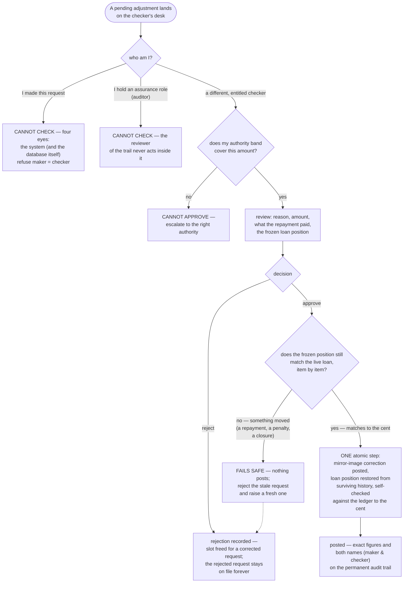

<!--
  P-DIAG user flow — CHECKER APPROVAL WORK (four-eyes queue)
  Authored against main @ 8f46aa54250ff1a066af423924f3eb54a9c72fb7
  by the P-DIAG drift MR. Business-facing (P-DIAG audience rule);
  code citations in the Source-of-truth footer.
  Drift rule: v1.2 rule 11 — any MR that changes a checker gate, the
  SoD rule or a drift outcome MUST update this file in the same MR.
-->

# User flow — the checker's day: four-eyes decisions

**Audience: business (checkers, branch managers, auditors).**

## The business rules this depicts

Some actions are too dangerous for one pair of hands. The checker is
the second pair of eyes on repayment adjustments (and the same
separation principle runs through write-off posting and exit/dividend
execution: the person who asked can never be the person who executes).
Three iron rules govern every item on the checker's desk: (1) **you
never check your own work** — the database itself refuses a checker
who was the maker; (2) **auditors never check** — whoever reviews the
trail must not act inside it; (3) **you approve the frozen figures,
not today's figures** — if reality moved since the request, the
approval fails safe: nothing posts, and the request must be redone
from scratch. Rejecting is always available and always safe: it frees
the request slot and leaves the rejected request on file forever.

The same separation principle elsewhere (each drawn in its own
diagram): a write-off's **requester** can neither vote on it nor post
it; an exit's or dividend's **initiator** cannot vote; a dividend's
**declarer** cannot run the payout.

## Source of truth (code citations, valid at `8f46aa5`)

| Flow step | Implementation |
|---|---|
| The pending queue item | `repayment_adjustments` row, `status = 'pending_approval'` (0025/0031); read via `GET /corrections/repayment-adjustments/{id}` (`api/corrections.py`, `RequirePermission(CORRECTIONS, VIEW)`) |
| Maker-cannot-check + auditor exclusion | `application/corrections.py:_require_distinct_non_assurance_checker` (role resolved server-side from users → roles, never the JWT); DB backstop `ck_repayment_adjustments_sod` (0031); `domain/rbac.py:ASSURANCE_ROLES` |
| Authority band | `application/tenant_settings.py:enforce_authority_band` — checked for the maker at request AND the checker at approval (A3, reuse 1.1) |
| Drift check, fails safe | `application/corrections.py:approve_repayment_adjustment` — frozen snapshot (balance / penalty_due / status) re-verified component-by-component under the full lock set (lock-order.md E24 → E20 → E21); 409 on drift posting NOTHING |
| The atomic posting step + self-check | storno via `application/ledger.py:post_reversal`; negative `repayments` twin (append-only, 0032); `_rebuild_schedule_paid_amounts`; `_reconstructed_balance` conservation check aborts everything on a cent of divergence |
| Rejection frees the slot | `application/corrections.py:reject_repayment_adjustment` — optimistic-locked checker decision; the partial UNIQUE `uq_repayment_adjustments_claim` (`WHERE status <> 'rejected'`) excludes rejected rows |
| Both names on the trail | `correction.repayment_adjusted` audit row carries maker, checker, before/after figures (`application/audit.py:record_audit`, in-transaction) |
| The separation principle elsewhere | write-off: `cast_write_off_vote` requester-vote ban + `post_write_off` requester-post ban; exit: `cast_exit_vote` initiator ban + `post_settlement` separation; dividends: `cast_dividend_vote` declarer ban + `distribute_dividend` declarer ≠ executor |
