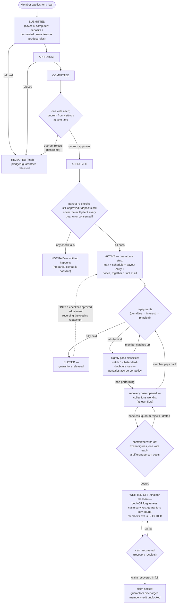

<!--
  P-DIAG user flow — LOAN LIFECYCLE (application to recovery)
  Authored against main @ 8f46aa54250ff1a066af423924f3eb54a9c72fb7
  by the P-DIAG drift MR. Business-facing (P-DIAG audience rule);
  code citations in the Source-of-truth footer.
  Drift rule: v1.2 rule 11 — any MR that changes a stage, a gate or a
  terminal state MUST update this file in the same MR.
-->

# User flow — the life of a loan

**Audience: business (loan officers, committee, managers, auditors).**

## The business rules this depicts

A loan moves through named stages and only ever forward: submitted →
appraisal → committee → approved → paid out (or rejected on the way).
The committee decides by one-vote-each quorum; payout is one
all-or-nothing step that re-checks approval, deposit cover and
guarantor consent at the moment the money moves. From then on the
nightly arrears process — not a person — classifies the loan by how
overdue it is, accrues penalties per the configured policy, and opens
the door to recovery work. A hopeless loan is written off by the
committee (never a keystroke), which removes it from the performing
book but does NOT forgive the member: the claim survives, guarantors
stay bound, exit is blocked, and cash that comes back enters through
recovery receipts until the claim clears. The one path backwards —
re-opening a closed loan — exists only when a checker-approved
adjustment reverses the repayment that closed it.

## Source of truth (code citations, valid at `8f46aa5`)

| Flow step | Implementation |
|---|---|
| Stage machine (submitted → … → disbursed, rejected) | `domain/lending.py:ApplicationStage` + its `_ALLOWED` transition map, executed under the application row lock (`application/loan_applications.py:transition_stage`); rejection sweep releases pledges (`_release_application_pledges`) |
| Cover % | `application/loan_applications.py` cover computation over deposits + `application/guarantees.py` pledges (product rules server-side) |
| Committee vote | `application/loan_applications.py:cast_vote` — [`sequence-committee-voting.md`](sequence-committee-voting.md); quorum `application/tenant_settings.py:committee_quorum` at vote time; approver authority band `enforce_authority_band` |
| Atomic payout + re-checks | `application/ledger.py:disburse_loan` — approval check, deposit-multiplier re-check under the row lock (issue #15), unconsented-pledge refusal, loan + schedule (`domain/lending` amortisation), LN- posting, outbox: ONE transaction (locks: lock-order.md E4/E5 → E15/E16) |
| Repayment + closure | `application/loans.py:record_repayment` / `_close_loan` — [`flow-teller-money-in.md`](flow-teller-money-in.md) |
| Nightly classification + penalties | `application/arrears.py:run_arrears_for_tenant` (`POST /jobs/arrears`, `api/loan_book.py`) — `domain/lending.py:classify` thresholds 30/90/180/360 dpd, provisioning 1/5/25/50/100%; penalty accrual per P13.7 config, idempotent claims (0019) |
| Recovery case | `application/recovery.py` — [`sequence-recovery-case-lifecycle.md`](sequence-recovery-case-lifecycle.md), [`flow-recovery-officer.md`](flow-recovery-officer.md) |
| Committee write-off | `application/corrections.py:request_write_off` / `cast_write_off_vote` / `post_write_off` — NPL-only prudential gate, write-once snapshot (0025), requester can neither vote nor post; dfd.md F12 |
| Write-off is not forgiveness | claim = `loan_write_offs.total_written_off` (write-once); exit block `application/member_exits.py:_compute_under_locks` (!51); guarantees untouched until full recovery (`application/corrections.py` module docstring, GUARANTEE DISPOSITION) |
| Recovery receipts → discharge | `application/corrections.py:record_recovery_receipt` — [`sequence-recovery-receipt.md`](sequence-recovery-receipt.md) |
| The one reopen edge | `domain/lending.py:_LOAN_ALLOWED` CLOSED → ACTIVE, adjustment-service-only — [`sequence-repayment-adjustment.md`](sequence-repayment-adjustment.md) |
