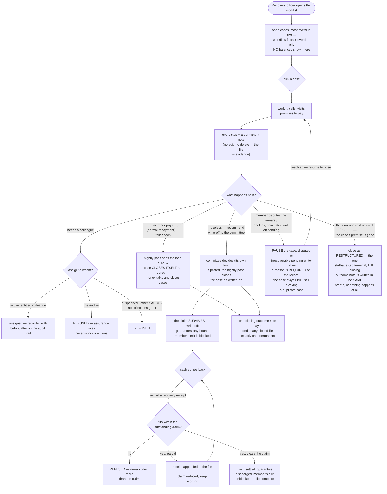

<!--
  P-DIAG user flow — RECOVERY-CASE OFFICER WORK
  Authored against main @ 8f46aa54250ff1a066af423924f3eb54a9c72fb7
  by the P-DIAG drift MR. Business-facing (P-DIAG audience rule);
  code citations in the Source-of-truth footer.
  As-built flip (!55 reconciliation, after !53 and !54 merged): pause
  dispositions, the staff-attested restructure close and the single
  outcome note (!53 / issue #23, 0033) drawn SOLID, with the !54
  hardening (pause reason required; restructure close writes the
  outcome note atomically) — verified against merged main code
  (v1.2 rule 11).
  Drift rule: v1.2 rule 11 — any MR that changes the worklist, the
  case rules or the receipt path MUST update this file in the same MR.
-->

# User flow — the recovery officer's day

**Audience: business (recovery officers, branch managers, auditors).**

## The business rules this depicts

Collections work runs on a worklist of open cases, most overdue first
— showing workflow facts and the overdue pill, never balances (those
live behind the loan screens, for the entitled). Every call, promise
and visit is a permanent note: the file is evidence. The officer can
never hand-declare a cure or a write-off — the loan's own facts close
those: cash cures it, or the committee writes the loan off. The case
can PAUSE without pretending to be workable (disputed, or hopeless
with the write-off still pending) — always with a reason on the
record — and the one staff-attested terminal, restructured, demands
its closing outcome note in the same breath. After a write-off, the officer's
job continues against the surviving claim: recovery receipts, one by
one, until the claim clears — which discharges the guarantors and
unblocks the member's exit in the same breath.

## Source of truth (code citations, valid at `8f46aa5`; disposition/outcome-note rows verified at merged main `d517769`)

| Flow step | Implementation |
|---|---|
| Worklist | `application/recovery.py:list_worklist` (`GET /recovery-cases`, `RequirePermission(LOAN_BOOK, VIEW)`) — keyset by days-past-due DESC, `idx_loans_dpd_worklist` (0026); least disclosure: no balance/penalty/provision columns |
| Permanent notes | `application/recovery.py:add_recovery_note` — append-only `recovery_case_notes` (0026); no edit/delete route exists (P13.16 addendum A2) |
| Assignment vetting | `application/recovery.py:assign_recovery_case` — ACTIVE same-tenant user with the collections grant (`application/rbac.py:actor_access`, `loan_book:view`); `domain/rbac.py:ASSURANCE_ROLES` excluded server-side; audited before/after |
| Job-only closes | `application/recovery.py:run_recovery_close_pass` inside the arrears run (`application/arrears.py:run_arrears_for_tenant`) via the single gatekeeper `domain/recovery.py:transition` — [`sequence-recovery-case-lifecycle.md`](sequence-recovery-case-lifecycle.md) |
| Committee write-off | `application/corrections.py` write-off workflow — [`flow-loan-lifecycle.md`](flow-loan-lifecycle.md), dfd.md F12 |
| Claim survives / exit blocked | `loan_write_offs` write-once snapshot (0025); `application/member_exits.py:_compute_under_locks` unresolved-claim guard (!51) — [`sequence-member-exit-claim-guard.md`](sequence-member-exit-claim-guard.md) |
| Recovery receipts | `application/corrections.py:record_recovery_receipt` (`POST /corrections/write-offs/{id}/recoveries`, `RequirePermission(CORRECTIONS, CREATE)`) — over-recovery refused (0030 constraint trigger backstop); receipts listed via `list_recovery_receipts` — [`sequence-recovery-receipt.md`](sequence-recovery-receipt.md) |
| Full-recovery discharge + exit unblock | `application/guarantees.py:release_guarantees_for_loan` in the receipt transaction; the F4 guard stops matching at receipts = total |
| Pause / resume / restructure close | `api/recovery.py`: `POST /recovery-cases/{id}/disposition` (`RequirePermission(LOAN_BOOK, EDIT)`) → `application/recovery.py:set_case_disposition` — every move via the single gatekeeper `domain/recovery.py:transition`; pauses (`PAUSE_STATUSES`) REQUIRE a `reason`, captured into the audit payload (!54); `closed_restructured` REQUIRES and atomically writes THE outcome note in the same transaction (!54); `closed_cured`/`closed_written_off` deliberately absent from `STAFF_DISPOSITION_TARGETS` — job-only; one-LIVE-case claim regenerated over the live set (`uq_recovery_cases_one_open`, 0033) |
| Outcome note | `api/recovery.py`: `POST /recovery-cases/{id}/outcome-note` → `application/recovery.py:add_outcome_note` — terminal-only, exactly one per case (`uq_recovery_notes_one_outcome` partial UNIQUE, 0033), append-only like every note |
