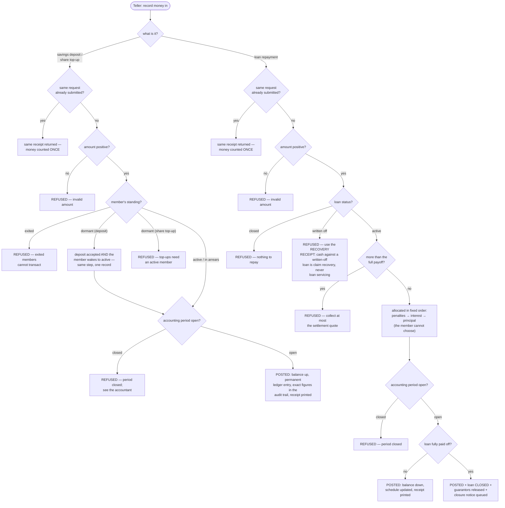

<!--
  P-DIAG user flow — TELLER MONEY-IN (deposit / loan repayment)
  Authored against main @ 8f46aa54250ff1a066af423924f3eb54a9c72fb7
  by the P-DIAG drift MR. Business-facing user-flow diagram
  (decision-diamond style, P-DIAG audience rule): every outcome the
  teller can see is drawn, incl. the refusals; code citations live in
  the Source-of-truth footer.
  Drift rule: v1.2 rule 11 — any MR that changes a refusal outcome or
  the allocation/reactivation behaviour MUST update this file.
-->

# User flow — teller money-in: deposit & loan repayment

**Audience: business (tellers, branch managers, auditors).**

## The business rules this depicts

Money in is welcome — but only through the front door, with every
refusal explicit. A deposit wakes a dormant member automatically. A
repayment always pays penalties first, then interest, then principal;
paying more than the full payoff is refused (collect at most the
settlement quote); and a written-off loan takes NO repayments — cash
against a written-off loan goes through the recovery receipt instead
(its own flow). Submitting the same transaction twice (double click,
network retry) produces exactly one effect and the same receipt.

## Source of truth (code citations, valid at `8f46aa5`)

| Flow step | Implementation |
|---|---|
| Duplicate-submission shield | `api/idempotency.py:IdempotencyMiddleware` — atomic claim per (tenant, actor, route+body); replay returns the stored response; expiry per 0029 |
| Deposit / top-up service | `application/transactions.py:record_deposit` / `record_share_topup` (routes `api/transactions.py`, `RequirePermission(TRANSACTIONS, CREATE)`, `extra="forbid"`) |
| Amount guards | `InvalidInputError` on non-positive amounts (`record_deposit` / `record_share_topup` / `application/loans.py:record_repayment`) |
| Member-standing gate | `application/transactions.py:_require_member` → `domain/members.py:member_may` (code-owned capability map: deposits allowed for active/arrears/dormant; top-ups active/arrears only; exited always refused) |
| Dormant wake-up | `application/members.py:reactivate_dormant_member` — inside the SAME deposit transaction (P13.13) |
| Period-closed refusal | `application/accounting_periods.py:assert_open_period`, called by every posting via `application/ledger.py:_post` (locks: lock-order.md E15 → E16) |
| Repayment allocation + overpayment refusal | `domain/lending.py:allocate_repayment` (penalties → interest → principal; amount > payoff rejected) via `application/loans.py:record_repayment` (loan row held: lock-order.md §3 repayment row) |
| Written-off refusal | `record_repayment` status guard (`is not LoanStatus.ACTIVE`); the recovery path is `application/corrections.py:record_recovery_receipt` — [`sequence-recovery-receipt.md`](sequence-recovery-receipt.md) |
| Closure + guarantor release | `application/loans.py:_close_loan` → `application/guarantees.py:release_guarantees_for_loan` (lock-order.md E7) |
| Receipts / audit / notices | balanced postings via `application/ledger.py` (append-only, 0004/0014 triggers); `application/audit.py:record_audit` (exact figures); `application/outbox.py:enqueue_event` |
