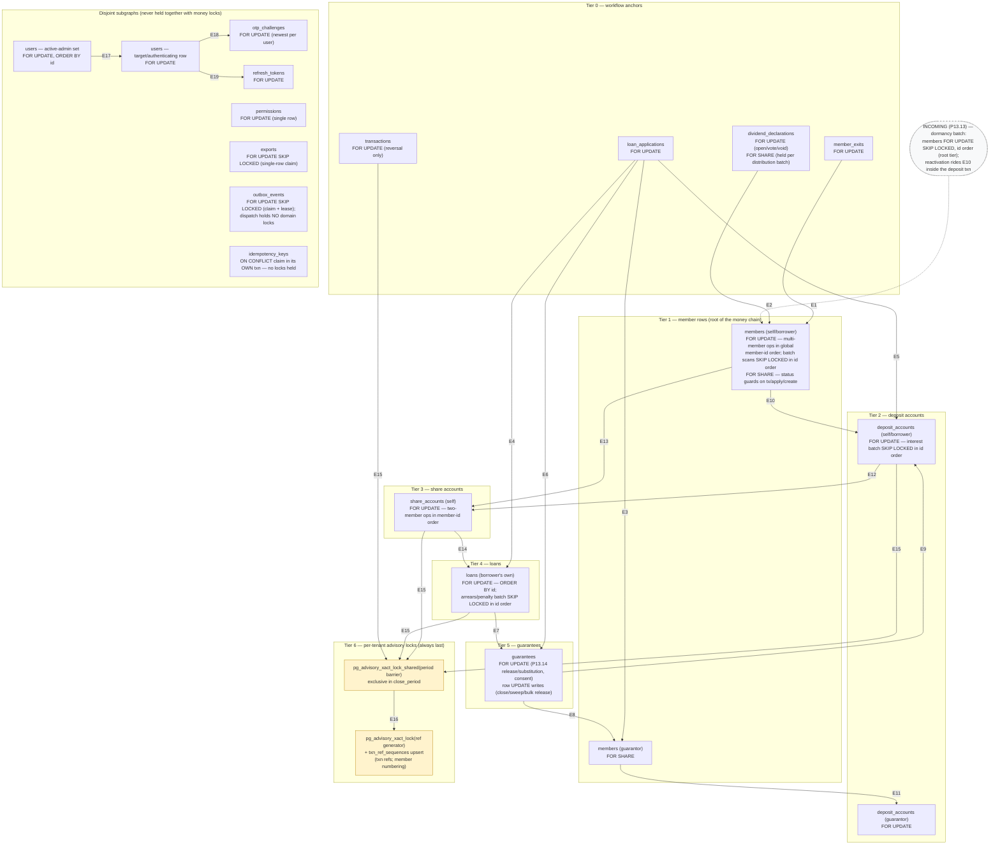

<!--
  P-DIAG.0 — AUTHORITATIVE lock-ordering DAG (Genesis Prestige backend)
  Authored against main @ bb220ad2a9056d6b0daecd646011216b20c5309d
  Status: as-built, derived from code (not from MR prose) — see §8.
  Drift rule: v1.2 rule 11 — any MR that adds/moves/removes a lock-graph
  edge MUST update this file in the same MR. This file is the single
  authority for every lock-order statement; MR descriptions must match
  it verbatim or update it in the same MR.
-->

# Lock-ordering DAG — the single authority (P-DIAG.0)

Every MR since P7 has re-stated the lock chains in prose. This file is
their one drift-governed home: **future prompts and MRs reference this
diagram instead of re-deriving the chains**. The default for every MR
is **"no new lock-graph edges"**; adding one requires updating this
file (edge + code citation + acyclicity note) in the same MR (v1.2
rule 11).

## 1. How to read this diagram

- **Nodes** are lock targets: table + lock mode + qualifier (`id
  order`, `SKIP LOCKED`). Nodes are **parameterised by actor** where
  the distinction carries the acyclicity proof: `members (self)` is the
  member whose own money moves; `members (guarantor)` is a *different*
  member reached through an application/loan anchor. Same table, but
  provably disjoint row sets per transaction (§4, Lemma 2).
- **Edges** mean **"taken while holding"**: an edge A → B exists when
  some transaction acquires lock B while still holding lock A. Each
  edge is annotated with every code path that creates it (§3).
- **Binding vs advisory-read**: solid edges are deadlock-relevant
  row/advisory locks. `FOR SHARE` guard locks are marked — they
  conflict with `FOR UPDATE` (that is their purpose) but not with each
  other. Plain MVCC snapshot reads (settings/config reads, capacity
  sums, dashboards) take **no** locks and never appear here — that is
  the !26/P13.9 convention, recorded in §7.
- **Dashed** elements are `INCOMING (Pn)` — claimed by a prompt that
  has not merged yet; the executing MR flips them to as-built (rule 11).

## 2. The DAG



## 3. Edges — every code path that takes them

Line numbers are valid at the authoring SHA
`bb220ad2a9056d6b0daecd646011216b20c5309d`; functions are the stable
citation.

| Edge | Taken while holding → acquires | Mode | Code sites (file:function) | Since |
|---|---|---|---|---|
| E1 | member_exits → members (self) | FU → FU | `application/member_exits.py:post_settlement` (exit row L714, then `_lock_member` L215) | P12 |
| E2 | dividend_declarations → members (self) | FS → FU SKIP LOCKED, id order | `application/dividends.py:distribute_dividend.process` (decl FOR SHARE L1141, then `members_scan_sql` L312 `FOR UPDATE OF m SKIP LOCKED ORDER BY m.id`) | !30 |
| E3 | loan_applications → members (guarantor) | FU → FS | `application/guarantees.py:pledge_guarantee` (app L177) → `_guarantor_available_capacity` (member FOR SHARE L129) | P9 |
| E4 | loan_applications → loans | FU → FU | `application/guarantees.py:_lock_release_anchor` (app L440, then loan L451). P7 disbursement locks the app and *creates* the loan (no second lock) — same direction, `application/ledger.py:disburse_loan` | P13.14 (!29) |
| E5 | loan_applications → deposit_accounts (borrower) | FU → FU | `application/ledger.py:disburse_loan` step 2b (deposit-multiplier check, L903) | P7/issue #15 |
| E6 | loan_applications → guarantees | FU → FU | `application/guarantees.py:release_guarantee` / `substitute_guarantee` (`_lock_release_anchor` then `_read_guarantee(for_update=True)` L410/L440). Row-write form: `loan_applications.py:_release_application_pledges` (rejection sweep, under the app lock) | P13.14 (!29) — see Finding F1 in §9 |
| E7 | loans → guarantees | FU → FU / row write | `application/guarantees.py:_lock_release_anchor` (loan-anchored release/substitution); `application/loans.py:_close_loan` → `release_guarantees_for_loan` (row UPDATE); `application/member_exits.py:post_settlement` received-guarantee sweep | P10 |
| E8 | guarantees → members (guarantor) | FU → FS | `application/guarantees.py:substitute_guarantee` (guarantee row locked, then `_guarantor_available_capacity`) | P13.14 (!29) |
| E9 | guarantees → deposit_accounts (borrower) | FU → FU | `application/guarantees.py:release_guarantee` cover guard (borrower deposit L585, after the release write) | P13.14 (!29) |
| E10 | members (self) → deposit_accounts (self) | FS/FU → FU | `application/transactions.py:record_deposit`/`record_withdrawal` (`_require_member` FOR SHARE L73 → `_lock_account` L102); `application/member_exits.py:_compute_under_locks`; `application/dividends.py:_distribute_one` (member held from the E2 scan) | P11/P12 |
| E11 | members (guarantor) → deposit_accounts (guarantor) | FS → FU | `application/guarantees.py:_guarantor_available_capacity` (L129 → L147) | P9 |
| E12 | deposit_accounts (self) → share_accounts (self) | FU → FU | `application/member_exits.py:_compute_under_locks` (deposit then share via `_lock_account`); `application/dividends.py:_distribute_one` (same order) | P12 |
| E13 | members (self) → share_accounts (self) | FS/FU → FU | `application/dividends.py:transfer_shares` (both members `sorted()` L1364, then both share accounts in the same member-id order L1379); `application/transactions.py:record_share_topup` (member FOR SHARE guard → share account, single member) — the deposit tier is skipped, which is always safe (§4) | P11/!30 |
| E14 | share_accounts (self) → loans (self, id order) | FU → FU | `application/member_exits.py:_compute_under_locks` → `_active_loan_payoffs` (`ORDER BY id FOR UPDATE` L258) | P12 |
| E15 | last row lock of any posting chain → advisory period barrier (shared) | row → advisory | `application/ledger.py:_post` → `accounting_periods.py:assert_open_period` (`pg_advisory_xact_lock_shared` L110) — called by EVERY posting: deposits/withdrawals/top-ups, disbursement, repayment, exit set-off, deposit interest, dividends/rebates, share transfer, reversal | issue #12 |
| E16 | advisory period barrier → advisory ref generator | advisory → advisory | `application/ledger.py:_post` (barrier first, then `_next_ref` `pg_advisory_xact_lock` L108 + `txn_ref_sequences` upsert). Member numbering (`members.py:_next_member_no` L91) takes ADVR with **no** row locks held | P7 |
| E17 | users (admin set, id order) → users (target) | FU → FU | `application/users.py:change_user_status` / `assign_role` / `update_user` (`_lock_admin_set` L467 → `_lock_user_row` L483) | P13.5 |
| E18 | users → otp_challenges | FU → FU | `application/auth.py:verify_otp` (user L179 → newest challenge L191); suspension voids challenges (row writes) under the same user lock (`users.py:_void_pending_otp_challenges`) | P13.5 |
| E19 | users → refresh_tokens | FU → FU | `application/auth.py:rotate_refresh_token` (unlocked peek → user L255 → token L270); suspension revokes families under the user lock (`users.py:_revoke_refresh_families`) | P13.5 |

**Single-node lockers** (no outgoing domain edges — they enter the DAG
and stop, or never touch it):

| Site | Lock | Code |
|---|---|---|
| Application stage / committee vote / create | APP alone; create takes MSELF FOR SHARE alone | `loan_applications.py:transition_stage` L408, `cast_vote` L498, `create_application` L219 |
| Exit vote / void | EXIT alone | `member_exits.py:cast_exit_vote` L495, `void_exit` L626 |
| Dividend vote / void / distribution-open | DECL alone | `dividends.py:cast_dividend_vote` L657, `void_declaration` L783, `distribute_dividend` opening txn L1091 |
| Guarantee consent | GUAR alone | `guarantees.py:consent_guarantee` L268 |
| Repayment (P10) | LOANS alone (mid-chain entry) → E7 on payoff (closure releases guarantees) → E15 | `loans.py:record_repayment` L309 |
| Arrears + penalty batch | LOANS alone, `ORDER BY l.id … FOR UPDATE OF l SKIP LOCKED`; **no ledger rows, no advisory** | `arrears.py:arrears_scan_sql` L223 |
| Deposit-interest batch | DSELF alone (SKIP LOCKED, id order) → E15/E16 posting | `deposit_interest.py:_accrue_batch` L231 |
| Ledger reversal | TXN → E15 | `ledger.py:reverse_transaction` L694 |
| Period close | ADVP **exclusive** only, then `ON CONFLICT` claim — no row locks | `accounting_periods.py:close_period` L159 |
| RBAC permission edit | PERM alone | `rbac.py:update_permission` L227 |
| Export claim | EXP single row SKIP LOCKED, then snapshot-consistent reads | `exports.py:CLAIM_SQL` L85 |
| Outbox claim | OBX SKIP LOCKED + lease, commit, dispatch **outside** any txn | `infrastructure/outbox_worker.py:dispatch_due` L67 |
| Idempotency claim | `ON CONFLICT DO NOTHING` in its **own** middleware txn before the handler — never holds domain locks | `api/idempotency.py` L137 |
| Settings read/write | **no row locks** (single-statement optimistic writes; consumers read config as plain MVCC snapshot while holding their own anchor lock) | `tenant_settings.py` (module docstring), the !26 convention |

## 4. Acyclicity — why this graph cannot deadlock

**Global tier order.** Within one transaction, locks are only ever
acquired downward through the tiers: workflow anchor (T0) → members
(T1) → deposit (T2) → share (T3) → loans (T4) → guarantees (T5) →
advisory (T6). Skipping tiers downward is safe (a chain that starts or
continues mid-chain — share top-up at T3, deposit-interest at T2,
repayment at T4 — still only moves down). Ties inside a tier are broken
by a **total order**: global member-id order for multi-member
operations (E13, the !30 rule), `ORDER BY id` for multi-row scans
(E2, E14, arrears, E17). All E1–E19 edges point downward **except two
upward edges out of the guarantees tier — E8 (→ guarantor member, T1)
and E9 (→ borrower deposit, T2)** — so any cycle would have to pass
through one of them. Each is safe for a different, checkable reason:

**The cross-actor edge E8 (and the guarantor continuation of E3):
borrower's anchor/guarantee → guarantor's member row.** A transaction
holding lower-tier locks (T0/T4/T5, the borrower's application/loan/
guarantee rows) acquires a higher-tier lock (T1, a member row). It is
safe because the target subgraph is **row-disjoint** from everything
held — the exact !29 argument, made checkable:

- *Lemma 1 (self-guarantee ban).* `guarantor_member_id ≠
  borrower_member_id` is enforced at pledge and substitution
  (`guarantees.py:pledge_guarantee`, `substitute_guarantee`). So the
  member row acquired via E3/E8 is never the borrower whose
  application/loan the transaction holds.
- *Lemma 2 (disjoint continuations).* From `members (guarantor)` the
  chain continues only to that guarantor's own deposit row (E11) and
  stops. For a cycle, some other transaction would have to hold the
  guarantor's member/deposit rows and wait on the borrower's
  application/loan/guarantee rows. The only paths holding a member row
  and reaching T4/T5 are the member's **own** chain (E10→E12→E14→E7:
  their own accounts, their own loans, guarantees *behind their own
  loans/borrowing*). By Lemma 1 the borrower's loan is never among the
  guarantor's own loans, and the guarantee rows swept by the
  guarantor's exit are those the guarantor *received* (borrower =
  guarantor), disjoint from the row being released/substituted
  (borrower = the other member). No shared row, no wait, no cycle.
- *The FOR SHARE discipline is what closes the remaining race:* a
  guarantor's exit (member FOR UPDATE) and a pledge/substitution
  (member FOR SHARE) conflict **at the member row, first**, so one
  always serialises behind the other before any deposit lock is
  contested. This is why E3/E8 take FOR SHARE *before* E11 — a path
  that took the guarantor's deposit without the member guard would
  reintroduce the TOCTOU the P9 chain closed.

**The cover-guard edge E9: guarantee row → borrower's deposit row.**
At the table level this closes a loop (deposit → share → loans →
guarantees via E12/E14/E7, guarantees → deposit via E9). It cannot
deadlock at the row level because of the **exit-eligibility guard**:

- E9 fires only in `release_guarantee`'s cover-guard branch — an
  **active** guarantee on an application in `_COVER_GUARDED_STAGES`
  (submitted/appraisal/committee/approved), decided **while holding the
  application anchor FOR UPDATE**, so the stage cannot move underneath
  it (a disbursed anchor is refused before E9 is reached).
- The only paths that hold the borrower's deposit/share rows and later
  wait on guarantee rows are the borrower's **exit settlement** (sweep
  + per-loan closure) and **repayment closure** (E7). The exit aborts
  at `_compute_under_locks` on its open-application eligibility check —
  `_OPEN_STAGES` is exactly the cover-guarded set — *before* touching
  any loan or guarantee row, rolling back and releasing its deposit/
  share locks; so whenever an E9-taking release can exist, the
  conflicting exit cannot reach the guarantee tier. Repayment closure
  only writes **loan-attached** guarantee rows, which are disjoint from
  the application-attached rows E9's branch locks (loan-attached
  releases/substitutions lock the loan anchor first, E4/E7 order, and
  serialise with repayment at T4).
- P11 transactions and !30 distribution hold deposit/share rows and
  then move only to the advisory tier (E15) — they never reach
  guarantees.

**Shared prefixes (members, deposit_accounts) cannot form a cycle** —
the !29/!30 prose, diagrammatic:

- *P12 settlement vs P11 transactions vs !30 distribution*: all three
  take the same member → deposit → share prefix in the same order; they
  contend at T1 and serialise there (or skip: SKIP LOCKED batches never
  wait at T1 at all).
- *!30 share transfer vs opposing transfer*: both member rows in global
  member-id order (E13), so A→B and B→A serialise instead of
  deadlocking; the share-account pair follows in the same member order.
- *!30 distribution vs share transfer / exit*: distribution's member
  scan is SKIP LOCKED — a member whose row a transfer/exit holds is
  skipped, and the account locks it takes (E10/E12) are only for
  members whose T1 row it holds, so no account-tier contention can
  invert the member-tier order.
- *P7 disbursement vs P12 exit (same borrower)*: disbursement holds APP
  and takes the borrower's deposit (E5) without the member row; exit
  holds the member row and waits on that deposit. Disbursement never
  waits on the member row (it only moves down to T6), so the wait is
  one-directional.
- *Anchors above the member tier*: the P12 exit row and the !30
  declaration row are locked **before** the member row (E1/E2) and
  nothing ever acquires them while holding T1+ locks (votes/voids lock
  the anchor alone), so T0 sits strictly above the chain.

**Advisory tier is terminal.** `_post` is the only taker of both
advisory locks and always in the order barrier → ref (E15→E16), after
every row lock of its caller; `close_period` takes the barrier
exclusively while holding **no** row locks; member numbering takes the
ref lock with no row locks. No code acquires a row lock after an
advisory lock, so the advisory tier cannot participate in a cycle.
Shared/exclusive on the same barrier key serialise close-vs-postings by
design (issue #12) without ordering violations.

**Disjoint subgraphs.** The auth/admin chain (E17–E19), permissions,
exports, outbox and the idempotency middleware never hold any T0–T6
money lock (verified by the catalogue in §3 — no site takes both). The
P13.5 orderings are internally consistent: the admin-set lock (id
order) is the serialisation point for user-status changes; verify/
rotate lock the user row **before** its challenge/token rows, matching
the suspension writer (the pre-P13.5 inverse order was a real
verify-vs-suspend deadlock, fixed in P13.5).

## 5. SKIP LOCKED — how it changes the waiting analysis

`FOR UPDATE SKIP LOCKED` sites (E2 member scan; arrears/penalty loans
scan; deposit-interest scan; exports claim; outbox claim) **do not
wait** at their scan tier — a locked row is skipped, not queued. Two
consequences the MRs rely on:

1. **They cannot deadlock at the scan tier** — no wait edge is ever
   created there. Deadlock analysis for batch jobs therefore reduces to
   the locks they take *after* the scan (E10/E12/E15/E16 for
   distribution and deposit-interest; none for arrears; none for
   exports/outbox).
2. **They trade waiting for incompleteness** — a skipped row is simply
   not processed this run. Every SKIP LOCKED job is therefore paired
   with an idempotent re-run guard (anti-join + `ON CONFLICT` claim,
   v1.1 rules 5/8) so the skipped row is picked up later: the !30
   `pending_members` reconciliation, the arrears "picked up next run"
   rule, the outbox lease. A SKIP LOCKED scan **without** a claimed
   re-run path would be a correctness bug, not just a liveness one.

Concurrent runners of the same job claim disjoint row sets via SKIP
LOCKED, so their downstream account locks are disjoint too (accounts
are per-member).

## 6. The advisory-lock tier

| Lock | Key | Takers | Position |
|---|---|---|---|
| Period barrier | `(_PERIOD_NS, tenant)` — `accounting_periods.py` L43/L77 | shared: every `_post`; exclusive: `close_period` | after all row locks (E15); close takes it with no row locks |
| Ref generator | `(_ADVISORY_NS, tenant⊕prefix)` — `ledger.py:_advisory_key` L75 | `_next_ref` (txn refs, per prefix); `members.py:_next_member_no` (GP- numbers, same `txn_ref_sequences` table) | last (E16); the `txn_ref_sequences` upsert row is serialised by it; UNIQUE constraint is the backstop |

Both are `pg_advisory_xact_lock*` — transaction-scoped, released at
commit/rollback, per-tenant keys so tenants never serialise each other.

## 7. Concurrent-prompt claims recorded at authoring (rule 11 landing zone)

- **P13.13 (dormancy) — INCOMING, claimed by its BUILD_PROMPTS section:**
  the dormancy batch locks member rows `FOR UPDATE SKIP LOCKED` in id
  order — the ROOT tier of the established chain (the !30 distribution
  precedent); reactivation-on-deposit already rides E10 inside the
  deposit transaction. **No new lock-graph edges.** The P13.13 MR flips
  the dashed node in §2 to as-built in the same MR (rule 11).
- **P13.9 (dashboard aggregates) — NO LOCKS, claimed by its section:**
  read-only MVCC snapshot reads, documented as advisory vs the binding
  gates; no new lock-graph edges. Nothing to draw; recorded here so the
  claim is checkable when the MR lands.
- **P13.15 (corrections/write-off), P19 (M-Pesa)** and later prompts:
  any lock they take must land as an edge here first-class, in the same
  MR.

## 8. Derivation & re-verification (falsifiable completeness)

Derived from code at `bb220ad2a9056d6b0daecd646011216b20c5309d`, not
from MR prose. Re-run and diff:

```sh
cd backend/src
grep -rniE "for update"            --include='*.py' . | wc -l   # 75
grep -rniE "for share"             --include='*.py' . | wc -l   # 12
grep -rniE "skip locked"           --include='*.py' . | wc -l   # 13
grep -rniE "for no key update"     --include='*.py' . | wc -l   # 0
grep -rniE "advisory"              --include='*.py' . | wc -l   # 28
grep -rniE "for update|for share|for no key update|skip locked|advisory" \
                                   --include='*.py' . | wc -l   # 118
```

The 118 matches include comments/docstrings restating the chains; the
**49 executable SQL lock sites** (lines inside `text()` literals
matching `FOR UPDATE|FOR SHARE|SKIP LOCKED|pg_advisory`) are what §3
catalogues — every one of them maps to an edge, a single-node locker,
or the advisory tier above. `FOR NO KEY UPDATE` is not used anywhere.
A new grep hit that maps to none of §3's rows means this file is stale
and the MR introducing it is rejected until it updates this file
(v1.2 rule 11).

## 9. Cross-check: MR prose vs code-derived DAG (P-DIAG.0 step 3)

Every lock-order statement in the merged MR descriptions !17, !26,
!28, !29, !30 was checked against the code-derived graph.

| MR | Claimed order | Code-derived | Verdict |
|---|---|---|---|
| !17 (P11) | "lock the account row → validate → post"; withdrawal capacity under the same deposit-account row lock P9 takes; interest job `FOR UPDATE SKIP LOCKED` | E10 (member FOR SHARE guard was added by P12-era hardening and is part of the as-built chain), E15/E16; `deposit_interest.py` L231 | **Match** |
| !26 (P13.7) | settings service takes no row locks; consumers read config as MVCC snapshot while already holding their own application/exit row lock; no new edge | `tenant_settings.py` docstring + `committee_quorum` call sites under APP/EXIT/DECL locks | **Match** |
| !28 (P13.8) | job locks **loans only**, `ORDER BY l.id … FOR UPDATE OF l SKIP LOCKED`; loans is the terminal node of the settlement chain; config read lock-free | `arrears.py` L223; no further locks, no ledger rows | **Match.** Refinement: "terminal" holds for the *named* chain — the as-built graph has guarantee row **writes** (E7) and the advisory tier (E15/E16) below loans on *other* paths; the arrears job itself touches neither |
| !29 (P13.14) | "application/loan row → guarantor member FOR SHARE → guarantor deposit account FOR UPDATE — the established pledge chain; **no new lock-graph edges**"; cover guard at "application → borrower deposit" (the P7 position) | Code additionally takes the **guarantee row FOR UPDATE** between the anchor and the rest of the chain (`_read_guarantee(for_update=True)` after `_lock_release_anchor`): the as-built chains are anchor → **guarantees** → guarantor member → guarantor deposit (substitution, E6/E7→E8→E11) and anchor → **guarantees** → borrower deposit (release, E6/E7→E9). E4 (app → loan) is also first *locked* (vs created) here | **FINDING F1 — prose-vs-code divergence, documentation-level.** The !29 verbatim chain omits the guarantee-row lock its own code takes (the MR's code comments do state it). **Not an ordering bug**: every path locking a guarantee row takes it after the borrower's anchor (E6/E7) or alone (consent), so the tier order stands and no cycle is possible — verified in §4. No code change needed (docs-only prompt); no blocker issue required. Disposition: this file now records E6/E8/E9 as the authoritative chain; future restatements must include the guarantees tier |
| !30 (P13.11) | batch scans lock the root tier `FOR UPDATE SKIP LOCKED` in id order; two-member ops lock member rows in global member-id order, then share accounts in the same order; distribution: declaration FOR SHARE per batch → member → deposit → share (the P12 chain prefix); DV-/ST- refs via the advisory generator | E2, E13, E10→E12, E15/E16 — `dividends.py` L312/L1141/`_distribute_one`/`transfer_shares` | **Match** |

**Findings summary: one documentation-level divergence (F1, !29), zero
ordering bugs, zero blocker issues.** The graph as built is acyclic
(§4).

## 10. Rules for future MRs (binding, v1.2 rule 11)

1. **Default: no new lock-graph edges.** State it in the MR description
   (the !28/!29 precedent) — with this file as the reference, the claim
   is now checkable: re-run §8, diff against §3.
2. **Adding/moving/removing an edge requires updating THIS file in the
   same MR**: the §2 diagram, the §3 edge row (with code citations),
   and a §4 note proving the tier order (or the disjointness lemma)
   still holds. A stale diagram is a rejected MR.
3. **Restatements must match this file verbatim** — including the
   guarantees tier (Finding F1) — or update it in the same MR.
4. **New SKIP LOCKED scans** must name their idempotent re-run path
   (§5) in the same MR.
5. **New advisory locks** get a §6 row; they must remain terminal
   (no row lock is ever acquired after an advisory lock).
6. **INCOMING claims** (§7) are flipped to as-built by the executing
   MR, never left dashed after merge.
