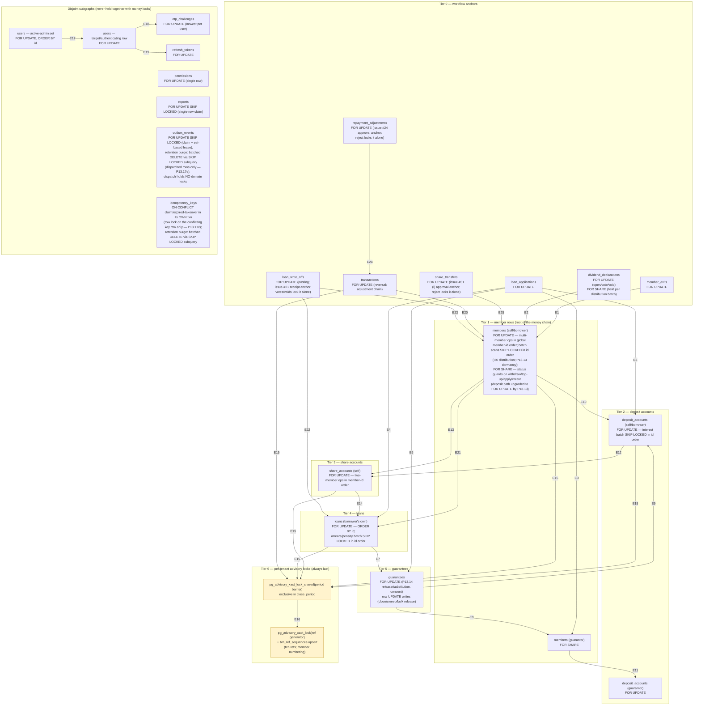

<!--
  P-DIAG.0 — AUTHORITATIVE lock-ordering DAG (Genesis Prestige backend)
  Authored against main @ bb220ad2a9056d6b0daecd646011216b20c5309d
  Status: as-built, derived from code (not from MR prose) — see §8.
  Drift rule: v1.2 rule 11 — any MR that adds/moves/removes a lock-graph
  edge MUST update this file in the same MR. This file is the single
  authority for every lock-order statement; MR descriptions must match
  it verbatim or update it in the same MR.
-->

# Lock-ordering DAG — the single authority (P-DIAG.0)

Every MR since P7 has re-stated the lock chains in prose. This file is
their one drift-governed home: **future prompts and MRs reference this
diagram instead of re-deriving the chains**. The default for every MR
is **"no new lock-graph edges"**; adding one requires updating this
file (edge + code citation + acyclicity note) in the same MR (v1.2
rule 11).

## 1. How to read this diagram

- **Nodes** are lock targets: table + lock mode + qualifier (`id
  order`, `SKIP LOCKED`). Nodes are **parameterised by actor** where
  the distinction carries the acyclicity proof: `members (self)` is the
  member whose own money moves; `members (guarantor)` is a *different*
  member reached through an application/loan anchor. Same table, but
  provably disjoint row sets per transaction (§4, Lemma 2).
- **Edges** mean **"taken while holding"**: an edge A → B exists when
  some transaction acquires lock B while still holding lock A. Each
  edge is annotated with every code path that creates it (§3).
- **Binding vs advisory-read**: solid edges are deadlock-relevant
  row/advisory locks. `FOR SHARE` guard locks are marked — they
  conflict with `FOR UPDATE` (that is their purpose) but not with each
  other. Plain MVCC snapshot reads (settings/config reads, capacity
  sums, dashboards) take **no** locks and never appear here — that is
  the !26/P13.9 convention, recorded in §7.
- **Dashed** elements are `INCOMING (Pn)` — claimed by a prompt that
  has not merged yet; the executing MR flips them to as-built (rule 11).

## 2. The DAG



## 3. Edges — every code path that takes them

Line numbers were authored at
`bb220ad2a9056d6b0daecd646011216b20c5309d` and re-verified (updated
where P13.13's !32 shifted them) for the as-built pass at
`5922b924c68c5ac18e0b097f944855a5786ea268`; functions are the stable
citation.

| Edge | Taken while holding → acquires | Mode | Code sites (file:function) | Since |
|---|---|---|---|---|
| E1 | member_exits → members (self) | FU → FU | `application/member_exits.py:post_settlement` (exit row L717, then `_lock_member` L216) | P12 |
| E2 | dividend_declarations → members (self) | FS → FU SKIP LOCKED, id order | `application/dividends.py:distribute_dividend.process` (decl FOR SHARE L1142, then `members_scan_sql` L313 `FOR UPDATE OF m SKIP LOCKED ORDER BY m.id`) | !30 |
| E3 | loan_applications → members (guarantor) | FU → FS | `application/guarantees.py:pledge_guarantee` (app L182) → `_guarantor_available_capacity` (member FOR SHARE L130) | P9 |
| E4 | loan_applications → loans | FU → FU | `application/guarantees.py:_lock_release_anchor` (app L445, then loan L456). P7 disbursement locks the app and *creates* the loan (no second lock) — same direction, `application/ledger.py:disburse_loan` | P13.14 (!29) |
| E5 | loan_applications → deposit_accounts (borrower) | FU → FU | `application/ledger.py:disburse_loan` step 2b (deposit-multiplier check, L903) | P7/issue #15 |
| E6 | loan_applications → guarantees | FU → FU | `application/guarantees.py:release_guarantee` / `substitute_guarantee` (`_lock_release_anchor` then `_read_guarantee(for_update=True)` L415/L445). Row-write form: `loan_applications.py:_release_application_pledges` (rejection sweep, under the app lock) | P13.14 (!29) — see Finding F1 in §9 |
| E7 | loans → guarantees | FU → FU / row write | `application/guarantees.py:_lock_release_anchor` (loan-anchored release/substitution); `application/loans.py:_close_loan` → `release_guarantees_for_loan` (row UPDATE); `application/member_exits.py:post_settlement` received-guarantee sweep; `application/corrections.py:record_recovery_receipt` → `release_guarantees_for_loan` (issue #21 full-recovery discharge, row UPDATE under the loan lock) | P10 |
| E8 | guarantees → members (guarantor) | FU → FS | `application/guarantees.py:substitute_guarantee` (guarantee row locked, then `_guarantor_available_capacity`) | P13.14 (!29) |
| E9 | guarantees → deposit_accounts (borrower) | FU → FU | `application/guarantees.py:release_guarantee` cover guard (borrower deposit L590, after the release write) | P13.14 (!29) |
| E10 | members (self) → deposit_accounts (self) | FU/FS → FU | `application/transactions.py:record_deposit` — member **FOR UPDATE** since P13.13 (!32 upgraded it from FOR SHARE: a deposit may have to write a Dormant→Active reactivation, and taking FOR UPDATE from the start avoids the share→update lock upgrade that would deadlock two concurrent deposits to the same dormant member): `_require_member(for_update=True)` L182 → `_lock_account` L124; `record_withdrawal` still takes member FOR SHARE (call L233 → `_lock_account`) — the two modes coexist safely, conflicting at the member row (§4); `application/member_exits.py:_compute_under_locks`; `application/dividends.py:_distribute_one` (member held from the E2 scan) | P11/P12; deposit-path mode upgraded by P13.13 (!32) |
| E11 | members (guarantor) → deposit_accounts (guarantor) | FS → FU | `application/guarantees.py:_guarantor_available_capacity` (L130 → L152) | P9 |
| E12 | deposit_accounts (self) → share_accounts (self) | FU → FU | `application/member_exits.py:_compute_under_locks` (deposit then share via `_lock_account`); `application/dividends.py:_distribute_one` (same order) | P12 |
| E13 | members (self) → share_accounts (self) | FS/FU → FU | `application/dividends.py:transfer_shares` (both members `sorted()` L1365, then both share accounts in the same member-id order L1384); `application/transactions.py:record_share_topup` (member FOR SHARE guard → share account, single member) — the deposit tier is skipped, which is always safe (§4) | P11/!30 |
| E14 | share_accounts (self) → loans (self, id order) | FU → FU | `application/member_exits.py:_compute_under_locks` → `_active_loan_payoffs` (`ORDER BY id FOR UPDATE` L259) | P12 |
| E15 | last row lock of any posting chain → advisory period barrier (shared) | row → advisory | `application/ledger.py:_post` → `accounting_periods.py:assert_open_period` (`pg_advisory_xact_lock_shared` L110) — called by EVERY posting: deposits/withdrawals/top-ups, disbursement, repayment, exit set-off, deposit interest, dividends/rebates, share transfer, reversal, P13.15 misc fees / adjustment reversals / write-off postings, issue-#21 recovery receipts | issue #12 |
| E16 | advisory period barrier → advisory ref generator | advisory → advisory | `application/ledger.py:_post` (barrier first, then `_next_ref` `pg_advisory_xact_lock` L108 + `txn_ref_sequences` upsert). Member numbering (`members.py:_next_member_no` L91) takes ADVR with **no** row locks held | P7 |
| E17 | users (admin set, id order) → users (target) | FU → FU | `application/users.py:change_user_status` / `assign_role` / `update_user` (`_lock_admin_set` L467 → `_lock_user_row` L483) | P13.5 |
| E18 | users → otp_challenges | FU → FU | `application/auth.py:verify_otp` (user L179 → newest challenge L191); suspension voids challenges (row writes) under the same user lock (`users.py:_void_pending_otp_challenges`) | P13.5 |
| E19 | users → refresh_tokens | FU → FU | `application/auth.py:rotate_refresh_token` (unlocked peek → user L255 → token L270); suspension revokes families under the user lock (`users.py:_revoke_refresh_families`) | P13.5 |
| E20 | transactions → members (self) | FU → FS | `application/corrections.py:_lock_adjustment_chain` (original txn FOR UPDATE — serialises against generic reversal and concurrent adjustment workflows — then member FOR SHARE, holding off a concurrent terminal exit; shared VERBATIM by the issue-#24 maker request and checker approval, the P12 snapshot-bind-reverify discipline) | P13.15; #24 |
| E21 | members (self) → loans (self) | FS → FU | `application/corrections.py:_lock_adjustment_chain` (member FOR SHARE from E20, then the loan row — the deposit/share tiers are skipped, which is always safe, §4); `application/corrections.py:record_recovery_receipt` (issue #21 — member FOR SHARE from E23, then the written-off loan row) | P13.15; #21 |
| E22 | loan_write_offs → loans | FU → FU | `application/corrections.py:post_write_off` (snapshot row FOR UPDATE, then the loan row for the component re-verification + terminal transition); `application/corrections.py:record_recovery_receipt` (issue #21 — snapshot row FOR UPDATE pinning the claim math, then the loan row via the E23→E21 chain, anchoring the full-recovery guarantee release in E7 order) | P13.15; #21 |
| E23 | loan_write_offs → members (self) | FU → FS | `application/corrections.py:record_recovery_receipt` (issue #21 — the claim anchor is locked FIRST, then the member FOR SHARE via `transactions._require_member` holds off a concurrent terminal exit; the exit's unresolved-claim guard in `member_exits._compute_under_locks` relies on this conflict at T1) | #21 |
| E24 | repayment_adjustments → transactions | FU → FU | `application/corrections.py:approve_repayment_adjustment` (issue #24 — the pending adjustment row is locked FIRST as the workflow anchor, the WOFF/E22 shape; the approval then retakes the full E20/E21 chain via `_lock_adjustment_chain` for the snapshot re-verification). Nothing anywhere acquires an adjustment row while holding T0+ locks: the maker's request INSERTs it as a plain write under the E20/E21 chain, and rejection locks the adjustment row ALONE (§3 single-node rows) | #24 |
| E25 | share_transfers → members (self) | FU → FU | `application/dividends.py:approve_share_transfer` (issue #31 (l) — the pending transfer row is locked FIRST as the workflow anchor, the ADJ/E24 shape; the approval then retakes the FULL transfer chain via `_lock_transfer_chain`, shared VERBATIM with the maker's request: BOTH member rows FOR UPDATE in global member-id order via `_lock_member_status`, then both share accounts FOR UPDATE in the same member order via `_lock_account` — the existing E13 hop — for the component-by-component snapshot re-verification). Nothing anywhere acquires a share_transfers row while holding T0+ locks: the maker's request (`request_share_transfer`) INSERTs the pending row as a plain write under the same chain, and rejection locks the transfer row ALONE (§3 single-node rows) | #31 (l) |

**Single-node lockers** (no outgoing domain edges — they enter the DAG
and stop, or never touch it):

| Site | Lock | Code |
|---|---|---|
| Application stage / committee vote / create | APP alone; create takes MSELF FOR SHARE alone | `loan_applications.py:transition_stage` L413, `cast_vote` L503, `create_application` L220 |
| Exit vote / void | EXIT alone | `member_exits.py:cast_exit_vote` L498, `void_exit` L629 |
| Dividend vote / void / distribution-open | DECL alone | `dividends.py:cast_dividend_vote` L658, `void_declaration` L784, `distribute_dividend` opening txn L1092 |
| Guarantee consent (both principals, P14.5) | GUAR alone | `guarantees.py:_lock_pledged_guarantee` (via `_read_guarantee(for_update=True)`) — the ONE pledged→active lock shared by `consent_guarantee_as_member` and the staff-attested `consent_guarantee_override`; the member path's credential→member link re-check under the held row is a plain MVCC read (`member_auth.live_credential_by_id`), no lock |
| Member OTP verify (P14.5) | member OTP challenge row alone | `member_auth.py:verify_member_otp` L211 — the E18 analogue WITHOUT the leading principal-row lock: credential revocation never writes challenge rows (unlike staff suspension), so there is no verify-vs-revoke lock ordering to defend; liveness is re-checked per use instead |
| Member refresh rotation (P14.5) | member refresh token row alone | `member_auth.py:rotate_member_refresh_token` L287 — the E19 analogue WITHOUT the leading principal-row lock (same reasoning as the verify row; the pre-lock credential liveness check is an unlocked MVCC read) |
| Member credential link create/revoke (P14.5) | MSELF alone (chain ROOT) | `member_identity.py:_lock_member` L87 — the recovery-case-open single-node pattern at the ROOT tier: create/revoke serialise per member under the held row and perform only plain writes on member_credentials beneath it; **nothing below T1 is acquired**. Conflicts with a terminal exit at T1 by design |
| Repayment (P10) | LOANS alone (mid-chain entry) → E7 on payoff (closure releases guarantees) → E15 | `loans.py:record_repayment` L309 |
| Arrears + penalty batch | LOANS alone, `ORDER BY l.id … FOR UPDATE OF l SKIP LOCKED`; **no ledger rows, no advisory** | `arrears.py:arrears_scan_sql` L223 |
| Recovery case open (P13.16) | LOANS alone (mid-chain entry at the terminal node, the repayment pattern): NPL check + classification/dpd snapshot under the loan FOR UPDATE; the case row is INSERTed via the ON CONFLICT claim — **no case-row lock, nothing below T4, no ledger rows, no advisory** | `recovery.py:open_recovery_case` |
| Recovery case mutations (P13.16; issue #23) | recovery_cases row ALONE: assign/note/disposition/outcome-note take the case FOR UPDATE; the arrears close pass scans `ORDER BY c.id … FOR UPDATE OF c SKIP LOCKED` (issue #23: over ALL live statuses, not only open) — the joined loans row is read **without** a lock (the job's own persisted classification, MVCC); assignee validation reads users/permissions with **no** locks | `recovery.py:assign_recovery_case` / `set_case_disposition` / `add_recovery_note` / `add_outcome_note` / `close_scan_sql` |
| Dormancy batch (P13.13) | MSELF alone, `ORDER BY m.id … FOR UPDATE OF m SKIP LOCKED` (root tier, id order); the transition UPDATE, audit row and outbox INSERT happen under the held member row — **no ledger rows, no advisory, nothing below T1**. Reactivation is NOT this job: it rides E10 inside `record_deposit` | `dormancy.py:dormancy_scan_sql` L215; the worker cycle (`infrastructure/dormancy_worker.py`) takes no locks |
| Deposit-interest batch | DSELF alone (SKIP LOCKED, id order) → E15/E16 posting | `deposit_interest.py:_accrue_batch` L231 |
| Ledger reversal | TXN → E15 | `ledger.py:reverse_transaction` L694 |
| Share-transfer reject (issue #31 (l)) | STFR alone (the ADJ/DECL void pattern): the pending row FOR UPDATE, the SoD checks and the optimistic-locked (version-pinned) decision UPDATE under it — **no money locks, nothing posts**; the mandatory rationale is audit metadata | `dividends.py:reject_share_transfer` |
| Adjustment reject (issue #24) | ADJ alone (the DECL/WOFF void pattern): the pending row FOR UPDATE, the optimistic-locked decision UPDATE under it — **no money locks, nothing posts** | `corrections.py:reject_repayment_adjustment` |
| Period close | ADVP **exclusive** (no row locks held when taken), then `ON CONFLICT` claim; the P13.17(a)/(b) writers run inside the same transaction: snapshot + rollup INSERT claims, whose 0028 late-insert fence probes the period row `FOR SHARE`, then the `rollup_at` marker UPDATE (implicitly `FOR NO KEY UPDATE`) — every one of these row locks is on the period row THIS transaction just inserted (invisible to every other transaction), so no cross-transaction wait can follow the advisory lock (§4 terminality note) | `accounting_periods.py:close_period` L159, `period_rollups.py:write_period_rollups` |
| Rollup backfill (P13.17b) | accounting_periods single row `FOR UPDATE SKIP LOCKED` (oldest closed-but-unrolled), one period per short transaction via the shared batch runner; the writer's fence `FOR SHARE` + marker UPDATE then hit the row the transaction already holds (self, no wait). Re-run path (§5): a fully rolled tenant matches zero rows, locks nothing, writes nothing | `period_rollups.py:ROLLUP_BACKFILL_SCAN_SQL` L239 |
| Snapshot writer/backfill (P13.17a) | **no row locks** — ON CONFLICT claim + MVCC reconstruction reads only; divergence 409s loudly (FM1) | `portfolio_snapshots.py:write_month_snapshot` |
| Late-insert fence (0028 trigger, P13.17b N3) | direct-SQL INSERT into either rollup table takes accounting_periods `FOR SHARE` (the fence's locking probe) and STOPS — a single-node locker for third parties; it conflicts with the marker UPDATE's `FOR NO KEY UPDATE` (deliberately NOT `FOR KEY SHARE`, which would not conflict), serialising fabricators against completion | migration `0028_period_rollups.py:forbid_late_period_rollup_insert` |
| Claim-cap locking probe (0034 trigger, !51 review N1) | any INSERT into loan_recoveries takes the parent loan_write_offs row `FOR UPDATE` inside the constraint trigger and STOPS — a single-node locker for direct-SQL third parties (no advisory lock is held on that path), serialising them on the claim anchor so the cap SUM always sees every committed competitor. The SERVICE path re-acquires the exact WOFF lock its own anchor-first chain already holds (E22/E23) — a self-owned lock, no wait edge (§4 advisory-terminality qualifier) | migration `0034_recovery_claim_cap_lock.py:check_recovery_within_claim` |
| RBAC permission edit | PERM alone | `rbac.py:update_permission` L227 |
| Export claim | EXP single row SKIP LOCKED, then snapshot-consistent reads | `exports.py:CLAIM_SQL` L85 |
| Outbox claim | OBX SKIP LOCKED + lease (ONE set-based UPDATE per batch since P13.17e), commit, dispatch **outside** any txn | `infrastructure/outbox_worker.py:dispatch_due` |
| Outbox retention purge (P13.17e) | OBX batched DELETE, at most batch_size rows per txn claimed via a `FOR UPDATE SKIP LOCKED` subquery — dispatched rows ONLY (pending/dead exempt by status); no other table touched | `infrastructure/outbox_worker.py:purge_dispatched` |
| Idempotency claim | `ON CONFLICT DO NOTHING` in its **own** middleware txn before the handler — never holds domain locks | `api/idempotency.py` L137 |
| Settings read/write | **no row locks** (single-statement optimistic writes; consumers read config as plain MVCC snapshot while holding their own anchor lock) | `tenant_settings.py` (module docstring), the !26 convention |

## 4. Acyclicity — why this graph cannot deadlock

**Global tier order.** Within one transaction, locks are only ever
acquired downward through the tiers: workflow anchor (T0) → members
(T1) → deposit (T2) → share (T3) → loans (T4) → guarantees (T5) →
advisory (T6). Skipping tiers downward is safe (a chain that starts or
continues mid-chain — share top-up at T3, deposit-interest at T2,
repayment at T4 — still only moves down). Ties inside a tier are broken
by a **total order**: global member-id order for multi-member
operations (E13, the !30 rule), `ORDER BY id` for multi-row scans
(E2, E14, arrears, E17). All E1–E25 edges point downward **except two
upward edges out of the guarantees tier — E8 (→ guarantor member, T1)
and E9 (→ borrower deposit, T2)** — so any cycle would have to pass
through one of them. Each is safe for a different, checkable reason.
(E24 is an intra-T0 edge, ADJ → TXN; ADJ sits strictly ABOVE the TXN
anchor in the total order — the dedicated paragraph below.)

**The P13.15 edges (E20/E21/E22) are strictly downward and
anchor-first.** E20 (TXN, T0 → member, T1) and E21 (member, T1 →
loans, T4 — a skip-tier hop, always safe) form the adjustment chain:
the TXN anchor is locked FIRST, and nothing anywhere acquires a
transactions row while holding T1+ locks (`reverse_transaction` locks
TXN alone; the adjustment locks TXN before anything else), so no wait
can point back up into T0. E22 (WOFF, T0 → loans, T4) mirrors E1/E4:
votes and voids lock the WOFF anchor alone (the DECL discipline), and
nothing acquires a loan_write_offs row while holding T1+ locks
(`request_write_off` inserts the snapshot under the loan lock — a
plain write, not a lock on WOFF). The member FOR SHARE in E20→E21
conflicts with a terminal exit's member FOR UPDATE (E1) exactly like
the P9/P11 guard chains, so adjustment-vs-exit serialises at T1 before
any loan-tier contention; adjustment-vs-repayment serialises at T4
(repayment is a LOANS-alone single-node locker).

**The issue-#21 edge E23 (WOFF, T0 → member, T1) is strictly downward
and anchor-first, the exact E20 shape.** The recovery receipt locks
the WOFF anchor FIRST (serialising concurrent receipts so the
outstanding-claim math never races), then the member FOR SHARE (E23),
then the written-off loan (the existing E21 hop), then guarantees on
the full-recovery discharge (the existing E7 row write) — every hop
downward. Nothing anywhere acquires a loan_write_offs row while
holding T1+ locks (the E22 argument verbatim: `request_write_off`
inserts the snapshot under the loan lock — a plain write, not a lock
on WOFF; votes/voids lock WOFF alone), so no wait can point back up
into T0. The member FOR SHARE conflicts with a terminal exit's member
FOR UPDATE (E1) at T1 — receipt-vs-exit serialises there, which is
precisely what the issue-#21 unresolved-claim exit guard
(`member_exits._compute_under_locks`) relies on: whichever wins, the
loser re-reads a committed claim position.

**The issue-#24 edge E24 (ADJ, above T0 → TXN, T0) is anchor-first
and cannot close a cycle.** The maker-checker approval locks the
PENDING adjustment row FIRST (the workflow anchor — the WOFF/E22
discipline), then retakes the established E20/E21 chain for the
snapshot re-verification. ADJ sits strictly above the TXN anchor
because nothing anywhere acquires a repayment_adjustments row lock
while holding a transactions (or lower) lock: the maker's request
INSERTs the adjustment as a plain write under the E20/E21 chain (the
`request_write_off` argument verbatim — an INSERT is not a lock on an
existing row), rejection locks the adjustment row ALONE (§3
single-node rows), and the approval's own decision UPDATE hits the
row it already holds. So every wait involving ADJ points strictly
downward into the existing acyclic chain, and E24 extends the total
order upward without creating any return path.

**The issue-#31 edge E25 (STFR, T0 → members, T1) is anchor-first
and strictly downward — the exact E24/WOFF discipline.** The
checker's approval locks the PENDING share_transfers row FIRST (the
workflow anchor), then retakes the FULL transfer chain via
`_lock_transfer_chain` (shared verbatim with the maker's request):
both member rows FOR UPDATE in global member-id order, then both
share accounts in the same member order — the existing E13 hop — for
the component-by-component snapshot re-verification. STFR sits
strictly above the member tier because nothing anywhere acquires a
share_transfers row lock while holding member/account (or any other)
locks: the maker's request INSERTs the pending row as a plain write
UNDER the member/account chain (an INSERT is not a lock on an
existing row), rejection locks the transfer row ALONE (§3
single-node rows), and the approval's one-shot decision UPDATE hits
the row it already holds. Opposing concurrent approvals (A→B racing
B→A) hold two DIFFERENT anchors and then serialise on the id-ordered
member locks (the E13 total order) — no wait cycle is representable
(falsifiable test: `tests/test_share_transfers.py::
test_fm4_opposing_concurrent_approvals_do_not_deadlock_exactly_one_posts`).
E25 extends the DAG downward from a source-only node; acyclicity is
preserved.

**The cross-actor edge E8 (and the guarantor continuation of E3):
borrower's anchor/guarantee → guarantor's member row.** A transaction
holding lower-tier locks (T0/T4/T5, the borrower's application/loan/
guarantee rows) acquires a higher-tier lock (T1, a member row). It is
safe because the target subgraph is **row-disjoint** from everything
held — the exact !29 argument, made checkable:

- *Lemma 1 (self-guarantee ban).* `guarantor_member_id ≠
  borrower_member_id` is enforced at pledge and substitution
  (`guarantees.py:pledge_guarantee`, `substitute_guarantee`). So the
  member row acquired via E3/E8 is never the borrower whose
  application/loan the transaction holds.
- *Lemma 2 (disjoint continuations).* From `members (guarantor)` the
  chain continues only to that guarantor's own deposit row (E11) and
  stops. For a cycle, some other transaction would have to hold the
  guarantor's member/deposit rows and wait on the borrower's
  application/loan/guarantee rows. The only paths holding a member row
  and reaching T4/T5 are the member's **own** chain (E10→E12→E14→E7:
  their own accounts, their own loans, guarantees *behind their own
  loans/borrowing*). By Lemma 1 the borrower's loan is never among the
  guarantor's own loans, and the guarantee rows swept by the
  guarantor's exit are those the guarantor *received* (borrower =
  guarantor), disjoint from the row being released/substituted
  (borrower = the other member). No shared row, no wait, no cycle.
- *The FOR SHARE discipline is what closes the remaining race:* a
  guarantor's exit (member FOR UPDATE) and a pledge/substitution
  (member FOR SHARE) conflict **at the member row, first**, so one
  always serialises behind the other before any deposit lock is
  contested. This is why E3/E8 take FOR SHARE *before* E11 — a path
  that took the guarantor's deposit without the member guard would
  reintroduce the TOCTOU the P9 chain closed.

**The cover-guard edge E9: guarantee row → borrower's deposit row.**
At the table level this closes a loop (deposit → share → loans →
guarantees via E12/E14/E7, guarantees → deposit via E9). It cannot
deadlock at the row level because of the **exit-eligibility guard**:

- E9 fires only in `release_guarantee`'s cover-guard branch — an
  **active** guarantee on an application in `_COVER_GUARDED_STAGES`
  (submitted/appraisal/committee/approved), decided **while holding the
  application anchor FOR UPDATE**, so the stage cannot move underneath
  it (a disbursed anchor is refused before E9 is reached).
- The only paths that hold the borrower's deposit/share rows and later
  wait on guarantee rows are the borrower's **exit settlement** (sweep
  + per-loan closure) and **repayment closure** (E7). The exit aborts
  at `_compute_under_locks` on its open-application eligibility check —
  `_OPEN_STAGES` is exactly the cover-guarded set — *before* touching
  any loan or guarantee row, rolling back and releasing its deposit/
  share locks; so whenever an E9-taking release can exist, the
  conflicting exit cannot reach the guarantee tier. Repayment closure
  only writes **loan-attached** guarantee rows, which are disjoint from
  the application-attached rows E9's branch locks (loan-attached
  releases/substitutions lock the loan anchor first, E4/E7 order, and
  serialise with repayment at T4).
- P11 transactions and !30 distribution hold deposit/share rows and
  then move only to the advisory tier (E15) — they never reach
  guarantees.

**Shared prefixes (members, deposit_accounts) cannot form a cycle** —
the !29/!30 prose, diagrammatic:

- *P12 settlement vs P11 transactions vs !30 distribution*: all three
  take the same member → deposit → share prefix in the same order; they
  contend at T1 and serialise there (or skip: SKIP LOCKED batches never
  wait at T1 at all).
- *!30 share transfer vs opposing transfer*: both member rows in global
  member-id order (E13), so A→B and B→A serialise instead of
  deadlocking; the share-account pair follows in the same member order.
- *!30 distribution vs share transfer / exit*: distribution's member
  scan is SKIP LOCKED — a member whose row a transfer/exit holds is
  skipped, and the account locks it takes (E10/E12) are only for
  members whose T1 row it holds, so no account-tier contention can
  invert the member-tier order.
- *P7 disbursement vs P12 exit (same borrower)*: disbursement holds APP
  and takes the borrower's deposit (E5) without the member row; exit
  holds the member row and waits on that deposit. Disbursement never
  waits on the member row (it only moves down to T6), so the wait is
  one-directional.
- *P13.13 dormancy batch vs deposits (reactivation)*: the batch locks
  member rows only (SKIP LOCKED, id order — root tier; nothing below
  T1 is ever acquired). A concurrent deposit takes the same member row
  `FOR UPDATE` first, so the two serialise (or skip) at T1 and exactly
  one final status wins (P13.13 FM3). The deposit path holds the member
  row `FOR UPDATE` from the start (!32 upgraded it from FOR SHARE)
  precisely so a reactivating deposit never upgrades share→update
  mid-transaction — the upgrade two concurrent deposits to the same
  dormant member would deadlock on. `record_withdrawal`'s member FOR
  SHARE coexists safely: FOR SHARE and FOR UPDATE conflict at the
  member row, and neither path ever upgrades its own lock.
- *Anchors above the member tier*: the P12 exit row and the !30
  declaration row are locked **before** the member row (E1/E2) and
  nothing ever acquires them while holding T1+ locks (votes/voids lock
  the anchor alone), so T0 sits strictly above the chain.

**Advisory tier is terminal.** `_post` is the only taker of both
advisory locks and always in the order barrier → ref (E15→E16), after
every row lock of its caller; `close_period` takes the barrier
exclusively while holding **no** row locks; member numbering takes the
ref lock with no row locks. No code acquires a **contendable** row
lock after an advisory lock, so the advisory tier cannot participate
in a cycle. *P13.17(a)/(b) qualifier:* inside `close_period`, the
rollup writers run after ADVP and their fence probe/marker UPDATE do
lock the accounting_periods row — but ONLY the row this same
transaction just INSERTed via its ON CONFLICT claim, which no other
transaction can see or hold; a self-owned lock on an uncommitted row
creates no wait edge, so terminality stands (the backfill path takes
no advisory lock at all — its period row is claimed FOR UPDATE before
the writers run).
*0034 (!51 N1) qualifier, the same argument:* the claim-cap trigger's
parent `FOR UPDATE` fires inside the service's receipt INSERT, which
runs after the advisory posting tier — but the ONLY row it locks is
the loan_write_offs anchor this same transaction locked FIRST
(`record_recovery_receipt`, the E22/E23 chain head), so the
re-acquisition is self-owned and creates no wait edge; a direct-SQL
inserter holds no advisory lock when the probe fires (a §3
single-node locker). Terminality stands.
Shared/exclusive on the same barrier key serialise close-vs-postings by
design (issue #12) without ordering violations.

**Disjoint subgraphs.** The auth/admin chain (E17–E19), permissions,
exports, outbox and the idempotency middleware never hold any T0–T6
money lock (verified by the catalogue in §3 — no site takes both). The
P13.5 orderings are internally consistent: the admin-set lock (id
order) is the serialisation point for user-status changes; verify/
rotate lock the user row **before** its challenge/token rows, matching
the suspension writer (the pre-P13.5 inverse order was a real
verify-vs-suspend deadlock, fixed in P13.5).

## 5. SKIP LOCKED — how it changes the waiting analysis

`FOR UPDATE SKIP LOCKED` sites (E2 member scans, incl. the !36
unclaimed-disposition scan; P13.13 dormancy
member scan; arrears/penalty loans scan; P13.16 recovery close-pass
case scan; P13.17b rollup-backfill period claim;
deposit-interest scan;
exports claim; outbox claim) **do not
wait** at their scan tier — a locked row is skipped, not queued. Two
consequences the MRs rely on:

1. **They cannot deadlock at the scan tier** — no wait edge is ever
   created there. Deadlock analysis for batch jobs therefore reduces to
   the locks they take *after* the scan (E10/E12/E15/E16 for
   distribution and deposit-interest; none for arrears; none for the
   dormancy batch; none for the recovery close pass — it writes only
   the case row it holds; none for exports/outbox, claim or purge).
2. **They trade waiting for incompleteness** — a skipped row is simply
   not processed this run. Every SKIP LOCKED job is therefore paired
   with an idempotent re-run guard (anti-join + `ON CONFLICT` claim,
   v1.1 rules 5/8) so the skipped row is picked up later: the !30
   `pending_members` reconciliation, the arrears "picked up next run"
   rule, the P13.13 anti-join on status + ledger-derived last activity
   (a re-run scans zero rows), the outbox lease, and the P13.17e
   retention purge's claimed re-run path: a skipped/failed row still
   matches `status = 'dispatched' AND dispatched_at < cutoff` and is
   deleted by the next hourly purge cycle; a re-run after exhaustion
   matches zero rows and locks nothing (idempotent by side-effect
   counts). A SKIP LOCKED scan **without** a claimed
   re-run path would be a correctness bug, not just a liveness one.

Concurrent runners of the same job claim disjoint row sets via SKIP
LOCKED, so their downstream account locks are disjoint too (accounts
are per-member).

## 6. The advisory-lock tier

| Lock | Key | Takers | Position |
|---|---|---|---|
| Period barrier | `(_PERIOD_NS, tenant)` — `accounting_periods.py` L43/L77 | shared: every `_post`; exclusive: `close_period` | after all row locks (E15); close takes it with no row locks |
| Ref generator | `(_ADVISORY_NS, tenant⊕prefix)` — `ledger.py:_advisory_key` L75 | `_next_ref` (txn refs, per prefix); `members.py:_next_member_no` (GP- numbers, same `txn_ref_sequences` table) | last (E16); the `txn_ref_sequences` upsert row is serialised by it; UNIQUE constraint is the backstop |

Both are `pg_advisory_xact_lock*` — transaction-scoped, released at
commit/rollback, per-tenant keys so tenants never serialise each other.

## 7. Concurrent-prompt claims recorded at authoring (rule 11 landing zone)

- **P13.13 (dormancy) — AS-BUILT, verified against merged !32:** the
  dormancy batch locks member rows only — `dormancy.py:
  dormancy_scan_sql` L215, `ORDER BY m.id … FOR UPDATE OF m SKIP
  LOCKED` (root tier, id order; a single-node locker, §3): the
  transition UPDATE, audit row and outbox INSERT all happen under the
  held member row and nothing below T1 is acquired; the worker cycle
  takes no locks. Reactivation rides E10 inside `record_deposit`,
  whose member lock !32 **upgraded from FOR SHARE to FOR UPDATE** (E10
  row; §4 dormancy bullet — the share→update-upgrade deadlock
  avoidance). **No new lock-graph edges** — confirmed by the §8
  re-derivation: one new executable lock site (the scan), zero new
  edges. The formerly dashed §2 node is flipped to as-built in this
  update (rule 11; handed off from the !32/!33 reviews).
- **P13.9 (dashboard aggregates) — NO LOCKS, verified as-built (!34,
  refreshed head):** `application/dashboard.py` and `api/dashboard.py`
  contain no `FOR UPDATE` / `FOR SHARE` / `SKIP LOCKED` / advisory
  sites (the lock keywords appear only in docstrings stating this);
  all slices read from one `REPEATABLE READ` snapshot. Nothing to
  draw; the no-new-edges claim holds.
- **P13.15 (corrections/write-off) — AS-BUILT (!46):** three new
  strictly-downward edges landed first-class in this file's §2/§3/§4:
  E20 (transactions FOR UPDATE → member FOR SHARE) and E21 (member
  FOR SHARE → loan FOR UPDATE) for the repayment adjustment, and E22
  (loan_write_offs FOR UPDATE → loan FOR UPDATE) for write-off
  posting. Write-off request is a LOANS-alone single-node locker (the
  P10 repayment pattern); votes/voids lock the WOFF anchor alone (the
  DECL pattern); the misc fee takes member FOR SHARE alone then the
  advisory posting tier (§3 rows).
- **P13.16 (recovery worklist) — claimed by !47, verified against its
  branch:** exactly four executable lock sites, all single-node (§3):
  case open holds the LOAN row alone (mid-chain entry at the terminal
  node, the repayment pattern) and INSERTs the case under it; assign/
  note lock the case row alone; the arrears close pass scans open
  cases `FOR UPDATE OF c SKIP LOCKED` in id order, reading the joined
  loans row WITHOUT a lock (the arrears job's own persisted
  classification, MVCC). recovery_cases is never held together with
  any other lock, so it joins the disjoint subgraph (§2). **No new
  lock-graph edges.** The !47 MR statement — "the NPL check locks the
  loan row — terminal node of member → accounts → loans; case
  mutations lock the case row only" — matches this file.
- **Issue #21 (bad-debt recovery receipts) — AS-BUILT (this MR):** ONE
  new strictly-downward edge, E23 (loan_write_offs FOR UPDATE →
  members FOR SHARE), landed first-class in §2/§3/§4: the recovery
  receipt locks the claim anchor first (serialising concurrent
  receipts), then rides the existing E21 (member FOR SHARE → loan FOR
  UPDATE), E7 (loans → guarantees row write, the full-recovery
  discharge) and E15/E16 (the RC- posting) hops. The issue-#21 exit
  guard (`member_exits._compute_under_locks` unresolved-claim check)
  adds NO lock site — a plain read under the member FOR UPDATE the
  exit already holds, race-safe against receipts via the E23 FOR
  SHARE conflict at T1 (§4).
- **Issue #24 (maker-checker adjustments) — AS-BUILT (this MR):** ONE
  new anchor-first edge, E24 (repayment_adjustments FOR UPDATE →
  transactions FOR UPDATE), landed first-class in §2/§3/§4: the
  checker's approval locks the pending adjustment row FIRST (the
  workflow anchor, the WOFF/E22 discipline), then retakes the
  EXISTING E20/E21 chain — now factored into
  `corrections._lock_adjustment_chain`, shared verbatim by the
  maker's request (snapshot capture) and the approval (snapshot
  re-verification). Rejection locks the adjustment row alone (a §3
  single-node locker); the maker's request adds NO edge (it enters at
  E20 and INSERTs the pending row as a plain write). The 0031 SoD
  CHECK / write-once trigger and the 0032 repayments append-only
  triggers live in migration DDL and take no locking probes (the
  issue-#21 posture: the service serialises on the rows it already
  holds).
- **P14.5 (member identity & member-facing auth) — AS-BUILT (!65):**
  exactly three new executable lock sites, all §3 single-node lockers
  (see the §8 delta): member OTP verify locks the newest member
  challenge row ALONE and member refresh rotation locks the token row
  ALONE — the E18/E19 analogues deliberately WITHOUT the leading
  principal-row lock, because credential revocation (unlike staff
  suspension) writes no challenge/token rows: the link's liveness is
  re-checked at every use (`live_credential_by_id` — an unlocked MVCC
  read at the gate, on refresh, and again INSIDE consent/release
  transactions under the guarantee row lock), so a revoked link dies
  within one request with no cross-table ordering to defend. Link
  create/revoke lock the MEMBER row ALONE (chain ROOT, the
  recovery-case-open pattern) with only plain member_credentials
  writes beneath. Member consent/self-release ride the EXISTING P13.14
  chains verbatim (GUAR alone for consent; E4/E6/E7 anchor →
  guarantee, then E9 for the cover guard); the retired
  `consent_guarantee`/`_actor_is_guarantor` sites moved into the
  factored `_lock_pledged_guarantee`/`_lock_release_target` cores
  without changing a single lock acquisition. **No new lock-graph
  edges.**
- **Issue #31 (l)/(m) (maker-checker share transfers, batch 10) —
  AS-BUILT (this MR, !83):** ONE new anchor-first edge, E25
  (share_transfers FOR UPDATE → members FOR UPDATE), landed
  first-class in §2/§3/§4: the checker's approval locks the pending
  transfer row FIRST (the workflow anchor, the ADJ/E24 discipline),
  then retakes the EXISTING member → share-account chain — factored
  into `dividends._lock_transfer_chain`, shared verbatim by the
  maker's request (snapshot capture) and the approval (snapshot
  re-verification), reusing the pre-existing
  `_lock_member_status`/`_lock_account` statements. Rejection locks
  the transfer row alone (a §3 single-node locker); the maker's
  request adds NO edge (it enters at T1 and INSERTs the pending row
  as a plain write); the ledger-(m) register read takes no locks.
  The 0040 SoD CHECK / write-once + status-machine trigger lives in
  migration DDL and takes no locking probes (the 0030/0031/0032
  posture: row-shape guards, not cross-row sums).
- **P19 (M-Pesa)** and later prompts: any lock they take must land as
  an edge here first-class, in the same MR.

## 8. Derivation & re-verification (falsifiable completeness)

Derived from code at `bb220ad2a9056d6b0daecd646011216b20c5309d`, not
from MR prose; re-derived for the P13.13/P13.9 as-built pass at
`5922b924c68c5ac18e0b097f944855a5786ea268`. Re-run and diff:

```sh
cd backend/src
grep -rniE "for update"            --include='*.py' . | wc -l   # 114 (was 96)
grep -rniE "for share"             --include='*.py' . | wc -l   # 23 (was 15)
grep -rniE "skip locked"           --include='*.py' . | wc -l   # 29 (was 25)
grep -rniE "for no key update"     --include='*.py' . | wc -l   # 0
grep -rniE "advisory"              --include='*.py' . | wc -l   # 34 (was 32)
grep -rniE "for update|for share|for no key update|skip locked|advisory" \
                                   --include='*.py' . | wc -l   # 176 (was 148)
```

(Counts re-derived on the !47 combined state — the post-!46 merge of
main into the P13.16 branch; the "was" figures are the P13.16
pre-merge branch. The deltas are !44/P13.17e's and !46/P13.15's code
joining the tree.)

The 176 matches include comments/docstrings restating the chains; the
**65 executable SQL lock sites** (lines inside `text()` literals
matching `FOR UPDATE|FOR SHARE|SKIP LOCKED|pg_advisory`) are what §3
catalogues — every one of them maps to an edge, a single-node locker,
or the advisory tier above. Derivation of the delta since the !35
count of 50 (this update also settles the owed !36/!37 re-derivation —
the !45 RF3 debt):

  * **!36 (issue #19) added two sites**, both riding the established
    E2 pattern: `dividends.py:unclaimed_scan_sql` (members
    `FOR UPDATE OF m SKIP LOCKED` in id order — root tier, no
    downstream locks) and the declaration `FOR SHARE` re-check held
    per unclaimed-disposition batch (the same E2 anchor mode). !36
    also parameterised the paying scan's lock literal into a fragment
    without adding a site (the !32 precedent). **Zero new edges.**
  * **!37 added zero lock sites** (worker-level error isolation only).
  * **!44 (P13.17e) added one site** — the retention purge's
    `FOR UPDATE SKIP LOCKED` driving subquery
    (`outbox_worker.py:purge_dispatched` L212), a §3 single-node
    locker (see the P13.17e delta below). **Zero new edges.**
  * **!46 (P13.15) added eight sites**, all in
    `application/corrections.py` (verified per-line on the combined
    state: L461/476/495/870/982/1102/1185/1201), catalogued as the
    E20–E22 edges plus the §3 single-node rows (write-off request =
    LOANS alone; votes/voids = WOFF anchor alone; misc fee = member
    FOR SHARE then the advisory posting tier). **Three new
    strictly-downward edges (E20–E22), landed first-class by !46.**
  * **P13.16 (!47) added four sites**, all single-node (§3, §7):
    open (loans FOR UPDATE), assign + note (recovery_cases FOR
    UPDATE), close pass (recovery_cases `FOR UPDATE OF c SKIP
    LOCKED`). **Zero new edges.**

`FOR NO KEY UPDATE` is not written explicitly in any statement; it
appears in two P13.17(b) docstring/comment lines naming the lock the
`rollup_at` marker UPDATE acquires implicitly (every non-key UPDATE
does) — the fence-vs-marker conflict analysis in the §3 rows above.
A new grep hit that maps to none of §3's rows means this file is stale
and the MR introducing it is rejected until it updates this file
(v1.2 rule 11).

**P13.17(e) delta (scoped re-verification, authored on the DSA-6
branch off `08541b8`):** the outbox hardening adds exactly **one new
executable SQL lock site** — the retention purge's `FOR UPDATE SKIP
LOCKED` driving subquery (`outbox_worker.py:purge_dispatched`),
catalogued as a §3 single-node locker with its §5 re-run path. Grep
deltas from this change: +2 `for update` lines, +4 `skip locked`
lines (the extras are docstrings/comments restating the chain); the
set-based lease UPDATE and the SECURITY DEFINER discovery functions
take no locks and add no sites. (The re-derivation debt this
paragraph originally recorded — totals predating !36/!37 — was
settled by the !47 §8 refresh above: the !36 disposition scan and
this delta's +1 purge site are now catalogued in the derivation
ledger and included in the printed totals.)

**P13.17(a)–(b) delta (!49, authored on the post-!47 combined
state):** the snapshot/rollup work adds exactly **one new executable
SQL lock site** in `backend/src` — the rollup backfill's period claim
(`period_rollups.py:ROLLUP_BACKFILL_SCAN_SQL` L239, `FOR UPDATE SKIP
LOCKED`), catalogued as a §3 single-node locker with its §5 re-run
path — bringing the executable-site count to **66**. Combined-state
grep totals: 119 / 26 / 33 / 2 / 37 = **189** (`for update` /
`for share` / `skip locked` / `for no key update` / `advisory`; was
114/23/29/0/34 = 176 at the !47 refresh) — every line beyond the one
new site is a docstring/comment restating the fence-vs-marker
analysis. Two DB-LEVEL lock acquisitions live in migration DDL, not
`src`, and are catalogued in §3 prose rows: the 0028 late-insert
fence's `FOR SHARE` period probe (review !49 N3 — deliberately not
`FOR KEY SHARE`, which would not conflict with the marker UPDATE's
implicit `FOR NO KEY UPDATE`) and that marker UPDATE itself
(`period_rollups.py:write_period_rollups`, ordered inserts → marker →
verify per N3b). **Zero new lock-graph edges**: close-path locks are
self-owned (§4 qualifier), the backfill claim and the fence are
single-node lockers, and the snapshot writer takes no locks.

**P13.17(c) delta (!49, same combined state):** the idempotency-expiry
work adds exactly **one new executable SQL lock site** in
`backend/src` — the retention purge's `FOR UPDATE SKIP LOCKED` driving
subquery (`application/idempotency_purge.py:PURGE_BATCH_SQL`),
catalogued as a §3 single-node locker with its §5 re-run path —
bringing the executable-site count to **67**. Combined-state grep
totals: 123 / 26 / 36 / 2 / 37 = **193** (`for update` / `for share` /
`skip locked` / `for no key update` / `advisory`; union of matching
lines, was 119/26/33/2/37 = 189 at the (a)–(b) delta) — the three
extra lines beyond the one new site are docstrings restating the
purge posture. The claim statement's
change (`ON CONFLICT DO NOTHING` → `DO UPDATE` takeover) adds no grep
hit and no site: the row lock it takes on conflict is the same-table
idempotency_keys row, in the middleware's own transaction, before any
handler runs — the claim stays a single-node locker. **Zero new
lock-graph edges.**

**Issue-#21 delta (bad-debt recovery receipts, authored on this
branch):** the recovery branch adds exactly **two new executable SQL
lock sites**, both in `application/corrections.py:
record_recovery_receipt` — the loan_write_offs claim anchor
`FOR UPDATE` (the E23 tail) and the written-off loan `FOR UPDATE` (the
E21 continuation); the member `FOR SHARE` hop rides the EXISTING
`transactions._require_member` literal (no new site) — bringing the
executable-site count to **69**. Combined grep totals: 130 / 30 / 36 /
2 / 40 = **207** (`for update` / `for share` / `skip locked` /
`for no key update` / `advisory`; union of matching lines, was
123/26/36/2/37 = 193 at the (c) delta) — the twelve extra lines beyond
the two new sites are docstrings/comments restating the E23 chain
(corrections module + service docstrings, the member_exits exit-guard
comment, and this file's own quotes are outside `backend/src`). The
0030 constraint/append-only triggers live in migration DDL, not `src`,
and take only same-row/parent MVCC reads (no locking probes — unlike
the 0028 fence, deliberately: the service serialises on the WOFF row
it already holds, so a locking probe would add a redundant wait edge).
*[The no-probe choice is deliberately REVERSED for the WOFF anchor by
migration 0034 (!51 review N1) — see the !51-N1 delta below. The
MVCC-only cap check left two concurrent direct-SQL inserts able to
pass against snapshots excluding each other, and the probe costs the
service path nothing: re-acquiring a lock the SAME transaction already
holds is a self-owned lock, not a wait edge — the redundant-wait-edge
worry recorded here was wrong for that path. The no-probe posture
stands for the 0030 append-only triggers (and 0031/0032), which guard
row shape, not a cross-row sum.]*
**One new lock-graph edge (E23), landed first-class in this MR.**

**Issue-#24 delta (maker-checker adjustments, authored on this
branch):** the two-phase flow adds exactly **two new executable SQL
lock sites**, both in `application/corrections.py` — the pending
adjustment anchor `FOR UPDATE` in `approve_repayment_adjustment` (the
E24 tail) and the same anchor taken ALONE in
`reject_repayment_adjustment` (a §3 single-node locker) — bringing
the executable-site count to **71**. The E20/E21 chain sites moved
verbatim from the retired one-shot `adjust_repayment` into
`_lock_adjustment_chain` (same three statements, now shared by
request and approval — a refactor, not a delta). Combined grep
totals: 134 / 31 / 36 / 2 / 40 = **212** (`for update` / `for share`
/ `skip locked` / `for no key update` / `advisory`; union of matching
lines, was 130/30/36/2/40 = 207 at the issue-#21 delta) — the three
extra lines beyond the two new sites are docstrings restating the
anchor-first chain (the corrections module + approval docstrings).
The 0031 write-once/SoD enforcement and the 0032 append-only triggers
live in migration DDL, not `src`, and take no locking probes. **One
new lock-graph edge (E24), landed first-class in this MR.**

**Issue-#23 delta (recovery dispositions + outcome notes, authored on
this branch):** the disposition work adds exactly **two new executable
SQL lock sites**, both in `application/recovery.py` and both §3
single-node lockers on the case row — the `set_case_disposition`
anchor `FOR UPDATE` and the `add_outcome_note` anchor `FOR UPDATE`
(the assign/note pattern, unchanged posture) — bringing the
executable-site count to **73**. The close pass keeps its single
`FOR UPDATE OF c SKIP LOCKED` site (now scanning all live statuses —
a predicate change, not a lock-site change); the joined loans row
stays an unlocked MVCC read. Combined grep totals: 136 / 31 / 36 / 2
/ 40 = **215** (`for update` / `for share` / `skip locked` /
`for no key update` / `advisory`; union of matching lines, was
134/31/36/2/40 = 212 at the issue-#24 delta) — the one extra line
beyond the two new sites is a docstring reflow restating the
close-pass posture. The 0033 CHECK/index regeneration and the
one-outcome partial UNIQUE live in migration DDL, not `src`, and take
no locking probes. **Zero new lock-graph edges** — recovery_cases
stays in the disjoint subgraph (§2), never held together with any
other lock.

**!51-N1 delta (review-follow-up micro-MR, migration 0034, authored on
this branch):** the claim-cap hardening adds **zero new executable SQL
lock sites in `backend/src`** — the executable-site count stays at
**73** and the combined grep totals stay 136 / 31 / 36 / 2 / 40 =
**215** (the !52-F2 / !53-F1-F2 service edits in the same MR add no
line matching any lock keyword; re-derived on this branch). The ONE
new DB-LEVEL lock acquisition lives in migration DDL, catalogued as a
§3 prose row (the 0028-fence precedent): the 0034
`check_recovery_within_claim` parent probe — every INSERT into
loan_recoveries takes the loan_write_offs anchor `FOR UPDATE` inside
the trigger. This deliberately REVERSES the issue-#21 no-locking-probe
choice for the WOFF anchor (annotated in that delta above): the
MVCC-only check could not stop two CONCURRENT direct-SQL inserts from
passing the cap against snapshots excluding each other. **Zero new
lock-graph edges**: the direct-SQL path takes the WOFF row ALONE and
stops (a §3 single-node locker, no advisory lock held); the service
path re-acquires the self-owned anchor its E22/E23 chain locked first
(the §4 advisory-terminality qualifier — no wait edge). Falsifiable
test: `tests/test_loan_recoveries.py::
test_fm2_concurrent_direct_sql_inserts_serialise_on_the_claim_anchor`
(fails with the FOR UPDATE removed).

**P14.5 delta (member identity & member-facing auth, authored on this
branch, !65):** the member principal adds exactly **three new
executable SQL lock sites** — the member OTP challenge row `FOR
UPDATE` (`member_auth.py:verify_member_otp` L211), the member refresh
token row `FOR UPDATE` (`member_auth.py:rotate_member_refresh_token`
L287), and the member-row link-mutation anchor `FOR UPDATE`
(`member_identity.py:_lock_member` L87) — all three §3 single-node
lockers (rows above) — bringing the executable-site count to **76**.
Combined grep totals: 141 / 31 / 36 / 2 / 40 = **220** (`for update` /
`for share` / `skip locked` / `for no key update` / `advisory`; union
of matching lines, was 136/31/36/2/40 = 215 at the !51-N1 delta) — the
two extra lines beyond the three new sites are docstrings restating
the chain-ROOT posture (`member_identity.py` module + `_lock_member`
docstrings). The guarantees refactor moved the consent lock into
`_lock_pledged_guarantee` and the release chain into
`_lock_release_target` (one lock-keyword line removed, one added — a
refactor, not a delta); the 0035 FM4 consent trigger lives in
migration DDL, not `src`, and takes **no locking probe** (the
0030/0031/0032 posture: it reads only NEW/OLD of its own row — no
cross-row sum, so MVCC suffices; unlike 0034's cap SUM). The
`live_credential_by_id` use-time re-checks are plain MVCC reads.
**Zero new lock-graph edges.**

**Issue-#31 (l) delta (maker-checker share transfers, authored on the
batch-10 branch off `41af78d` — a SCOPED re-verification against this
branch's base, the P13.17(e) precedent):** the two-phase flow adds
exactly **two new executable SQL lock sites**, both in
`application/dividends.py` — the pending share_transfers anchor
`FOR UPDATE` in `approve_share_transfer` (the E25 tail) and the same
anchor taken ALONE in `reject_share_transfer` (a §3 single-node
locker). The member/share-account chain sites are UNCHANGED: the
retired one-shot `transfer_shares` already drove the same
`_lock_member_status`/`_lock_account` statements now factored into
`_lock_transfer_chain` (a refactor, not a delta); the ledger-(m)
register read (`list_share_transfers`) takes no locks. Grep totals
measured against the branch base (main @ `41af78d`:
141 / 32 / 36 / 2 / 64 = **244**): 145 / 33 / 36 / 2 / 64 = **249**
(`for update` / `for share` / `skip locked` / `for no key update` /
`advisory`; union of matching lines) — of the five new lines, two are
the executable sites, two are docstrings restating the anchor-first
chain, and one is a grep FALSE POSITIVE (the stale-version error
message "… for share transfer …" matches `for share` without naming a
lock). [Scope note: the running executable-site counter above was
last printed at the P14.5 delta (76, !65); the read-model batches
merged to main since then moved the raw totals to the 244 base
without §8 delta paragraphs — re-deriving THEIR history is outside
this MR's scope and is not claimed here.] The 0040 SoD CHECK and
write-once/status-machine trigger live in migration DDL, not `src`,
and take no locking probes (the 0031 posture: row-shape guards, not
cross-row sums). **One new lock-graph edge (E25), landed first-class
in this MR.**

## 9. Cross-check: MR prose vs code-derived DAG (P-DIAG.0 step 3)

Every lock-order statement in the merged MR descriptions !17, !26,
!28, !29, !30 was checked against the code-derived graph; the as-built
pass extended the check to !32 (P13.13) and !34 (P13.9), the same way.

| MR | Claimed order | Code-derived | Verdict |
|---|---|---|---|
| !17 (P11) | "lock the account row → validate → post"; withdrawal capacity under the same deposit-account row lock P9 takes; interest job `FOR UPDATE SKIP LOCKED` | E10 (member FOR SHARE guard was added by P12-era hardening and is part of the as-built chain), E15/E16; `deposit_interest.py` L231 | **Match** |
| !26 (P13.7) | settings service takes no row locks; consumers read config as MVCC snapshot while already holding their own application/exit row lock; no new edge | `tenant_settings.py` docstring + `committee_quorum` call sites under APP/EXIT/DECL locks | **Match** |
| !28 (P13.8) | job locks **loans only**, `ORDER BY l.id … FOR UPDATE OF l SKIP LOCKED`; loans is the terminal node of the settlement chain; config read lock-free | `arrears.py` L223; no further locks, no ledger rows | **Match.** Refinement: "terminal" holds for the *named* chain — the as-built graph has guarantee row **writes** (E7) and the advisory tier (E15/E16) below loans on *other* paths; the arrears job itself touches neither |
| !29 (P13.14) | "application/loan row → guarantor member FOR SHARE → guarantor deposit account FOR UPDATE — the established pledge chain; **no new lock-graph edges**"; cover guard at "application → borrower deposit" (the P7 position) | Code additionally takes the **guarantee row FOR UPDATE** between the anchor and the rest of the chain (`_read_guarantee(for_update=True)` after `_lock_release_anchor`): the as-built chains are anchor → **guarantees** → guarantor member → guarantor deposit (substitution, E6/E7→E8→E11) and anchor → **guarantees** → borrower deposit (release, E6/E7→E9). E4 (app → loan) is also first *locked* (vs created) here | **FINDING F1 — prose-vs-code divergence, documentation-level.** The !29 verbatim chain omits the guarantee-row lock its own code takes (the MR's code comments do state it). **Not an ordering bug**: every path locking a guarantee row takes it after the borrower's anchor (E6/E7) or alone (consent), so the tier order stands and no cycle is possible — verified in §4. No code change needed (docs-only prompt); no blocker issue required. Disposition: this file now records E6/E8/E9 as the authoritative chain; future restatements must include the guarantees tier |
| !30 (P13.11) | batch scans lock the root tier `FOR UPDATE SKIP LOCKED` in id order; two-member ops lock member rows in global member-id order, then share accounts in the same order; distribution: declaration FOR SHARE per batch → member → deposit → share (the P12 chain prefix); DV-/ST- refs via the advisory generator | E2, E13, E10→E12, E15/E16 — `dividends.py` L312/L1141/`_distribute_one`/`transfer_shares` | **Match** |
| !32 (P13.13) | Verbatim: "the batch locks member rows FOR UPDATE SKIP LOCKED in id order — the ROOT tier of the established chain member → accounts → loans (the !30 distribution precedent); reactivation already holds member → deposit account in chain order inside the deposit transaction. No new lock-graph edges." Plus the disclosed mode change: `record_deposit` "now takes the member row FOR UPDATE (previously FOR SHARE) *before* the deposit-account FOR UPDATE" to avoid the share→update upgrade deadlock | `dormancy.py:dormancy_scan_sql` L215 (`ORDER BY m.id … FOR UPDATE OF m SKIP LOCKED`, member rows only — the transition UPDATE, audit row and outbox INSERT are plain writes under the held row; nothing below T1; `infrastructure/dormancy_worker.py` takes no locks); `transactions.py:record_deposit` member FOR UPDATE (`_require_member(for_update=True)` L182) → deposit FOR UPDATE (`_lock_account` L124); `record_withdrawal` still member FOR SHARE (call L233) → deposit FOR UPDATE | **Match.** The job is a single-node locker at the root tier; zero new edges (§8: exactly one new executable site, the scan). The E10 mode upgrade is not a new edge and was disclosed verbatim in the MR; this file's E10 annotation and citations are corrected accordingly (the pre-!32 row cited `_require_member` FOR SHARE for the deposit path — stale after !32, fixed in this update). The FOR SHARE → deposit FOR UPDATE form survives on the withdrawal path only, drawn in E10 |
| !34 (P13.9) | "this endpoint takes NO row locks and adds no lock-graph edges"; all slices read from one `REPEATABLE READ` snapshot; documented advisory vs the binding gates | zero `FOR UPDATE` / `FOR SHARE` / `SKIP LOCKED` / advisory sites in `application/dashboard.py` and `api/dashboard.py` (lock keywords appear only in docstrings stating the claim), verified on the refreshed !34 head | **Match** — recorded as verified-as-built in §7 |

**Findings summary: one documentation-level divergence (F1, !29), zero
ordering bugs, zero blocker issues.** The as-built pass over !32/!34
found **zero divergences** (both MRs' verbatim statements match the
merged code; the only correction needed was this file's own pre-!32
E10 citation, updated here). The graph as built is acyclic (§4).

## 10. Rules for future MRs (binding, v1.2 rule 11)

1. **Default: no new lock-graph edges.** State it in the MR description
   (the !28/!29 precedent) — with this file as the reference, the claim
   is now checkable: re-run §8, diff against §3.
2. **Adding/moving/removing an edge requires updating THIS file in the
   same MR**: the §2 diagram, the §3 edge row (with code citations),
   and a §4 note proving the tier order (or the disjointness lemma)
   still holds. A stale diagram is a rejected MR.
3. **Restatements must match this file verbatim** — including the
   guarantees tier (Finding F1) — or update it in the same MR.
4. **New SKIP LOCKED scans** must name their idempotent re-run path
   (§5) in the same MR.
5. **New advisory locks** get a §6 row; they must remain terminal
   (no row lock is ever acquired after an advisory lock).
6. **INCOMING claims** (§7) are flipped to as-built by the executing
   MR, never left dashed after merge.
