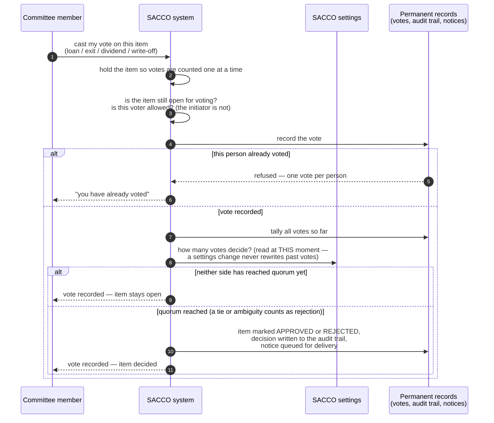

<!--
  P-DIAG.5 — Sequence 1/3: the COMMITTEE/VOTING pattern (as-built)
  Authored against main @ 08541b860f1445b16c342c39b6606d86b9dbeb17
  Redrawn business-readable and reconciled to main @
  8f46aa54250ff1a066af423924f3eb54a9c72fb7 by the P-DIAG drift MR:
  the loan write-off (!46) joins as the FOURTH consumer; code
  citations moved out of the drawing into the Source-of-truth footer
  (P-DIAG audience rule).
  Drift rule: v1.2 rule 11 — any MR that changes this flow in ANY of
  its four consumers MUST update this file in the same MR. Future
  prompts/MRs REFERENCE this diagram instead of re-describing the
  pattern in prose.
  Lock authority: the anchor-row locks below are lock-order.md §3
  single-node locker rows — cited, never restated.
-->

# Sequence — committee voting (P-DIAG.5, pattern 1)

**Audience: business (committee members, managers, auditors).** The
diagram uses business vocabulary only; the code citations live in the
Source-of-truth footer.

## The business rule this depicts

Big decisions are never one person's keystroke. Approving a loan,
paying out a leaving member, declaring a dividend and writing off a
bad loan are all decided the same way: each committee member casts
**one** vote (the system makes a second vote by the same person
impossible), the quorum comes from the SACCO's configured settings at
the moment of the vote, and the decision happens **only** when a vote
tips the count past quorum — nobody can "decide" an item outside the
voting room. Whoever initiated the item cannot vote on it (four-eyes
control). Every vote and every decision is written to the permanent
audit trail, and the affected member is notified through the same
transaction that records the decision.

One pattern, four consumers, all on main at the reconciliation SHA:

| Decision being voted | Since | Initiator ban |
|---|---|---|
| Loan application approval | P9 | vote-caster authority band also checked on approve |
| Member exit settlement | P12 | requester cannot vote |
| Dividend declaration | !30 | declarer cannot vote |
| Loan write-off | !46 (P13.15) | requester cannot vote (and cannot post it later either) |

## Source of truth (code citations, valid at `8f46aa5`)

| Diagram step | Implementation |
|---|---|
| The four vote functions | `application/loan_applications.py:cast_vote`; `application/member_exits.py:cast_exit_vote`; `application/dividends.py:cast_dividend_vote`; `application/corrections.py:cast_write_off_vote` (!46) |
| "hold the item" (anchor row lock serialises voters) | `SELECT … FOR UPDATE` on `loan_applications` / `member_exits` / `dividend_declarations` / `loan_write_offs` — lock-order.md §3 single-node rows ("Application stage / committee vote / create", "Exit vote / void", "Dividend vote / void", write-off votes lock the WOFF anchor alone) |
| "is this voter allowed?" | stage/status guards + initiator bans in each `cast_*_vote`; loan approvals additionally check the voter's authority band (`application/tenant_settings.py:enforce_authority_band`) |
| "one vote per person" | DB UNIQUE constraints: `committee_votes` (0005), `exit_votes` (0010), `dividend_declaration_votes` (0020), `loan_write_off_votes` (0025); the `IntegrityError` handler in each vote function maps the violation to a 409 |
| "how many votes decide?" (quorum at vote time) | `application/tenant_settings.py:committee_quorum`, called inside the vote transaction under the anchor lock (P13.7 consumer convention; fallback `domain/committee.py:COMMITTEE_QUORUM`) |
| "quorum reached … rejection wins ambiguity" | `domain/committee.py:decide` — pure; called ONLY from the four vote functions, so a decision can only be produced by a vote event |
| decision + audit + notice, one transaction | each vote function's decision branch: the status transition function, `application/audit.py:record_audit`, `application/outbox.py:enqueue_event` (same transaction — gate 1.2/1.5) |

Downstream: an APPROVED item is **bound to its frozen snapshot** and
re-verified at execution — that half of the lifecycle is
[`sequence-snapshot-bind-reverify.md`](sequence-snapshot-bind-reverify.md).
