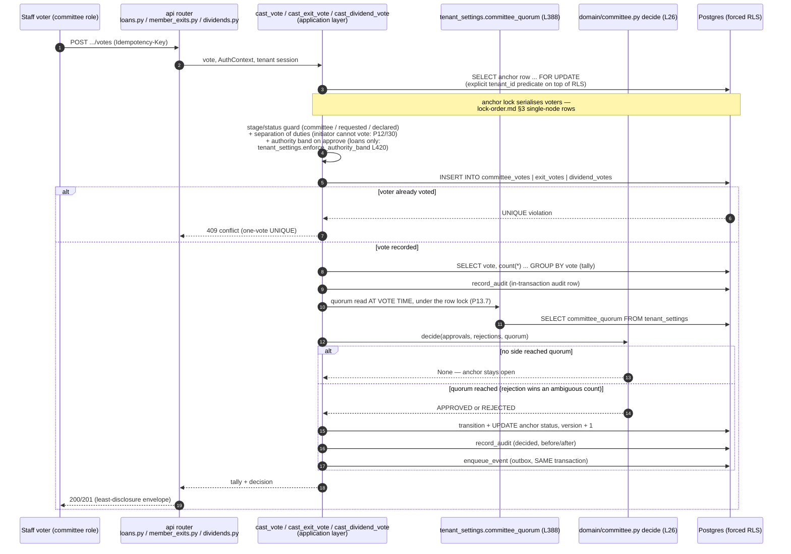

<!--
  P-DIAG.5 — Sequence 1/3: the COMMITTEE/VOTING pattern (as-built)
  Authored against main @ 08541b860f1445b16c342c39b6606d86b9dbeb17
  Drift rule: v1.2 rule 11 — any MR that changes this flow in ANY of
  its three consumers MUST update this file in the same MR. Future
  prompts/MRs REFERENCE this diagram instead of re-describing the
  pattern in prose.
  Lock authority: the anchor-row locks below are lock-order.md §3
  single-node locker rows ("Application stage / committee vote /
  create", "Exit vote / void", "Dividend vote / void") — cited, never
  restated.
-->

# Sequence — committee/voting (P-DIAG.5, pattern 1)

One pattern, three consumers, all on main at the authoring SHA:

| Consumer | Vote function | Anchor row | One-vote UNIQUE table | Since |
|---|---|---|---|---|
| Loan committee | `genesis/application/loan_applications.py:cast_vote` (L475) | `loan_applications` | `committee_votes` (0005) | P9 |
| Member exits | `genesis/application/member_exits.py:cast_exit_vote` (L478) | `member_exits` | `exit_votes` (0010) | P12 |
| Dividends | `genesis/application/dividends.py:cast_dividend_vote` (L708) | `dividend_declarations` | `dividend_votes` (0020) | !30 |

Invariants the diagram encodes (each traceable to the cited code):

1. **Vote cast under the anchor row lock** — `SELECT ... FOR UPDATE`
   serialises voters; tallies and decisions are race-free.
2. **Quorum read AT VOTE TIME** (the P13.7 consumer convention) —
   `genesis/application/tenant_settings.py:committee_quorum` (L388) is
   called inside the vote transaction, under the row lock; a quorum
   change mid-vote governs the NEXT vote's tally only.
3. **A decision is produced only by a vote event** — `decide` is only
   invoked from the three `cast_*_vote` functions; nothing decides
   retroactively.
4. **One vote per voter by DB UNIQUE** — the `INSERT` relies on the
   constraint; `IntegrityError` maps to 409 (double-voting impossible
   even outside this code path).

## Code citations (valid at `08541b8`)

| Participant / message | Source |
|---|---|
| Anchor `FOR UPDATE` + stage guard | `loan_applications.py:cast_vote` L475 (guard: committee stage); `member_exits.py:cast_exit_vote` L478 (guard: requested; initiator ban); `dividends.py:cast_dividend_vote` L708 (initiator ban) |
| Authority band (loans, approve only) | `tenant_settings.py:enforce_authority_band` L420, called from `cast_vote` under the row lock |
| One-vote INSERT → UNIQUE → 409 | the `IntegrityError` handler in each `cast_*_vote` |
| Quorum at vote time | `tenant_settings.py:committee_quorum` L388 (config read, fallback `domain/committee.py:COMMITTEE_QUORUM`) |
| Decision only from a vote event | `domain/committee.py:decide` L26 — pure; called only by the three vote functions |
| Decision transition + audit + outbox | each `cast_*_vote` decision branch: `transition`/`exit_transition`/`_transition`, `record_audit`, `application/outbox.py:enqueue_event` L17 |

Downstream: an APPROVED anchor is **bound to its persisted snapshot**
and re-verified at execution — that half of the lifecycle is
[`sequence-snapshot-bind-reverify.md`](sequence-snapshot-bind-reverify.md).
