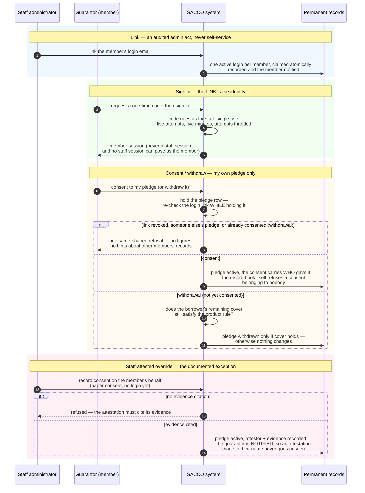

<!--
  P-DIAG.5 — Sequence 8: GUARANTOR CONSENT AS THE MEMBER PRINCIPAL
  (as-built: P14.5 / !65 — member OTP sign-in, consent/self-release,
  the staff-attested override; DFD flow F15, dfd.md §3.15)
  Authored against main @ 047d4e399e3f5c5537f15a8fb73b8f1ab4a15658
  by the issue-#30 close-out MR (!71). Every step hand-verified
  against api/member.py, application/member_auth.py,
  application/guarantees.py (consent_guarantee_as_member,
  release_guarantee_as_member, consent_guarantee_override,
  _release_locked_guarantee) and api/authz.py:RequireMemberPrincipal
  on that SHA.
  Drift rule: v1.2 rule 11 — any MR that changes member auth, the
  consent-principal columns/trigger, or the override contract MUST
  update this file in the same MR.
  Lock authority: lock-order.md — §3 single-node rows (member OTP
  verify, member refresh rotation, guarantee consent, member
  credential link) and E4 → E6, then E9 for the self-release —
  cited by row/edge id, never restated.
-->

# Sequence — guarantor consent belongs to the member (P-DIAG.5, pattern 8)

**Audience: business (managers, loan officers, committee, auditors,
members).** Code citations live in the Source-of-truth footer.

## The business rule this depicts

Pledging savings behind someone else's loan puts the GUARANTOR's money
at risk, so the consent must be the guarantor's own act — recorded so
it can never be denied, forged, or quietly substituted. A staff
administrator first LINKS the member to a login (an audited admin act;
members can never self-provision). The member then signs in with a
one-time code — same code rules as staff, but a member session can
never open a staff door — and consents to, or withdraws, THEIR OWN
pledge only. The system re-checks the login link at every step: at the
door, and AGAIN while the pledge row is held, so a link revoked a
moment ago can never consent. The record book itself refuses a consent
belonging to nobody. Where the member cannot act (no login, paper
consent), a staff officer may record an ATTESTED override — only with
a mandatory citation of the evidence, and the guarantor is notified so
an attestation made in their name never goes unseen.

## Source of truth (code citations, valid at `047d4e39`)

| Diagram step | Implementation |
|---|---|
| Link (admin act) | `api/member_identity.py` routes (`member_identity:create` / `:edit`; view is `member_identity:view`) → `application/member_identity.py:create_credential` / `revoke_credential` — atomic active-email claim (`CLAIM_EMAIL_SQL`, `ON CONFLICT` checked by rowcount), audit + member notification in the same transaction; lock-order.md §3 member-credential-link row (MSELF alone) |
| Sign in | `api/member.py:request_member_otp` / `verify_member_otp` / `refresh_member_token` → `application/member_auth.py` — the ONE OTP implementation shared with staff (`domain/otp.py:evaluate_challenge`); MEMBER-audience tokens (`application/auth.py:decode_principal`, FM1 deny-by-default dispatch); same `api/auth.py:_rate_guard`; lock-order.md §3 member-OTP-verify / member-refresh-rotation rows |
| Session gate | `api/authz.py:RequireMemberPrincipal` — decodes the member audience AND re-verifies the live link (`application/member_auth.py:live_credential_by_id`) on every request |
| Consent | `application/guarantees.py:consent_guarantee_as_member` — pledge row held (`_lock_pledged_guarantee`; lock-order.md §3 guarantee-consent row), link re-verified under the held row (FM2), audit `guarantee.consent` with the CREDENTIAL as actor |
| "refuses a consent belonging to nobody" | the 0035 constraint trigger `guarantee_consent_requires_principal` (FM4) + `ck_guarantees_attested_consent_reference` — DB-level backstops, unrepresentable even via direct SQL |
| Withdrawal | `application/guarantees.py:release_guarantee_as_member` — own PLEDGED row only; shared core `application/guarantees.py:_release_locked_guarantee` (identical rules for both principals): cover re-verified at execution under the borrower's deposit row (lock-order.md E4 → E6, then E9), optimistic `version` 409 |
| Same-shaped refusal | least disclosure (gate 1.6): every wrong-principal shape gets one message; exact figures live in the audit row (`consent_guarantee_as_member` / `release_guarantee_as_member` docstrings) |
| Override | `api/loans.py:consent_guarantee_override` (`member_identity:approve` — never `applications:edit`) → `application/guarantees.py:consent_guarantee_override` — mandatory `consent_reference`, audit `guarantee.consent_override` (attestor + reference), consent-confirmation outbox notification to the guarantor (the !29 substitution-consent lesson; detection control) |
