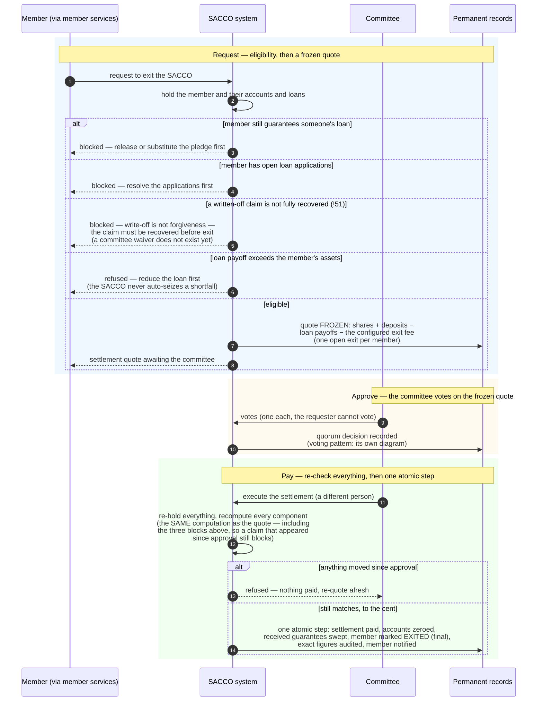

<!--
  P-DIAG.5 — Sequence 7: MEMBER EXIT with the UNRESOLVED-CLAIM BLOCK
  (as-built: P12 exit workflow + the issue #21 / !51 claim guard)
  Authored against main @ 8f46aa54250ff1a066af423924f3eb54a9c72fb7
  by the P-DIAG drift MR. Every step hand-verified against
  application/member_exits.py (_compute_under_locks, request_exit,
  cast_exit_vote, post_settlement) on that SHA.
  Drift rule: v1.2 rule 11 — any MR that changes exit eligibility,
  the settlement snapshot or the claim guard MUST update this file in
  the same MR. The committee WAIVER (release the claim without cash)
  is a FUTURE branch recorded on issue #21.
  Lock authority: lock-order.md E1 → E10 → E12 → E14 → E7 → E15/E16 —
  cited by edge id, never restated.
-->

# Sequence — member exit, and the debts that block the door (P-DIAG.5, pattern 7)

**Audience: business (managers, member services, committee,
auditors).** Code citations live in the Source-of-truth footer.

## The business rule this depicts

A member leaves with what is theirs — **after** everything they owe or
underwrite is resolved. The exit request computes a settlement quote
(shares + deposits − loan payoffs − the configured exit fee) and
freezes it for the committee. Three things block the door outright:
(1) the member still **guarantees someone else's loan** — release or
substitute the pledge first; (2) the member has **open loan
applications** — resolve them first; (3) since !51: the member has a
**written-off loan whose claim is not fully recovered** — write-off is
not forgiveness, and a debt the committee wrote off must not quietly
walk out inside a settlement. Cash recovery (see the recovery-receipt
diagram) is today the only unblock. A quote whose loan payoff exceeds
the member's assets is refused rather than paid negative. The
committee approves the frozen quote; a different person executes it;
and execution re-checks every component — if anything moved, nothing
is paid.

## Source of truth (code citations, valid at `8f46aa5`)

| Diagram step | Implementation |
|---|---|
| Routes | `api/member_exits.py` — request/votes/void/settlement/statement, `RequirePermission(MEMBERS, EDIT/APPROVE)` |
| "hold the member…" | `application/member_exits.py:_lock_member` then `_compute_under_locks` (lock-order.md E1 → E10 → E12 → E14); member capability gate `domain/members.py:member_may` (`EXIT_REQUEST` — active, arrears AND dormant members may request) |
| Guarantee block | `application/guarantees.py:live_pledged_total > 0` refusal inside `_compute_under_locks` |
| Open-applications block | `_open_application_count > 0` refusal |
| Unresolved-claim block (**!51**) | the anti-join in `_compute_under_locks`: any `loan_write_offs` row with `status='posted'` whose `total_written_off` exceeds `SUM(loan_recoveries.amount)` blocks the exit; race-safe against a concurrent receipt via the member-row conflict (lock-order.md E23 note); the WAIVER branch is FUTURE, recorded on issue #21 |
| Negative-settlement refusal | `request_exit`: `computation.net_payable < 0` → refusal, nothing persisted (documented branch, `domain/exits.py`) |
| Frozen quote + one-open-exit | `member_exits` snapshot row (0010) — fee from `_exit_fee` (tenant config, never the request); partial UNIQUE `uq_member_exits_open` collapses double-submits |
| Committee vote | `cast_exit_vote` — [`sequence-committee-voting.md`](sequence-committee-voting.md); quorum at vote time; one-vote UNIQUE `exit_votes` (0010) |
| Re-check at execution | `post_settlement` → `_compute_under_locks` again (the SAME function both phases — gate 1.1; eligibility INCLUDING the claim guard re-runs), component-by-component compare, 409 on drift posting nothing |
| One atomic payout | `post_settlement` — `application/ledger.py:post_exit_settlement` + zeroed balances + received-guarantee sweep (E7) + terminal member transition + audit + outbox, ONE transaction; declarer/approver separation |
