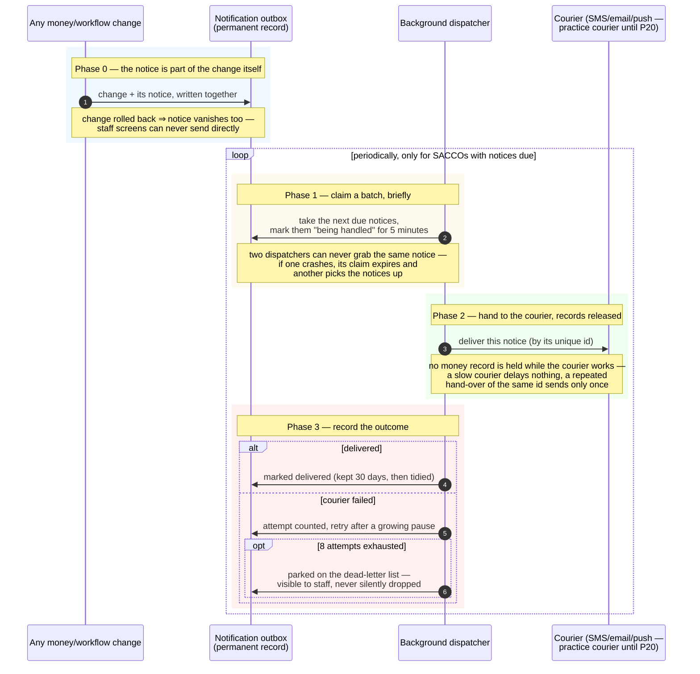

<!--
  P-DIAG.5 — Sequence 3/3: the OUTBOX DISPATCH pattern (as-built)
  Authored against main @ 08541b860f1445b16c342c39b6606d86b9dbeb17
  Redrawn business-readable and reconciled to main @
  8f46aa54250ff1a066af423924f3eb54a9c72fb7 by the P-DIAG drift MR
  (code citations moved to the Source-of-truth footer; the P13.17e
  as-built markers kept). P20 is the remaining named incoming change;
  it flips its PLANNED notes in its own MR.
  Drift rule: v1.2 rule 11 — any MR that changes the enqueue contract,
  the claim/lease shape, the backoff/dead-letter policy or the
  no-domain-locks rule MUST update this file in the same MR.
  Lock authority: the claim is the lock-order.md §3 outbox_events
  single-node locker row ("dispatch holds NO domain locks") — cited,
  never restated.
-->

# Sequence — the notification promise (P-DIAG.5, pattern 3)

**Audience: business (managers, auditors).** Code citations live in
the Source-of-truth footer.

## The business rule this depicts

Notifications must be **truthful and unstoppable, but never in the
way**. Truthful: a notice is written in the very same step as the
change it announces — if the change is rolled back, the notice
vanishes with it, so a member can never be told about something that
did not happen. Unstoppable: once the change commits, delivery WILL be
attempted, retried with growing pauses, and — if the courier keeps
failing — parked on a dead-letter list that staff can inspect, never
silently dropped. Never in the way: the actual sending happens later,
in the background, holding **no** money records — a slow SMS provider
can never delay or block a deposit.

## Source of truth (code citations, valid at `8f46aa5`)

| Diagram step | Implementation |
|---|---|
| Notice written with the change | `application/outbox.py:enqueue_event` — called inside every notifying mutation's transaction (gate 1.2); atomicity proven by the P5 rollback test |
| Staff screens can never send directly | `backend/pyproject.toml` import-linter contract 3 (api forbidden from `providers`/`outbox_worker`/`export_worker`) |
| "only for SACCOs with notices due" | `infrastructure/outbox_worker.py:run_worker` → `run_dispatch_cycle` → `list_due_tenants` (`outbox_due_tenant_ids()` SECURITY DEFINER, migration 0024 — P13.17e/DSA-6) |
| Claim a batch + 5-minute lease | `infrastructure/outbox_worker.py:dispatch_due` phase 1 — `FOR UPDATE SKIP LOCKED` batch over the `idx_outbox_pending` partial index (0001), then ONE set-based lease `UPDATE … WHERE id = ANY(:ids)` (`CLAIM_LEASE_SECONDS = 300`, P13.17e), committed BEFORE any courier call |
| No money records held while the courier works | the claim transaction touches ONLY `outbox_events` and commits before `provider.send` — [`lock-order.md`](lock-order.md) §3, outbox single-node row |
| Send-only-once by id | `infrastructure/providers.py` — `NotificationProvider` contract + `StubProvider` (dedup by event id); real providers PLANNED (P20) |
| Growing pauses / dead-letter | `backoff_delay` (exponential + jitter), `_record_failure`, `MAX_ATTEMPTS = 8` → `status = 'dead'`; alertable via `outbox_metrics` |
| "kept 30 days, then tidied" | `infrastructure/outbox_worker.py:purge_dispatched` (P13.17e) — batched DELETE via `FOR UPDATE SKIP LOCKED` subquery, `status = 'dispatched'` ONLY (pending/dead never purged), `DISPATCHED_RETENTION_DAYS = 30`, driven by `idx_outbox_dispatched_purge` (0024); hourly `run_purge_cycle` → `list_purgeable_tenants` (`outbox_purgeable_tenant_ids()`, 0024) |
