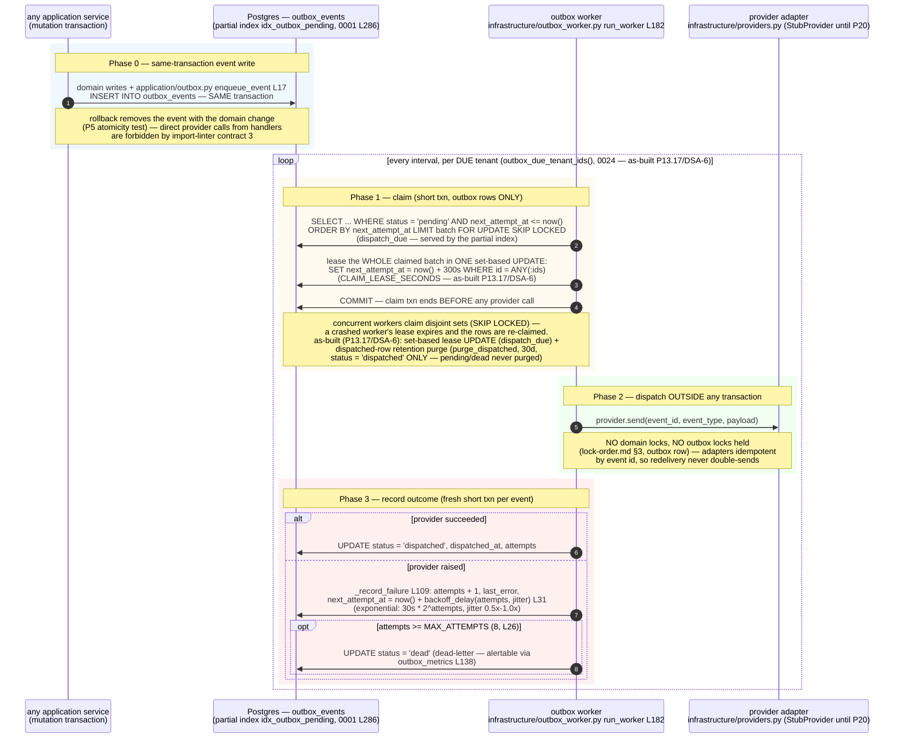

<!--
  P-DIAG.5 — Sequence 3/3: the OUTBOX DISPATCH pattern (as-built)
  Authored against main @ 08541b860f1445b16c342c39b6606d86b9dbeb17
  Drift rule: v1.2 rule 11 — any MR that changes the enqueue contract,
  the claim/lease shape, the backoff/dead-letter policy or the
  no-domain-locks rule MUST update this file in the same MR. P13.17(e)
  (DSA-6) landed via !44 — its markers below are flipped to as-built
  (set-based lease, retention purge, due-tenant discovery). P20 is the
  remaining named incoming change; it flips its PLANNED notes in its
  own MR.
  Lock authority: the claim is the lock-order.md §3 outbox_events
  single-node locker row ("dispatch holds NO domain locks") — cited,
  never restated.
-->

# Sequence — outbox dispatch (P-DIAG.5, pattern 3)

The MASTER_PROMPT 1.2/1.4 contract as built: **the event commits with
the domain change; dispatch happens later, off-transaction, holding no
domain locks.**

## Code citations (valid at `08541b8`)

| Element | Source |
|---|---|
| Same-transaction write | `genesis/application/outbox.py:enqueue_event` L17 — called inside every mutating application-service transaction; atomicity proven by the P5 rollback test |
| No direct provider calls from handlers | `backend/pyproject.toml` import-linter contract 3 (api forbidden from `providers`/`outbox_worker`/`export_worker`) |
| Partial index | `idx_outbox_pending ON outbox_events (next_attempt_at) WHERE status = 'pending'` — migration `0001` L286 |
| Claim + lease (as-built P13.17/DSA-6) | `genesis/infrastructure/outbox_worker.py:dispatch_due` — `FOR UPDATE SKIP LOCKED` batch, then ONE set-based lease `UPDATE ... WHERE id = ANY(:ids)` over exactly the claimed set inside the claim txn (`CLAIM_LEASE_SECONDS = 300`), commit before dispatch |
| Retention purge (as-built P13.17/DSA-6) | `genesis/infrastructure/outbox_worker.py:purge_dispatched` — batched `DELETE ... WHERE id IN (SELECT ... LIMIT :n FOR UPDATE SKIP LOCKED)` of `status = 'dispatched'` rows older than `DISPATCHED_RETENTION_DAYS = 30`; driven by `idx_outbox_dispatched_purge` (migration `0024`); pending/dead rows never purged |
| Dispatch holds no domain locks | claim txn touches ONLY `outbox_events` and is committed before `provider.send`; recorded in [`lock-order.md`](lock-order.md) §3 (outbox single-node locker row) |
| Idempotent adapters | `genesis/infrastructure/providers.py` — `NotificationProvider` contract + `StubProvider` (dedup by event id); real providers PLANNED (P20) |
| Backoff / dead-letter | `backoff_delay` L31 (exponential + jitter), `_record_failure` L109, `MAX_ATTEMPTS = 8` L26 → `status = 'dead'` |
| Worker loop / due-tenant walk (as-built P13.17/DSA-6) | `run_worker` → `run_dispatch_cycle` → `list_due_tenants` (`outbox_due_tenant_ids()` SECURITY DEFINER, migration `0024`) — only tenants with due work are walked; the hourly purge interleave is `run_purge_cycle` → `list_purgeable_tenants` (`outbox_purgeable_tenant_ids()`, `0024`) |
| PLANNED deltas | P20: real SMS/email/push adapters, per-channel circuit breakers |
