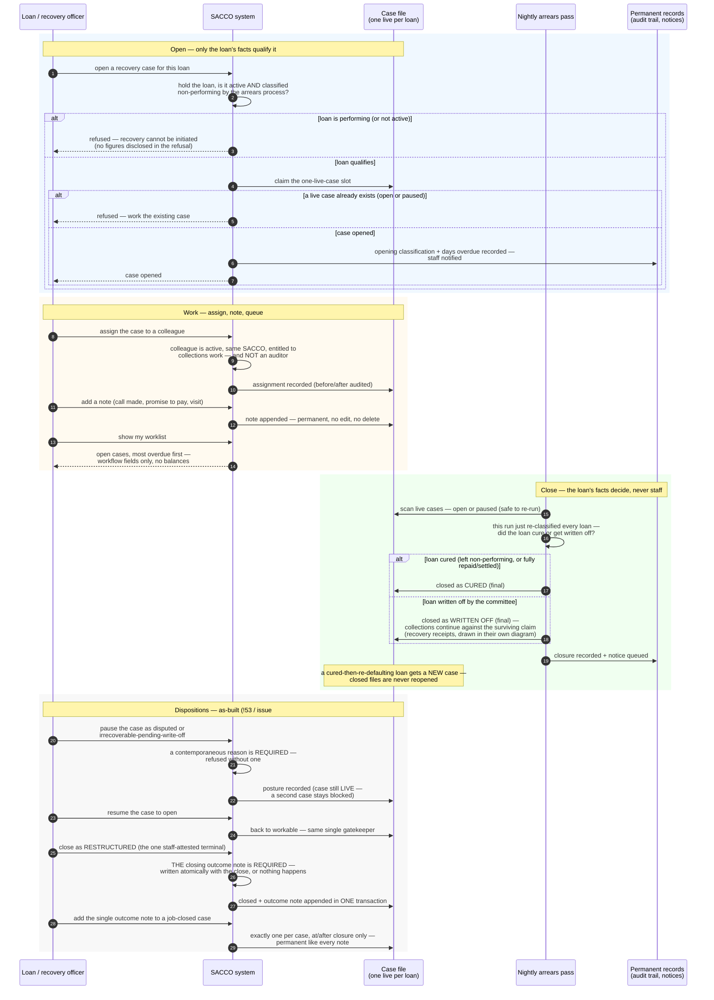

<!--
  P-DIAG.5 — Sequence 6: RECOVERY-CASE LIFECYCLE (as-built, P13.16 / !47)
  Authored against main @ 8f46aa54250ff1a066af423924f3eb54a9c72fb7
  by the P-DIAG drift MR. Every step hand-verified against
  application/recovery.py and domain/recovery.py on that SHA.
  As-built flip (!55 reconciliation, after !53 and !54 merged): pause
  dispositions (disputed, irrecoverable-pending-write-off), the
  staff-attested closed_restructured terminal and the single outcome
  note (!53 / issue #23, migration 0033) are drawn SOLID below, with
  the !54 hardening (pause requires a reason; closed_restructured
  requires the outcome note atomically) — verified against merged
  main code at d517769 (v1.2 rule 11).
  Lock authority: lock-order.md §3 recovery single-node rows — cited,
  never restated.
-->

# Sequence — recovery-case lifecycle (P-DIAG.5, pattern 6)

**Audience: business (managers, recovery officers, auditors).** Code
citations live in the Source-of-truth footer.

## The business rule this depicts

A recovery case is a **work file**, not a money record — and its
closure is decided by the **loan's facts, not by staff mood**. A case
can be opened only for a genuinely non-performing loan (as classified
by the nightly arrears process — staff cannot hand-declare a loan
non-performing to open one), and each loan has at most one LIVE case
(open or paused — a paused case still blocks a duplicate).
Staff may assign the case to an active, entitled colleague — never to
the auditor, whose job is to review the collections trail, not to work
inside it — and add notes, which are permanent evidence: there is no
edit or delete. Closing is **job-only**: the nightly pass closes the
case by itself when the loan cures (money came back — money talks and
closes cases) or when the committee writes the loan off. Staff can
never hand-declare a cure or a write-off. The one staff-attested
terminal — the loan was RESTRUCTURED, so the case's premise no longer
holds — demands its justification in the same breath: the closing
outcome note is written atomically with the close, or nothing happens
at all. A case can also PAUSE without pretending to be workable —
the member disputes the arrears, or recovery is hopeless and the
committee write-off hasn't landed yet — and every pause demands a
contemporaneous reason on the record. A paused case still blocks a
second case on the same loan, and the nightly pass still closes it
the moment the loan's own facts decide.

## Source of truth (code citations, valid at `8f46aa5`; disposition/outcome-note rows verified at merged main `d517769`)

| Diagram step | Implementation |
|---|---|
| Routes | `api/recovery.py`: `POST /recovery-cases` (`LOAN_BOOK, CREATE`), `GET /recovery-cases` worklist (`LOAN_BOOK, VIEW`), `GET /recovery-cases/{id}`, `POST …/assign`, `POST …/notes` (`LOAN_BOOK, EDIT`) |
| Open gate | `application/recovery.py:open_recovery_case` — loan `FOR UPDATE` (lock-order.md §3 recovery-open row); active check + stored `loans.classification` in `domain/lending.py:NPL_CLASSES` (the arrears job's persisted output, v1.1 rule 2); least-disclosure refusals, exact figures in the audit row |
| One-live-case slot | atomic claim on `uq_recovery_cases_one_open` (0026; regenerated by 0033 under the SAME name over the live-status predicate — a paused case still blocks a second) via `ON CONFLICT DO NOTHING` + rowcount, arbiter predicate mirrored from the code-owned `_LIVE_STATUS_SQL`; 0026 CHECKs (NPL set, dpd > 90) are the DB backstop |
| Assignment vetting | `application/recovery.py:assign_recovery_case` — ACTIVE same-tenant user (`domain/users.py:UserStatus`), grant check via `application/rbac.py:actor_access` (`loan_book:view`), `domain/rbac.py:ASSURANCE_ROLES` excluded server-side from the assignee's role_id; a user suspended AFTER assignment is surfaced as `assignee_unassignable`, never silently orphaned |
| Permanent notes | `application/recovery.py:add_recovery_note` — append-only `recovery_case_notes` rows (0026); no edit/delete route exists anywhere (addendum A2) |
| Worklist | `application/recovery.py:list_worklist` — keyset `ORDER BY days_past_due DESC, id DESC`, `idx_loans_dpd_worklist` (0026); workflow fields + dpd + classification pill only, no balance/penalty/provision figures |
| Job-only close | `application/arrears.py:run_arrears_for_tenant` → `application/recovery.py:run_recovery_close_pass` (runs AFTER the classify pass, so today's cure closes today) → `_close_one` — every close passes `domain/recovery.py:transition` (the single gatekeeper; any LIVE status → CLOSED_CURED / CLOSED_WRITTEN_OFF, all closed states terminal, self-transitions illegal); `closed_cured`/`closed_written_off` stay job-only — deliberately absent from `STAFF_DISPOSITION_TARGETS` (staff can never hand-declare a cure or a write-off); worker-actor audit rows (`actor_id=None`) |
| Safe re-run | close scan matches ALL live statuses (`_LIVE_STATUS_SQL`, issue #23 — a paused case still closes when the loan's facts decide), case rows `FOR UPDATE SKIP LOCKED` in id order, joined loan read WITHOUT a lock (MVCC — the job's own persisted classification); idempotent by side-effect counts |
| "new case, never reopened" | `domain/recovery.py` — all three closed states have empty transition sets (addendum A6; the issue-#23 full-matrix test enumerates every pair) |
| Receipt linkage | `loan_recoveries.recovery_case_id` (0030) ties recovery receipts to the closed_written_off case — [`sequence-recovery-receipt.md`](sequence-recovery-receipt.md) |
| Dispositions (as-built) | `api/recovery.py`: `POST /recovery-cases/{id}/disposition` (`LOAN_BOOK, EDIT`) → `application/recovery.py:set_case_disposition` — every move through the single `domain/recovery.py:transition` gatekeeper (full-matrix test); pause targets (`PAUSE_STATUSES`: `disputed`, `irrecoverable_pending_write_off`) REQUIRE a `reason` (422 without; captured into the audit `after` payload — !54); `closed_restructured` REQUIRES and atomically writes THE outcome note in the SAME transaction via `add_outcome_note` (!54); live statuses keep the one-LIVE-case claim (`uq_recovery_cases_one_open` regenerated over the live set, 0033) |
| Outcome note (as-built) | `api/recovery.py`: `POST /recovery-cases/{id}/outcome-note` (`LOAN_BOOK, EDIT`) → `application/recovery.py:add_outcome_note` — terminal-only, exactly one per case (`uq_recovery_notes_one_outcome` partial UNIQUE on `recovery_case_notes.is_outcome`, 0033), append-only like every note |
