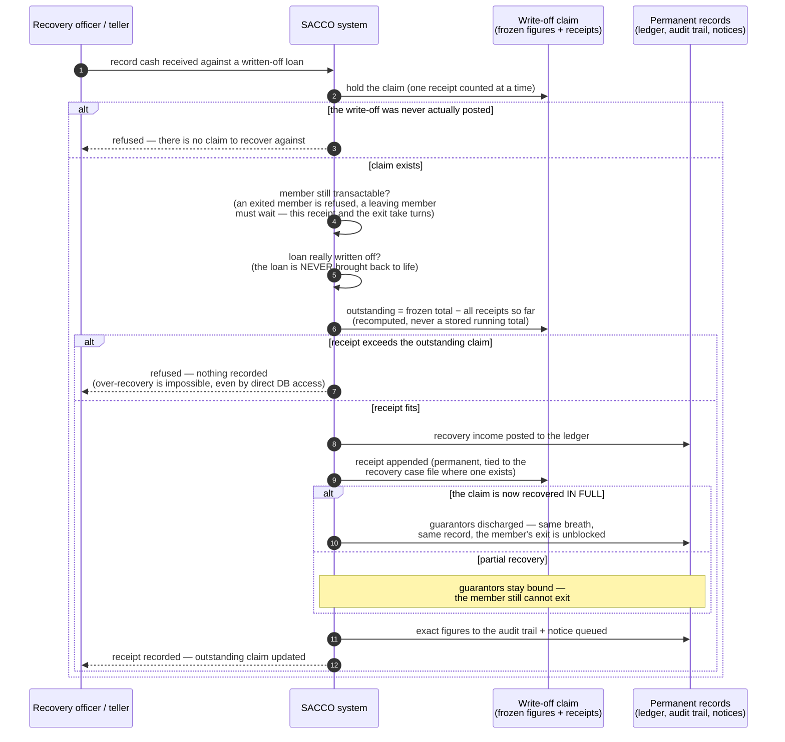

<!--
  P-DIAG.5 — Sequence 4: bad-debt RECOVERY RECEIPT (as-built, issue #21 / !51)
  Authored against main @ 8f46aa54250ff1a066af423924f3eb54a9c72fb7
  by the P-DIAG drift MR. Every step hand-verified against
  application/corrections.py:record_recovery_receipt on that SHA.
  Drift rule: v1.2 rule 11 — any MR that changes the receipt flow,
  the claim math, the guarantee-discharge policy or the exit guard
  MUST update this file in the same MR. The committee WAIVER branch
  (release without cash) is a FUTURE path recorded on issue #21.
  Lock authority: lock-order.md E23 → E21 → E7 → E15/E16 — cited by
  edge id, never restated.
-->

# Sequence — bad-debt recovery receipt (P-DIAG.5, pattern 4)

**Audience: business (managers, recovery officers, auditors).** Code
citations live in the Source-of-truth footer.

## The business rule this depicts

**Write-off is not forgiveness.** When the committee writes off a
loan, the SACCO stops carrying it as an asset — but the member still
owes the frozen figures, and that claim survives in the books. When
cash actually comes back, the **recovery receipt** is the only door it
may enter: a normal repayment against a written-off loan is refused
outright, so recovered cash can never masquerade as loan servicing.
Each receipt is appended to the claim's permanent history and the
outstanding amount is always **recomputed from those receipts** —
there is no editable running total to fiddle. A receipt for more than
what is outstanding is refused; even someone with direct database
access cannot record an over-recovery. And the receipt that clears the
claim **in full** discharges the member's guarantors in the same
breath — exactly as if the loan had been honestly repaid — and unlocks
the member's until-then-blocked exit.

## Source of truth (code citations, valid at `8f46aa5`)

| Diagram step | Implementation |
|---|---|
| The one service | `application/corrections.py:record_recovery_receipt`; route `api/corrections.py:record_recovery_receipt` — `POST /corrections/write-offs/{id}/recoveries`, `RequirePermission(CORRECTIONS, CREATE)`, `extra="forbid"` |
| "hold the claim" | `loan_write_offs` row `FOR UPDATE` — lock-order.md E23 tail (serialises concurrent receipts so the claim math never races) |
| "never actually posted" refusal | `record.status is not WriteOffStatus.POSTED` guard; the 0030 `loan_recoveries_within_claim` constraint trigger re-checks POSTED at the DB |
| member gate + exit turn-taking | `application/transactions.py:_require_member` (`MoneyOperation.RECOVERY` — money-in statuses; EXITED refused), member `FOR SHARE`; the conflict with the exit's member `FOR UPDATE` is what the exit guard relies on (lock-order.md E23 note; `member_exits._compute_under_locks`) |
| "loan really written off / never resurrected" | loan row `FOR UPDATE` re-verifying `LoanStatus.WRITTEN_OFF` (E21 hop); `written_off` is terminal in `domain/lending.py:_LOAN_ALLOWED`; a repayment against it is refused by `application/loans.py:record_repayment` |
| outstanding recomputed | `_recovered_total` — `SUM(amount)` over append-only `loan_recoveries` (0030 append-only triggers; v1.1 rule 2 — no mutable total exists) vs the write-once `loan_write_offs.total_written_off` (0025 trigger) |
| over-recovery refusal | service 409 with zero side effects (least disclosure: category only, figures in the audit row); DB backstop `loan_recoveries_within_claim` (0030) |
| recovery income posting | `application/ledger.py:post_loan_recovery` — RC- ref, DR cash / CR `income.bad_debt_recoveries` (0030 `transactions.type` `loan_recovery`); open-period gate + advisory tier via `_post` (E15 → E16) |
| receipt appended + case linkage | `loan_recoveries` INSERT with `recovery_case_id` resolved server-side (latest `closed_written_off` case, MVCC read) |
| full-recovery discharge | `claim_fully_recovered` ⇒ `application/guarantees.py:release_guarantees_for_loan` in the SAME transaction (the P10 closure hook, E7 row write) + dedicated `write_off.claim_recovered` audit row |
| exit unblock | the F4/EXIT_S10 guard in `application/member_exits.py:_compute_under_locks` stops matching once receipts = total |
| audit + notice | `write_off.recovery_recorded` audit row (exact figures) + outbox event, same transaction |
