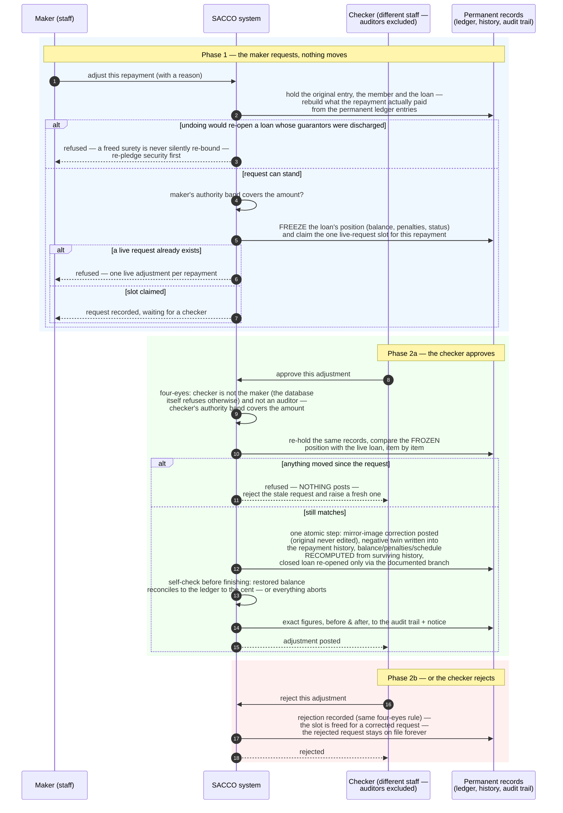

<!--
  P-DIAG.5 — Sequence 5: MAKER-CHECKER REPAYMENT ADJUSTMENT
  (as-built, P13.15 !46 hardened by issue #24 / !52)
  Authored against main @ 8f46aa54250ff1a066af423924f3eb54a9c72fb7
  by the P-DIAG drift MR. Every step hand-verified against
  application/corrections.py request/approve/reject_repayment_adjustment
  on that SHA.
  Drift rule: v1.2 rule 11 — any MR that changes the two-phase flow,
  the SoD rule, the snapshot re-verification or the reopen branch
  MUST update this file in the same MR.
  Lock authority: lock-order.md E20/E21 (request), E24 → E20/E21
  (approval), ADJ-alone §3 row (rejection) — cited by edge id, never
  restated.
-->

# Sequence — maker-checker repayment adjustment (P-DIAG.5, pattern 5)

**Audience: business (managers, checkers, auditors).** Code citations
live in the Source-of-truth footer.

## The business rule this depicts

Undoing a recorded repayment is the classic teller-fraud channel, so
it takes **four eyes and two phases**. The **maker** requests the
adjustment with a reason: the system freezes the loan's position at
that instant (balance, penalties owed, status) and claims the single
live-request slot for that repayment. Nothing moves yet. A **checker**
— a different person, never the maker, and never an auditor (the
person who reviews the trail must not act inside it; the database
itself enforces maker ≠ checker) — then decides. On **approval** the
system first re-checks the frozen position against the live loan: if
anything changed in between, nothing posts and the stale request must
be rejected and remade. If everything still matches, one atomic step
posts the mirror-image correction (the original entry is never edited
— the books only grow), writes the negative twin into the repayment
history, and **recomputes** the loan's balance, penalties and schedule
from the surviving history — then proves to itself, before finishing,
that the restored balance still reconciles to the ledger to the cent.
A repayment that had closed the loan re-opens it through the one
documented branch — unless the guarantors were discharged at closure:
a freed surety is never silently re-bound. On **rejection** the slot
is freed for a corrected request; the rejected request itself stays on
file forever.

## Source of truth (code citations, valid at `8f46aa5`)

| Diagram step | Implementation |
|---|---|
| Routes | `api/corrections.py`: `POST /corrections/repayment-adjustments` (`CORRECTIONS, CREATE`), `POST …/{id}/approval` (`CORRECTIONS, APPROVE`), `POST …/{id}/reject` (`CORRECTIONS, APPROVE`); all `extra="forbid"`, actor-scoped Idempotency-Key via `api/idempotency.py` |
| Phase 1 lock set + leg reconstruction | `application/corrections.py:request_repayment_adjustment` → `_lock_adjustment_chain` (lock-order.md E20 → E21, shared VERBATIM with approval) + `_allocation_from_legs` (append-only ledger legs; refuses if they do not reconstruct the amount) |
| Re-bind refusal (FM10) | `_released_guarantees_exist` — checked at request AND re-checked at approval (approval is the binding gate) |
| Authority bands (maker AND checker) | `application/tenant_settings.py:enforce_authority_band` — called in both phases (A3) |
| Freeze + slot claim | snapshot columns `loan_balance_at_request` / `loan_penalty_due_at_request` / `loan_status_at_request` (0031); atomic claim `ON CONFLICT … WHERE status <> 'rejected' DO NOTHING` on `uq_repayment_adjustments_claim` (0025/0031) |
| Four-eyes | `_require_distinct_non_assurance_checker` (maker ≠ checker server-side; `domain/rbac.py:ASSURANCE_ROLES` excluded); DB backstop `ck_repayment_adjustments_sod` (0031) |
| Approval anchor + gatekeeper | adjustment row `FOR UPDATE` FIRST (lock-order.md E24), `adjustment_transition` (single status gatekeeper; 0031 write-once trigger permits only the decision write) |
| Item-by-item re-check, 409 on drift | `approve_repayment_adjustment` drift comparison (balance, penalty_due, status) — posting NOTHING on drift |
| The atomic posting step | storno `application/ledger.py:post_reversal` (`reversal_of_id` linkage, `allow_repayment_correction=True`, occurred_at = NOW so the open-period gate applies); negative `repayments` row (0025 CHECK `<> 0`; 0032 append-only triggers); `_rebuild_schedule_paid_amounts`; loan UPDATE with balance/penalty restore |
| Documented reopen branch | `domain/lending.py:loan_transition` CLOSED → ACTIVE — the ONE reopen edge, adjustment-service-only (`_LOAN_ALLOWED` comment + full-matrix test) |
| Conservation self-check | `_reconstructed_balance` — in-transaction; a cent of divergence aborts the WHOLE adjustment |
| Rejection | `reject_repayment_adjustment` — ADJ row alone (§3 single-node row), optimistic-locked, same SoD; rejected rows are terminal write-once workflow history; the partial UNIQUE excludes them, freeing the slot |
| Audit + notices | `correction.adjustment_requested` / `correction.repayment_adjusted` / `correction.adjustment_rejected` audit rows (exact figures) + outbox events, same transaction |
