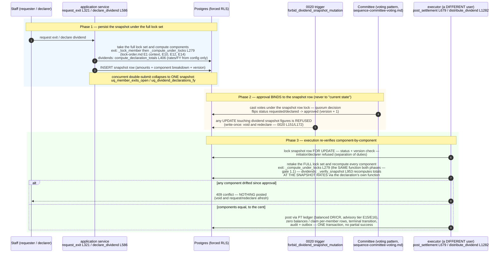

<!--
  P-DIAG.5 — Sequence 2/3: the SNAPSHOT-BIND-REVERIFY pattern (as-built)
  Authored against main @ 08541b860f1445b16c342c39b6606d86b9dbeb17
  P13.15 (!46) extended the consumer table with the loan write-off.
  Drift rule: v1.2 rule 11 — any MR that changes this flow in any
  consumer (P12 exits, !30/!36 dividends, P13.15 write-offs) MUST
  update this file in the same MR. Future prompts/MRs REFERENCE this
  diagram instead of re-describing the pattern (v1.1 rule 3 is its
  normative statement).
  Lock authority: the full lock sets below are lock-order.md edges
  E1/E10/E12/E14 (exit), E2/E10/E12 (distribution) and E22 (write-off
  posting) — cited by edge id, never restated.
-->

# Sequence — snapshot-bind-reverify (P-DIAG.5, pattern 2)

The v1.1 rule 3 lifecycle: **persist snapshot → committee approval
binds to it → execution re-verifies component-by-component under the
full lock set → 409 on drift, posting nothing.** Three consumers:

| Consumer | Snapshot writer | Re-verifier | Snapshot store | Since |
|---|---|---|---|---|
| Member exit settlement | `genesis/application/member_exits.py:request_exit` (L321) | `member_exits.py:post_settlement` (L679) | `member_exits` row (partial UNIQUE `uq_member_exits_open`) | P12 |
| Dividend declaration | `genesis/application/dividends.py:declare_dividend` (L586) | `dividends.py:_verify_snapshot` (L953), first distribution run | `dividend_declarations` row — **DB-level write-once trigger** `dividend_declarations_write_once` (0020) | !30 |
| Loan write-off (P13.15) | `genesis/application/corrections.py:request_write_off` (snapshot of balance / penalty_due / classification under the loan row lock) | `corrections.py:post_write_off` (lock-order.md E22: WOFF anchor FOR UPDATE → loan FOR UPDATE; balance AND penalty_due re-verified against the snapshot; 409 on drift, posting nothing; the requester can neither vote nor execute) | `loan_write_offs` row — **DB-level write-once trigger** `loan_write_offs_write_once` (0025); one live workflow per loan via partial UNIQUE `uq_loan_write_offs_open`; drifted snapshots are VOIDED and re-requested, never edited | !46 |

## The !36 variant — unclaimed disposition on mid-run exit

A member who **exits after the declaration snapshot but before their
paying batch** would otherwise strand the distribution. The !36
extension terminates the run in an **audited payable claim on the same
idempotency key** instead — `genesis/application/dividends.py:
_dispose_unclaimed_one` (L1145), called from the disposition pass that
runs AFTER the paying batches in `distribute_dividend`:

- entitlement recomputed **at the snapshot rates** via the exact
  declaration function (`compute_member_entitlement` L291) — it
  reconstructs to the record-date figure because every post-exit
  posting carries `occurred_at` after the FY end;
- the claim reuses the **same** `(tenant_id, declaration_id,
  member_id)` UNIQUE key as the paying path, with
  `disposition='unclaimed'` (`ON CONFLICT DO NOTHING` + rowcount,
  v1.1 rule 5 — exactly-once even against a concurrent runner);
- the posting parks the money as the `liability.unclaimed_dividends`
  payable (`application/ledger.py:post_unclaimed_dividend` L567) —
  nothing is paid to the exited member, nothing is silently dropped;
- audit row + `dividend.unclaimed` outbox event commit atomically with
  the batch.

A **pre**-distribution exit never reaches this path: `_verify_snapshot`
refuses the drifted population (409) and the redeclared snapshot simply
excludes the leaver — see the docstring at L953.

## Code citations (valid at `08541b8`)

| Element | Source |
|---|---|
| Snapshot compute + persist (exit) | `member_exits.py:request_exit` L321 → `_compute_under_locks` L279 (member lock via `_lock_member` L208 first); fee from config (`_exit_fee` L193, v1.1 rule 1) |
| Snapshot compute + persist (dividend) | `dividends.py:declare_dividend` L586 → `compute_declaration_totals` L406; rates/FY exclusively from `resolve_dividend_config` L263 |
| Double-submit collapse | `uq_member_exits_open` (0010) / `uq_dividend_declarations_fy` (0020) — `IntegrityError` → 409 |
| Approval binds to the row | voting pattern under the snapshot row lock — [`sequence-committee-voting.md`](sequence-committee-voting.md) |
| DB-level write-once | `forbid_dividend_snapshot_mutation` + trigger `dividend_declarations_write_once`, migration `0020` L151/L172 |
| Re-verify (exit) | `post_settlement` L679: version check, initiator ban, `_compute_under_locks` again, component-by-component compare → `ConflictError`, nothing posted |
| Re-verify (dividend) | `_verify_snapshot` L953 (first run only — `_claims_exist` L937 gates it); void-vs-distribute FOR SHARE fence inside `distribute_dividend` L1282 |
| !36 unclaimed variant | `_dispose_unclaimed_one` L1145; `post_unclaimed_dividend` (`application/ledger.py` L567); disposition pass in `distribute_dividend` |
