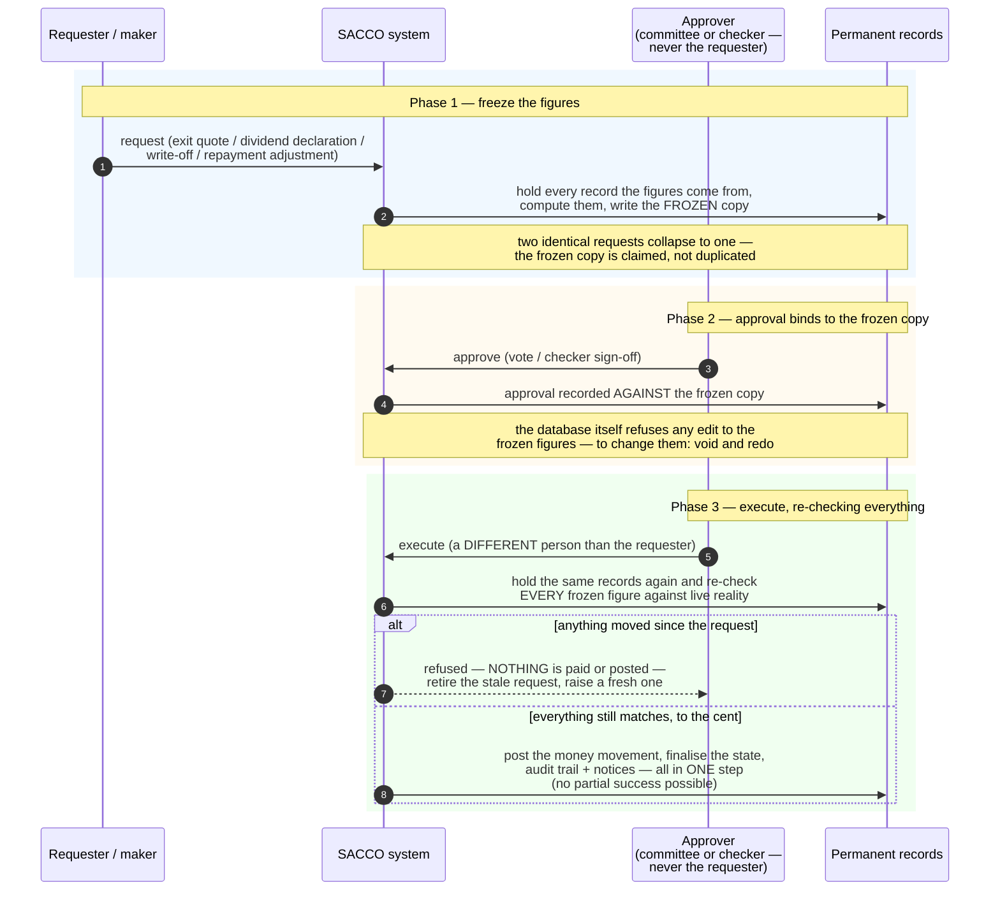

<!--
  P-DIAG.5 — Sequence 2/3: the SNAPSHOT-BIND-REVERIFY pattern (as-built)
  Authored against main @ 08541b860f1445b16c342c39b6606d86b9dbeb17
  P13.15 (!46) extended the consumer table with the loan write-off.
  Redrawn business-readable and reconciled to main @
  8f46aa54250ff1a066af423924f3eb54a9c72fb7 by the P-DIAG drift MR:
  the maker-checker repayment adjustment (!52, issue #24) joins as the
  FOURTH consumer; code citations moved out of the drawing into the
  Source-of-truth footer (P-DIAG audience rule).
  Drift rule: v1.2 rule 11 — any MR that changes this flow in any
  consumer (P12 exits, !30/!36 dividends, P13.15 write-offs, !52
  adjustments) MUST update this file in the same MR. Future
  prompts/MRs REFERENCE this diagram instead of re-describing the
  pattern (v1.1 rule 3 is its normative statement).
  Lock authority: the full lock sets below are lock-order.md edges
  E1/E10/E12/E14 (exit), E2/E10/E12 (distribution), E22 (write-off
  posting) and E24/E20/E21 (adjustment approval) — cited by edge id,
  never restated.
-->

# Sequence — approve the frozen figures, never "the current state" (P-DIAG.5, pattern 2)

**Audience: business (committee members, managers, auditors).** Code
citations live in the Source-of-truth footer.

## The business rule this depicts

When money moves on the strength of an approval, the approval must be
of **specific frozen figures** — never of "whatever the numbers are by
the time someone presses pay". The system therefore works in three
phases: (1) the request **freezes** the figures while holding all the
records that produce them; (2) the approval (committee vote or
checker's sign-off) **binds to that frozen copy**, which the database
itself refuses to let anyone edit; (3) the execution — done by a
**different person** than the requester — **re-checks every frozen
figure against the live records** at the moment of payment. If
anything moved in between (a repayment landed, a penalty accrued, a
balance changed), **nothing is paid**: the stale request is retired
and a fresh one is made. This closes the classic
approve-small-pay-big window.

Four consumers of the same pattern:

| What is frozen | Approved by | Since |
|---|---|---|
| Exit settlement quote (shares + deposits − loans − fees) | committee vote | P12 |
| Dividend declaration totals | committee vote | !30 |
| Write-off figures (the surviving claim) | committee vote | !46 (P13.15) |
| Repayment-adjustment position (balance / penalties / status at request) | a distinct checker (maker-checker) | !52 (issue #24) |

## The !36 variant — a member who exits mid-payout

A member who exits **after** a dividend declaration is frozen but
**before** their payout batch runs is neither silently paid nor
silently forgotten: their entitlement is recomputed at the frozen
rates and **parked as a recorded payable**, using the same
one-receipt-per-member claim as the paying path — so a re-run can
never produce a second outcome. (Paying out that parked money later
still has no shipped path — recorded honestly as stride.md UNOWNED-4.)

## Source of truth (code citations, valid at `8f46aa5`)

| Diagram step | Implementation |
|---|---|
| Freeze (exit) | `application/member_exits.py:request_exit` → `_compute_under_locks` (member lock first via `_lock_member`); fee from config (`_exit_fee`, v1.1 rule 1); locks lock-order.md E1 → E10 → E12 → E14 |
| Freeze (dividend) | `application/dividends.py:declare_dividend` → `compute_declaration_totals`; rates/FY exclusively from `resolve_dividend_config` |
| Freeze (write-off) | `application/corrections.py:request_write_off` — balance/penalty_due/classification snapshot under the loan row lock; prudential NPL gate | 
| Freeze (adjustment) | `application/corrections.py:request_repayment_adjustment` — balance/penalty_due/status snapshot under the full E20→E21 chain, shared verbatim with approval (`_lock_adjustment_chain`) |
| Double-request collapse | partial UNIQUEs claimed atomically: `uq_member_exits_open` (0010), `uq_dividend_declarations_fy` (0020), `uq_loan_write_offs_open` (0025), `uq_repayment_adjustments_claim` (0025/0031, `WHERE status <> 'rejected'`) |
| Approval binds to the row | committee voting under the frozen row's lock — [`sequence-committee-voting.md`](sequence-committee-voting.md); adjustment checker sign-off: `approve_repayment_adjustment` with SoD (`_require_distinct_non_assurance_checker` + 0031 `ck_repayment_adjustments_sod`) |
| DB refuses edits to the frozen copy | write-once triggers: `dividend_declarations_write_once` (0020), `loan_write_offs_write_once` (0025), the `repayment_adjustments` workflow trigger (0025/0031 — only the decision write is permitted) |
| Re-check at execution (409 on drift, posting nothing) | exit: `post_settlement` → `_compute_under_locks` (the SAME function both phases — gate 1.1); dividend: `_verify_snapshot` (first run only, `_claims_exist` gates it); write-off: `post_write_off` (E22 — balance AND penalty_due re-verified; requester can neither vote nor execute); adjustment: `approve_repayment_adjustment` (E24 → E20 → E21 — balance, penalty_due AND status re-verified) |
| One-step execution, no partial success | exit settlement postings + zeroed balances + guarantee sweep + terminal transition + audit + outbox in ONE transaction (`post_settlement`); write-off WO- posting + terminal transition (`post_write_off`); adjustment storno + negative repayment row + state restore + conservation self-check (`approve_repayment_adjustment`, `_reconstructed_balance`) |
| !36 unclaimed variant | `application/dividends.py:_dispose_unclaimed_one` (entitlement at the frozen rates via `compute_member_entitlement`); parking posting `application/ledger.py:post_unclaimed_dividend`; same `(tenant, declaration, member)` UNIQUE claim with `disposition='unclaimed'` (0022) |
